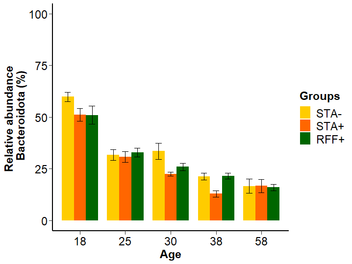
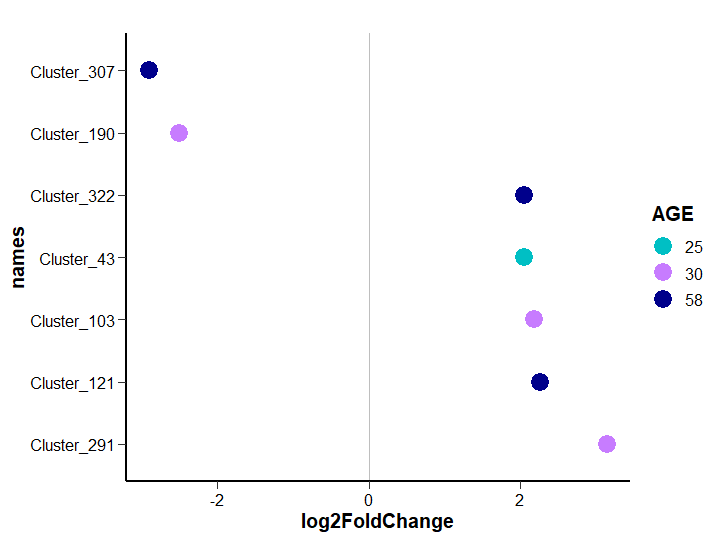

You will find below the code for all the analyses presented in the study of Paës et al, "Establishment of hindgut bacterial ecosystems and acquisition of microbial functions in the infant rabbit: impact of early-life nutrition and polysaccharides ingestion" 

Nomenclature: 
STA- or STAN: rabbits access to solid food enriched in starch from 15 days
STA+ or STAP: rabbits access to solid food enriched in starch from 3 days
RFF+ or RFFP: rabbits access to solid food enriched in rapidly fermentable fibres from 3 days

# Litters description

Description of the feeding behaviour and growth of the 48 rabbit litters studied

## Ingestion pattern

Herein we analyse feeding behaviour of the litters (one litter = 10 rabbits at the beginning of the experiment) before weaning. 

Rabbit milk consumption and solid food ingestion (first with gel food and then with pellets) are studied. In rabbit farming, the ingestion of solid food starts before weaning and becomes predominant in the fourth week after brith.

### Milk consumption

The data analyzed were collected from d3 to d21 by weighing the doe before and after nursing

#### Import data and cleaning

Outliers are considered with the rule: mean+/-3*sd (because partial suckling could have accidently occured)


```r
milk<-read.table("Milk_consumption.csv", header=TRUE, sep=";", dec=",")
milk$AGE<-as.factor(milk$AGE)
milk$GROUP<-as.factor(milk$GROUP)
milk$FEMALE<-as.factor(as.character(milk$FEMALE))
milk$MILK_CONSUMED_RABBIT<-as.numeric(as.character(milk$MILK_CONSUMED_RABBIT))

#We delete negative values
milk<-milk[milk[,8]>0,]

#We look for outliers
boxplot(MILK_CONSUMED_RABBIT~AGE, data=milk, main="Original data")
```

<!-- -->

```r
SEmilk<-summarySE(milk, measurevar="MILK_CONSUMED_RABBIT", groupvars=c("AGE"), na.rm=TRUE)
#outliers are considered with the rule mean+/-3*sd because partial suckling could have occured

#threshold inf day 7
b7<-SEmilk[2,3]-3*SEmilk[2,4]

#threshold inf day 10
b10<-SEmilk[3,3]-3*SEmilk[3,4]

#threshold inf day 14
b14<-SEmilk[4,3]-3*SEmilk[4,4]

#threshold inf day 17
b17<-SEmilk[5,3]-3*SEmilk[5,4]

#thresholds day 21
b21n<-SEmilk[6,3]-3*SEmilk[6,4]
b21p<-SEmilk[6,3]+3*SEmilk[6,4]

#outliers considered as missing data
for (k in 1:nrow(milk)) {
  if ((milk[k,10]=="10") & (milk[k,8]<b10)){
    milk[k,8]<-"NA"
  }
}
for (k in 1:nrow(milk)) {
  if ((milk[k,10]=="17") & (milk[k,8]<b17)){
    milk[k,8]<-"NA"
  }
}
for (k in 1:nrow(milk)) {
  if ((milk[k,10]=="21") & (milk[k,8]<b21n)){
    milk[k,8]<-"NA"
  }
}
for (k in 1:nrow(milk)) {
  if ((milk[k,10]=="21") & (milk[k,8]>b21p)){
    milk[k,8]<-"NA"
  }
}
for (k in 1:nrow(milk)) {
  if ((milk$AGE=="7") & (milk[k,8]<b7)){
    milk[k,8]<-"NA"
  }
}

milk$MILK_CONSUMED_RABBIT<-as.numeric(as.character(milk$MILK_CONSUMED_RABBIT))
boxplot(MILK_CONSUMED_RABBIT~AGE, data=milk, main="Cleaned data")
```

<!-- -->

#### Statistics

Does milk consumption differ between the groups ? 


```r
options(contrasts = c("contr.sum", "contr.poly"))
mod_milk=lme(MILK_CONSUMED_RABBIT~GROUP*AGE, random=~1|FEMALE, data=milk, na.action=na.omit)
mod_milkc<-update(mod_milk,weights=varIdent(form=~1|AGE), method="ML")
#plot(mod_milkc, resid(., type = "p") ~fitted(.), abline = 0) #visual control of residuals aspects
anova(mod_milkc)
```

```
##             numDF denDF  F-value p-value
## (Intercept)     1   190 3532.802  <.0001
## GROUP           2    45    0.333  0.7187
## AGE             5   190  114.236  <.0001
## GROUP:AGE      10   190    1.190  0.3001
```

```r
milk$AGE<-as.factor(milk$AGE)
synth_milk<-summary(MILK_CONSUMED_RABBIT~AGE*GROUP, method="cross", fun=smean.sd, data=milk)
synth_milk
```

```
## 
##  smean.sd by AGE, GROUP 
## 
## +-------+
## |      N|
## |Missing|
## |   Mean|
## |     SD|
## +-------+
## +---+--------+--------+--------+--------+
## |AGE|  RFFP  |  STAN  |  STAP  |   ALL  |
## +---+--------+--------+--------+--------+
## |  3|      16|      16|      16|      48|
## |   |       0|       0|       0|       0|
## |   |14.24375|14.25625|15.21875|14.57292|
## |   |5.638672|5.206402|6.139296|5.571384|
## +---+--------+--------+--------+--------+
## |  7|      15|      15|      16|      46|
## |   |       0|       0|       0|       0|
## |   |25.78813|25.97500|24.37500|25.35754|
## |   |3.571074|7.041085|5.215042|5.384150|
## +---+--------+--------+--------+--------+
## | 10|      15|      16|      15|      46|
## |   |       0|       0|       1|       1|
## |   |30.05187|30.09775|29.81480|29.99052|
## |   |2.928492|4.290657|5.120427|4.120349|
## +---+--------+--------+--------+--------+
## | 14|      15|      16|      16|      47|
## |   |       0|       0|       0|       0|
## |   |27.25167|26.75119|23.07775|25.66038|
## |   |5.350338|5.833428|6.594455|6.127702|
## +---+--------+--------+--------+--------+
## | 17|      15|      15|      16|      46|
## |   |       0|       0|       0|       0|
## |   |31.37167|34.44407|33.77850|33.21070|
## |   |4.999990|5.446000|4.059805|4.924227|
## +---+--------+--------+--------+--------+
## | 21|       6|       7|       7|      20|
## |   |       9|       9|       9|      27|
## |   |47.21067|44.43257|43.08429|44.79410|
## |   |8.870512|4.633413|2.271570|5.664382|
## +---+--------+--------+--------+--------+
## |ALL|      82|      85|      86|     253|
## |   |       9|       9|      10|      28|
## |   |27.17212|27.70585|26.65130|27.17440|
## |   |9.571706|9.829592|9.394942|9.571625|
## +---+--------+--------+--------+--------+
```

## Gel consumption

Consumption of gel food from d7 to d17. Data are corrected for water loss (8% of initial gel weight) and already divided by the number of kits inside litters.

### Statistics daily consumption

Does gel consumption differ between the gels enriched in starch and the ones enriched in rapidly fermentable fibers ? 


```r
intakegel<-read.table("Gel_consumption.csv", header=TRUE, sep=";", dec=",")
intakegel$FEMALE<-as.factor(as.character(intakegel$FEMALE))
intakegel$GROUP<-as.factor(as.character(intakegel$GROUP))
intakegel$AGE<-as.factor(intakegel$AGE)

intakegelselect<-subset(intakegel, GROUP!="STAN")

lme_nest<-lme(GEL_INGESTION_CORRECTED_RABBIT~GROUP*AGE, random=~1|FEMALE, data=intakegelselect, na.action=na.omit)
lme_nest<-update(lme_nest, weights=varIdent(form=~1|AGE), method="ML")
#plot(lme_nid, resid(., type = "p") ~ fitted(.), abline = 0)
anova(lme_nest)
```

```
##             numDF denDF   F-value p-value
## (Intercept)     1   288 224.62577  <.0001
## GROUP           1    29   4.59700  0.0405
## AGE            10   288  75.04641  <.0001
## GROUP:AGE      10   288   4.39663  <.0001
```

```r
a<-emmeans(lme_nest, pairwise ~ GROUP | AGE, adjust="fdr") 
a$contrast
```

```
## AGE = 7:
##  contrast    estimate     SE df t.ratio p.value
##  RFFP - STAP   0.0130 0.0376 29  0.346  0.7318 
## 
## AGE = 8:
##  contrast    estimate     SE df t.ratio p.value
##  RFFP - STAP  -0.0412 0.0404 29 -1.019  0.3165 
## 
## AGE = 9:
##  contrast    estimate     SE df t.ratio p.value
##  RFFP - STAP   0.0516 0.0365 29  1.412  0.1687 
## 
## AGE = 10:
##  contrast    estimate     SE df t.ratio p.value
##  RFFP - STAP   0.1464 0.0480 29  3.048  0.0049 
## 
## AGE = 11:
##  contrast    estimate     SE df t.ratio p.value
##  RFFP - STAP   0.0867 0.0443 29  1.955  0.0603 
## 
## AGE = 12:
##  contrast    estimate     SE df t.ratio p.value
##  RFFP - STAP   0.1299 0.0580 29  2.241  0.0328 
## 
## AGE = 13:
##  contrast    estimate     SE df t.ratio p.value
##  RFFP - STAP   0.2251 0.0705 29  3.192  0.0034 
## 
## AGE = 14:
##  contrast    estimate     SE df t.ratio p.value
##  RFFP - STAP   0.2216 0.0896 29  2.473  0.0195 
## 
## AGE = 15:
##  contrast    estimate     SE df t.ratio p.value
##  RFFP - STAP   0.3214 0.1150 29  2.795  0.0091 
## 
## AGE = 16:
##  contrast    estimate     SE df t.ratio p.value
##  RFFP - STAP   0.3295 0.1072 29  3.072  0.0046 
## 
## AGE = 17:
##  contrast    estimate     SE df t.ratio p.value
##  RFFP - STAP   0.1039 0.1294 29  0.803  0.4286 
## 
## Degrees-of-freedom method: containment
```

### Total gel ingestion (d7-d17)

The daily ingestion of gels are summed over the period (d7-d17)


```r
#Calculation total ingestion of gel per litter
intakegeltot<-aggregate(intakegel$GEL_INGESTION_CORRECTED_RABBIT, by=list(intakegel$FEMALE, intakegel$GROUP), FUN=sum, na.action=NULL)
names(intakegeltot)<-c("FEMALE", "GROUP", "GEL_INGESTION_CORRECTED_RABBIT")

#Values
summarygel<-summary(intakegeltot$GEL_INGESTION_CORRECTED_RABBIT ~ intakegeltot$GROUP, method="cross", fun=smean.sd)
names(summarygel)<-c("Group", "Missing", "Mean", "SD")

#Statistics
options(contrasts = c("contr.treatment", "contr.poly"))
intakegeltotselect<-subset(intakegeltot, GROUP!="STAN")
modtot<-lm(GEL_INGESTION_CORRECTED_RABBIT~GROUP, data=intakegeltotselect)
# plot(modtot) #ok
# leveneTest(intakegeltot$GEL_INGESTION_CORRECTED_RABBIT, intakegeltot$GROUP) # ok 
Anova(modtot)
```

```
## Anova Table (Type II tests)
## 
## Response: GEL_INGESTION_CORRECTED_RABBIT
##           Sum Sq Df F value   Pr(>F)   
## GROUP     18.098  1  7.7969 0.009498 **
## Residuals 62.673 27                    
## ---
## Signif. codes:  0 '***' 0.001 '**' 0.01 '*' 0.05 '.' 0.1 ' ' 1
```

```r
#Graph boxplot 
intakegeltot$GROUP<-factor(intakegeltot$GROUP, levels = c("STAN", "STAP", "RFFP"))
ggplot(intakegeltot, aes(x=GROUP, y=GEL_INGESTION_CORRECTED_RABBIT)) + geom_boxplot(fill=col) + geom_jitter(shape=16, position=position_jitter(0.1)) + ylab("Total gel intake \n (g of fresh matter/rabbit)") + theme_classic() + scale_color_manual(values=col) + scale_x_discrete(name="", breaks=c("STAN", "STAP", "RFFP"), labels=c("STA-", "STA+", "RFF+")) + theme_classic()+theme(legend.position="right",axis.line=element_line(size = 1, color = "black"), 
                                           axis.ticks.length = unit(.2, "cm"), 
                                           axis.text = element_text( size = 18, color = "black"), 
                                           axis.title = element_text(face="bold", size = 22, color = "black"), 
                                           legend.text = element_text( size = 12), 
                                           legend.title = element_text(face="bold", size = 15), legend.key.height = unit(.7, "cm")) 
```

<!-- -->

## Pellet consumption

Ingestion of pellets from d15 to weaning. 

Daily pellet consumption is provided, i.e, the difference of weight (food offered - food left) divided by the number of days between weighing. For example, food offered was weighed at d15 and food left at day 18. The difference was divided by 3 to calculate the daily ingestion at d18. To obtain the ingestion per kit, this number was then divided by a theroretical number of rabbits in the litter since the number of kits was adjusted assuming that dead animals did not consume feed 2 days before their death.

### Statistics daily consumption

Does daily pellets consumption differ between the three experimental groups ? 


```r
intakepellet<-read.table("Pellet_consumption.csv", header=TRUE, sep=";", dec=",")
intakepellet$FEMALE<-as.factor(as.character(intakepellet$FEMALE))
intakepellet$GROUP<-as.factor(as.character(intakepellet$GROUP))
intakepellet$AGE<-as.factor(intakepellet$AGE)

mod_pellets=lme(log(DAILY_PELLET_INGESTION_RABBIT)~AGE+GROUP, random=~1|FEMALE, data=intakepellet, na.action=na.omit)
mod_pellets<-update(mod_pellets, weights=varIdent(form=~AGE), method="REML")
mod_pellets<-update(mod_pellets, method="ML")
ano<-data.frame(anova(mod_pellets))
ano[,3:4]<-round(ano[,3:4],3)
datatable(ano, rownames=c("Intercept", "Age", "Group"))
```

### Total pellets ingestion

Does total pellets consumption differ between the three experimental groups ? 


```r
#data wide
pelletcol<-reshape2::dcast(intakepellet, FEMALE + GROUP ~ AGE, value.var="DAILY_PELLET_INGESTION_RABBIT")
names(pelletcol)<-c("FEMALE", "GROUP", "D18", "D21", "D25", "D28", "D32", "D36")
pelletcol<-dplyr::mutate(pelletcol, CONSOTOT1536=D18*3+D21*3+D25*4+D28*3+D32*4+D36)
modtotpellet<-lm(CONSOTOT1536 ~ GROUP, data=pelletcol)
# leveneTest(pelletcol$CONSOTOT1536, pelletcol$GROUP) #ok
# plot(residuals(modtotpellet))
Anova(modtotpellet)
```

```
## Anova Table (Type II tests)
## 
## Response: CONSOTOT1536
##           Sum Sq Df F value Pr(>F)
## GROUP       3095  2  0.3959 0.6755
## Residuals 168047 43
```

```r
summary<-summary(CONSOTOT1536 ~ GROUP, method="cross", fun=smean.sd, data=pelletcol)
summary[,2]<-round(summary[,2],3)
datatable(summary)
```

## Graphical synthesis of the feeding pattern


```r
dailymilk<-summarySE(milk, measurevar="MILK_CONSUMED_RABBIT", groupvars=c("AGE", "GROUP"), na.rm=TRUE)
dailypellets<-summarySE(intakepellet, measurevar="DAILY_PELLET_INGESTION_RABBIT", groupvars=c("AGE","GROUP"), na.rm=TRUE)
colnames(dailymilk)[4]<-"CONSO"
colnames(dailypellets)[4]<-"CONSO"
dailymilk$type<-"Milk"
dailypellets$type<-"Pellets"
intake<-rbind(dailymilk, dailypellets)
intake$type<-as.factor(intake$type)

#from d3 to d36
ggplot(intake, aes(AGE, CONSO, group = interaction(GROUP, type), 
               color = GROUP, linetype = type)) +   geom_line(size=1) + geom_point() + geom_errorbar(aes(ymin=CONSO, ymax=CONSO+se, colour=GROUP, width=.2)) + scale_x_discrete(name="Age (days)") + scale_y_continuous(name="Fresh matter intake \n (g/rabbit)") + scale_color_manual (values=col, name="Groups", labels=c("STA-", "STA+", "RFF+")) + theme_classic()+theme(legend.position="right",axis.line=element_line(size = 1, color = "black"), 
                                           axis.ticks.length = unit(.2, "cm"), 
                                           axis.text = element_text( size = 12, color = "black"), 
                                           axis.title = element_text(face="bold", size = 15, color = "black"), 
                                           legend.text = element_text( size = 12), 
                                           legend.title = element_text(face="bold", size = 15), legend.key.height = unit(.7, "cm"))  
```

<!-- -->


```r
#focus gel consumption
gelkinetics<-summarySE(intakegel, measurevar="GEL_INGESTION_CORRECTED_RABBIT", groupvars=c("AGE","GROUP"), na.rm=TRUE) 
gelkinetics$AGE<-as.numeric(as.character(gelkinetics$AGE))
conso_GROUP<-ggplot(gelkinetics, aes(x=AGE, y=GEL_INGESTION_CORRECTED_RABBIT))+ geom_errorbar(aes(ymin=GEL_INGESTION_CORRECTED_RABBIT-se, ymax=GEL_INGESTION_CORRECTED_RABBIT+se, color = factor(GROUP)), width=0.3) + geom_line(aes(group = GROUP, color = GROUP), size = 1) + geom_point(aes(group = GROUP, color = GROUP), size=1.5) + scale_x_continuous(name="Age (days)", breaks=seq(7,17,1)) + scale_y_continuous(name="Early feed intake \n (g of gel/rabbit/day)") + scale_color_manual(values=col, name="Groups", breaks=c("STAN", "STAP", "RFFP"), labels=c("STA-",  "STA+","RFF+")) 
conso_GROUP<-conso_GROUP + theme_classic()+theme(legend.position="right",axis.line=element_line(size = 1, color = "black"), 
                                           axis.ticks.length = unit(.2, "cm"), 
                                           axis.text = element_text( size = 15, color = "black"), 
                                           axis.title = element_text(face="bold", size = 15, color = "black"), 
                                           legend.text = element_text( size = 12), 
                                           legend.title = element_text(face="bold", size = 15), legend.key.height = unit(.7, "cm")) 
conso_GROUP
```

<!-- -->

# Microbiota analysis

In total : 296 samples from 10 rabbits per age and per group (ages: 18, 25, 30, 38 and 58 days of age; groups: STA-/STA+/RFF+) with two areas investigated (caecum body and appendix vermiformis), including 147 samples from appendix vermiformis and 149 from the caecum body


```r
options(scipen=999)
options(contrasts = c("contr.sum", "contr.poly"))

load("caecal_appendix_microbiome_rabbit_newSILVAdatabase.rdata")
frogs.data<-data
fact<-data.frame(sample_data(frogs.data))

fact$WEIGHT<-as.numeric(as.character(fact$WEIGHT))

fact$AGE_GROUP<-interaction(fact$AGE, fact$GROUP, sep="_")
fact$AGE_GROUP<-factor(fact$AGE_GROUP, levels = c("18_STAN", "25_STAN", "30_STAN", "38_STAN", "58_STAN", "18_STAP", "25_STAP", "30_STAP", "38_STAP", "58_STAP", "18_RFFP", "25_RFFP", "30_RFFP", "38_RFFP", "58_RFFP"))

fact$AGE<-as.factor(fact$AGE)
fact$AGE<-factor(fact$AGE, levels=c("18", "25", "30", "38", "58"))

fact$GROUP<-factor(fact$GROUP, levels=c("STAN", "STAP", "RFFP")) #we change the order for graphs

fact$ID_ORGAN<-interaction(fact$ID, fact$ORGAN, sep="_")
fact$AGE_ORGAN<-interaction(fact$AGE, fact$ORGAN, sep="_")

sample_data(frogs.data)<-(fact)
```

## Rarefying counts


```r
#We delete the sample ID: 478 from the appendix to avoid rarefaction at 3 430 seq

frogs.data_without478<-subset_samples(frogs.data, ID_ORGAN!="478_appendix")
frogs.data_raref<- rarefy_even_depth(frogs.data_without478, rngseed = 24)

#new segmentation for rarefied matrix
frogs.data_raref_caecum<-subset_samples(frogs.data_raref, ORGAN=="caecum")
frogs.data_raref_vermiform<-subset_samples(frogs.data_raref, ORGAN=="appendix")

frogs.data_raref_vermiform_STA<-subset_samples(frogs.data_raref_vermiform, GROUP!="RFFP")
frogs.data_raref_vermiform_EARLY<-subset_samples(frogs.data_raref_vermiform, GROUP!="STAN")

frogs.data_raref_cc_STA<-subset_samples(frogs.data_raref_caecum, GROUP!="RFFP")
frogs.data_raref_cc_EARLY<-subset_samples(frogs.data_raref_caecum, GROUP!="STAN")
```

We deleted vermiform sample 478 on the rarefied matrix.
Count matrix is rarefied to 8 802 sequences

## Clusterization to verify absence of outliers


```r
Y=t(otu_table(frogs.data_raref))
rownames(Y)<-get_variable(frogs.data_raref,"ID_ORGAN")
clust_plot <- hclust(vegdist(Y, method = "bray"), method = "ward.D2")
ggdendrogram(clust_plot, rotate = TRUE, size = 1)
```

<!-- -->

## Rarefaction curve

```{r}
rarefaction<-ggrare(frogs.data, step = 200, label = NULL, color = "ORGAN",
  plot = TRUE, parallel = FALSE, se = TRUE)
rarefaction <- rarefaction + facet_wrap(~ ORGAN)
rarefaction 
```

<!-- -->


## Alpha-diversity {.tabset}

### Caecum

We calculate for each sample, after rarefaction, three alpha diversity metrics 


```r
alpha.diversity_raref_cc <- estimate_richness(frogs.data_raref_caecum,
           measures = c("Observed", "Shannon","InvSimpson"))
tmp_cc<-cbind(sample_data(frogs.data_raref_caecum), alpha.diversity_raref_cc)
#we calculate by age and group
diversity_cc<-tmp_cc%>%dplyr::select(AGE_GROUP,Observed,Shannon,InvSimpson)%>%group_by(AGE_GROUP)%>%summarise_all(funs(mean,sd, se=sd(.)/sqrt(n())))
diversity_cc[,2:10]<-round(diversity_cc[,2:10],2)
diversity_cc<-diversity_cc[,1:10]
datatable(diversity_cc)
```

#### Richness (number of OTUs)

__Graph__

```r
temp_cc <- cbind(diversity_cc$Observed_mean, diversity_cc$Observed_se)
df_cc<-as.data.frame(cbind(str_split_fixed(diversity_cc$AGE_GROUP, "_", 2), temp_cc))
colnames(df_cc)<- c("age","group","OTU","OTU_se")
df_cc$age<-as.factor(df_cc$age)

df_cc$OTU<-as.numeric(as.character(df_cc$OTU))
df_cc$OTU_se<-as.numeric(as.character(df_cc$OTU_se))

df_cc$group<-factor(df_cc$group, levels=c("STAN", "STAP", "RFFP"))

ggplot(df_cc, aes(x=age, y=OTU, fill=group)) + geom_bar(stat="identity", position=position_dodge()) + geom_errorbar(aes(ymin=OTU-OTU_se, ymax=OTU+OTU_se), width=.4, position=position_dodge(.9))+ theme_classic() + theme(legend.position="right",axis.line=element_line(size = 1, color = "black"), axis.ticks.length = unit(.2, "cm"), axis.text = element_text( size = 12, color = "black"),                         axis.title = element_text(face="bold", size = 15, color = "black"), legend.text = element_text( size = 12),                           legend.title = element_text(face="bold", size = 15), legend.key.height = unit(.7, "cm")) +  scale_fill_manual(values=col, breaks=c("STAN", "STAP", "RFFP"), labels=c("STA-", "STA+", "RFF+"), name="Groups") + ylab("Number of OTUs") + xlab ("Age") + ylim(0, 650)
```

<!-- -->

__Statistics (comparison STA-/STA+)__


```r
alpha.diversity_raref_STA_cc<- estimate_richness(frogs.data_raref_cc_STA,
           measures = c("Observed", "Shannon","InvSimpson"))
divSTA<-as.data.frame(cbind(alpha.diversity_raref_STA_cc,sample_data(frogs.data_raref_cc_STA)))

lme_Observed<-lme(Observed~GROUP*AGE, random=~1|LITTER, data=as.data.frame(divSTA))
lme_Observed<-update(lme_Observed, weights=varIdent(form=~1|AGE), method="ML") #to improve homogeneity of the variances
#plot(lme_Observed, resid(., type = "p") ~ fitted(.), abline = 0) #visual control of the redisuals : ok
datatable(anova(lme_Observed), colnames=c("DF","denDF","F-val", "P-val nb OTU")) %>% formatRound(columns=c('numDF', 'denDF', 'F-value', 'p-value'), digits=3)
```

```r
a<-emmeans(lme_Observed, pairwise ~ GROUP | AGE, adjust="bonferroni")
a$contrasts
```

```
## AGE = 18:
##  contrast    estimate   SE df t.ratio p.value
##  STAN - STAP    -5.78 26.4 18 -0.219  0.8292 
## 
## AGE = 25:
##  contrast    estimate   SE df t.ratio p.value
##  STAN - STAP    -1.00 28.3 18 -0.035  0.9722 
## 
## AGE = 30:
##  contrast    estimate   SE df t.ratio p.value
##  STAN - STAP   -46.90 34.3 18 -1.368  0.1880 
## 
## AGE = 38:
##  contrast    estimate   SE df t.ratio p.value
##  STAN - STAP   -23.80 14.8 18 -1.607  0.1255 
## 
## AGE = 58:
##  contrast    estimate   SE df t.ratio p.value
##  STAN - STAP   -17.30 18.7 18 -0.923  0.3682 
## 
## Degrees-of-freedom method: containment
```

__Statistics (comparison STA+/RFF+)__


```r
alpha.diversity_raref_EARLY_cc<- estimate_richness(frogs.data_raref_cc_EARLY,
           measures = c("Observed", "Shannon","InvSimpson"))
divEARLY<-as.data.frame(cbind(alpha.diversity_raref_EARLY_cc,sample_data(frogs.data_raref_cc_EARLY)))

lme_Observed<-lme(Observed~GROUP*AGE, random=~1|LITTER, data=as.data.frame(divEARLY))
lme_Observed<-update(lme_Observed, weights=varIdent(form=~1|AGE), method="ML") #to improve homogeneity of the variances
#plot(lme_Observed, resid(., type = "p") ~ fitted(.), abline = 0) #visual control of the redisuals : ok
datatable(anova(lme_Observed), colnames=c("DF","denDF","F-val", "P-val nb OTU")) %>% formatRound(columns=c('numDF', 'denDF', 'F-value', 'p-value'), digits=3)
```

```r
a<-emmeans(lme_Observed, pairwise ~ GROUP | AGE, adjust="bonferroni")
a$contrasts
```

```
## AGE = 18:
##  contrast    estimate   SE df t.ratio p.value
##  STAP - RFFP     12.4 15.2 18 0.815   0.4255 
## 
## AGE = 25:
##  contrast    estimate   SE df t.ratio p.value
##  STAP - RFFP     16.0 27.5 18 0.583   0.5673 
## 
## AGE = 30:
##  contrast    estimate   SE df t.ratio p.value
##  STAP - RFFP     86.0 26.7 18 3.220   0.0048 
## 
## AGE = 38:
##  contrast    estimate   SE df t.ratio p.value
##  STAP - RFFP     66.3 27.5 18 2.411   0.0268 
## 
## AGE = 58:
##  contrast    estimate   SE df t.ratio p.value
##  STAP - RFFP     57.5 23.0 18 2.504   0.0221 
## 
## Degrees-of-freedom method: containment
```

#### Inv Simpson


```r
diversity_cc<-tmp_cc%>%dplyr::select(AGE_GROUP,Observed,Shannon,InvSimpson)%>%group_by(AGE_GROUP)%>%summarise_all(funs(mean,sd, se=sd(.)/sqrt(n())))
temp_cc<- cbind(diversity_cc$InvSimpson_mean, diversity_cc$InvSimpson_se)
df_cc<-as.data.frame(cbind(str_split_fixed(diversity_cc$AGE_GROUP, "_", 2), temp_cc))
colnames(df_cc)<- c("age","group","InvSimpson","InvSimpson_se")

df_cc$InvSimpson<-as.numeric(as.character(df_cc$InvSimpson))
df_cc$InvSimpson_se<-as.numeric(as.character(df_cc$InvSimpson_se))

df_cc$group<-factor(df_cc$group, levels=c("STAN", "STAP", "RFFP"))

ggplot(df_cc, aes(x=age, y=InvSimpson, fill=group)) + geom_bar(stat="identity", position=position_dodge()) + geom_errorbar(aes(ymin=InvSimpson-InvSimpson_se, ymax=InvSimpson+InvSimpson_se), width=.4, position=position_dodge(.9))+ theme_classic() + theme(legend.position="right",axis.line=element_line(size = 1, color = "black"), axis.ticks.length = unit(.2, "cm"), axis.text = element_text( size = 12, color = "black"),                         axis.title = element_text(face="bold", size = 15, color = "black"), legend.text = element_text( size = 12),                           legend.title = element_text(face="bold", size = 15), legend.key.height = unit(.7, "cm")) +  scale_fill_manual(values=col, breaks=c("STAN", "STAP", "RFFP"), labels=c("STA-", "STA+", "RFF+"), name="Groups") + ylab("Inv Simpson index") + xlab ("Age") + ylim(0, 100)
```

<!-- -->

__Statistics (comparison STA-/STA+)__


```r
alpha.diversity_raref_STA_cc<- estimate_richness(frogs.data_raref_cc_STA,
           measures = c("InvSimpson", "Shannon","InvSimpson"))
divSTA<-as.data.frame(cbind(alpha.diversity_raref_STA_cc,sample_data(frogs.data_raref_cc_STA)))

lme_InvSimpson<-lme(InvSimpson~GROUP*AGE, random=~1|LITTER, data=as.data.frame(divSTA))
lme_InvSimpson<-update(lme_InvSimpson, weights=varIdent(form=~1|AGE), method="ML") #to improve homogeneity of the variances
#plot(lme_InvSimpson, resid(., type = "p") ~ fitted(.), abline = 0) #visual control of the redisuals : ok
datatable(anova(lme_InvSimpson), colnames=c("DF","denDF","F-val", "P-val nb OTU")) %>% formatRound(columns=c('numDF', 'denDF', 'F-value', 'p-value'), digits=3)
```

```r
a<-emmeans(lme_InvSimpson, pairwise ~ GROUP | AGE, adjust="bonferroni")
a$contrasts
```

```
## AGE = 18:
##  contrast    estimate   SE df t.ratio p.value
##  STAN - STAP    -3.43 1.92 18 -1.787  0.0908 
## 
## AGE = 25:
##  contrast    estimate   SE df t.ratio p.value
##  STAN - STAP    -6.98 5.25 18 -1.330  0.2001 
## 
## AGE = 30:
##  contrast    estimate   SE df t.ratio p.value
##  STAN - STAP   -16.44 6.46 18 -2.545  0.0203 
## 
## AGE = 38:
##  contrast    estimate   SE df t.ratio p.value
##  STAN - STAP   -12.74 9.48 18 -1.344  0.1956 
## 
## AGE = 58:
##  contrast    estimate   SE df t.ratio p.value
##  STAN - STAP   -15.36 9.73 18 -1.579  0.1317 
## 
## Degrees-of-freedom method: containment
```

__Statistics (comparison STA+/RFF+)__


```r
alpha.diversity_raref_EARLY_cc<- estimate_richness(frogs.data_raref_cc_EARLY,
           measures = c("InvSimpson", "Shannon","InvSimpson"))
divEARLY<-as.data.frame(cbind(alpha.diversity_raref_EARLY_cc,sample_data(frogs.data_raref_cc_EARLY)))

lme_InvSimpson<-lme(InvSimpson~GROUP*AGE, random=~1|LITTER, data=as.data.frame(divEARLY))
lme_InvSimpson<-update(lme_InvSimpson, weights=varIdent(form=~1|AGE), method="ML") #to improve homogeneity of the variances
#plot(lme_InvSimpson, resid(., type = "p") ~ fitted(.), abline = 0) #visual control of the redisuals : ok
datatable(anova(lme_InvSimpson), colnames=c("DF","denDF","F-val", "P-val nb OTU")) %>% formatRound(columns=c('numDF', 'denDF', 'F-value', 'p-value'), digits=3)
```

```r
a<-emmeans(lme_InvSimpson, pairwise ~ GROUP | AGE, adjust="bonferroni")
a$contrasts
```

```
## AGE = 18:
##  contrast    estimate    SE df t.ratio p.value
##  STAP - RFFP     1.04  2.58 18 0.405   0.6902 
## 
## AGE = 25:
##  contrast    estimate    SE df t.ratio p.value
##  STAP - RFFP     6.95  4.32 18 1.608   0.1252 
## 
## AGE = 30:
##  contrast    estimate    SE df t.ratio p.value
##  STAP - RFFP    14.95  6.31 18 2.369   0.0292 
## 
## AGE = 38:
##  contrast    estimate    SE df t.ratio p.value
##  STAP - RFFP    24.33 10.33 18 2.355   0.0300 
## 
## AGE = 58:
##  contrast    estimate    SE df t.ratio p.value
##  STAP - RFFP    17.05  9.34 18 1.825   0.0846 
## 
## Degrees-of-freedom method: containment
```

### Appendix vermiformis


```r
#we calculate for each sample, after rarefaction, alpha diversity metrics 
alpha.diversity_raref_vermiform <- estimate_richness(frogs.data_raref_vermiform,
           measures = c("Observed", "Shannon","InvSimpson"))
tmp_vermiform<-cbind(sample_data(frogs.data_raref_vermiform), alpha.diversity_raref_vermiform)
#we calculate by age and group
diversity_vermiform<-tmp_vermiform%>%dplyr::select(AGE_GROUP,Observed,Shannon,InvSimpson)%>%group_by(AGE_GROUP)%>%summarise_all(funs(mean,sd, se=sd(.)/sqrt(n())))
diversity_vermiform[,2:10]<-round(diversity_vermiform[,2:10],2)
diversity_vermiform<-diversity_vermiform[,1:10]
datatable(diversity_vermiform)
```

#### Richness (number of OTUs)

__Graph__


```r
temp_vermiform <- cbind(diversity_vermiform$Observed_mean, diversity_vermiform$Observed_se)
df_vermiform<-as.data.frame(cbind(str_split_fixed(diversity_vermiform$AGE_GROUP, "_", 2), temp_vermiform))
colnames(df_vermiform)<- c("age","group","OTU","OTU_se")
df_vermiform$age<-as.factor(df_vermiform$age)

df_vermiform$OTU<-as.numeric(as.character(df_vermiform$OTU))
df_vermiform$OTU_se<-as.numeric(as.character(df_vermiform$OTU_se))

df_vermiform$group<-factor(df_vermiform$group, levels=c("STAN", "STAP", "RFFP"))

ggplot(df_vermiform, aes(x=age, y=OTU, fill=group)) + geom_bar(stat="identity", position=position_dodge()) + geom_errorbar(aes(ymin=OTU-OTU_se, ymax=OTU+OTU_se), width=.4, position=position_dodge(.9))+ theme_classic() + theme(legend.position="right",axis.line=element_line(size = 1, color = "black"), axis.ticks.length = unit(.2, "cm"), axis.text = element_text( size = 12, color = "black"),                         axis.title = element_text(face="bold", size = 15, color = "black"), legend.text = element_text( size = 12),                           legend.title = element_text(face="bold", size = 15), legend.key.height = unit(.7, "cm")) +  scale_fill_manual(values=col, breaks=c("STAN", "STAP", "RFFP"), labels=c("STA-", "STA+", "RFF+"), name="Groups") + ylab("Number of OTUs") + xlab ("Age") + ylim(0, 650)
```

<!-- -->

__Statistics (comparison STA-/STA+)__


```r
alpha.diversity_raref_STA_vermiform<- estimate_richness(frogs.data_raref_vermiform_STA,
           measures = c("Observed", "Shannon","InvSimpson"))
divSTA<-as.data.frame(cbind(alpha.diversity_raref_STA_vermiform,sample_data(frogs.data_raref_vermiform_STA)))

lme_Observed<-lme(Observed~GROUP*AGE, random=~1|LITTER, data=as.data.frame(divSTA))
lme_Observed<-update(lme_Observed, weights=varIdent(form=~1|AGE), method="ML") #to improve homogeneity of the variances
#plot(lme_Observed, resid(., type = "p") ~ fitted(.), abline = 0) #visual control of the redisuals : ok
datatable(anova(lme_Observed), colnames=c("DF","denDF","F-val", "P-val nb OTU")) %>% formatRound(columns=c('numDF', 'denDF', 'F-value', 'p-value'), digits=3)
```

__Statistics (comparison STA+/RFF+)__


```r
alpha.diversity_raref_EARLY_vermiform<- estimate_richness(frogs.data_raref_vermiform_EARLY,
           measures = c("Observed", "Shannon","InvSimpson"))
divEARLY<-as.data.frame(cbind(alpha.diversity_raref_EARLY_vermiform,sample_data(frogs.data_raref_vermiform_EARLY)))

lme_Observed<-lme(Observed~GROUP*AGE, random=~1|LITTER, data=as.data.frame(divEARLY))
lme_Observed<-update(lme_Observed, weights=varIdent(form=~1|AGE), method="ML") #to improve homogeneity of the variances
#plot(lme_Observed, resid(., type = "p") ~ fitted(.), abline = 0) #visual control of the redisuals : ok
datatable(anova(lme_Observed), colnames=c("DF","denDF","F-val", "P-val nb OTU")) %>% formatRound(columns=c('numDF', 'denDF', 'F-value', 'p-value'), digits=3)
```

#### Inv Simpson


```r
diversity_vermiform<-tmp_vermiform%>%dplyr::select(AGE_GROUP,Observed,Shannon,InvSimpson)%>%group_by(AGE_GROUP)%>%summarise_all(funs(mean,sd, se=sd(.)/sqrt(n())))
temp_vermiform<- cbind(diversity_vermiform$InvSimpson_mean, diversity_vermiform$InvSimpson_se)
df_vermiform<-as.data.frame(cbind(str_split_fixed(diversity_vermiform$AGE_GROUP, "_", 2), temp_vermiform))
colnames(df_vermiform)<- c("age","group","InvSimpson","InvSimpson_se")

df_vermiform$InvSimpson<-as.numeric(as.character(df_vermiform$InvSimpson))
df_vermiform$InvSimpson_se<-as.numeric(as.character(df_vermiform$InvSimpson_se))

df_vermiform$group<-factor(df_vermiform$group, levels=c("STAN", "STAP", "RFFP"))

ggplot(df_vermiform, aes(x=age, y=InvSimpson, fill=group)) + geom_bar(stat="identity", position=position_dodge()) + geom_errorbar(aes(ymin=InvSimpson-InvSimpson_se, ymax=InvSimpson+InvSimpson_se), width=.4, position=position_dodge(.9))+ theme_classic() + theme(legend.position="right",axis.line=element_line(size = 1, color = "black"), axis.ticks.length = unit(.2, "cm"), axis.text = element_text( size = 12, color = "black"),                         axis.title = element_text(face="bold", size = 15, color = "black"), legend.text = element_text( size = 12),                           legend.title = element_text(face="bold", size = 15), legend.key.height = unit(.7, "cm")) +  scale_fill_manual(values=col, breaks=c("STAN", "STAP", "RFFP"), labels=c("STA-", "STA+", "RFF+"), name="Groups") + ylab("InvSimpson index") + xlab ("Age") + ylim(0, 100)
```

<!-- -->

__Statistics (comparison STA-/STA+)__


```r
alpha.diversity_raref_STA_vermiform<- estimate_richness(frogs.data_raref_vermiform_STA,
           measures = c("InvSimpson", "Shannon","InvSimpson"))
divSTA<-as.data.frame(cbind(alpha.diversity_raref_STA_vermiform,sample_data(frogs.data_raref_vermiform_STA)))

lme_InvSimpson<-lme(InvSimpson~GROUP*AGE, random=~1|LITTER, data=as.data.frame(divSTA))
lme_InvSimpson<-update(lme_InvSimpson, weights=varIdent(form=~1|AGE), method="ML") #to improve homogeneity of the variances
#plot(lme_InvSimpson, resid(., type = "p") ~ fitted(.), abline = 0) #visual control of the redisuals : ok
datatable(anova(lme_InvSimpson), colnames=c("DF","denDF","F-val", "P-val nb OTU")) %>% formatRound(columns=c('numDF', 'denDF', 'F-value', 'p-value'), digits=3)
```

```r
a<-emmeans(lme_InvSimpson, pairwise ~ GROUP | AGE, adjust="bonferroni")
a$contrasts
```

```
## AGE = 18:
##  contrast    estimate    SE df t.ratio p.value
##  STAN - STAP    -4.93  2.48 18 -1.985  0.0626 
## 
## AGE = 25:
##  contrast    estimate    SE df t.ratio p.value
##  STAN - STAP    -5.49  5.89 18 -0.932  0.3636 
## 
## AGE = 30:
##  contrast    estimate    SE df t.ratio p.value
##  STAN - STAP   -22.75  7.86 18 -2.895  0.0096 
## 
## AGE = 38:
##  contrast    estimate    SE df t.ratio p.value
##  STAN - STAP   -10.50  8.86 18 -1.185  0.2515 
## 
## AGE = 58:
##  contrast    estimate    SE df t.ratio p.value
##  STAN - STAP   -13.88 10.61 18 -1.309  0.2071 
## 
## Degrees-of-freedom method: containment
```

__Statistics (comparison STA+/RFF+)__


```r
alpha.diversity_raref_EARLY_vermiform<- estimate_richness(frogs.data_raref_vermiform_EARLY,
           measures = c("InvSimpson", "Shannon","InvSimpson"))
divEARLY<-as.data.frame(cbind(alpha.diversity_raref_EARLY_vermiform,sample_data(frogs.data_raref_vermiform_EARLY)))

lme_InvSimpson<-lme(InvSimpson~GROUP*AGE, random=~1|LITTER, data=as.data.frame(divEARLY))
lme_InvSimpson<-update(lme_InvSimpson, weights=varIdent(form=~1|AGE), method="ML") #to improve homogeneity of the variances
#plot(lme_InvSimpson, resid(., type = "p") ~ fitted(.), abline = 0) #visual control of the redisuals : ok
datatable(anova(lme_InvSimpson), colnames=c("DF","denDF","F-val", "P-val nb OTU")) %>% formatRound(columns=c('numDF', 'denDF', 'F-value', 'p-value'), digits=3)
```

## Beta-diversity (Wunifrac distances) {.tabset}

### Caecum

__We first control homogeneity of dispersions within our three groups__

```r
dist<- phyloseq::distance(frogs.data_raref_caecum, "wunifrac")
mod <- betadisper(dist, sample_data(frogs.data_raref_caecum)$GROUP)
anova(mod)
```

```
## Analysis of Variance Table
## 
## Response: Distances
##            Df Sum Sq   Mean Sq F value Pr(>F)
## Groups      2 0.0085 0.0042487   0.469 0.6265
## Residuals 146 1.3225 0.0090583
```

```r
dist<-data.frame(mod$distances)
dist$GROUP<- factor(sample_data(frogs.data_raref_caecum)$GROUP)
dist$AGE<- factor(sample_data(frogs.data_raref_caecum)$AGE)

bp <- ggplot(dist, aes(x = AGE, y = mod.distances, fill = (GROUP)))+
      geom_boxplot(notch = F)
bp <- bp + geom_point(position = position_jitter(width = 0.5))
bp <- bp + labs(title="",x="Age", y ="Distance to centroides")
bp <- bp  +  scale_fill_manual(values=col, breaks=c("STAN", "STAP", "RFFP"), labels=c("STA-", "STA+", "RFF+"), name="Groups")
bp <- bp + theme_classic() + theme(axis.text.x = element_text(colour="black",size=13,angle=0,hjust=.5,vjust=.5,face="plain"),
axis.text.y = element_text(colour="black",size=13,angle=0,hjust=1,vjust=0,face="plain"),
axis.title.x = element_text(colour="black",size=16,angle=0,hjust=.5,vjust=0,face="bold"),
axis.title.y = element_text(colour="black",size=14,angle=90,hjust=.5,vjust=.5,face="bold"))
bp
```

<!-- -->

__Adonis comparison STA-/STA+__


```r
dist_wunif_STAcc<- phyloseq::distance(frogs.data_raref_cc_STA, "wunifrac")
ado_resu_wunif_STAcc<-adonis(dist_wunif_STAcc ~ sample_data(frogs.data_raref_cc_STA)$GROUP*sample_data(frogs.data_raref_cc_STA)$AGE, set.seed(712)) 
datatable(ado_resu_wunif_STAcc$aov.tab, rownames=c("Group", "Age", "Age x Group", "Résidus", "Total")) %>% formatRound(columns=c('Df', 'SumsOfSqs', 'MeanSqs', 'F.Model', 'R2', 'Pr(>F)'), digits=3)
```

__Adonis comparison STA+/RFF+__


```r
dist_wunif_EARLYcc<- phyloseq::distance(frogs.data_raref_cc_EARLY, "wunifrac")
ado_resu_wunif_EARLYcc<-adonis(dist_wunif_EARLYcc ~ sample_data(frogs.data_raref_cc_EARLY)$GROUP*sample_data(frogs.data_raref_cc_EARLY)$AGE, set.seed(712)) 

datatable(ado_resu_wunif_EARLYcc$aov.tab, rownames=c("Group", "Age", "Age x Group", "Résidus", "Total")) %>% formatRound(columns=c('Df', 'SumsOfSqs', 'MeanSqs', 'F.Model', 'R2', 'Pr(>F)'), digits=3)
```

### Appendix

__We first control homogeneity of dispersions within our three groups__


```r
dist<- phyloseq::distance(frogs.data_raref_vermiform, "wunifrac")
mod <- betadisper(dist, sample_data(frogs.data_raref_vermiform)$GROUP)
anova(mod)
```

```
## Analysis of Variance Table
## 
## Response: Distances
##            Df Sum Sq   Mean Sq F value Pr(>F)
## Groups      2  0.034 0.0170025  1.8117 0.1671
## Residuals 143  1.342 0.0093849
```

```r
dist<-data.frame(mod$distances)
dist$GROUP<- factor(sample_data(frogs.data_raref_vermiform)$GROUP)
dist$AGE<- factor(sample_data(frogs.data_raref_vermiform)$AGE)

bp <- ggplot(dist, aes(x = AGE, y = mod.distances, fill = (GROUP)))+
      geom_boxplot(notch = F)
bp <- bp + geom_point(position = position_jitter(width = 0.5))
bp <- bp + labs(title="",x="Age", y ="Distance to centroides")
bp <- bp  +  scale_fill_manual(values=col, breaks=c("STAN", "STAP", "RFFP"), labels=c("STA-", "STA+", "RFF+"), name="Groups")
bp <- bp + theme_classic() + theme(axis.text.x = element_text(colour="black",size=13,angle=0,hjust=.5,vjust=.5,face="plain"),
axis.text.y = element_text(colour="black",size=13,angle=0,hjust=1,vjust=0,face="plain"),
axis.title.x = element_text(colour="black",size=16,angle=0,hjust=.5,vjust=0,face="bold"),
axis.title.y = element_text(colour="black",size=14,angle=90,hjust=.5,vjust=.5,face="bold"))
bp
```

<!-- -->

__Adonis comparison STA-/STA+__


```r
dist_wunif_STAvermiform<- phyloseq::distance(frogs.data_raref_vermiform_STA, "wunifrac")
ado_resu_wunif_STAvermiform<-adonis(dist_wunif_STAvermiform ~ sample_data(frogs.data_raref_vermiform_STA)$GROUP*sample_data(frogs.data_raref_vermiform_STA)$AGE, set.seed(712)) 
datatable(ado_resu_wunif_STAvermiform$aov.tab, rownames=c("Group", "Age", "Age x Group", "Résidus", "Total")) %>% formatRound(columns=c('Df', 'SumsOfSqs', 'MeanSqs', 'F.Model', 'R2', 'Pr(>F)'), digits=3)
```

__Adonis comparison STA+/RFF+__


```r
dist_wunif_EARLYvermiform<- phyloseq::distance(frogs.data_raref_vermiform_EARLY, "wunifrac")
ado_resu_wunif_EARLYvermiform<-adonis(dist_wunif_EARLYvermiform ~ sample_data(frogs.data_raref_vermiform_EARLY)$GROUP*sample_data(frogs.data_raref_vermiform_EARLY)$AGE, set.seed(712)) 

datatable(ado_resu_wunif_EARLYvermiform$aov.tab, rownames=c("Group", "Age", "Age x Group", "Résidus", "Total")) %>% formatRound(columns=c('Df', 'SumsOfSqs', 'MeanSqs', 'F.Model', 'R2', 'Pr(>F)'), digits=3)
```


### Comparison microbiota caecum/appendix

__NMDS__


```r
capture.output(ord <- ordinate(frogs.data_raref, method = "NMDS", distance = "wunifrac"), file='NULL')
stress<-round(ord[["stress"]],3)

p.o <- plot_ordination(frogs.data_raref, ord, color = "ORGAN", shape = "AGE") + geom_point(size = 4)
p.o <- p.o + scale_shape_manual(values=c(3, 16, 2, 15, 6), "Age") + scale_color_manual(values=c("red", "blue"), "Gut segment", labels=c("caecum", "appendix vermiformis")) 
p.o <- p.o + theme_classic() + ggtitle("nMDS Wunifrac \nStress value: 0.061") ## add title and plain background
p.o <- p.o + 
  theme(axis.line=element_line(size = 1, color = "black"), 
        axis.ticks.length = unit(.2, "cm"), 
        axis.text = element_text(size = 15, color = "black"), 
        axis.title = element_text(size = 15, color = "black"), 
        legend.text = element_text(size = 12), 
        legend.title = element_text(size = 15), legend.key.height = unit(.7, "cm")) 
p.o$layers <- p.o$layers[-1]
p.o
```

<!-- -->

__ADONIS to compare the difference of microbiome structure between caecum and appendix over time__


```r
dist_wunif<- phyloseq::distance(frogs.data_raref, "wunifrac")
ado_resu_wunif<-adonis(dist_wunif ~ sample_data(frogs.data_raref)$ORGAN*sample_data(frogs.data_raref)$AGE, set.seed(712)) 

datatable(ado_resu_wunif$aov.tab, rownames=c("Organe", "Age", "Age x Organ", "Résidus", "Total")) %>% formatRound(columns=c('Df', 'SumsOfSqs', 'MeanSqs', 'F.Model', 'R2', 'Pr(>F)'), digits=3)
```

```r
#pairwise adonis
fact <- sample_data(frogs.data_raref)[,colnames(sample_data(frogs.data_raref)) == "AGE_ORGAN"]
fact <- unlist(fact@.Data)
co <- combn(unique(as.character(fact)), 2)
pairs <- c()
total.DF <- c()
F.Model <- c()
R2 <- c()
p.value <- c()
frogs.data_raref1 <- c()

for (i in c(1:ncol(co)))
{
  frogs.data_raref1 = phyloseq::distance(subset_samples(frogs.data_raref, get("AGE_ORGAN") %in% c(co[1, i], co[2, i])), method = "wunifrac")
  ad <- adonis(frogs.data_raref1 ~ fact[fact %in% c(co[1, i], co[2, i])])
  pairs <- c(pairs, paste(co[1, i], "vs", co[2, i]))
  total.DF <- c(total.DF, ad$aov.tab["Total", 1])
  F.Model <- c(F.Model, ad$aov.tab[1, 4])
  R2 <- c(R2, ad$aov.tab[1, 5])
  p.value <- c(p.value, ad$aov.tab[1, 6])
}

p.adjusted <- p.adjust(p.value, method = "BH")
sig = c(rep("", length(p.adjusted)))
sig[p.adjusted <= 0.05] <- "."
sig[p.adjusted <= 0.01] <- "*"
sig[p.adjusted <= 0.001] <- "**"
sig[p.adjusted <= 1e-04] <- "***"
pairw.res <- data.frame(pairs, total.DF, F.Model, R2, p.value, p.adjusted, sig)
pairw.res
```

```
##                         pairs total.DF    F.Model          R2 p.value
## 1      18_caecum vs 25_caecum       58  35.923357 0.386591254   0.001
## 2      18_caecum vs 30_caecum       58  52.171245 0.477884493   0.001
## 3      18_caecum vs 38_caecum       58 116.112564 0.670734470   0.001
## 4      18_caecum vs 58_caecum       58 279.101927 0.830408589   0.001
## 5    18_caecum vs 18_appendix       56   0.368400 0.006653615   0.892
## 6    18_caecum vs 25_appendix       58  46.877069 0.451274469   0.001
## 7    18_caecum vs 30_appendix       58  70.339144 0.552376449   0.001
## 8    18_caecum vs 38_appendix       58 120.616349 0.679083596   0.001
## 9    18_caecum vs 58_appendix       56 111.909801 0.670480705   0.001
## 10     25_caecum vs 30_caecum       59   3.423426 0.055734855   0.013
## 11     25_caecum vs 38_caecum       59  28.248463 0.327524245   0.001
## 12     25_caecum vs 58_caecum       59 125.955549 0.684706440   0.001
## 13   25_caecum vs 18_appendix       57  38.080366 0.404764220   0.001
## 14   25_caecum vs 25_appendix       59   2.082672 0.034663433   0.070
## 15   25_caecum vs 30_appendix       59   8.354084 0.125901578   0.001
## 16   25_caecum vs 38_appendix       59  30.342950 0.343467704   0.001
## 17   25_caecum vs 58_appendix       57  39.613209 0.414306863   0.001
## 18     30_caecum vs 38_caecum       59  16.660477 0.223149889   0.001
## 19     30_caecum vs 58_caecum       59 103.711537 0.641336661   0.001
## 20   30_caecum vs 18_appendix       57  54.597713 0.493660414   0.001
## 21   30_caecum vs 25_appendix       59   5.658611 0.088889950   0.001
## 22   30_caecum vs 30_appendix       59   3.703963 0.060027964   0.016
## 23   30_caecum vs 38_appendix       59  19.774808 0.254257239   0.001
## 24   30_caecum vs 58_appendix       57  32.484800 0.367122941   0.001
## 25     38_caecum vs 58_caecum       59  41.984942 0.419912650   0.001
## 26   38_caecum vs 18_appendix       57 120.313944 0.682384735   0.001
## 27   38_caecum vs 25_appendix       59  28.365758 0.328437551   0.001
## 28   38_caecum vs 30_appendix       59  11.952470 0.170865592   0.001
## 29   38_caecum vs 38_appendix       59   2.056904 0.034249258   0.062
## 30   38_caecum vs 58_appendix       57  11.284553 0.167713878   0.001
## 31   58_caecum vs 18_appendix       57 287.123797 0.836793599   0.001
## 32   58_caecum vs 25_appendix       59 135.056161 0.699569288   0.001
## 33   58_caecum vs 30_appendix       59  96.124728 0.623681413   0.001
## 34   58_caecum vs 38_appendix       59  47.627557 0.450900865   0.001
## 35   58_caecum vs 58_appendix       57  19.539589 0.258666870   0.001
## 36 18_appendix vs 25_appendix       57  49.136494 0.467359070   0.001
## 37 18_appendix vs 30_appendix       57  73.471600 0.567472714   0.001
## 38 18_appendix vs 38_appendix       57 124.825931 0.690309904   0.001
## 39 18_appendix vs 58_appendix       55 113.788904 0.678167038   0.001
## 40 25_appendix vs 30_appendix       59   5.821897 0.091221000   0.002
## 41 25_appendix vs 38_appendix       59  27.300810 0.320053351   0.001
## 42 25_appendix vs 58_appendix       57  34.849576 0.383596464   0.001
## 43 30_appendix vs 38_appendix       59  11.170960 0.161497835   0.001
## 44 30_appendix vs 58_appendix       57  23.579843 0.296304219   0.001
## 45 38_appendix vs 58_appendix       57   9.025662 0.138801545   0.001
##     p.adjusted sig
## 1  0.001153846   *
## 2  0.001153846   *
## 3  0.001153846   *
## 4  0.001153846   *
## 5  0.892000000    
## 6  0.001153846   *
## 7  0.001153846   *
## 8  0.001153846   *
## 9  0.001153846   *
## 10 0.014268293   .
## 11 0.001153846   *
## 12 0.001153846   *
## 13 0.001153846   *
## 14 0.071590909    
## 15 0.001153846   *
## 16 0.001153846   *
## 17 0.001153846   *
## 18 0.001153846   *
## 19 0.001153846   *
## 20 0.001153846   *
## 21 0.001153846   *
## 22 0.017142857   .
## 23 0.001153846   *
## 24 0.001153846   *
## 25 0.001153846   *
## 26 0.001153846   *
## 27 0.001153846   *
## 28 0.001153846   *
## 29 0.064883721    
## 30 0.001153846   *
## 31 0.001153846   *
## 32 0.001153846   *
## 33 0.001153846   *
## 34 0.001153846   *
## 35 0.001153846   *
## 36 0.001153846   *
## 37 0.001153846   *
## 38 0.001153846   *
## 39 0.001153846   *
## 40 0.002250000   *
## 41 0.001153846   *
## 42 0.001153846   *
## 43 0.001153846   *
## 44 0.001153846   *
## 45 0.001153846   *
```

```r
#plot R2
pairw.resv1<-pairw.res
pairw.resv1$var1<-str_split_fixed(pairw.res$pairs, " vs ", 2)[,c(1)]
pairw.resv1$var2<-str_split_fixed(pairw.res$pairs, " vs ", 2)[,c(2)]

pairw.resv2<-pairw.res
pairw.resv2$var2<-str_split_fixed(pairw.res$pairs, " vs ", 2)[,c(1)]
pairw.resv2$var1<-str_split_fixed(pairw.res$pairs, " vs ", 2)[,c(2)]
ado_resu_pairwise_tot<-rbind(pairw.resv1,pairw.resv2)

ado_resu_pairwise_tot$var1 = factor(ado_resu_pairwise_tot$var1, 
                                    levels = c("18_caecum", "25_caecum", "30_caecum", "38_caecum", "58_caecum", "18_appendix", "25_appendix", "30_appendix", "38_appendix", "58_appendix")) 
ado_resu_pairwise_tot$var2 = factor(ado_resu_pairwise_tot$var2, 
                                    levels = c("18_caecum", "25_caecum", "30_caecum", "38_caecum", "58_caecum", "18_appendix", "25_appendix", "30_appendix", "38_appendix", "58_appendix")) 

#To obtain the lower triangle of the R2 matrix
upper_tri<- ado_resu_pairwise_tot
upper_tri[c(46:90),]<-"NA"
upper_tri$R2<-as.numeric(as.character(upper_tri$R2))
upper_tri$R2<-round(upper_tri$R2, 2)
upper_tri$var1= factor(ado_resu_pairwise_tot$var1, 
                                    levels = c("18_caecum", "25_caecum", "30_caecum", "38_caecum", "58_caecum", "18_appendix", "25_appendix", "30_appendix", "38_appendix", "58_appendix")) 
upper_tri$var2 = factor(ado_resu_pairwise_tot$var2, 
                                    levels = c("18_caecum", "25_caecum", "30_caecum", "38_caecum", "58_caecum", "18_appendix", "25_appendix", "30_appendix", "38_appendix", "58_appendix"))
levels(upper_tri$var1)<-c("18_caecum", "25_caecum", "30_caecum", "38_caecum", "58_caecum", "18_appendix", "25_appendix", "30_appendix", "38_appendix", "58_appendix")
levels(upper_tri$var2)<-c("18_caecum", "25_caecum", "30_caecum", "38_caecum", "58_caecum", "18_appendix", "25_appendix", "30_appendix", "38_appendix", "58_appendix")
ggplot(data = upper_tri, aes(x=var1, y=var2, fill=R2)) + 
  geom_tile(color = "white") +
scale_fill_gradient2(low = "darkblue", high = "red", mid="grey",
   midpoint = 0.20, limit = c(0,0.85), 
   name="Adonis R2", na.value="white") + geom_text(aes(var1, var2, label =R2), color = "black", size = 3) + xlab("") + ylab("") +
  theme_minimal()+ 
 theme(axis.text.x = element_text(angle = 45, vjust = 1, 
    size = 12, hjust = 1))+
coord_fixed()
```

<!-- -->

__Analysis within_sample__

Here we calculate within-sample Wunifrac distance between caecum and appendix. For example, we measure Wunifrac distance between sample 301_caecum and sample 301_appendix (same animal but two different sections investigated) etc. to estimate the degree of similitude between caecum and appendix over time


```r
#first we calculate distances between items per age
frogs.data_raref_18<-subset_samples(frogs.data_raref, AGE=="18")
diswuni_18<-phyloseq::distance(frogs.data_raref_18, "wunifrac")
groupe<-sample_data(frogs.data_raref_18)$ID_ORGAN
distance_18<-dist_groups(diswuni_18, groupe)

frogs.data_raref_25<-subset_samples(frogs.data_raref, AGE=="25")
diswuni_25<-phyloseq::distance(frogs.data_raref_25, "wunifrac")
groupe<-sample_data(frogs.data_raref_25)$ID_ORGAN
distance_25<-dist_groups(diswuni_25, groupe)

frogs.data_raref_30<-subset_samples(frogs.data_raref, AGE=="30")
diswuni_30<-phyloseq::distance(frogs.data_raref_30, "wunifrac")
groupe<-sample_data(frogs.data_raref_30)$ID_ORGAN
distance_30<-dist_groups(diswuni_30, groupe)

frogs.data_raref_38<-subset_samples(frogs.data_raref, AGE=="38")
diswuni_38<-phyloseq::distance(frogs.data_raref_38, "wunifrac")
groupe<-sample_data(frogs.data_raref_38)$ID_ORGAN
distance_38<-dist_groups(diswuni_38, groupe)

frogs.data_raref_58<-subset_samples(frogs.data_raref, AGE=="58")
diswuni_58<-phyloseq::distance(frogs.data_raref_58, "wunifrac")
groupe<-sample_data(frogs.data_raref_58)$ID_ORGAN
distance_58<-dist_groups(diswuni_58, groupe)

distance<-rbind(distance_18, distance_25, distance_30, distance_38, distance_58)
#write.table(distance,"dist_cc_vv.txt",sep="\t",row.names=FALSE)
```


```r
#we manually curated the file "dist_cc_vv.txt" to only keep within-sample Wunifrac distance (new file "Within_distance_wunifrac.csv")
distance_cc_vv_within<- read.table("C:/Users/charlotte.paes/OneDrive - Ecole d'Ingénieurs de PURPAN/Productions scientifiques/Data paper ISME/Within_distance_wunifrac.csv", header=TRUE, sep=";", dec=",")
distance_cc_vv_within$GROUP<-as.factor(as.character(distance_cc_vv_within$GROUP))

dist<-distance_cc_vv_within%>%dplyr::select(.,AGE,DISTANCE)%>%dplyr::group_by(AGE)%>%dplyr::summarise_all(funs(mean,sd,se=sd/sqrt(n())))
pd <- position_dodge(0.2) 
ggplot(dist, aes(x=AGE, y=mean, group=1)) + geom_smooth(method="auto", se=FALSE) + 
  geom_point(size=3, position=pd)+
  geom_errorbar(aes(ymin=mean-se, ymax=mean+se, width=0.8), position=pd)+labs(x = "Age", y = "Within-sample WuniFrac distance \n  between caecum and appendix") + theme_classic() + 
  theme(axis.line=element_line(size = 1, color = "black"), 
        axis.ticks.length = unit(.2, "cm"), 
        axis.text = element_text(size = 15, color = "black"), 
        axis.title = element_text(size = 15, color = "black"), 
        legend.text = element_text(size = 12), 
        legend.title = element_text(size = 15), legend.key.height = unit(.7, "cm"), legend.position="right") 
```

<!-- -->

```r
#Statistics AGE effect
distance_cc_vv_within$AGE<-as.factor(distance_cc_vv_within$AGE)
mod_dist<-lm(log(DISTANCE)~GROUP*AGE, data=distance_cc_vv_within)
#plot(residuals(mod_dist))
Anova(mod_dist, type="III")
```

```
## Anova Table (Type III tests)
## 
## Response: log(DISTANCE)
##             Sum Sq  Df   F value                Pr(>F)    
## (Intercept) 676.41   1 2142.4615 < 0.00000000000000022 ***
## GROUP         0.29   2    0.4576              0.633796    
## AGE           5.51   4    4.3616              0.002422 ** 
## GROUP:AGE     1.04   8    0.4127              0.911595    
## Residuals    41.04 130                                    
## ---
## Signif. codes:  0 '***' 0.001 '**' 0.01 '*' 0.05 '.' 0.1 ' ' 1
```

```r
mod_dist_age<-lm(log(DISTANCE)~AGE, data=distance_cc_vv_within)
a<-emmeans(mod_dist_age, pairwise ~ AGE, adjust="bonf")
a$contrasts
```

```
##  contrast estimate    SE  df t.ratio p.value
##  18 - 25   -0.0196 0.146 140 -0.134  1.0000 
##  18 - 30   -0.2360 0.146 140 -1.617  1.0000 
##  18 - 38   -0.0619 0.146 140 -0.424  1.0000 
##  18 - 58   -0.5346 0.148 140 -3.602  0.0044 
##  25 - 30   -0.2164 0.142 140 -1.523  1.0000 
##  25 - 38   -0.0423 0.142 140 -0.298  1.0000 
##  25 - 58   -0.5150 0.145 140 -3.562  0.0050 
##  30 - 38    0.1741 0.142 140  1.225  1.0000 
##  30 - 58   -0.2986 0.145 140 -2.065  0.4077 
##  38 - 58   -0.4727 0.145 140 -3.269  0.0136 
## 
## Results are given on the log (not the response) scale. 
## P value adjustment: bonferroni method for 10 tests
```

## Beta-diversity (2) (Wunifrac distances to the 58-days-old state) {.tabset}

### Caecum

We calculate the Wunifrac distances to reach the 58-days-old state at three stages, as an indicator of maturity


```r
#We calculate for each groups the distance matrices
STAN<-subset_samples(frogs.data_raref_caecum, GROUP=="STAN")
fact_STAN<-sample_data(STAN)
disunifrac_tot_STAN<-phyloseq::distance(STAN, "wunifrac")
age<-fact_STAN$AGE
distance_caluni_STAN<-dist_groups(disunifrac_tot_STAN, age)
distance_caluni_STAN$GROUP<-"STAN"

STAP<-subset_samples(frogs.data_raref_caecum, GROUP=="STAP")
fact_STAP<-sample_data(STAP)
disunifrac_tot_STAP<-phyloseq::distance(STAP, "wunifrac")
age<-fact_STAP$AGE
distance_caluni_STAP<-dist_groups(disunifrac_tot_STAP, age)
distance_caluni_STAP$GROUP<-"STAP"

RFFP<-subset_samples(frogs.data_raref_caecum, GROUP=="RFFP")
fact_RFFP<-sample_data(RFFP)
disunifrac_tot_RFFP<-phyloseq::distance(RFFP, "wunifrac")
age<-fact_RFFP$AGE
distance_caluni_RFFP<-dist_groups(disunifrac_tot_RFFP, age)
distance_caluni_RFFP$GROUP<-"RFFP"

distance58_STAP<-distance_caluni_STAP%>%dplyr::filter(Label %in% 
                                                 c("Between 18 and 58",
                                                    "Between 25 and 58",
                                                    "Between 30 and 58",
                                                    "Between 38 and 58"))
distance58_STAN<-distance_caluni_STAN%>%dplyr::filter(Label %in% 
                                                 c("Between 18 and 58",
                                                    "Between 25 and 58",
                                                    "Between 30 and 58",
                                                    "Between 38 and 58"))
distance58_RFFP<-distance_caluni_RFFP%>%dplyr::filter(Label %in% 
                                                 c("Between 18 and 58",
                                                    "Between 25 and 58",
                                                    "Between 30 and 58",
                                                    "Between 38 and 58"))
Tf3<-rbind(distance58_STAN, distance58_STAP,distance58_RFFP)
dfbis<-Tf3%>%dplyr::select(.,Label,Distance, GROUP)%>%dplyr::group_by(Label,GROUP)%>%dplyr::summarise_all(funs(mean,sd,se=sd/sqrt(n())))

dfbis$Label<-rep(c("18_58","25_58","30_58","38_58"),each=3)
ggplot(dfbis, aes(x=Label, y=mean,colour=GROUP)) + geom_line(size=1, aes(group=GROUP), position=pd) + scale_colour_manual(values=col, breaks=c("STAN", "STAP", "RFFP"), labels=c("STA-", "STA+", "RFF+"), name="Groups") +
  geom_point(aes(colour=GROUP), size=3, position=pd)+
  geom_errorbar(aes(ymin=mean-se, ymax=mean+se, width=0.2), position=pd)+
labs(x = "Age interval (days)", y = "Wunifrac distance") + theme_classic()+theme(legend.position="right",axis.line=element_line(size = 1, color = "black"), 
                                           axis.ticks.length = unit(.2, "cm"), 
                                           axis.text = element_text( size = 12, color = "black"), 
                                           axis.title = element_text(face="bold", size = 15, color = "black"), 
                                           legend.text = element_text( size = 12), 
                                           legend.title = element_text(face="bold", size = 15), legend.key.height = unit(.7, "cm")) + ylim(0.2,0.7)
```

<!-- -->


__Comparison STA-/STA+__


```r
Tf2STA<-rbind(distance58_STAP,distance58_STAN)
mod<-lm((log(Distance))~Label*GROUP, data=Tf2STA)
#plot(residuals(mod))
c=Anova(mod, type="III")
c
```

```
## Anova Table (Type III tests)
## 
## Response: (log(Distance))
##             Sum Sq  Df    F value               Pr(>F)    
## (Intercept) 740.28   1 16461.5368 < 0.0000000000000002 ***
## Label        73.74   3   546.6004 < 0.0000000000000002 ***
## GROUP         3.70   1    82.1785 < 0.0000000000000002 ***
## Label:GROUP   0.39   3     2.9095              0.03378 *  
## Residuals    35.17 782                                    
## ---
## Signif. codes:  0 '***' 0.001 '**' 0.01 '*' 0.05 '.' 0.1 ' ' 1
```

```r
a<-emmeans(mod, pairwise ~ GROUP | Label, adjust="BH")
a$contrasts
```

```
## Label = Between 18 and 58:
##  contrast    estimate     SE  df t.ratio p.value
##  STAN - STAP   0.1050 0.0308 782 3.408   0.0007 
## 
## Label = Between 25 and 58:
##  contrast    estimate     SE  df t.ratio p.value
##  STAN - STAP   0.0969 0.0300 782 3.231   0.0013 
## 
## Label = Between 30 and 58:
##  contrast    estimate     SE  df t.ratio p.value
##  STAN - STAP   0.2096 0.0300 782 6.989   <.0001 
## 
## Label = Between 38 and 58:
##  contrast    estimate     SE  df t.ratio p.value
##  STAN - STAP   0.1360 0.0300 782 4.534   <.0001 
## 
## Note: contrasts are still on the (.log scale
```

__Comparison STA+/RFF+__


```r
Tf2EARLY<-rbind(distance58_STAP,distance58_RFFP)
mod<-lm((log(Distance))~Label*GROUP, data=Tf2EARLY)
#plot(residuals(mod))
c=Anova(mod, type="III")
c
```

```
## Anova Table (Type III tests)
## 
## Response: (log(Distance))
##             Sum Sq  Df    F value                Pr(>F)    
## (Intercept) 772.61   1 16860.6823 < 0.00000000000000022 ***
## Label        70.69   3   514.2112 < 0.00000000000000022 ***
## GROUP         1.78   1    38.8644       0.0000000007426 ***
## Label:GROUP   0.31   3     2.2834                0.0777 .  
## Residuals    35.83 782                                     
## ---
## Signif. codes:  0 '***' 0.001 '**' 0.01 '*' 0.05 '.' 0.1 ' ' 1
```

```r
a<-emmeans(mod, pairwise ~ GROUP| Label, adjust="BH")
a$contrasts
```

```
## Label = Between 18 and 58:
##  contrast    estimate     SE  df t.ratio p.value
##  RFFP - STAP   0.0870 0.0311 782 2.798   0.0053 
## 
## Label = Between 25 and 58:
##  contrast    estimate     SE  df t.ratio p.value
##  RFFP - STAP   0.0508 0.0303 782 1.678   0.0937 
## 
## Label = Between 30 and 58:
##  contrast    estimate     SE  df t.ratio p.value
##  RFFP - STAP   0.0830 0.0303 782 2.743   0.0062 
## 
## Label = Between 38 and 58:
##  contrast    estimate     SE  df t.ratio p.value
##  RFFP - STAP   0.1592 0.0303 782 5.259   <.0001 
## 
## Note: contrasts are still on the (.log scale
```

### Appendix

We calculate the Wunifrac distances to reach the 58-days-old state at three stages, as an indicator of maturity


```r
#We calculate for each groups the distance matrices
STAN<-subset_samples(frogs.data_raref_vermiform, GROUP=="STAN")
fact_STAN<-sample_data(STAN)
disunifrac_tot_STAN<-phyloseq::distance(STAN, "wunifrac")
age<-fact_STAN$AGE
distance_caluni_STAN<-dist_groups(disunifrac_tot_STAN, age)
distance_caluni_STAN$GROUP<-"STAN"

STAP<-subset_samples(frogs.data_raref_vermiform, GROUP=="STAP")
fact_STAP<-sample_data(STAP)
disunifrac_tot_STAP<-phyloseq::distance(STAP, "wunifrac")
age<-fact_STAP$AGE
distance_caluni_STAP<-dist_groups(disunifrac_tot_STAP, age)
distance_caluni_STAP$GROUP<-"STAP"

RFFP<-subset_samples(frogs.data_raref_vermiform, GROUP=="RFFP")
fact_RFFP<-sample_data(RFFP)
disunifrac_tot_RFFP<-phyloseq::distance(RFFP, "wunifrac")
age<-fact_RFFP$AGE
distance_caluni_RFFP<-dist_groups(disunifrac_tot_RFFP, age)
distance_caluni_RFFP$GROUP<-"RFFP"

distance58_STAP<-distance_caluni_STAP%>%dplyr::filter(Label %in% 
                                                 c("Between 18 and 58",
                                                    "Between 25 and 58",
                                                    "Between 30 and 58",
                                                    "Between 38 and 58"))
distance58_STAN<-distance_caluni_STAN%>%dplyr::filter(Label %in% 
                                                 c("Between 18 and 58",
                                                    "Between 25 and 58",
                                                    "Between 30 and 58",
                                                    "Between 38 and 58"))
distance58_RFFP<-distance_caluni_RFFP%>%dplyr::filter(Label %in% 
                                                 c("Between 18 and 58",
                                                    "Between 25 and 58",
                                                    "Between 30 and 58",
                                                    "Between 38 and 58"))
Tf3<-rbind(distance58_STAN, distance58_STAP,distance58_RFFP)
dfbis<-Tf3%>%dplyr::select(.,Label,Distance, GROUP)%>%dplyr::group_by(Label,GROUP)%>%dplyr::summarise_all(funs(mean,sd,se=sd/sqrt(n())))

dfbis$Label<-rep(c("18_58","25_58","30_58","38_58"),each=3)
ggplot(dfbis, aes(x=Label, y=mean,colour=GROUP)) + geom_line(size=1, aes(group=GROUP), position=pd) + scale_colour_manual(values=col, breaks=c("STAN", "STAP", "RFFP"), labels=c("STA-", "STA+", "RFF+"), name="Groups") +
  geom_point(aes(colour=GROUP), size=3, position=pd)+
  geom_errorbar(aes(ymin=mean-se, ymax=mean+se, width=0.2), position=pd)+
labs(x = "Age interval (days)", y = "Wunifrac distance") + theme_classic()+theme(legend.position="right",axis.line=element_line(size = 1, color = "black"), 
                                           axis.ticks.length = unit(.2, "cm"), 
                                           axis.text = element_text( size = 12, color = "black"), 
                                           axis.title = element_text(face="bold", size = 15, color = "black"), 
                                           legend.text = element_text( size = 12), 
                                           legend.title = element_text(face="bold", size = 15), legend.key.height = unit(.7, "cm")) + ylim(0.2,0.7)
```

<!-- -->

__Comparison STA-/STA+__


```r
Tf2STA<-rbind(distance58_STAP,distance58_STAN)
mod<-lm((log(Distance))~Label*GROUP, data=Tf2STA)
#plot(residuals(mod))
c=Anova(mod, type="III")
c
```

```
## Anova Table (Type III tests)
## 
## Response: (log(Distance))
##             Sum Sq  Df    F value                Pr(>F)    
## (Intercept) 891.76   1 12187.0050 < 0.00000000000000022 ***
## Label        49.63   3   226.0880 < 0.00000000000000022 ***
## GROUP         1.20   1    16.4057            0.00005682 ***
## Label:GROUP   0.58   3     2.6304               0.04915 *  
## Residuals    51.51 704                                     
## ---
## Signif. codes:  0 '***' 0.001 '**' 0.01 '*' 0.05 '.' 0.1 ' ' 1
```

```r
a<-emmeans(mod, pairwise ~ GROUP | Label, adjust="BH")
a$contrasts
```

```
## Label = Between 18 and 58:
##  contrast    estimate     SE  df t.ratio p.value
##  STAN - STAP   0.1364 0.0418 704 3.262   0.0012 
## 
## Label = Between 25 and 58:
##  contrast    estimate     SE  df t.ratio p.value
##  STAN - STAP   0.0372 0.0406 704 0.916   0.3598 
## 
## Label = Between 30 and 58:
##  contrast    estimate     SE  df t.ratio p.value
##  STAN - STAP   0.1428 0.0406 704 3.519   0.0005 
## 
## Label = Between 38 and 58:
##  contrast    estimate     SE  df t.ratio p.value
##  STAN - STAP   0.0149 0.0406 704 0.367   0.7138 
## 
## Note: contrasts are still on the (.log scale
```

__Comparison STA+/RFF+__


```r
Tf2EARLY<-rbind(distance58_STAP,distance58_RFFP)
mod<-lm((log(Distance))~Label*GROUP, data=Tf2EARLY)
#plot(residuals(mod))
c=Anova(mod, type="III")
c
```

```
## Anova Table (Type III tests)
## 
## Response: (log(Distance))
##              Sum Sq  Df    F value                Pr(>F)    
## (Intercept) 1010.00   1 18561.0148 < 0.00000000000000022 ***
## Label         50.01   3   306.3456 < 0.00000000000000022 ***
## GROUP          1.02   1    18.7134            0.00001742 ***
## Label:GROUP    0.59   3     3.6227               0.01291 *  
## Residuals     37.76 694                                     
## ---
## Signif. codes:  0 '***' 0.001 '**' 0.01 '*' 0.05 '.' 0.1 ' ' 1
```

```r
a<-emmeans(mod, pairwise ~ GROUP| Label, adjust="BH")
a$contrasts
```

```
## Label = Between 18 and 58:
##  contrast    estimate     SE  df t.ratio p.value
##  RFFP - STAP  -0.0267 0.0369 694 -0.723  0.4699 
## 
## Label = Between 25 and 58:
##  contrast    estimate     SE  df t.ratio p.value
##  RFFP - STAP  -0.0185 0.0350 694 -0.530  0.5964 
## 
## Label = Between 30 and 58:
##  contrast    estimate     SE  df t.ratio p.value
##  RFFP - STAP  -0.1008 0.0350 694 -2.879  0.0041 
## 
## Label = Between 38 and 58:
##  contrast    estimate     SE  df t.ratio p.value
##  RFFP - STAP  -0.1610 0.0350 694 -4.600  <.0001 
## 
## Note: contrasts are still on the (.log scale
```


## Taxonomy {.tabset}

Manual curating of taxonomic assignments not necessary thanks to update of SILVA database (SILVA 138)


```r
frogs.data.taxcorr<-frogs.data

frogs.data.taxcorr_cc<-subset_samples(frogs.data.taxcorr, ORGAN=="caecum")
frogs.data.taxcorr_vv<-subset_samples(frogs.data.taxcorr, ORGAN=="appendix")
```

### Caecum 

We merges species that have the same taxonomy at phyum, family and genus taxaonomic rank. 


```r
tab_phylum<-tax_glom(frogs.data.taxcorr_cc, "Phylum") # phyloseq object
# tax_table(tab_phylum)
# ntaxa(tab_phylum)
tab_Family<-tax_glom(frogs.data.taxcorr_cc, "Family") # phyloseq object
# tax_table(tab_Family)
# ntaxa(tab_Family)
tab_genus<-tax_glom(frogs.data.taxcorr_cc, "Genus") # phyloseq object
# ntaxa(tab_genus)
```

6 phyla, 37 families, 109 genus

#### By phylum

Calculation of the phyla ratio Firmicutes/Bacteroidetes and grouping by experimental treatments and age


```r
relatabunphy = transform_sample_counts(tab_phylum, function(OTU) OTU/sum(OTU))
temp<-data.frame(otu_table(relatabunphy))
temp2<-cbind(tax_table(tab_phylum)[,"Phylum"],temp)
temp3<-temp2 %>% remove_rownames  %>% column_to_rownames(var="Phylum") 
temp4<-data.frame(t(temp3))%>% mutate(Firm_bact_ratio = Firmicutes/Bacteroidota)
temp4$ratio<-(temp4$Firmicutes)/(temp4$Bacteroidota)
PhylumAnova<-cbind(temp4,sample_data(relatabunphy))

dfrap<-psmelt(relatabunphy)
temp<-(dfrap%>%dplyr::select(.,Phylum,Abundance, AGE_GROUP, AGE)%>%group_by(AGE,AGE_GROUP,Phylum)%>%summarise_all(funs(mean,sd, se=sd(.)/sqrt(n()))))%>%dplyr::arrange(desc(mean))
temp[,4:6]<-round(temp[,4:6],4)*100
temp$proportion<-paste(temp$mean, temp$se, sep=" ± ")

autofit(flextable(temp%>%select(AGE, AGE_GROUP, Phylum, proportion)))
```

```{=html}
<div class="tabwid"><style>.cl-1252e0ea{border-collapse:collapse;}.cl-1207a74c{font-family:'Arial';font-size:11pt;font-weight:normal;font-style:normal;text-decoration:none;color:rgba(0, 0, 0, 1.00);background-color:transparent;}.cl-1207ce34{margin:0;text-align:left;border-bottom: 0 solid rgba(0, 0, 0, 1.00);border-top: 0 solid rgba(0, 0, 0, 1.00);border-left: 0 solid rgba(0, 0, 0, 1.00);border-right: 0 solid rgba(0, 0, 0, 1.00);padding-bottom:3pt;padding-top:3pt;padding-left:3pt;padding-right:3pt;line-height: 1;background-color:transparent;}.cl-12086a06{width:104pt;background-color:transparent;vertical-align: middle;border-bottom: 0 solid rgba(0, 0, 0, 1.00);border-top: 0 solid rgba(0, 0, 0, 1.00);border-left: 0 solid rgba(0, 0, 0, 1.00);border-right: 0 solid rgba(0, 0, 0, 1.00);margin-bottom:0;margin-top:0;margin-left:0;margin-right:0;}.cl-12086a07{width:85pt;background-color:transparent;vertical-align: middle;border-bottom: 0 solid rgba(0, 0, 0, 1.00);border-top: 0 solid rgba(0, 0, 0, 1.00);border-left: 0 solid rgba(0, 0, 0, 1.00);border-right: 0 solid rgba(0, 0, 0, 1.00);margin-bottom:0;margin-top:0;margin-left:0;margin-right:0;}.cl-12086a08{width:76pt;background-color:transparent;vertical-align: middle;border-bottom: 0 solid rgba(0, 0, 0, 1.00);border-top: 0 solid rgba(0, 0, 0, 1.00);border-left: 0 solid rgba(0, 0, 0, 1.00);border-right: 0 solid rgba(0, 0, 0, 1.00);margin-bottom:0;margin-top:0;margin-left:0;margin-right:0;}.cl-12086a09{width:38pt;background-color:transparent;vertical-align: middle;border-bottom: 0 solid rgba(0, 0, 0, 1.00);border-top: 0 solid rgba(0, 0, 0, 1.00);border-left: 0 solid rgba(0, 0, 0, 1.00);border-right: 0 solid rgba(0, 0, 0, 1.00);margin-bottom:0;margin-top:0;margin-left:0;margin-right:0;}.cl-12086a0a{width:85pt;background-color:transparent;vertical-align: middle;border-bottom: 0 solid rgba(0, 0, 0, 1.00);border-top: 0 solid rgba(0, 0, 0, 1.00);border-left: 0 solid rgba(0, 0, 0, 1.00);border-right: 0 solid rgba(0, 0, 0, 1.00);margin-bottom:0;margin-top:0;margin-left:0;margin-right:0;}.cl-12086a0b{width:38pt;background-color:transparent;vertical-align: middle;border-bottom: 0 solid rgba(0, 0, 0, 1.00);border-top: 0 solid rgba(0, 0, 0, 1.00);border-left: 0 solid rgba(0, 0, 0, 1.00);border-right: 0 solid rgba(0, 0, 0, 1.00);margin-bottom:0;margin-top:0;margin-left:0;margin-right:0;}.cl-12086a0c{width:104pt;background-color:transparent;vertical-align: middle;border-bottom: 0 solid rgba(0, 0, 0, 1.00);border-top: 0 solid rgba(0, 0, 0, 1.00);border-left: 0 solid rgba(0, 0, 0, 1.00);border-right: 0 solid rgba(0, 0, 0, 1.00);margin-bottom:0;margin-top:0;margin-left:0;margin-right:0;}.cl-12086a0d{width:76pt;background-color:transparent;vertical-align: middle;border-bottom: 0 solid rgba(0, 0, 0, 1.00);border-top: 0 solid rgba(0, 0, 0, 1.00);border-left: 0 solid rgba(0, 0, 0, 1.00);border-right: 0 solid rgba(0, 0, 0, 1.00);margin-bottom:0;margin-top:0;margin-left:0;margin-right:0;}.cl-12086a0e{width:38pt;background-color:transparent;vertical-align: middle;border-bottom: 0 solid rgba(0, 0, 0, 1.00);border-top: 0 solid rgba(0, 0, 0, 1.00);border-left: 0 solid rgba(0, 0, 0, 1.00);border-right: 0 solid rgba(0, 0, 0, 1.00);margin-bottom:0;margin-top:0;margin-left:0;margin-right:0;}.cl-12086a0f{width:76pt;background-color:transparent;vertical-align: middle;border-bottom: 0 solid rgba(0, 0, 0, 1.00);border-top: 0 solid rgba(0, 0, 0, 1.00);border-left: 0 solid rgba(0, 0, 0, 1.00);border-right: 0 solid rgba(0, 0, 0, 1.00);margin-bottom:0;margin-top:0;margin-left:0;margin-right:0;}.cl-12086a10{width:85pt;background-color:transparent;vertical-align: middle;border-bottom: 0 solid rgba(0, 0, 0, 1.00);border-top: 0 solid rgba(0, 0, 0, 1.00);border-left: 0 solid rgba(0, 0, 0, 1.00);border-right: 0 solid rgba(0, 0, 0, 1.00);margin-bottom:0;margin-top:0;margin-left:0;margin-right:0;}.cl-120890f8{width:104pt;background-color:transparent;vertical-align: middle;border-bottom: 0 solid rgba(0, 0, 0, 1.00);border-top: 0 solid rgba(0, 0, 0, 1.00);border-left: 0 solid rgba(0, 0, 0, 1.00);border-right: 0 solid rgba(0, 0, 0, 1.00);margin-bottom:0;margin-top:0;margin-left:0;margin-right:0;}.cl-120890f9{width:85pt;background-color:transparent;vertical-align: middle;border-bottom: 2pt solid rgba(0, 0, 0, 1.00);border-top: 0 solid rgba(0, 0, 0, 1.00);border-left: 0 solid rgba(0, 0, 0, 1.00);border-right: 0 solid rgba(0, 0, 0, 1.00);margin-bottom:0;margin-top:0;margin-left:0;margin-right:0;}.cl-120890fa{width:104pt;background-color:transparent;vertical-align: middle;border-bottom: 2pt solid rgba(0, 0, 0, 1.00);border-top: 0 solid rgba(0, 0, 0, 1.00);border-left: 0 solid rgba(0, 0, 0, 1.00);border-right: 0 solid rgba(0, 0, 0, 1.00);margin-bottom:0;margin-top:0;margin-left:0;margin-right:0;}.cl-120890fb{width:38pt;background-color:transparent;vertical-align: middle;border-bottom: 2pt solid rgba(0, 0, 0, 1.00);border-top: 0 solid rgba(0, 0, 0, 1.00);border-left: 0 solid rgba(0, 0, 0, 1.00);border-right: 0 solid rgba(0, 0, 0, 1.00);margin-bottom:0;margin-top:0;margin-left:0;margin-right:0;}.cl-120890fc{width:76pt;background-color:transparent;vertical-align: middle;border-bottom: 2pt solid rgba(0, 0, 0, 1.00);border-top: 0 solid rgba(0, 0, 0, 1.00);border-left: 0 solid rgba(0, 0, 0, 1.00);border-right: 0 solid rgba(0, 0, 0, 1.00);margin-bottom:0;margin-top:0;margin-left:0;margin-right:0;}.cl-120890fd{width:38pt;background-color:transparent;vertical-align: middle;border-bottom: 2pt solid rgba(0, 0, 0, 1.00);border-top: 2pt solid rgba(0, 0, 0, 1.00);border-left: 0 solid rgba(0, 0, 0, 1.00);border-right: 0 solid rgba(0, 0, 0, 1.00);margin-bottom:0;margin-top:0;margin-left:0;margin-right:0;}.cl-120890fe{width:85pt;background-color:transparent;vertical-align: middle;border-bottom: 2pt solid rgba(0, 0, 0, 1.00);border-top: 2pt solid rgba(0, 0, 0, 1.00);border-left: 0 solid rgba(0, 0, 0, 1.00);border-right: 0 solid rgba(0, 0, 0, 1.00);margin-bottom:0;margin-top:0;margin-left:0;margin-right:0;}.cl-120890ff{width:76pt;background-color:transparent;vertical-align: middle;border-bottom: 2pt solid rgba(0, 0, 0, 1.00);border-top: 2pt solid rgba(0, 0, 0, 1.00);border-left: 0 solid rgba(0, 0, 0, 1.00);border-right: 0 solid rgba(0, 0, 0, 1.00);margin-bottom:0;margin-top:0;margin-left:0;margin-right:0;}.cl-12089100{width:104pt;background-color:transparent;vertical-align: middle;border-bottom: 2pt solid rgba(0, 0, 0, 1.00);border-top: 2pt solid rgba(0, 0, 0, 1.00);border-left: 0 solid rgba(0, 0, 0, 1.00);border-right: 0 solid rgba(0, 0, 0, 1.00);margin-bottom:0;margin-top:0;margin-left:0;margin-right:0;}</style><table class='cl-1252e0ea'><thead><tr style="overflow-wrap:break-word;"><td class="cl-120890fd"><p class="cl-1207ce34"><span class="cl-1207a74c">AGE</span></p></td><td class="cl-120890fe"><p class="cl-1207ce34"><span class="cl-1207a74c">AGE_GROUP</span></p></td><td class="cl-12089100"><p class="cl-1207ce34"><span class="cl-1207a74c">Phylum</span></p></td><td class="cl-120890ff"><p class="cl-1207ce34"><span class="cl-1207a74c">proportion</span></p></td></tr></thead><tbody><tr style="overflow-wrap:break-word;"><td class="cl-12086a09"><p class="cl-1207ce34"><span class="cl-1207a74c">58</span></p></td><td class="cl-12086a07"><p class="cl-1207ce34"><span class="cl-1207a74c">58_STAN</span></p></td><td class="cl-12086a06"><p class="cl-1207ce34"><span class="cl-1207a74c">Firmicutes</span></p></td><td class="cl-12086a08"><p class="cl-1207ce34"><span class="cl-1207a74c">90.53 ± 1.04</span></p></td></tr><tr style="overflow-wrap:break-word;"><td class="cl-12086a09"><p class="cl-1207ce34"><span class="cl-1207a74c">58</span></p></td><td class="cl-12086a07"><p class="cl-1207ce34"><span class="cl-1207a74c">58_STAP</span></p></td><td class="cl-12086a06"><p class="cl-1207ce34"><span class="cl-1207a74c">Firmicutes</span></p></td><td class="cl-12086a08"><p class="cl-1207ce34"><span class="cl-1207a74c">89.73 ± 0.97</span></p></td></tr><tr style="overflow-wrap:break-word;"><td class="cl-12086a0b"><p class="cl-1207ce34"><span class="cl-1207a74c">58</span></p></td><td class="cl-12086a0a"><p class="cl-1207ce34"><span class="cl-1207a74c">58_RFFP</span></p></td><td class="cl-12086a0c"><p class="cl-1207ce34"><span class="cl-1207a74c">Firmicutes</span></p></td><td class="cl-12086a0d"><p class="cl-1207ce34"><span class="cl-1207a74c">89.48 ± 1.16</span></p></td></tr><tr style="overflow-wrap:break-word;"><td class="cl-12086a09"><p class="cl-1207ce34"><span class="cl-1207a74c">38</span></p></td><td class="cl-12086a07"><p class="cl-1207ce34"><span class="cl-1207a74c">38_STAP</span></p></td><td class="cl-12086a06"><p class="cl-1207ce34"><span class="cl-1207a74c">Firmicutes</span></p></td><td class="cl-12086a08"><p class="cl-1207ce34"><span class="cl-1207a74c">81.25 ± 2.33</span></p></td></tr><tr style="overflow-wrap:break-word;"><td class="cl-12086a09"><p class="cl-1207ce34"><span class="cl-1207a74c">38</span></p></td><td class="cl-12086a07"><p class="cl-1207ce34"><span class="cl-1207a74c">38_STAN</span></p></td><td class="cl-12086a06"><p class="cl-1207ce34"><span class="cl-1207a74c">Firmicutes</span></p></td><td class="cl-12086a08"><p class="cl-1207ce34"><span class="cl-1207a74c">77.17 ± 1.83</span></p></td></tr><tr style="overflow-wrap:break-word;"><td class="cl-12086a0b"><p class="cl-1207ce34"><span class="cl-1207a74c">38</span></p></td><td class="cl-12086a0a"><p class="cl-1207ce34"><span class="cl-1207a74c">38_RFFP</span></p></td><td class="cl-12086a0c"><p class="cl-1207ce34"><span class="cl-1207a74c">Firmicutes</span></p></td><td class="cl-12086a0d"><p class="cl-1207ce34"><span class="cl-1207a74c">75.44 ± 2.3</span></p></td></tr><tr style="overflow-wrap:break-word;"><td class="cl-12086a09"><p class="cl-1207ce34"><span class="cl-1207a74c">30</span></p></td><td class="cl-12086a07"><p class="cl-1207ce34"><span class="cl-1207a74c">30_STAP</span></p></td><td class="cl-12086a06"><p class="cl-1207ce34"><span class="cl-1207a74c">Firmicutes</span></p></td><td class="cl-12086a08"><p class="cl-1207ce34"><span class="cl-1207a74c">70.81 ± 1.88</span></p></td></tr><tr style="overflow-wrap:break-word;"><td class="cl-12086a09"><p class="cl-1207ce34"><span class="cl-1207a74c">25</span></p></td><td class="cl-12086a07"><p class="cl-1207ce34"><span class="cl-1207a74c">25_STAP</span></p></td><td class="cl-12086a06"><p class="cl-1207ce34"><span class="cl-1207a74c">Firmicutes</span></p></td><td class="cl-12086a08"><p class="cl-1207ce34"><span class="cl-1207a74c">66.14 ± 2.81</span></p></td></tr><tr style="overflow-wrap:break-word;"><td class="cl-12086a0b"><p class="cl-1207ce34"><span class="cl-1207a74c">30</span></p></td><td class="cl-12086a0a"><p class="cl-1207ce34"><span class="cl-1207a74c">30_RFFP</span></p></td><td class="cl-12086a0c"><p class="cl-1207ce34"><span class="cl-1207a74c">Firmicutes</span></p></td><td class="cl-12086a0d"><p class="cl-1207ce34"><span class="cl-1207a74c">65.99 ± 3.04</span></p></td></tr><tr style="overflow-wrap:break-word;"><td class="cl-12086a09"><p class="cl-1207ce34"><span class="cl-1207a74c">25</span></p></td><td class="cl-12086a07"><p class="cl-1207ce34"><span class="cl-1207a74c">25_STAN</span></p></td><td class="cl-12086a06"><p class="cl-1207ce34"><span class="cl-1207a74c">Firmicutes</span></p></td><td class="cl-12086a08"><p class="cl-1207ce34"><span class="cl-1207a74c">62.84 ± 3.13</span></p></td></tr><tr style="overflow-wrap:break-word;"><td class="cl-12086a09"><p class="cl-1207ce34"><span class="cl-1207a74c">30</span></p></td><td class="cl-12086a07"><p class="cl-1207ce34"><span class="cl-1207a74c">30_STAN</span></p></td><td class="cl-12086a06"><p class="cl-1207ce34"><span class="cl-1207a74c">Firmicutes</span></p></td><td class="cl-12086a08"><p class="cl-1207ce34"><span class="cl-1207a74c">61.27 ± 3.77</span></p></td></tr><tr style="overflow-wrap:break-word;"><td class="cl-12086a0b"><p class="cl-1207ce34"><span class="cl-1207a74c">25</span></p></td><td class="cl-12086a0a"><p class="cl-1207ce34"><span class="cl-1207a74c">25_RFFP</span></p></td><td class="cl-12086a0c"><p class="cl-1207ce34"><span class="cl-1207a74c">Firmicutes</span></p></td><td class="cl-12086a0d"><p class="cl-1207ce34"><span class="cl-1207a74c">61.22 ± 3.55</span></p></td></tr><tr style="overflow-wrap:break-word;"><td class="cl-12086a09"><p class="cl-1207ce34"><span class="cl-1207a74c">18</span></p></td><td class="cl-12086a07"><p class="cl-1207ce34"><span class="cl-1207a74c">18_STAN</span></p></td><td class="cl-12086a06"><p class="cl-1207ce34"><span class="cl-1207a74c">Bacteroidota</span></p></td><td class="cl-12086a08"><p class="cl-1207ce34"><span class="cl-1207a74c">56.22 ± 3.31</span></p></td></tr><tr style="overflow-wrap:break-word;"><td class="cl-12086a0b"><p class="cl-1207ce34"><span class="cl-1207a74c">18</span></p></td><td class="cl-12086a0a"><p class="cl-1207ce34"><span class="cl-1207a74c">18_RFFP</span></p></td><td class="cl-12086a0c"><p class="cl-1207ce34"><span class="cl-1207a74c">Bacteroidota</span></p></td><td class="cl-12086a0d"><p class="cl-1207ce34"><span class="cl-1207a74c">55.24 ± 1.98</span></p></td></tr><tr style="overflow-wrap:break-word;"><td class="cl-12086a09"><p class="cl-1207ce34"><span class="cl-1207a74c">18</span></p></td><td class="cl-12086a07"><p class="cl-1207ce34"><span class="cl-1207a74c">18_STAP</span></p></td><td class="cl-12086a06"><p class="cl-1207ce34"><span class="cl-1207a74c">Bacteroidota</span></p></td><td class="cl-12086a08"><p class="cl-1207ce34"><span class="cl-1207a74c">47.92 ± 4.91</span></p></td></tr><tr style="overflow-wrap:break-word;"><td class="cl-12086a09"><p class="cl-1207ce34"><span class="cl-1207a74c">18</span></p></td><td class="cl-12086a07"><p class="cl-1207ce34"><span class="cl-1207a74c">18_STAP</span></p></td><td class="cl-12086a06"><p class="cl-1207ce34"><span class="cl-1207a74c">Firmicutes</span></p></td><td class="cl-12086a08"><p class="cl-1207ce34"><span class="cl-1207a74c">42.43 ± 4.98</span></p></td></tr><tr style="overflow-wrap:break-word;"><td class="cl-12086a0b"><p class="cl-1207ce34"><span class="cl-1207a74c">25</span></p></td><td class="cl-12086a0a"><p class="cl-1207ce34"><span class="cl-1207a74c">25_RFFP</span></p></td><td class="cl-12086a0c"><p class="cl-1207ce34"><span class="cl-1207a74c">Bacteroidota</span></p></td><td class="cl-12086a0d"><p class="cl-1207ce34"><span class="cl-1207a74c">37.49 ± 3.56</span></p></td></tr><tr style="overflow-wrap:break-word;"><td class="cl-12086a0b"><p class="cl-1207ce34"><span class="cl-1207a74c">18</span></p></td><td class="cl-12086a0a"><p class="cl-1207ce34"><span class="cl-1207a74c">18_RFFP</span></p></td><td class="cl-12086a0c"><p class="cl-1207ce34"><span class="cl-1207a74c">Firmicutes</span></p></td><td class="cl-12086a0d"><p class="cl-1207ce34"><span class="cl-1207a74c">37.02 ± 1.72</span></p></td></tr><tr style="overflow-wrap:break-word;"><td class="cl-12086a09"><p class="cl-1207ce34"><span class="cl-1207a74c">30</span></p></td><td class="cl-12086a07"><p class="cl-1207ce34"><span class="cl-1207a74c">30_STAN</span></p></td><td class="cl-12086a06"><p class="cl-1207ce34"><span class="cl-1207a74c">Bacteroidota</span></p></td><td class="cl-12086a08"><p class="cl-1207ce34"><span class="cl-1207a74c">36.97 ± 3.87</span></p></td></tr><tr style="overflow-wrap:break-word;"><td class="cl-12086a09"><p class="cl-1207ce34"><span class="cl-1207a74c">18</span></p></td><td class="cl-12086a07"><p class="cl-1207ce34"><span class="cl-1207a74c">18_STAN</span></p></td><td class="cl-12086a06"><p class="cl-1207ce34"><span class="cl-1207a74c">Firmicutes</span></p></td><td class="cl-12086a08"><p class="cl-1207ce34"><span class="cl-1207a74c">36.15 ± 3.26</span></p></td></tr><tr style="overflow-wrap:break-word;"><td class="cl-12086a09"><p class="cl-1207ce34"><span class="cl-1207a74c">25</span></p></td><td class="cl-12086a07"><p class="cl-1207ce34"><span class="cl-1207a74c">25_STAN</span></p></td><td class="cl-12086a06"><p class="cl-1207ce34"><span class="cl-1207a74c">Bacteroidota</span></p></td><td class="cl-12086a08"><p class="cl-1207ce34"><span class="cl-1207a74c">35.69 ± 3.12</span></p></td></tr><tr style="overflow-wrap:break-word;"><td class="cl-12086a0b"><p class="cl-1207ce34"><span class="cl-1207a74c">30</span></p></td><td class="cl-12086a0a"><p class="cl-1207ce34"><span class="cl-1207a74c">30_RFFP</span></p></td><td class="cl-12086a0c"><p class="cl-1207ce34"><span class="cl-1207a74c">Bacteroidota</span></p></td><td class="cl-12086a0d"><p class="cl-1207ce34"><span class="cl-1207a74c">32.76 ± 3.05</span></p></td></tr><tr style="overflow-wrap:break-word;"><td class="cl-12086a09"><p class="cl-1207ce34"><span class="cl-1207a74c">25</span></p></td><td class="cl-12086a07"><p class="cl-1207ce34"><span class="cl-1207a74c">25_STAP</span></p></td><td class="cl-12086a06"><p class="cl-1207ce34"><span class="cl-1207a74c">Bacteroidota</span></p></td><td class="cl-12086a08"><p class="cl-1207ce34"><span class="cl-1207a74c">32.25 ± 2.69</span></p></td></tr><tr style="overflow-wrap:break-word;"><td class="cl-12086a09"><p class="cl-1207ce34"><span class="cl-1207a74c">30</span></p></td><td class="cl-12086a07"><p class="cl-1207ce34"><span class="cl-1207a74c">30_STAP</span></p></td><td class="cl-12086a06"><p class="cl-1207ce34"><span class="cl-1207a74c">Bacteroidota</span></p></td><td class="cl-12086a08"><p class="cl-1207ce34"><span class="cl-1207a74c">27.18 ± 1.94</span></p></td></tr><tr style="overflow-wrap:break-word;"><td class="cl-12086a0b"><p class="cl-1207ce34"><span class="cl-1207a74c">38</span></p></td><td class="cl-12086a0a"><p class="cl-1207ce34"><span class="cl-1207a74c">38_RFFP</span></p></td><td class="cl-12086a0c"><p class="cl-1207ce34"><span class="cl-1207a74c">Bacteroidota</span></p></td><td class="cl-12086a0d"><p class="cl-1207ce34"><span class="cl-1207a74c">22.09 ± 2.29</span></p></td></tr><tr style="overflow-wrap:break-word;"><td class="cl-12086a09"><p class="cl-1207ce34"><span class="cl-1207a74c">38</span></p></td><td class="cl-12086a07"><p class="cl-1207ce34"><span class="cl-1207a74c">38_STAN</span></p></td><td class="cl-12086a06"><p class="cl-1207ce34"><span class="cl-1207a74c">Bacteroidota</span></p></td><td class="cl-12086a08"><p class="cl-1207ce34"><span class="cl-1207a74c">20.12 ± 1.81</span></p></td></tr><tr style="overflow-wrap:break-word;"><td class="cl-12086a09"><p class="cl-1207ce34"><span class="cl-1207a74c">38</span></p></td><td class="cl-12086a07"><p class="cl-1207ce34"><span class="cl-1207a74c">38_STAP</span></p></td><td class="cl-12086a06"><p class="cl-1207ce34"><span class="cl-1207a74c">Bacteroidota</span></p></td><td class="cl-12086a08"><p class="cl-1207ce34"><span class="cl-1207a74c">15.83 ± 2.32</span></p></td></tr><tr style="overflow-wrap:break-word;"><td class="cl-12086a0b"><p class="cl-1207ce34"><span class="cl-1207a74c">58</span></p></td><td class="cl-12086a0a"><p class="cl-1207ce34"><span class="cl-1207a74c">58_RFFP</span></p></td><td class="cl-12086a0c"><p class="cl-1207ce34"><span class="cl-1207a74c">Bacteroidota</span></p></td><td class="cl-12086a0d"><p class="cl-1207ce34"><span class="cl-1207a74c">8.85 ± 1.18</span></p></td></tr><tr style="overflow-wrap:break-word;"><td class="cl-12086a09"><p class="cl-1207ce34"><span class="cl-1207a74c">58</span></p></td><td class="cl-12086a07"><p class="cl-1207ce34"><span class="cl-1207a74c">58_STAP</span></p></td><td class="cl-12086a06"><p class="cl-1207ce34"><span class="cl-1207a74c">Bacteroidota</span></p></td><td class="cl-12086a08"><p class="cl-1207ce34"><span class="cl-1207a74c">8.19 ± 0.88</span></p></td></tr><tr style="overflow-wrap:break-word;"><td class="cl-12086a09"><p class="cl-1207ce34"><span class="cl-1207a74c">58</span></p></td><td class="cl-12086a07"><p class="cl-1207ce34"><span class="cl-1207a74c">58_STAN</span></p></td><td class="cl-12086a06"><p class="cl-1207ce34"><span class="cl-1207a74c">Bacteroidota</span></p></td><td class="cl-12086a08"><p class="cl-1207ce34"><span class="cl-1207a74c">7.68 ± 0.97</span></p></td></tr><tr style="overflow-wrap:break-word;"><td class="cl-12086a09"><p class="cl-1207ce34"><span class="cl-1207a74c">18</span></p></td><td class="cl-12086a07"><p class="cl-1207ce34"><span class="cl-1207a74c">18_STAP</span></p></td><td class="cl-12086a06"><p class="cl-1207ce34"><span class="cl-1207a74c">Desulfobacterota</span></p></td><td class="cl-12086a08"><p class="cl-1207ce34"><span class="cl-1207a74c">6.2 ± 0.7</span></p></td></tr><tr style="overflow-wrap:break-word;"><td class="cl-12086a09"><p class="cl-1207ce34"><span class="cl-1207a74c">18</span></p></td><td class="cl-12086a07"><p class="cl-1207ce34"><span class="cl-1207a74c">18_STAN</span></p></td><td class="cl-12086a06"><p class="cl-1207ce34"><span class="cl-1207a74c">Desulfobacterota</span></p></td><td class="cl-12086a08"><p class="cl-1207ce34"><span class="cl-1207a74c">4.75 ± 0.84</span></p></td></tr><tr style="overflow-wrap:break-word;"><td class="cl-12086a0b"><p class="cl-1207ce34"><span class="cl-1207a74c">18</span></p></td><td class="cl-12086a0a"><p class="cl-1207ce34"><span class="cl-1207a74c">18_RFFP</span></p></td><td class="cl-12086a0c"><p class="cl-1207ce34"><span class="cl-1207a74c">Desulfobacterota</span></p></td><td class="cl-12086a0d"><p class="cl-1207ce34"><span class="cl-1207a74c">4.29 ± 0.65</span></p></td></tr><tr style="overflow-wrap:break-word;"><td class="cl-12086a0b"><p class="cl-1207ce34"><span class="cl-1207a74c">18</span></p></td><td class="cl-12086a0a"><p class="cl-1207ce34"><span class="cl-1207a74c">18_RFFP</span></p></td><td class="cl-12086a0c"><p class="cl-1207ce34"><span class="cl-1207a74c">Proteobacteria</span></p></td><td class="cl-12086a0d"><p class="cl-1207ce34"><span class="cl-1207a74c">2.09 ± 1.14</span></p></td></tr><tr style="overflow-wrap:break-word;"><td class="cl-12086a09"><p class="cl-1207ce34"><span class="cl-1207a74c">18</span></p></td><td class="cl-12086a07"><p class="cl-1207ce34"><span class="cl-1207a74c">18_STAP</span></p></td><td class="cl-12086a06"><p class="cl-1207ce34"><span class="cl-1207a74c">Proteobacteria</span></p></td><td class="cl-12086a08"><p class="cl-1207ce34"><span class="cl-1207a74c">1.96 ± 0.99</span></p></td></tr><tr style="overflow-wrap:break-word;"><td class="cl-12086a09"><p class="cl-1207ce34"><span class="cl-1207a74c">18</span></p></td><td class="cl-12086a07"><p class="cl-1207ce34"><span class="cl-1207a74c">18_STAN</span></p></td><td class="cl-12086a06"><p class="cl-1207ce34"><span class="cl-1207a74c">Proteobacteria</span></p></td><td class="cl-12086a08"><p class="cl-1207ce34"><span class="cl-1207a74c">1.41 ± 0.38</span></p></td></tr><tr style="overflow-wrap:break-word;"><td class="cl-12086a09"><p class="cl-1207ce34"><span class="cl-1207a74c">38</span></p></td><td class="cl-12086a07"><p class="cl-1207ce34"><span class="cl-1207a74c">38_STAP</span></p></td><td class="cl-12086a06"><p class="cl-1207ce34"><span class="cl-1207a74c">Actinobacteriota</span></p></td><td class="cl-12086a08"><p class="cl-1207ce34"><span class="cl-1207a74c">1.2 ± 0.21</span></p></td></tr><tr style="overflow-wrap:break-word;"><td class="cl-12086a09"><p class="cl-1207ce34"><span class="cl-1207a74c">38</span></p></td><td class="cl-12086a07"><p class="cl-1207ce34"><span class="cl-1207a74c">38_STAN</span></p></td><td class="cl-12086a06"><p class="cl-1207ce34"><span class="cl-1207a74c">Actinobacteriota</span></p></td><td class="cl-12086a08"><p class="cl-1207ce34"><span class="cl-1207a74c">1.11 ± 0.16</span></p></td></tr><tr style="overflow-wrap:break-word;"><td class="cl-12086a0e"><p class="cl-1207ce34"><span class="cl-1207a74c">18</span></p></td><td class="cl-12086a10"><p class="cl-1207ce34"><span class="cl-1207a74c">18_STAP</span></p></td><td class="cl-120890f8"><p class="cl-1207ce34"><span class="cl-1207a74c">Campylobacterota</span></p></td><td class="cl-12086a0f"><p class="cl-1207ce34"><span class="cl-1207a74c">0.98 ± 0.37</span></p></td></tr><tr style="overflow-wrap:break-word;"><td class="cl-12086a0b"><p class="cl-1207ce34"><span class="cl-1207a74c">58</span></p></td><td class="cl-12086a0a"><p class="cl-1207ce34"><span class="cl-1207a74c">58_RFFP</span></p></td><td class="cl-12086a0c"><p class="cl-1207ce34"><span class="cl-1207a74c">Actinobacteriota</span></p></td><td class="cl-12086a0d"><p class="cl-1207ce34"><span class="cl-1207a74c">0.97 ± 0.1</span></p></td></tr><tr style="overflow-wrap:break-word;"><td class="cl-12086a09"><p class="cl-1207ce34"><span class="cl-1207a74c">25</span></p></td><td class="cl-12086a07"><p class="cl-1207ce34"><span class="cl-1207a74c">25_STAP</span></p></td><td class="cl-12086a06"><p class="cl-1207ce34"><span class="cl-1207a74c">Desulfobacterota</span></p></td><td class="cl-12086a08"><p class="cl-1207ce34"><span class="cl-1207a74c">0.96 ± 0.15</span></p></td></tr><tr style="overflow-wrap:break-word;"><td class="cl-12086a0e"><p class="cl-1207ce34"><span class="cl-1207a74c">18</span></p></td><td class="cl-12086a10"><p class="cl-1207ce34"><span class="cl-1207a74c">18_RFFP</span></p></td><td class="cl-120890f8"><p class="cl-1207ce34"><span class="cl-1207a74c">Campylobacterota</span></p></td><td class="cl-12086a0f"><p class="cl-1207ce34"><span class="cl-1207a74c">0.94 ± 0.28</span></p></td></tr><tr style="overflow-wrap:break-word;"><td class="cl-12086a09"><p class="cl-1207ce34"><span class="cl-1207a74c">58</span></p></td><td class="cl-12086a07"><p class="cl-1207ce34"><span class="cl-1207a74c">58_STAN</span></p></td><td class="cl-12086a06"><p class="cl-1207ce34"><span class="cl-1207a74c">Actinobacteriota</span></p></td><td class="cl-12086a08"><p class="cl-1207ce34"><span class="cl-1207a74c">0.92 ± 0.1</span></p></td></tr><tr style="overflow-wrap:break-word;"><td class="cl-12086a0b"><p class="cl-1207ce34"><span class="cl-1207a74c">38</span></p></td><td class="cl-12086a0a"><p class="cl-1207ce34"><span class="cl-1207a74c">38_RFFP</span></p></td><td class="cl-12086a0c"><p class="cl-1207ce34"><span class="cl-1207a74c">Actinobacteriota</span></p></td><td class="cl-12086a0d"><p class="cl-1207ce34"><span class="cl-1207a74c">0.91 ± 0.14</span></p></td></tr><tr style="overflow-wrap:break-word;"><td class="cl-12086a09"><p class="cl-1207ce34"><span class="cl-1207a74c">58</span></p></td><td class="cl-12086a07"><p class="cl-1207ce34"><span class="cl-1207a74c">58_STAP</span></p></td><td class="cl-12086a06"><p class="cl-1207ce34"><span class="cl-1207a74c">Actinobacteriota</span></p></td><td class="cl-12086a08"><p class="cl-1207ce34"><span class="cl-1207a74c">0.85 ± 0.1</span></p></td></tr><tr style="overflow-wrap:break-word;"><td class="cl-12086a0e"><p class="cl-1207ce34"><span class="cl-1207a74c">18</span></p></td><td class="cl-12086a10"><p class="cl-1207ce34"><span class="cl-1207a74c">18_STAN</span></p></td><td class="cl-120890f8"><p class="cl-1207ce34"><span class="cl-1207a74c">Campylobacterota</span></p></td><td class="cl-12086a0f"><p class="cl-1207ce34"><span class="cl-1207a74c">0.82 ± 0.22</span></p></td></tr><tr style="overflow-wrap:break-word;"><td class="cl-12086a09"><p class="cl-1207ce34"><span class="cl-1207a74c">25</span></p></td><td class="cl-12086a07"><p class="cl-1207ce34"><span class="cl-1207a74c">25_STAN</span></p></td><td class="cl-12086a06"><p class="cl-1207ce34"><span class="cl-1207a74c">Desulfobacterota</span></p></td><td class="cl-12086a08"><p class="cl-1207ce34"><span class="cl-1207a74c">0.77 ± 0.13</span></p></td></tr><tr style="overflow-wrap:break-word;"><td class="cl-12086a09"><p class="cl-1207ce34"><span class="cl-1207a74c">58</span></p></td><td class="cl-12086a07"><p class="cl-1207ce34"><span class="cl-1207a74c">58_STAP</span></p></td><td class="cl-12086a06"><p class="cl-1207ce34"><span class="cl-1207a74c">Proteobacteria</span></p></td><td class="cl-12086a08"><p class="cl-1207ce34"><span class="cl-1207a74c">0.76 ± 0.38</span></p></td></tr><tr style="overflow-wrap:break-word;"><td class="cl-12086a0b"><p class="cl-1207ce34"><span class="cl-1207a74c">25</span></p></td><td class="cl-12086a0a"><p class="cl-1207ce34"><span class="cl-1207a74c">25_RFFP</span></p></td><td class="cl-12086a0c"><p class="cl-1207ce34"><span class="cl-1207a74c">Desulfobacterota</span></p></td><td class="cl-12086a0d"><p class="cl-1207ce34"><span class="cl-1207a74c">0.7 ± 0.08</span></p></td></tr><tr style="overflow-wrap:break-word;"><td class="cl-12086a09"><p class="cl-1207ce34"><span class="cl-1207a74c">38</span></p></td><td class="cl-12086a07"><p class="cl-1207ce34"><span class="cl-1207a74c">38_STAP</span></p></td><td class="cl-12086a06"><p class="cl-1207ce34"><span class="cl-1207a74c">Desulfobacterota</span></p></td><td class="cl-12086a08"><p class="cl-1207ce34"><span class="cl-1207a74c">0.67 ± 0.09</span></p></td></tr><tr style="overflow-wrap:break-word;"><td class="cl-12086a09"><p class="cl-1207ce34"><span class="cl-1207a74c">18</span></p></td><td class="cl-12086a07"><p class="cl-1207ce34"><span class="cl-1207a74c">18_STAN</span></p></td><td class="cl-12086a06"><p class="cl-1207ce34"><span class="cl-1207a74c">Actinobacteriota</span></p></td><td class="cl-12086a08"><p class="cl-1207ce34"><span class="cl-1207a74c">0.65 ± 0.14</span></p></td></tr><tr style="overflow-wrap:break-word;"><td class="cl-12086a09"><p class="cl-1207ce34"><span class="cl-1207a74c">38</span></p></td><td class="cl-12086a07"><p class="cl-1207ce34"><span class="cl-1207a74c">38_STAN</span></p></td><td class="cl-12086a06"><p class="cl-1207ce34"><span class="cl-1207a74c">Desulfobacterota</span></p></td><td class="cl-12086a08"><p class="cl-1207ce34"><span class="cl-1207a74c">0.63 ± 0.11</span></p></td></tr><tr style="overflow-wrap:break-word;"><td class="cl-12086a0e"><p class="cl-1207ce34"><span class="cl-1207a74c">30</span></p></td><td class="cl-12086a10"><p class="cl-1207ce34"><span class="cl-1207a74c">30_STAP</span></p></td><td class="cl-120890f8"><p class="cl-1207ce34"><span class="cl-1207a74c">Campylobacterota</span></p></td><td class="cl-12086a0f"><p class="cl-1207ce34"><span class="cl-1207a74c">0.59 ± 0.14</span></p></td></tr><tr style="overflow-wrap:break-word;"><td class="cl-12086a09"><p class="cl-1207ce34"><span class="cl-1207a74c">30</span></p></td><td class="cl-12086a07"><p class="cl-1207ce34"><span class="cl-1207a74c">30_STAN</span></p></td><td class="cl-12086a06"><p class="cl-1207ce34"><span class="cl-1207a74c">Desulfobacterota</span></p></td><td class="cl-12086a08"><p class="cl-1207ce34"><span class="cl-1207a74c">0.57 ± 0.05</span></p></td></tr><tr style="overflow-wrap:break-word;"><td class="cl-12086a0b"><p class="cl-1207ce34"><span class="cl-1207a74c">38</span></p></td><td class="cl-12086a0a"><p class="cl-1207ce34"><span class="cl-1207a74c">38_RFFP</span></p></td><td class="cl-12086a0c"><p class="cl-1207ce34"><span class="cl-1207a74c">Desulfobacterota</span></p></td><td class="cl-12086a0d"><p class="cl-1207ce34"><span class="cl-1207a74c">0.57 ± 0.07</span></p></td></tr><tr style="overflow-wrap:break-word;"><td class="cl-12086a0b"><p class="cl-1207ce34"><span class="cl-1207a74c">38</span></p></td><td class="cl-12086a0a"><p class="cl-1207ce34"><span class="cl-1207a74c">38_RFFP</span></p></td><td class="cl-12086a0c"><p class="cl-1207ce34"><span class="cl-1207a74c">Proteobacteria</span></p></td><td class="cl-12086a0d"><p class="cl-1207ce34"><span class="cl-1207a74c">0.57 ± 0.06</span></p></td></tr><tr style="overflow-wrap:break-word;"><td class="cl-12086a0e"><p class="cl-1207ce34"><span class="cl-1207a74c">38</span></p></td><td class="cl-12086a10"><p class="cl-1207ce34"><span class="cl-1207a74c">38_STAP</span></p></td><td class="cl-120890f8"><p class="cl-1207ce34"><span class="cl-1207a74c">Campylobacterota</span></p></td><td class="cl-12086a0f"><p class="cl-1207ce34"><span class="cl-1207a74c">0.56 ± 0.13</span></p></td></tr><tr style="overflow-wrap:break-word;"><td class="cl-12086a09"><p class="cl-1207ce34"><span class="cl-1207a74c">30</span></p></td><td class="cl-12086a07"><p class="cl-1207ce34"><span class="cl-1207a74c">30_STAP</span></p></td><td class="cl-12086a06"><p class="cl-1207ce34"><span class="cl-1207a74c">Proteobacteria</span></p></td><td class="cl-12086a08"><p class="cl-1207ce34"><span class="cl-1207a74c">0.52 ± 0.1</span></p></td></tr><tr style="overflow-wrap:break-word;"><td class="cl-12086a09"><p class="cl-1207ce34"><span class="cl-1207a74c">30</span></p></td><td class="cl-12086a07"><p class="cl-1207ce34"><span class="cl-1207a74c">30_STAP</span></p></td><td class="cl-12086a06"><p class="cl-1207ce34"><span class="cl-1207a74c">Desulfobacterota</span></p></td><td class="cl-12086a08"><p class="cl-1207ce34"><span class="cl-1207a74c">0.52 ± 0.09</span></p></td></tr><tr style="overflow-wrap:break-word;"><td class="cl-12086a0e"><p class="cl-1207ce34"><span class="cl-1207a74c">38</span></p></td><td class="cl-12086a10"><p class="cl-1207ce34"><span class="cl-1207a74c">38_STAN</span></p></td><td class="cl-120890f8"><p class="cl-1207ce34"><span class="cl-1207a74c">Campylobacterota</span></p></td><td class="cl-12086a0f"><p class="cl-1207ce34"><span class="cl-1207a74c">0.51 ± 0.07</span></p></td></tr><tr style="overflow-wrap:break-word;"><td class="cl-12086a09"><p class="cl-1207ce34"><span class="cl-1207a74c">18</span></p></td><td class="cl-12086a07"><p class="cl-1207ce34"><span class="cl-1207a74c">18_STAP</span></p></td><td class="cl-12086a06"><p class="cl-1207ce34"><span class="cl-1207a74c">Actinobacteriota</span></p></td><td class="cl-12086a08"><p class="cl-1207ce34"><span class="cl-1207a74c">0.5 ± 0.14</span></p></td></tr><tr style="overflow-wrap:break-word;"><td class="cl-12086a09"><p class="cl-1207ce34"><span class="cl-1207a74c">38</span></p></td><td class="cl-12086a07"><p class="cl-1207ce34"><span class="cl-1207a74c">38_STAP</span></p></td><td class="cl-12086a06"><p class="cl-1207ce34"><span class="cl-1207a74c">Proteobacteria</span></p></td><td class="cl-12086a08"><p class="cl-1207ce34"><span class="cl-1207a74c">0.49 ± 0.07</span></p></td></tr><tr style="overflow-wrap:break-word;"><td class="cl-12086a0e"><p class="cl-1207ce34"><span class="cl-1207a74c">30</span></p></td><td class="cl-12086a10"><p class="cl-1207ce34"><span class="cl-1207a74c">30_STAN</span></p></td><td class="cl-120890f8"><p class="cl-1207ce34"><span class="cl-1207a74c">Campylobacterota</span></p></td><td class="cl-12086a0f"><p class="cl-1207ce34"><span class="cl-1207a74c">0.48 ± 0.08</span></p></td></tr><tr style="overflow-wrap:break-word;"><td class="cl-12086a09"><p class="cl-1207ce34"><span class="cl-1207a74c">38</span></p></td><td class="cl-12086a07"><p class="cl-1207ce34"><span class="cl-1207a74c">38_STAN</span></p></td><td class="cl-12086a06"><p class="cl-1207ce34"><span class="cl-1207a74c">Proteobacteria</span></p></td><td class="cl-12086a08"><p class="cl-1207ce34"><span class="cl-1207a74c">0.46 ± 0.04</span></p></td></tr><tr style="overflow-wrap:break-word;"><td class="cl-12086a0e"><p class="cl-1207ce34"><span class="cl-1207a74c">38</span></p></td><td class="cl-12086a10"><p class="cl-1207ce34"><span class="cl-1207a74c">38_RFFP</span></p></td><td class="cl-120890f8"><p class="cl-1207ce34"><span class="cl-1207a74c">Campylobacterota</span></p></td><td class="cl-12086a0f"><p class="cl-1207ce34"><span class="cl-1207a74c">0.42 ± 0.13</span></p></td></tr><tr style="overflow-wrap:break-word;"><td class="cl-12086a0b"><p class="cl-1207ce34"><span class="cl-1207a74c">30</span></p></td><td class="cl-12086a0a"><p class="cl-1207ce34"><span class="cl-1207a74c">30_RFFP</span></p></td><td class="cl-12086a0c"><p class="cl-1207ce34"><span class="cl-1207a74c">Desulfobacterota</span></p></td><td class="cl-12086a0d"><p class="cl-1207ce34"><span class="cl-1207a74c">0.42 ± 0.06</span></p></td></tr><tr style="overflow-wrap:break-word;"><td class="cl-12086a0b"><p class="cl-1207ce34"><span class="cl-1207a74c">18</span></p></td><td class="cl-12086a0a"><p class="cl-1207ce34"><span class="cl-1207a74c">18_RFFP</span></p></td><td class="cl-12086a0c"><p class="cl-1207ce34"><span class="cl-1207a74c">Actinobacteriota</span></p></td><td class="cl-12086a0d"><p class="cl-1207ce34"><span class="cl-1207a74c">0.41 ± 0.08</span></p></td></tr><tr style="overflow-wrap:break-word;"><td class="cl-12086a0b"><p class="cl-1207ce34"><span class="cl-1207a74c">30</span></p></td><td class="cl-12086a0a"><p class="cl-1207ce34"><span class="cl-1207a74c">30_RFFP</span></p></td><td class="cl-12086a0c"><p class="cl-1207ce34"><span class="cl-1207a74c">Proteobacteria</span></p></td><td class="cl-12086a0d"><p class="cl-1207ce34"><span class="cl-1207a74c">0.41 ± 0.06</span></p></td></tr><tr style="overflow-wrap:break-word;"><td class="cl-12086a09"><p class="cl-1207ce34"><span class="cl-1207a74c">25</span></p></td><td class="cl-12086a07"><p class="cl-1207ce34"><span class="cl-1207a74c">25_STAN</span></p></td><td class="cl-12086a06"><p class="cl-1207ce34"><span class="cl-1207a74c">Actinobacteriota</span></p></td><td class="cl-12086a08"><p class="cl-1207ce34"><span class="cl-1207a74c">0.39 ± 0.06</span></p></td></tr><tr style="overflow-wrap:break-word;"><td class="cl-12086a09"><p class="cl-1207ce34"><span class="cl-1207a74c">58</span></p></td><td class="cl-12086a07"><p class="cl-1207ce34"><span class="cl-1207a74c">58_STAN</span></p></td><td class="cl-12086a06"><p class="cl-1207ce34"><span class="cl-1207a74c">Proteobacteria</span></p></td><td class="cl-12086a08"><p class="cl-1207ce34"><span class="cl-1207a74c">0.39 ± 0.09</span></p></td></tr><tr style="overflow-wrap:break-word;"><td class="cl-12086a09"><p class="cl-1207ce34"><span class="cl-1207a74c">58</span></p></td><td class="cl-12086a07"><p class="cl-1207ce34"><span class="cl-1207a74c">58_STAN</span></p></td><td class="cl-12086a06"><p class="cl-1207ce34"><span class="cl-1207a74c">Desulfobacterota</span></p></td><td class="cl-12086a08"><p class="cl-1207ce34"><span class="cl-1207a74c">0.38 ± 0.06</span></p></td></tr><tr style="overflow-wrap:break-word;"><td class="cl-12086a09"><p class="cl-1207ce34"><span class="cl-1207a74c">30</span></p></td><td class="cl-12086a07"><p class="cl-1207ce34"><span class="cl-1207a74c">30_STAP</span></p></td><td class="cl-12086a06"><p class="cl-1207ce34"><span class="cl-1207a74c">Actinobacteriota</span></p></td><td class="cl-12086a08"><p class="cl-1207ce34"><span class="cl-1207a74c">0.38 ± 0.06</span></p></td></tr><tr style="overflow-wrap:break-word;"><td class="cl-12086a09"><p class="cl-1207ce34"><span class="cl-1207a74c">58</span></p></td><td class="cl-12086a07"><p class="cl-1207ce34"><span class="cl-1207a74c">58_STAP</span></p></td><td class="cl-12086a06"><p class="cl-1207ce34"><span class="cl-1207a74c">Desulfobacterota</span></p></td><td class="cl-12086a08"><p class="cl-1207ce34"><span class="cl-1207a74c">0.37 ± 0.07</span></p></td></tr><tr style="overflow-wrap:break-word;"><td class="cl-12086a09"><p class="cl-1207ce34"><span class="cl-1207a74c">30</span></p></td><td class="cl-12086a07"><p class="cl-1207ce34"><span class="cl-1207a74c">30_STAN</span></p></td><td class="cl-12086a06"><p class="cl-1207ce34"><span class="cl-1207a74c">Actinobacteriota</span></p></td><td class="cl-12086a08"><p class="cl-1207ce34"><span class="cl-1207a74c">0.36 ± 0.08</span></p></td></tr><tr style="overflow-wrap:break-word;"><td class="cl-12086a09"><p class="cl-1207ce34"><span class="cl-1207a74c">30</span></p></td><td class="cl-12086a07"><p class="cl-1207ce34"><span class="cl-1207a74c">30_STAN</span></p></td><td class="cl-12086a06"><p class="cl-1207ce34"><span class="cl-1207a74c">Proteobacteria</span></p></td><td class="cl-12086a08"><p class="cl-1207ce34"><span class="cl-1207a74c">0.35 ± 0.08</span></p></td></tr><tr style="overflow-wrap:break-word;"><td class="cl-12086a0b"><p class="cl-1207ce34"><span class="cl-1207a74c">58</span></p></td><td class="cl-12086a0a"><p class="cl-1207ce34"><span class="cl-1207a74c">58_RFFP</span></p></td><td class="cl-12086a0c"><p class="cl-1207ce34"><span class="cl-1207a74c">Proteobacteria</span></p></td><td class="cl-12086a0d"><p class="cl-1207ce34"><span class="cl-1207a74c">0.34 ± 0.08</span></p></td></tr><tr style="overflow-wrap:break-word;"><td class="cl-12086a09"><p class="cl-1207ce34"><span class="cl-1207a74c">25</span></p></td><td class="cl-12086a07"><p class="cl-1207ce34"><span class="cl-1207a74c">25_STAP</span></p></td><td class="cl-12086a06"><p class="cl-1207ce34"><span class="cl-1207a74c">Actinobacteriota</span></p></td><td class="cl-12086a08"><p class="cl-1207ce34"><span class="cl-1207a74c">0.29 ± 0.04</span></p></td></tr><tr style="overflow-wrap:break-word;"><td class="cl-12086a0b"><p class="cl-1207ce34"><span class="cl-1207a74c">58</span></p></td><td class="cl-12086a0a"><p class="cl-1207ce34"><span class="cl-1207a74c">58_RFFP</span></p></td><td class="cl-12086a0c"><p class="cl-1207ce34"><span class="cl-1207a74c">Desulfobacterota</span></p></td><td class="cl-12086a0d"><p class="cl-1207ce34"><span class="cl-1207a74c">0.29 ± 0.03</span></p></td></tr><tr style="overflow-wrap:break-word;"><td class="cl-12086a0b"><p class="cl-1207ce34"><span class="cl-1207a74c">30</span></p></td><td class="cl-12086a0a"><p class="cl-1207ce34"><span class="cl-1207a74c">30_RFFP</span></p></td><td class="cl-12086a0c"><p class="cl-1207ce34"><span class="cl-1207a74c">Actinobacteriota</span></p></td><td class="cl-12086a0d"><p class="cl-1207ce34"><span class="cl-1207a74c">0.26 ± 0.02</span></p></td></tr><tr style="overflow-wrap:break-word;"><td class="cl-12086a0b"><p class="cl-1207ce34"><span class="cl-1207a74c">25</span></p></td><td class="cl-12086a0a"><p class="cl-1207ce34"><span class="cl-1207a74c">25_RFFP</span></p></td><td class="cl-12086a0c"><p class="cl-1207ce34"><span class="cl-1207a74c">Actinobacteriota</span></p></td><td class="cl-12086a0d"><p class="cl-1207ce34"><span class="cl-1207a74c">0.24 ± 0.03</span></p></td></tr><tr style="overflow-wrap:break-word;"><td class="cl-12086a0b"><p class="cl-1207ce34"><span class="cl-1207a74c">25</span></p></td><td class="cl-12086a0a"><p class="cl-1207ce34"><span class="cl-1207a74c">25_RFFP</span></p></td><td class="cl-12086a0c"><p class="cl-1207ce34"><span class="cl-1207a74c">Proteobacteria</span></p></td><td class="cl-12086a0d"><p class="cl-1207ce34"><span class="cl-1207a74c">0.19 ± 0.03</span></p></td></tr><tr style="overflow-wrap:break-word;"><td class="cl-12086a09"><p class="cl-1207ce34"><span class="cl-1207a74c">25</span></p></td><td class="cl-12086a07"><p class="cl-1207ce34"><span class="cl-1207a74c">25_STAP</span></p></td><td class="cl-12086a06"><p class="cl-1207ce34"><span class="cl-1207a74c">Proteobacteria</span></p></td><td class="cl-12086a08"><p class="cl-1207ce34"><span class="cl-1207a74c">0.19 ± 0.04</span></p></td></tr><tr style="overflow-wrap:break-word;"><td class="cl-12086a0e"><p class="cl-1207ce34"><span class="cl-1207a74c">25</span></p></td><td class="cl-12086a10"><p class="cl-1207ce34"><span class="cl-1207a74c">25_STAP</span></p></td><td class="cl-120890f8"><p class="cl-1207ce34"><span class="cl-1207a74c">Campylobacterota</span></p></td><td class="cl-12086a0f"><p class="cl-1207ce34"><span class="cl-1207a74c">0.17 ± 0.06</span></p></td></tr><tr style="overflow-wrap:break-word;"><td class="cl-12086a09"><p class="cl-1207ce34"><span class="cl-1207a74c">25</span></p></td><td class="cl-12086a07"><p class="cl-1207ce34"><span class="cl-1207a74c">25_STAN</span></p></td><td class="cl-12086a06"><p class="cl-1207ce34"><span class="cl-1207a74c">Proteobacteria</span></p></td><td class="cl-12086a08"><p class="cl-1207ce34"><span class="cl-1207a74c">0.17 ± 0.02</span></p></td></tr><tr style="overflow-wrap:break-word;"><td class="cl-12086a0e"><p class="cl-1207ce34"><span class="cl-1207a74c">25</span></p></td><td class="cl-12086a10"><p class="cl-1207ce34"><span class="cl-1207a74c">25_RFFP</span></p></td><td class="cl-120890f8"><p class="cl-1207ce34"><span class="cl-1207a74c">Campylobacterota</span></p></td><td class="cl-12086a0f"><p class="cl-1207ce34"><span class="cl-1207a74c">0.16 ± 0.07</span></p></td></tr><tr style="overflow-wrap:break-word;"><td class="cl-12086a0e"><p class="cl-1207ce34"><span class="cl-1207a74c">25</span></p></td><td class="cl-12086a10"><p class="cl-1207ce34"><span class="cl-1207a74c">25_STAN</span></p></td><td class="cl-120890f8"><p class="cl-1207ce34"><span class="cl-1207a74c">Campylobacterota</span></p></td><td class="cl-12086a0f"><p class="cl-1207ce34"><span class="cl-1207a74c">0.15 ± 0.05</span></p></td></tr><tr style="overflow-wrap:break-word;"><td class="cl-12086a0e"><p class="cl-1207ce34"><span class="cl-1207a74c">30</span></p></td><td class="cl-12086a10"><p class="cl-1207ce34"><span class="cl-1207a74c">30_RFFP</span></p></td><td class="cl-120890f8"><p class="cl-1207ce34"><span class="cl-1207a74c">Campylobacterota</span></p></td><td class="cl-12086a0f"><p class="cl-1207ce34"><span class="cl-1207a74c">0.15 ± 0.04</span></p></td></tr><tr style="overflow-wrap:break-word;"><td class="cl-12086a0e"><p class="cl-1207ce34"><span class="cl-1207a74c">58</span></p></td><td class="cl-12086a10"><p class="cl-1207ce34"><span class="cl-1207a74c">58_STAN</span></p></td><td class="cl-120890f8"><p class="cl-1207ce34"><span class="cl-1207a74c">Campylobacterota</span></p></td><td class="cl-12086a0f"><p class="cl-1207ce34"><span class="cl-1207a74c">0.11 ± 0.04</span></p></td></tr><tr style="overflow-wrap:break-word;"><td class="cl-12086a0e"><p class="cl-1207ce34"><span class="cl-1207a74c">58</span></p></td><td class="cl-12086a10"><p class="cl-1207ce34"><span class="cl-1207a74c">58_STAP</span></p></td><td class="cl-120890f8"><p class="cl-1207ce34"><span class="cl-1207a74c">Campylobacterota</span></p></td><td class="cl-12086a0f"><p class="cl-1207ce34"><span class="cl-1207a74c">0.1 ± 0.03</span></p></td></tr><tr style="overflow-wrap:break-word;"><td class="cl-120890fb"><p class="cl-1207ce34"><span class="cl-1207a74c">58</span></p></td><td class="cl-120890f9"><p class="cl-1207ce34"><span class="cl-1207a74c">58_RFFP</span></p></td><td class="cl-120890fa"><p class="cl-1207ce34"><span class="cl-1207a74c">Campylobacterota</span></p></td><td class="cl-120890fc"><p class="cl-1207ce34"><span class="cl-1207a74c">0.07 ± 0.02</span></p></td></tr></tbody></table></div>
```


```r
#representation of the caecal communities
community_caecum<-dfrap%>%dplyr::select(.,Phylum,Abundance,AGE)%>%
  group_by(Phylum, AGE)%>%
  summarise_all(funs(mean,sd)) 


phyl_cc<-ggplot(data=community_caecum, 
       aes(x=AGE, y=mean, fill=Phylum)) + geom_bar(stat="identity", position = "stack") + scale_fill_brewer(palette = "Set2") + theme_classic() + theme(text = element_text(size = 20), legend.key.size = unit(1.5, "lines"), legend.text = element_text(size = 12), legend.title = element_text(size = 15), legend.position = "right", panel.background = element_rect(fill = "white", colour = "white"), axis.line = element_line(size = 1, colour = "black"), axis.text = element_text(colour = "black", size = 15), axis.title = element_text(size = 15), axis.text.x = element_text(angle = 90, hjust = 0.5), legend.key = element_rect(size = 2, color = 'white')) + labs(y= "Proportion", x="Age") + ggtitle("Communities of the caecum") + theme(legend.position="right", axis.line=element_line(size = 1, color = "black"), 
                                           axis.ticks.length = unit(.2, "cm"), 
                                           plot.title = element_text(size=18, face="bold"),
                                           axis.text = element_text( size = 18, color = "black"), 
                                           axis.title = element_text(face="bold", size = 18, color = "black"), 
                                           legend.text = element_text( size = 18), 
                                           legend.title = element_text(face="bold", size = 18), legend.key.height = unit(.7, "cm")) 
phyl_cc
```

<!-- -->


```r
#selection of variables for plot
m_df_ra_p<-dfrap%>%dplyr::select(.,Phylum,Abundance,AGE_GROUP, AGE)%>%
  group_by(Phylum, AGE_GROUP, AGE)%>%
  summarise_all(funs(mean,sd)) %>%
  mutate(group = AGE_GROUP)%>%
  mutate(group = dplyr::recode(group, "18_STAN"="STAN", "25_STAN"="STAN", "30_STAN"="STAN", "38_STAN"="STAN", "58_STAN"="STAN", "18_STAP"="STAP", "25_STAP"="STAP", "30_STAP"="STAP", "38_STAP"="STAP", "58_STAP"="STAP", "18_RFFP"="RFFP", "25_RFFP"="RFFP", "30_RFFP"="RFFP", "38_RFFP"="RFFP", "58_RFFP"="RFFP"))

pphyl<-ggplot(data=m_df_ra_p, 
       aes(x=AGE, y=mean, fill=Phylum)) + facet_grid(~group)+
       geom_bar(stat="identity", position = "stack") + scale_fill_brewer(palette = "Set2") + theme_classic() + 
theme(text = element_text(size = 20), legend.key.size = unit(1.5, "lines"), legend.text = element_text(size = 12), legend.title = element_text(size = 15), legend.position = "right", panel.background = element_rect(fill = "white", colour = "white"), axis.line = element_line(size = 1, colour = "black"), axis.text = element_text(colour = "black", size = 15), axis.title = element_text(size = 15), axis.text.x = element_text(angle = 90, hjust = 0.5), legend.key = element_rect(size = 2, color = 'white')) +
labs(x = "Group") + labs(y= "Proportion") +  theme(legend.position="right", axis.line=element_line(size = 1, color = "black"), 
                                           axis.ticks.length = unit(.2, "cm"), 
                                           axis.text = element_text( size = 12, color = "black"), 
                                           axis.title = element_text(face="bold", size = 15, color = "black"), 
                                           legend.text = element_text( size = 12), 
                                           legend.title = element_text(face="bold", size = 15), legend.key.height = unit(.7, "cm")) 
pphyl
```

```r
pd=position_dodge(0.8)
df<-PhylumAnova
sum1<-summarySE(df, measurevar="Bacteroidota", groupvars=c("AGE", "GROUP"), na.rm=TRUE)
sum1$Bacteroidota <- sum1$Bacteroidota*100
sum1$se <- sum1$se*100
ggplot(data=sum1, aes(x=AGE, y=Bacteroidota, fill=GROUP)) + geom_bar(stat="identity", position=position_dodge(.8),width = 0.8) + geom_errorbar(aes(ymin=Bacteroidota-se, ymax=Bacteroidota+se), width=.4, position=pd) +
theme(axis.text=element_text(size=15), axis.title=element_text(size=16)) + theme(plot.title = element_text(hjust = 0.5)) + ylab("Relative abundance \n Bacteroidota (%)") + xlab("Age") + ylim(c(0,100)) + theme_classic() + scale_fill_manual(values=col, breaks=c("STAN", "STAP", "RFFP"), labels=c("STA-", "STA+", "RFF+"), name="Groups") + theme(legend.position="right", axis.line=element_line(size = 1, color = "black"), 
                                           axis.ticks.length = unit(.2, "cm"), 
                                           axis.text = element_text( size = 17, color = "black"), 
                                           axis.title = element_text(face="bold", size = 17, color = "black"), 
                                           legend.text = element_text( size = 17), 
                                           legend.title = element_text(face="bold", size = 17), legend.key.height = unit(.7, "cm"))
```

<!-- -->


```r
pd=position_dodge(0.8)
df<-PhylumAnova
sum1<-summarySE(df, measurevar="Firmicutes", groupvars=c("AGE", "GROUP"), na.rm=TRUE)
sum1$Firmicutes <- sum1$Firmicutes*100
sum1$se <- sum1$se*100
ggplot(data=sum1, aes(x=AGE, y=Firmicutes, fill=GROUP)) + geom_bar(stat="identity", position=position_dodge(.8),width = 0.8) + geom_errorbar(aes(ymin=Firmicutes-se, ymax=Firmicutes+se), width=.4, position=pd) +
theme(axis.text=element_text(size=15), axis.title=element_text(size=16)) + theme(plot.title = element_text(hjust = 0.5)) + ylab("Relative abundance \n Firmicutes (%)") + xlab("Age") + ylim(c(0,100)) + theme_classic() + scale_fill_manual(values=col, breaks=c("STAN", "STAP", "RFFP"), labels=c("STA-", "STA+", "RFF+"), name="Groups") + theme(legend.position="right", axis.line=element_line(size = 1, color = "black"), 
                                           axis.ticks.length = unit(.2, "cm"), 
                                           axis.text = element_text( size = 17, color = "black"), 
                                           axis.title = element_text(face="bold", size = 17, color = "black"), 
                                           legend.text = element_text( size = 17), 
                                           legend.title = element_text(face="bold", size = 17), legend.key.height = unit(.7, "cm"))
```

<!-- -->


__Statistics phyla comparison STA-/STA+__


```r
options(contrasts = c("contr.sum", "contr.poly"))
dfSTA<-subset(df, GROUP!="RFFP")
lme_result<-list() 
ctrl <- lmeControl(opt='optim')
for (i in 1:7)
{
	newvar<-(dfSTA)[,i]^0.25
	lme_result$names[[i]] <- colnames(dfSTA)[i]
	mod_REML<-lmerTest::lmer(newvar ~ GROUP*AGE + (1|LITTER), data = dfSTA)
	mod_REMLupdate<-update(mod_REML,REML = FALSE)
	#plot(residuals(mod_REML))
  lme_result$shap[[i]] <-shapiro.test(residuals(mod_REMLupdate))
  lme_result$pval[[i]]<-Anova(mod_REMLupdate, type="III")
} 
reportAGE<-report_lme(lme_result)[,3]
reportGROUP<-report_lme(lme_result)[,2]
reportAGE_GROUP<-report_lme(lme_result)[,4]
report_pval_lme <- p.adjust(reportAGE, method="fdr")
report_pval_lme2 <- p.adjust(reportGROUP, method="fdr")
report_pval_lme3 <- p.adjust(reportAGE_GROUP, method="fdr")

result=data.frame(round(report_pval_lme,3), round(report_pval_lme2,3), round(report_pval_lme3,3))

colnames(result)=c('padj_AGE', 'padj_GROUP','padj_AGExGROUP')
rownames(result)=colnames(dfSTA[1:7])
STAT_PHYLUM=result
datatable(STAT_PHYLUM)
```

<font style="color:blue"> Investigation Bacteroidetes (STA-/STA+) </font>


```r
newvar<-((dfSTA)[,1])^0.25
mod_REML<-lmerTest::lmer(newvar ~ GROUP*AGE + (1|LITTER), data = dfSTA)
mod_REMLupdate<-update(mod_REML,REML = FALSE)
#plot(residuals(mod_REML))
Anova(mod_REMLupdate, type="III")
```

```
## Analysis of Deviance Table (Type III Wald chisquare tests)
## 
## Response: newvar
##                  Chisq Df           Pr(>Chisq)    
## (Intercept) 10767.6080  1 < 0.0000000000000002 ***
## GROUP           5.1203  1              0.02365 *  
## AGE           442.7356  4 < 0.0000000000000002 ***
## GROUP:AGE       4.9459  4              0.29289    
## ---
## Signif. codes:  0 '***' 0.001 '**' 0.01 '*' 0.05 '.' 0.1 ' ' 1
```

```r
a<-emmeans(mod_REML, pairwise ~ GROUP | AGE, adjust="bonferroni") 
a$contrasts
```

```
## AGE = 18:
##  contrast    estimate     SE   df t.ratio p.value
##  STAN - STAP  0.04122 0.0267 84.7  1.543  0.1265 
## 
## AGE = 25:
##  contrast    estimate     SE   df t.ratio p.value
##  STAN - STAP  0.01911 0.0260 83.9  0.735  0.4645 
## 
## AGE = 30:
##  contrast    estimate     SE   df t.ratio p.value
##  STAN - STAP  0.05379 0.0260 83.9  2.068  0.0417 
## 
## AGE = 38:
##  contrast    estimate     SE   df t.ratio p.value
##  STAN - STAP  0.04794 0.0260 83.9  1.843  0.0688 
## 
## AGE = 58:
##  contrast    estimate     SE   df t.ratio p.value
##  STAN - STAP -0.00887 0.0260 83.9 -0.341  0.7340 
## 
## Degrees-of-freedom method: kenward-roger
```

<font style="color:blue"> Investigation Firmicutes (STA-/STA+) </font>

```r
newvar<-((dfSTA)[,2])^0.25
mod_REML<-lmerTest::lmer(newvar ~ GROUP*AGE + (1|LITTER), data = dfSTA)
mod_REMLupdate<-update(mod_REML,REML = FALSE)
#plot(residuals(mod_REML))
Anova(mod_REMLupdate, type="III")
```

```
## Analysis of Deviance Table (Type III Wald chisquare tests)
## 
## Response: newvar
##                  Chisq Df           Pr(>Chisq)    
## (Intercept) 53474.0015  1 < 0.0000000000000002 ***
## GROUP           4.8835  1              0.02712 *  
## AGE           388.1377  4 < 0.0000000000000002 ***
## GROUP:AGE       4.2945  4              0.36761    
## ---
## Signif. codes:  0 '***' 0.001 '**' 0.01 '*' 0.05 '.' 0.1 ' ' 1
```

```r
a<-emmeans(mod_REML, pairwise ~ GROUP | AGE, adjust="bonferroni") 
a$contrasts
```

```
## AGE = 18:
##  contrast    estimate     SE   df t.ratio p.value
##  STAN - STAP -0.02895 0.0162 87.0 -1.786  0.0775 
## 
## AGE = 25:
##  contrast    estimate     SE   df t.ratio p.value
##  STAN - STAP -0.01205 0.0158 86.5 -0.764  0.4471 
## 
## AGE = 30:
##  contrast    estimate     SE   df t.ratio p.value
##  STAN - STAP -0.03510 0.0158 86.5 -2.225  0.0287 
## 
## AGE = 38:
##  contrast    estimate     SE   df t.ratio p.value
##  STAN - STAP -0.01195 0.0158 86.5 -0.758  0.4506 
## 
## AGE = 58:
##  contrast    estimate     SE   df t.ratio p.value
##  STAN - STAP  0.00213 0.0158 86.5  0.135  0.8928 
## 
## Degrees-of-freedom method: kenward-roger
```

__Statistics phyla comparison STA+/RFF+__


```r
options(contrasts = c("contr.sum", "contr.poly"))
df<-PhylumAnova
dfEARLY<-subset(df, GROUP!="STAN")
lme_result<-list() 
ctrl <- lmeControl(opt='optim')
for (i in 1:7)
{
	newvar<-(dfEARLY)[,i]^0.25
	lme_result$names[[i]] <- colnames(dfEARLY)[i]
	mod_REML<-lmerTest::lmer(newvar ~ GROUP*AGE + (1|LITTER), data = dfEARLY)
	mod_REMLupdate<-update(mod_REML,REML = FALSE)
	#plot(residuals(mod_REML))
  lme_result$shap[[i]] <-shapiro.test(residuals(mod_REMLupdate))
  lme_result$pval[[i]]<-Anova(mod_REMLupdate, type="III")
} 
reportAGE<-report_lme(lme_result)[,3]
reportGROUP<-report_lme(lme_result)[,2]
reportAGE_GROUP<-report_lme(lme_result)[,4]
report_pval_lme <- p.adjust(reportAGE, method="fdr")
report_pval_lme2 <- p.adjust(reportGROUP, method="fdr")
report_pval_lme3 <- p.adjust(reportAGE_GROUP, method="fdr")

result=data.frame(round(report_pval_lme,3), round(report_pval_lme2,3), round(report_pval_lme3,3))

colnames(result)=c('padj_AGE', 'padj_GROUP','padj_AGExGROUP')
rownames(result)=colnames(dfEARLY[1:7])
STAT_PHYLUM=result
datatable(STAT_PHYLUM)
```

<font style="color:blue"> Investigation Bacteroidetes (STA+/RFF+) </font>


```r
newvar<-((dfEARLY)[,1])^0.25
mod_REML<-lmerTest::lmer(newvar ~ GROUP*AGE + (1|LITTER), data = dfEARLY)
mod_REMLupdate<-update(mod_REML,REML = FALSE)
#plot(residuals(mod_REML))
Anova(mod_REMLupdate, type="III")
```

```
## Analysis of Deviance Table (Type III Wald chisquare tests)
## 
## Response: newvar
##                  Chisq Df            Pr(>Chisq)    
## (Intercept) 11976.1383  1 < 0.00000000000000022 ***
## GROUP           6.8372  1              0.008928 ** 
## AGE           375.0946  4 < 0.00000000000000022 ***
## GROUP:AGE       2.5470  4              0.636246    
## ---
## Signif. codes:  0 '***' 0.001 '**' 0.01 '*' 0.05 '.' 0.1 ' ' 1
```

```r
a<-emmeans(mod_REML, pairwise ~ GROUP | AGE, adjust="bonferroni") 
a$contrasts
```

```
## AGE = 18:
##  contrast    estimate     SE   df t.ratio p.value
##  STAP - RFFP  -0.0395 0.0272 87.4 -1.449  0.1508 
## 
## AGE = 25:
##  contrast    estimate     SE   df t.ratio p.value
##  STAP - RFFP  -0.0279 0.0265 87.0 -1.053  0.2952 
## 
## AGE = 30:
##  contrast    estimate     SE   df t.ratio p.value
##  STAP - RFFP  -0.0317 0.0265 87.0 -1.195  0.2354 
## 
## AGE = 38:
##  contrast    estimate     SE   df t.ratio p.value
##  STAP - RFFP  -0.0612 0.0265 87.0 -2.310  0.0232 
## 
## AGE = 58:
##  contrast    estimate     SE   df t.ratio p.value
##  STAP - RFFP  -0.0080 0.0265 87.0 -0.302  0.7633 
## 
## Degrees-of-freedom method: kenward-roger
```

<font style="color:blue"> Investigation Firmicutes (STA+/RFF+) </font>


```r
newvar<-((dfEARLY)[,2])^0.25
mod_REML<-lmerTest::lmer(newvar ~ GROUP*AGE + (1|LITTER), data = dfEARLY)
mod_REMLupdate<-update(mod_REML,REML = FALSE)
#plot(residuals(mod_REML))
Anova(mod_REMLupdate, type="III")
```

```
## Analysis of Deviance Table (Type III Wald chisquare tests)
## 
## Response: newvar
##                  Chisq Df          Pr(>Chisq)    
## (Intercept) 67209.5389  1 <0.0000000000000002 ***
## GROUP           4.6421  1              0.0312 *  
## AGE           435.2711  4 <0.0000000000000002 ***
## GROUP:AGE       1.5148  4              0.8240    
## ---
## Signif. codes:  0 '***' 0.001 '**' 0.01 '*' 0.05 '.' 0.1 ' ' 1
```

```r
a<-emmeans(mod_REML, pairwise ~ GROUP | AGE, adjust="bonferroni") 
a$contrasts
```

```
## AGE = 18:
##  contrast    estimate     SE   df t.ratio p.value
##  STAP - RFFP  0.02082 0.0147 87.5 1.412   0.1615 
## 
## AGE = 25:
##  contrast    estimate     SE   df t.ratio p.value
##  STAP - RFFP  0.01865 0.0143 87.2 1.301   0.1968 
## 
## AGE = 30:
##  contrast    estimate     SE   df t.ratio p.value
##  STAP - RFFP  0.01710 0.0143 87.2 1.192   0.2364 
## 
## AGE = 38:
##  contrast    estimate     SE   df t.ratio p.value
##  STAP - RFFP  0.01751 0.0143 87.2 1.221   0.2254 
## 
## AGE = 58:
##  contrast    estimate     SE   df t.ratio p.value
##  STAP - RFFP  0.00073 0.0143 87.2 0.051   0.9595 
## 
## Degrees-of-freedom method: kenward-roger
```


<font style="color:blue"> Investigation ratio Firmicutes/Bacteroidetes (STA+/RFF+) </font>


```r
newvar<-((dfEARLY)[,7])^0.25
mod_REML<-lmerTest::lmer(newvar ~ GROUP*AGE + (1|LITTER), data = dfEARLY)
mod_REMLupdate<-update(mod_REML,REML = FALSE)
#plot(residuals(mod_REML))
Anova(mod_REMLupdate, type="III")
```

```
## Analysis of Deviance Table (Type III Wald chisquare tests)
## 
## Response: newvar
##                 Chisq Df           Pr(>Chisq)    
## (Intercept) 5589.9129  1 < 0.0000000000000002 ***
## GROUP          5.7895  1              0.01612 *  
## AGE          336.0978  4 < 0.0000000000000002 ***
## GROUP:AGE      2.5179  4              0.64144    
## ---
## Signif. codes:  0 '***' 0.001 '**' 0.01 '*' 0.05 '.' 0.1 ' ' 1
```

```r
a<-emmeans(mod_REML, pairwise ~ GROUP | AGE, adjust="bonferroni") 
a$contrasts
```

```
## AGE = 18:
##  contrast    estimate     SE   df t.ratio p.value
##  STAP - RFFP   0.0884 0.0812 88.7 1.089   0.2791 
## 
## AGE = 25:
##  contrast    estimate     SE   df t.ratio p.value
##  STAP - RFFP   0.0659 0.0790 88.6 0.834   0.4063 
## 
## AGE = 30:
##  contrast    estimate     SE   df t.ratio p.value
##  STAP - RFFP   0.0716 0.0790 88.6 0.906   0.3672 
## 
## AGE = 38:
##  contrast    estimate     SE   df t.ratio p.value
##  STAP - RFFP   0.1815 0.0790 88.6 2.298   0.0239 
## 
## AGE = 58:
##  contrast    estimate     SE   df t.ratio p.value
##  STAP - RFFP   0.0235 0.0790 88.6 0.297   0.7671 
## 
## Degrees-of-freedom method: kenward-roger
```


```r
pd=position_dodge(0.8)
df<-PhylumAnova
sum1<-summarySE(df, measurevar="Firm_bact_ratio", groupvars=c("AGE", "GROUP"), na.rm=TRUE)
sum1$Firm_bact_ratio  <- sum1$Firm_bact_ratio *100
sum1$se <- sum1$se*100
ggplot(data=sum1, aes(x=AGE, y=Firm_bact_ratio, fill=GROUP)) + geom_bar(stat="identity", position=position_dodge(.8),width = 0.8) + geom_errorbar(aes(ymin=Firm_bact_ratio, ymax=Firm_bact_ratio+se), width=.4, position=pd) +
theme(axis.text=element_text(size=15), axis.title=element_text(size=16)) + theme(plot.title = element_text(hjust = 0.5)) + ylab("Firm_bact_ratio (%)") + xlab("Age") + theme_classic() + scale_fill_manual(values=col, breaks=c("STAN", "STAP", "RFFP"), labels=c("STA-", "STA+", "RFF+"), name="Groups") + theme(legend.position="right", axis.line=element_line(size = 1, color = "black"), 
                                           axis.ticks.length = unit(.2, "cm"), 
                                           axis.text = element_text( size = 17, color = "black"), 
                                           axis.title = element_text(face="bold", size = 17, color = "black"), 
                                           legend.text = element_text( size = 17), 
                                           legend.title = element_text(face="bold", size = 17), legend.key.height = unit(.7, "cm"))
```


#### By Family 

Calculation of the family ratio Ruminococcaceae/Lachnospiraceae and Ruminococcaceae/Bacteroidaceae and grouping by experimental treatments and age


```r
#calculation of families proportions 
relat_abunFam = transform_sample_counts(tab_Family, function(OTU) OTU/sum(OTU))
df_relat_otu_fam<-data.frame(otu_table(relat_abunFam))

#we paste order name to family name to distinguish different unknown or multiaffiliation families
temp2<-cbind(paste(tax_table(relat_abunFam)[,"Order"],tax_table(relat_abunFam)[,"Family"]) ,df_relat_otu_fam) 
#cluster name is replaced by corresponding Order+Family name
temp3<- temp2%>% remove_rownames %>% column_to_rownames(var= colnames(temp2)[1])

#selection family > 0.005% on average 
top.familyAnova<-sort(apply(temp3,1,mean),TRUE)>0.00005 
temp4<-as.data.frame(t(temp3[names(which(top.familyAnova==TRUE)),]))
temp4$ratio_rumino_lachno<-temp4[,1]/temp4[,2]
temp4$ratio_rumino_bacteroi<-temp4[,1]/temp4[,3]
FamilyAnova<-cbind(as.data.frame((temp4)),sample_data(relat_abunFam)) 
```

__Mean relative abundances of the top 10 families__


```r
#Prune to just the most-abundant 10 families
tax_table(relat_abunFam)[,"Family"]<-paste(tax_table(relat_abunFam)[,"Order"],tax_table(relat_abunFam)[,"Family"])
top.family = sort(tapply(taxa_sums(relat_abunFam), tax_table(relat_abunFam)[, "Family"], sum), TRUE)
top.family = top.family[1:10]

phylo_top.familyOF = subset_taxa(relat_abunFam, Family %in% names(top.family))
dfraF_OF<-psmelt(phylo_top.familyOF)
dfraF_OF<-as.data.frame(dfraF_OF)
temp<-(dfraF_OF%>%dplyr::select(.,Family,Abundance, AGE_GROUP, AGE)%>%group_by(AGE,AGE_GROUP,Family)%>%summarise_all(funs(mean,sd, se=sd(.)/sqrt(n()))))%>%dplyr::arrange(desc(mean))
temp[,4:6]<-round(temp[,4:6],4)
temp$proportion<-paste(temp$mean, temp$se, sep=" ± ")

Tf<-flextable(temp%>%select(AGE, AGE_GROUP, Family, proportion))
autofit(Tf)
```

```r
#representation of the caecal communities
mean_family<-(dfraF_OF%>%dplyr::select(.,Family,Abundance, AGE)%>%group_by(AGE,Family)%>%summarise_all(funs(mean,sd, se=sd(.)/sqrt(n()))))%>%dplyr::arrange(desc(mean))
fam_cc<-ggplot(data=mean_family, 
       aes(x=AGE, y=mean, fill=Family)) + geom_bar(stat="identity", position = "stack") + theme_classic() + theme(text = element_text(size = 20), legend.key.size = unit(1.5, "lines"), legend.text = element_text(size = 12), legend.title = element_text(size = 15), legend.position = "right", panel.background = element_rect(fill = "white", colour = "white"), axis.line = element_line(size = 1, colour = "black"), axis.text = element_text(colour = "black", size = 15), axis.title = element_text(size = 15), axis.text.x = element_text(angle = 90, hjust = 0.5), legend.key = element_rect(size = 2, color = 'white')) + labs(y= "Proportion", x="Age") +  labs(fill = "Order and Family") + ggtitle("Communities of the caecum") + theme(legend.position="right", axis.line=element_line(size = 1, color = "black"), 
                                           axis.ticks.length = unit(.2, "cm"), 
                                           plot.title = element_text(size=18, face="bold"),
                                           axis.text = element_text( size = 18, color = "black"), 
                                           axis.title = element_text(face="bold", size = 18, color = "black"), 
                                           legend.text = element_text( size = 12), 
                                           legend.title = element_text(face="bold", size = 18), legend.key.height = unit(.7, "cm")) 
fam_cc
```

<!-- -->

__Statistics families comparison STA-/STA+__


```r
df<-FamilyAnova
dfSTA<-subset(df,GROUP!="RFFP")
lme_result<-list() 
ctrl <- lmeControl(opt='optim')
for (i in 1:10)
{
	newvar<-(dfSTA)[,i]^0.25
	lme_result$names[[i]] <- colnames(dfSTA)[i]
	mod_REML<-lmerTest::lmer(newvar ~ GROUP*AGE + (1|LITTER), data = dfSTA)
	mod_REMLupdate<-update(mod_REML,REML = FALSE)
	#plot(residuals(mod_REML))
  lme_result$shap[[i]] <-shapiro.test(residuals(mod_REMLupdate))
  lme_result$pval[[i]]<-Anova(mod_REMLupdate, type="III")
} 
reportAGE<-report_lme(lme_result)[,3]
reportGROUP<-report_lme(lme_result)[,2]
reportAGE_GROUP<-report_lme(lme_result)[,4]
report_pval_lme <- p.adjust(reportAGE, method="fdr")
report_pval_lme2 <- p.adjust(reportGROUP, method="fdr")
report_pval_lme3 <- p.adjust(reportAGE_GROUP, method="fdr")

result=data.frame(round(report_pval_lme,3), round(report_pval_lme2,3), round(report_pval_lme3,3))
colnames(result)=c('padj_AGE', 'padj_GROUP','padj_AGE_AGExGROUP')
rownames(result)=colnames(dfSTA[1:10])
STAT_FAMILY=result
datatable(STAT_FAMILY)
```

<font style="color:blue"> Investigation Bacteroidaceae (STA-/STA+) </font>

```r
newvar<-((dfSTA)[,2])^0.25
mod_REML<-lmerTest::lmer(newvar ~ GROUP*AGE + (1|LITTER), data = dfSTA)
mod_REMLupdate<-update(mod_REML,REML = FALSE)
#plot(residuals(mod_REML))
Anova(mod_REMLupdate, type="III")
```

```
## Analysis of Deviance Table (Type III Wald chisquare tests)
## 
## Response: newvar
##                 Chisq Df            Pr(>Chisq)    
## (Intercept) 2423.8445  1 < 0.00000000000000022 ***
## GROUP          7.0767  1              0.007809 ** 
## AGE          423.7451  4 < 0.00000000000000022 ***
## GROUP:AGE      3.9786  4              0.408910    
## ---
## Signif. codes:  0 '***' 0.001 '**' 0.01 '*' 0.05 '.' 0.1 ' ' 1
```

```r
a<-emmeans(mod_REML, pairwise ~ GROUP | AGE, adjust="bonferroni") 
a$contrasts
```

```
## AGE = 18:
##  contrast    estimate     SE   df t.ratio p.value
##  STAN - STAP   0.0595 0.0387 75.2 1.540   0.1277 
## 
## AGE = 25:
##  contrast    estimate     SE   df t.ratio p.value
##  STAN - STAP   0.0800 0.0377 73.3 2.119   0.0375 
## 
## AGE = 30:
##  contrast    estimate     SE   df t.ratio p.value
##  STAN - STAP   0.0926 0.0377 73.3 2.453   0.0165 
## 
## AGE = 38:
##  contrast    estimate     SE   df t.ratio p.value
##  STAN - STAP   0.0537 0.0377 73.3 1.422   0.1593 
## 
## AGE = 58:
##  contrast    estimate     SE   df t.ratio p.value
##  STAN - STAP   0.0109 0.0377 73.3 0.290   0.7730 
## 
## Degrees-of-freedom method: kenward-roger
```

__Statistics families comparison STA+/RFF+__


```r
df<-FamilyAnova
dfEARLY<-subset(df,GROUP!="STAN")
lme_result<-list() 
ctrl <- lmeControl(opt='optim')
for (i in 1:10)
{
	newvar<-(dfEARLY)[,i]^0.25
	lme_result$names[[i]] <- colnames(dfEARLY)[i]
	mod_REML<-lmerTest::lmer(newvar ~ GROUP*AGE + (1|LITTER), data = dfEARLY)
	mod_REMLupdate<-update(mod_REML,REML = FALSE)
	#plot(residuals(mod_REML))
  lme_result$shap[[i]] <-shapiro.test(residuals(mod_REMLupdate))
  lme_result$pval[[i]]<-Anova(mod_REMLupdate, type="III")
} 
```

```r
reportAGE<-report_lme(lme_result)[,3]
reportGROUP<-report_lme(lme_result)[,2]
reportAGE_GROUP<-report_lme(lme_result)[,4]
report_pval_lme <- p.adjust(reportAGE, method="fdr")
report_pval_lme2 <- p.adjust(reportGROUP, method="fdr")
report_pval_lme3 <- p.adjust(reportAGE_GROUP, method="fdr")

result=data.frame(round(report_pval_lme,3), round(report_pval_lme2,3), round(report_pval_lme3,3))

colnames(result)=c('padj_AGE', 'padj_GROUP','padj_AGE_AGExGROUP')
rownames(result)=colnames(dfEARLY[1:10])
STAT_FAMILY=result
datatable(STAT_FAMILY)
```

<font style="color:blue"> Investigation Lachnospiraceae (STA+/RFF+) </font>

```r
newvar<-((dfEARLY)[,1])^0.25
mod_REML<-lmerTest::lmer(newvar ~ GROUP*AGE + (1|LITTER), data = dfEARLY)
mod_REMLupdate<-update(mod_REML,REML = FALSE)
#plot(residuals(mod_REML))
Anova(mod_REMLupdate, type="III")
```

```
## Analysis of Deviance Table (Type III Wald chisquare tests)
## 
## Response: newvar
##                  Chisq Df            Pr(>Chisq)    
## (Intercept) 30898.0577  1 < 0.00000000000000022 ***
## GROUP           4.9878  1              0.025527 *  
## AGE            17.1641  4              0.001796 ** 
## GROUP:AGE       2.2321  4              0.693160    
## ---
## Signif. codes:  0 '***' 0.001 '**' 0.01 '*' 0.05 '.' 0.1 ' ' 1
```

```r
a<-emmeans(mod_REML, pairwise ~ GROUP | AGE, adjust="bonferroni") 
a$contrasts
```

```
## AGE = 18:
##  contrast    estimate     SE   df t.ratio p.value
##  STAP - RFFP -0.00189 0.0179 88.8 -0.106  0.9158 
## 
## AGE = 25:
##  contrast    estimate     SE   df t.ratio p.value
##  STAP - RFFP -0.01373 0.0174 88.7 -0.790  0.4315 
## 
## AGE = 30:
##  contrast    estimate     SE   df t.ratio p.value
##  STAP - RFFP -0.01918 0.0174 88.7 -1.104  0.2726 
## 
## AGE = 38:
##  contrast    estimate     SE   df t.ratio p.value
##  STAP - RFFP -0.01652 0.0174 88.7 -0.950  0.3445 
## 
## AGE = 58:
##  contrast    estimate     SE   df t.ratio p.value
##  STAP - RFFP -0.03595 0.0174 88.7 -2.069  0.0415 
## 
## Degrees-of-freedom method: kenward-roger
```

<font style="color:blue"> Investigation Ruminococcaceae (STA+/RFF+) </font>

```r
newvar<-((dfEARLY)[,3])^0.25
mod_REML<-lmerTest::lmer(newvar ~ GROUP*AGE + (1|LITTER), data = dfEARLY)
mod_REMLupdate<-update(mod_REML,REML = FALSE)
#plot(residuals(mod_REML))
Anova(mod_REMLupdate, type="III")
```

```
## Analysis of Deviance Table (Type III Wald chisquare tests)
## 
## Response: newvar
##                  Chisq Df            Pr(>Chisq)    
## (Intercept) 14488.8139  1 < 0.00000000000000022 ***
## GROUP          14.0215  1             0.0001807 ***
## AGE           197.2581  4 < 0.00000000000000022 ***
## GROUP:AGE       9.1654  4             0.0570946 .  
## ---
## Signif. codes:  0 '***' 0.001 '**' 0.01 '*' 0.05 '.' 0.1 ' ' 1
```

```r
a<-emmeans(mod_REML, pairwise ~ GROUP | AGE, adjust="bonferroni") 
a$contrasts
```

```
## AGE = 18:
##  contrast    estimate     SE df t.ratio p.value
##  STAP - RFFP -0.00401 0.0236 89 -0.170  0.8655 
## 
## AGE = 25:
##  contrast    estimate     SE df t.ratio p.value
##  STAP - RFFP  0.06777 0.0230 89  2.952  0.0040 
## 
## AGE = 30:
##  contrast    estimate     SE df t.ratio p.value
##  STAP - RFFP  0.07156 0.0230 89  3.117  0.0025 
## 
## AGE = 38:
##  contrast    estimate     SE df t.ratio p.value
##  STAP - RFFP  0.03559 0.0230 89  1.550  0.1247 
## 
## AGE = 58:
##  contrast    estimate     SE df t.ratio p.value
##  STAP - RFFP  0.01237 0.0230 89  0.539  0.5914 
## 
## Degrees-of-freedom method: kenward-roger
```

<font style="color:blue"> Investigation Bacteroidaceae (STA+/RFF+) </font>

```r
newvar<-((dfEARLY)[,2])^0.25
mod_REML<-lmerTest::lmer(newvar ~ GROUP*AGE + (1|LITTER), data = dfEARLY)
mod_REMLupdate<-update(mod_REML,REML = FALSE)
#plot(residuals(mod_REML))
Anova(mod_REMLupdate, type="III")
```

```
## Analysis of Deviance Table (Type III Wald chisquare tests)
## 
## Response: newvar
##                 Chisq Df            Pr(>Chisq)    
## (Intercept) 3427.7579  1 < 0.00000000000000022 ***
## GROUP         10.6598  1              0.001095 ** 
## AGE          415.7761  4 < 0.00000000000000022 ***
## GROUP:AGE      9.9519  4              0.041245 *  
## ---
## Signif. codes:  0 '***' 0.001 '**' 0.01 '*' 0.05 '.' 0.1 ' ' 1
```

```r
a<-emmeans(mod_REML, pairwise ~ GROUP | AGE, adjust="bonferroni") 
a$contrasts
```

```
## AGE = 18:
##  contrast    estimate     SE   df t.ratio p.value
##  STAP - RFFP  -0.0605 0.0365 83.9 -1.657  0.1013 
## 
## AGE = 25:
##  contrast    estimate     SE   df t.ratio p.value
##  STAP - RFFP  -0.0670 0.0356 83.0 -1.885  0.0630 
## 
## AGE = 30:
##  contrast    estimate     SE   df t.ratio p.value
##  STAP - RFFP  -0.0808 0.0356 83.0 -2.272  0.0256 
## 
## AGE = 38:
##  contrast    estimate     SE   df t.ratio p.value
##  STAP - RFFP  -0.1166 0.0356 83.0 -3.279  0.0015 
## 
## AGE = 58:
##  contrast    estimate     SE   df t.ratio p.value
##  STAP - RFFP   0.0181 0.0356 83.0  0.509  0.6121 
## 
## Degrees-of-freedom method: kenward-roger
```

<font style="color:blue"> Investigation Eubacteriaceae (STA+/RFF+) </font>

```r
newvar<-((dfEARLY)[,6])^0.25
mod_REML<-lmerTest::lmer(newvar ~ GROUP*AGE + (1|LITTER), data = dfEARLY)
mod_REMLupdate<-update(mod_REML,REML = FALSE)
#plot(residuals(mod_REML))
Anova(mod_REMLupdate, type="III")
```

```
## Analysis of Deviance Table (Type III Wald chisquare tests)
## 
## Response: newvar
##                Chisq Df            Pr(>Chisq)    
## (Intercept) 1324.599  1 < 0.00000000000000022 ***
## GROUP         11.682  1              0.000631 ***
## AGE          964.655  4 < 0.00000000000000022 ***
## GROUP:AGE     16.216  4              0.002743 ** 
## ---
## Signif. codes:  0 '***' 0.001 '**' 0.01 '*' 0.05 '.' 0.1 ' ' 1
```

```r
a<-emmeans(mod_REML, pairwise ~ GROUP | AGE, adjust="bonferroni") 
a$contrasts
```

```
## AGE = 18:
##  contrast    estimate     SE   df t.ratio p.value
##  STAP - RFFP  0.00475 0.0331 84.9 0.144   0.8861 
## 
## AGE = 25:
##  contrast    estimate     SE   df t.ratio p.value
##  STAP - RFFP  0.00415 0.0322 84.1 0.129   0.8978 
## 
## AGE = 30:
##  contrast    estimate     SE   df t.ratio p.value
##  STAP - RFFP  0.10813 0.0322 84.1 3.358   0.0012 
## 
## AGE = 38:
##  contrast    estimate     SE   df t.ratio p.value
##  STAP - RFFP  0.12792 0.0322 84.1 3.972   0.0001 
## 
## AGE = 58:
##  contrast    estimate     SE   df t.ratio p.value
##  STAP - RFFP  0.04066 0.0322 84.1 1.263   0.2102 
## 
## Degrees-of-freedom method: kenward-roger
```

__Graphs__ 


```r
pd=position_dodge(0.8)
colnames(df)[3]<-"Ruminococcaceae"
sum1<-summarySE(df, measurevar="Ruminococcaceae", groupvars=c("AGE", "GROUP"), na.rm=TRUE)
sum1$Ruminococcaceae <- sum1$Ruminococcaceae*100
sum1$se <- sum1$se*100
ggplot(data=sum1, aes(x=AGE, y=Ruminococcaceae, fill=GROUP)) + geom_bar(stat="identity", position=position_dodge(.8),width = 0.8) + geom_errorbar(aes(ymin=Ruminococcaceae-se, ymax=Ruminococcaceae+se), width=.4, position=pd) +
theme(axis.text=element_text(size=15), axis.title=element_text(size=16)) + theme(plot.title = element_text(hjust = 0.5)) + ylab("Relative abundance \n Ruminococcaceae (%)") + xlab("Age") + theme_classic() + scale_fill_manual(values=col, breaks=c("STAN", "STAP", "RFFP"), labels=c("STA-", "STA+", "RFF+"), name="Groups") + ylim(c(0,40)) + theme(legend.position="right", axis.line=element_line(size = 1, color = "black"), 
                                           axis.ticks.length = unit(.2, "cm"), 
                                           axis.text = element_text( size = 18, color = "black"), 
                                           axis.title = element_text(face="bold", size = 18, color = "black"), 
                                           legend.text = element_text( size = 18), 
                                           legend.title = element_text(face="bold", size = 18), legend.key.height = unit(.7, "cm"))
```

<!-- -->


```r
pd=position_dodge(0.8)
colnames(df)[2]<-"Bacteroidaceae"
sum1<-summarySE(df, measurevar="Bacteroidaceae", groupvars=c("AGE", "GROUP"), na.rm=TRUE)
sum1$Bacteroidaceae  <- sum1$Bacteroidaceae *100
sum1$se <- sum1$se*100
ggplot(data=sum1, aes(x=AGE, y=Bacteroidaceae , fill=GROUP)) + geom_bar(stat="identity", position=position_dodge(.8),width = 0.8) + geom_errorbar(aes(ymin=Bacteroidaceae-se, ymax=Bacteroidaceae+se), width=.4, position=pd) +
theme(axis.text=element_text(size=15), axis.title=element_text(size=16)) + theme(plot.title = element_text(hjust = 0.5)) + ylab("Relative abundance \n Bacteroidaceae (%)") + xlab("Age") + theme_classic() + scale_fill_manual(values=col, breaks=c("STAN", "STAP", "RFFP"), labels=c("STA-", "STA+", "RFF+"), name="Groups") + ylim(c(0,40)) + theme(legend.position="right", axis.line=element_line(size = 1, color = "black"), 
                                           axis.ticks.length = unit(.2, "cm"), 
                                           axis.text = element_text( size = 18, color = "black"), 
                                           axis.title = element_text(face="bold", size = 18, color = "black"), 
                                           legend.text = element_text( size = 18), 
                                           legend.title = element_text(face="bold", size = 18), legend.key.height = unit(.7, "cm"))
```

<!-- -->

### Appendix


```r
tab_phylum_vv<-tax_glom(frogs.data.taxcorr_vv, "Phylum") # phyloseq object
# tax_table(tab_phylum)
# ntaxa(tab_phylum)
tab_Family_vv<-tax_glom(frogs.data.taxcorr_vv, "Family") # phyloseq object
# tax_table(tab_Family)
# ntaxa(tab_Family)
tab_genus_vv<-tax_glom(frogs.data.taxcorr_vv, "Genus") # phyloseq object
# ntaxa(tab_genus)
```

Similarly to caecum: 6 phyla, 37 families, 109 genus

#### By phylum


```r
relatabunphy = transform_sample_counts(tab_phylum_vv, function(OTU) OTU/sum(OTU))
temp<-data.frame(otu_table(relatabunphy))
temp2<-cbind(tax_table(tab_phylum)[,"Phylum"],temp)
temp3<-temp2 %>% remove_rownames  %>% column_to_rownames(var="Phylum") 
temp4<-data.frame(t(temp3))%>% mutate(Firm_bact_ratio = Firmicutes/Bacteroidota)
temp4$ratio<-(temp4$Firmicutes)/(temp4$Bacteroidota)
PhylumAnova_vv<-cbind(temp4,sample_data(relatabunphy))

dfrap<-psmelt(relatabunphy)
temp<-(dfrap%>%dplyr::select(.,Phylum,Abundance, AGE, GROUP)%>%group_by(Phylum, GROUP, AGE)%>%summarise_all(funs(mean,sd)))

evol<-summarySE(PhylumAnova_vv, measurevar="ratio", groupvars=c("GROUP", "AGE"), na.rm=TRUE)

temp[,4:5]<-round(temp[,4:5],4)
datatable(temp)
```

```r
#representation of the appendix vermiformis communities
community_vv<-dfrap%>%dplyr::select(.,Phylum,Abundance,AGE)%>%
  group_by(Phylum, AGE)%>%
  summarise_all(funs(mean,sd)) 


phyl_vv<-ggplot(data=community_vv, 
       aes(x=AGE, y=mean, fill=Phylum)) + geom_bar(stat="identity", position = "stack") + scale_fill_brewer(palette = "Set2") + theme_classic() + theme(text = element_text(size = 20), legend.key.size = unit(1.5, "lines"), legend.text = element_text(size = 12), legend.title = element_text(size = 15), legend.position = "right", panel.background = element_rect(fill = "white", colour = "white"), axis.line = element_line(size = 1, colour = "black"), axis.text = element_text(colour = "black", size = 15), axis.title = element_text(size = 15), axis.text.x = element_text(angle = 90, hjust = 0.5), legend.key = element_rect(size = 2, color = 'white')) + labs(y= "Proportion", x="Age") + ggtitle("Communities of the appendix") + theme(legend.position="right", axis.line=element_line(size = 1, color = "black"), 
                                           axis.ticks.length = unit(.2, "cm"), 
                                           plot.title = element_text(size=18, face="bold"),
                                           axis.text = element_text( size = 18, color = "black"), 
                                           axis.title = element_text(face="bold", size = 18, color = "black"), 
                                           legend.text = element_text( size = 18), 
                                           legend.title = element_text(face="bold", size = 18), legend.key.height = unit(.7, "cm")) 
phyl_vv
```

<!-- -->


```r
#selection of variables for plot
m_df_ra_p<-dfrap%>%dplyr::select(.,Phylum,Abundance,AGE_GROUP, AGE)%>%
  group_by(Phylum, AGE_GROUP, AGE)%>%
  summarise_all(funs(mean,sd)) %>%
  mutate(group = AGE_GROUP)%>%
  mutate(group = dplyr::recode(group, "18_STAN"="STAN", "25_STAN"="STAN", "30_STAN"="STAN", "38_STAN"="STAN", "58_STAN"="STAN", "18_STAP"="STAP", "25_STAP"="STAP", "30_STAP"="STAP", "38_STAP"="STAP", "58_STAP"="STAP", "18_RFFP"="RFFP", "25_RFFP"="RFFP", "30_RFFP"="RFFP", "38_RFFP"="RFFP", "58_RFFP"="RFFP"))

pphyl<-ggplot(data=m_df_ra_p, 
       aes(x=AGE, y=mean, fill=Phylum)) + facet_grid(~group)+
       geom_bar(stat="identity", position = "stack") + scale_fill_brewer(palette = "Set2") + theme_classic() + 
theme(text = element_text(size = 20), legend.key.size = unit(1.5, "lines"), legend.text = element_text(size = 12), legend.title = element_text(size = 15), legend.position = "right", panel.background = element_rect(fill = "white", colour = "white"), axis.line = element_line(size = 1, colour = "black"), axis.text = element_text(colour = "black", size = 15), axis.title = element_text(size = 15), axis.text.x = element_text(angle = 90, hjust = 0.5), legend.key = element_rect(size = 2, color = 'white')) +
labs(x = "Group") + labs(y= "Proportion") +  theme(legend.position="right", axis.line=element_line(size = 1, color = "black"), 
                                           axis.ticks.length = unit(.2, "cm"), 
                                           axis.text = element_text( size = 12, color = "black"), 
                                           axis.title = element_text(face="bold", size = 15, color = "black"), 
                                           legend.text = element_text( size = 12), 
                                           legend.title = element_text(face="bold", size = 15), legend.key.height = unit(.7, "cm")) 
pphyl
```

```r
pd=position_dodge(0.8)
df<-PhylumAnova_vv
sum1<-summarySE(df, measurevar="Bacteroidota", groupvars=c("AGE", "GROUP"), na.rm=TRUE)
sum1$Bacteroidota <- sum1$Bacteroidota*100
sum1$se <- sum1$se*100
ggplot(data=sum1, aes(x=AGE, y=Bacteroidota, fill=GROUP)) + geom_bar(stat="identity", position=position_dodge(.8),width = 0.8) + geom_errorbar(aes(ymin=Bacteroidota-se, ymax=Bacteroidota+se), width=.4, position=pd) +
theme(axis.text=element_text(size=15), axis.title=element_text(size=16)) + theme(plot.title = element_text(hjust = 0.5)) + ylab("Relative abundance \n Bacteroidota (%)") + xlab("Age") + ylim(c(0,100)) + theme_classic() + scale_fill_manual(values=col, breaks=c("STAN", "STAP", "RFFP"), labels=c("STA-", "STA+", "RFF+"), name="Groups") + theme(legend.position="right", axis.line=element_line(size = 1, color = "black"), 
                                           axis.ticks.length = unit(.2, "cm"), 
                                           axis.text = element_text( size = 17, color = "black"), 
                                           axis.title = element_text(face="bold", size = 17, color = "black"), 
                                           legend.text = element_text( size = 17), 
                                           legend.title = element_text(face="bold", size = 17), legend.key.height = unit(.7, "cm"))
```

<!-- -->


```r
pd=position_dodge(0.8)
df<-PhylumAnova_vv
sum1<-summarySE(df, measurevar="Firmicutes", groupvars=c("AGE", "GROUP"), na.rm=TRUE)
sum1$Firmicutes <- sum1$Firmicutes*100
sum1$se <- sum1$se*100
ggplot(data=sum1, aes(x=AGE, y=Firmicutes, fill=GROUP)) + geom_bar(stat="identity", position=position_dodge(.8),width = 0.8) + geom_errorbar(aes(ymin=Firmicutes-se, ymax=Firmicutes+se), width=.4, position=pd) +
theme(axis.text=element_text(size=15), axis.title=element_text(size=16)) + theme(plot.title = element_text(hjust = 0.5)) + ylab("Relative abundance \n Firmicutes (%)") + xlab("Age") + ylim(c(0,100)) + theme_classic() + scale_fill_manual(values=col, breaks=c("STAN", "STAP", "RFFP"), labels=c("STA-", "STA+", "RFF+"), name="Groups") + theme(legend.position="right", axis.line=element_line(size = 1, color = "black"), 
                                           axis.ticks.length = unit(.2, "cm"), 
                                           axis.text = element_text( size = 17, color = "black"), 
                                           axis.title = element_text(face="bold", size = 17, color = "black"), 
                                           legend.text = element_text( size = 17), 
                                           legend.title = element_text(face="bold", size = 17), legend.key.height = unit(.7, "cm"))
```

<!-- -->


__Statistics phyla comparison STA-/STA+__


```r
df<-PhylumAnova_vv
dfSTA<-subset(df, GROUP!="RFFP")
lme_result<-list() 
ctrl <- lmeControl(opt='optim')
for (i in 1:7)
{
	newvar<-(dfSTA)[,i]^0.25
	lme_result$names[[i]] <- colnames(dfSTA)[i]
	mod_REML<-lmerTest::lmer(newvar ~ GROUP*AGE + (1|LITTER), data = dfSTA)
	mod_REMLupdate<-update(mod_REML,REML = FALSE)
	#plot(residuals(mod_REML))
  lme_result$shap[[i]] <-shapiro.test(residuals(mod_REMLupdate))
  lme_result$pval[[i]]<-Anova(mod_REMLupdate, type="III")
} 
reportAGE<-report_lme(lme_result)[,3]
reportGROUP<-report_lme(lme_result)[,2]
reportAGE_GROUP<-report_lme(lme_result)[,4]
report_pval_lme <- p.adjust(reportAGE, method="fdr")
report_pval_lme2 <- p.adjust(reportGROUP, method="fdr")
report_pval_lme3 <- p.adjust(reportAGE_GROUP, method="fdr")

result=data.frame(round(report_pval_lme,3), round(report_pval_lme2,3), round(report_pval_lme3,3))

colnames(result)=c('padj_AGE', 'padj_GROUP','padj_AGExGROUP')
rownames(result)=colnames(dfSTA[1:7])
STAT_PHYLUM=result
datatable(STAT_PHYLUM)
```

<font style="color:blue"> Investigation Bacteroidetes (STA-/STA+) </font>


```r
newvar<-((dfSTA)[,1])^0.25
mod_REML<-lmerTest::lmer(newvar ~ GROUP*AGE + (1|LITTER), data = dfSTA)
mod_REMLupdate<-update(mod_REML,REML = FALSE)
#plot(residuals(mod_REML))
Anova(mod_REMLupdate, type="III")
```

```
## Analysis of Deviance Table (Type III Wald chisquare tests)
## 
## Response: newvar
##                  Chisq Df            Pr(>Chisq)    
## (Intercept) 11077.1269  1 < 0.00000000000000022 ***
## GROUP           7.6013  1              0.005833 ** 
## AGE           223.3960  4 < 0.00000000000000022 ***
## GROUP:AGE       8.5698  4              0.072800 .  
## ---
## Signif. codes:  0 '***' 0.001 '**' 0.01 '*' 0.05 '.' 0.1 ' ' 1
```

```r
a<-emmeans(mod_REML, pairwise ~ GROUP | AGE, adjust="bonferroni") 
a$contrasts
```

```
## AGE = 18:
##  contrast    estimate     SE   df t.ratio p.value
##  STAN - STAP  0.03476 0.0289 86.7  1.203  0.2322 
## 
## AGE = 25:
##  contrast    estimate     SE   df t.ratio p.value
##  STAN - STAP  0.00555 0.0281 86.4  0.197  0.8439 
## 
## AGE = 30:
##  contrast    estimate     SE   df t.ratio p.value
##  STAN - STAP  0.06531 0.0281 86.4  2.324  0.0225 
## 
## AGE = 38:
##  contrast    estimate     SE   df t.ratio p.value
##  STAN - STAP  0.08513 0.0281 86.4  3.029  0.0032 
## 
## AGE = 58:
##  contrast    estimate     SE   df t.ratio p.value
##  STAN - STAP -0.00346 0.0289 86.7 -0.120  0.9049 
## 
## Degrees-of-freedom method: kenward-roger
```

<font style="color:blue"> Investigation Firmicutes (STA-/STA+) </font>

```r
newvar<-((dfSTA)[,2])^0.25
mod_REML<-lmerTest::lmer(newvar ~ GROUP*AGE + (1|LITTER), data = dfSTA)
mod_REMLupdate<-update(mod_REML,REML = FALSE)
#plot(residuals(mod_REML))
Anova(mod_REMLupdate, type="III")
```

```
## Analysis of Deviance Table (Type III Wald chisquare tests)
## 
## Response: newvar
##                  Chisq Df            Pr(>Chisq)    
## (Intercept) 59132.0576  1 < 0.00000000000000022 ***
## GROUP          10.5805  1              0.001143 ** 
## AGE           389.9064  4 < 0.00000000000000022 ***
## GROUP:AGE       8.4482  4              0.076472 .  
## ---
## Signif. codes:  0 '***' 0.001 '**' 0.01 '*' 0.05 '.' 0.1 ' ' 1
```

```r
a<-emmeans(mod_REML, pairwise ~ GROUP | AGE, adjust="bonferroni") 
a$contrasts
```

```
## AGE = 18:
##  contrast    estimate     SE   df t.ratio p.value
##  STAN - STAP -0.04609 0.0158 87.0 -2.916  0.0045 
## 
## AGE = 25:
##  contrast    estimate     SE   df t.ratio p.value
##  STAN - STAP -0.00603 0.0154 86.8 -0.392  0.6960 
## 
## AGE = 30:
##  contrast    estimate     SE   df t.ratio p.value
##  STAN - STAP -0.03892 0.0154 86.8 -2.531  0.0132 
## 
## AGE = 38:
##  contrast    estimate     SE   df t.ratio p.value
##  STAN - STAP -0.03014 0.0154 86.8 -1.960  0.0532 
## 
## AGE = 58:
##  contrast    estimate     SE   df t.ratio p.value
##  STAN - STAP  0.00205 0.0158 87.0  0.130  0.8971 
## 
## Degrees-of-freedom method: kenward-roger
```

<font style="color:blue"> Investigation ratio Firmicutes/Bacteroidetes (STA+/RFF+) </font>


```r
newvar<-((dfSTA)[,7])^0.25
mod_REML<-lmerTest::lmer(newvar ~ GROUP*AGE + (1|LITTER), data = dfSTA)
mod_REMLupdate<-update(mod_REML,REML = FALSE)
#plot(residuals(mod_REML))
Anova(mod_REMLupdate, type="III")
```

```
## Analysis of Deviance Table (Type III Wald chisquare tests)
## 
## Response: newvar
##                 Chisq Df           Pr(>Chisq)    
## (Intercept) 4036.7797  1 < 0.0000000000000002 ***
## GROUP          6.1571  1              0.01309 *  
## AGE          180.2639  4 < 0.0000000000000002 ***
## GROUP:AGE      8.2172  4              0.08394 .  
## ---
## Signif. codes:  0 '***' 0.001 '**' 0.01 '*' 0.05 '.' 0.1 ' ' 1
```

```r
a<-emmeans(mod_REML, pairwise ~ GROUP | AGE, adjust="bonferroni") 
a$contrasts
```

```
## AGE = 18:
##  contrast    estimate     SE   df t.ratio p.value
##  STAN - STAP  -0.0914 0.0881 87.0 -1.038  0.3024 
## 
## AGE = 25:
##  contrast    estimate     SE   df t.ratio p.value
##  STAN - STAP  -0.0172 0.0857 86.8 -0.201  0.8412 
## 
## AGE = 30:
##  contrast    estimate     SE   df t.ratio p.value
##  STAN - STAP  -0.1575 0.0857 86.8 -1.839  0.0694 
## 
## AGE = 38:
##  contrast    estimate     SE   df t.ratio p.value
##  STAN - STAP  -0.2623 0.0857 86.8 -3.062  0.0029 
## 
## AGE = 58:
##  contrast    estimate     SE   df t.ratio p.value
##  STAN - STAP   0.0235 0.0881 87.0  0.267  0.7898 
## 
## Degrees-of-freedom method: kenward-roger
```


__Statistics phyla comparison STA+/RFF+__


```r
df<-PhylumAnova_vv
dfEARLY<-subset(df, GROUP!="STAN")
lme_result<-list() 
ctrl <- lmeControl(opt='optim')
for (i in 1:7)
{
	newvar<-(dfEARLY)[,i]^0.25
	lme_result$names[[i]] <- colnames(dfEARLY)[i]
	mod_REML<-lmerTest::lmer(newvar ~ GROUP*AGE + (1|LITTER), data = dfEARLY)
	mod_REMLupdate<-update(mod_REML,REML = FALSE)
	#plot(residuals(mod_REML))
  lme_result$shap[[i]] <-shapiro.test(residuals(mod_REMLupdate))
  lme_result$pval[[i]]<-Anova(mod_REMLupdate, type="III")
} 
reportAGE<-report_lme(lme_result)[,3]
reportGROUP<-report_lme(lme_result)[,2]
reportAGE_GROUP<-report_lme(lme_result)[,4]
report_pval_lme <- p.adjust(reportAGE, method="fdr")
report_pval_lme2 <- p.adjust(reportGROUP, method="fdr")
report_pval_lme3 <- p.adjust(reportAGE_GROUP, method="fdr")

result=data.frame(round(report_pval_lme,3), round(report_pval_lme2,3), round(report_pval_lme3,3))

colnames(result)=c('padj_AGE', 'padj_GROUP','padj_AGExGROUP')
rownames(result)=colnames(dfEARLY[1:7])
STAT_PHYLUM=result
datatable(STAT_PHYLUM)
```

<font style="color:blue"> Investigation Bacteroidetes (STA+/FRF+) </font>


```r
newvar<-((dfEARLY)[,1])^0.25
mod_REML<-lmerTest::lmer(newvar ~ GROUP*AGE + (1|LITTER), data = dfEARLY)
mod_REMLupdate<-update(mod_REML,REML = FALSE)
#plot(residuals(mod_REML))
Anova(mod_REMLupdate, type="III")
```

```
## Analysis of Deviance Table (Type III Wald chisquare tests)
## 
## Response: newvar
##                  Chisq Df           Pr(>Chisq)    
## (Intercept) 13254.7437  1 < 0.0000000000000002 ***
## GROUP           4.6334  1              0.03136 *  
## AGE           279.2596  4 < 0.0000000000000002 ***
## GROUP:AGE      11.5635  4              0.02091 *  
## ---
## Signif. codes:  0 '***' 0.001 '**' 0.01 '*' 0.05 '.' 0.1 ' ' 1
```

```r
a<-emmeans(mod_REML, pairwise ~ GROUP | AGE, adjust="bonferroni") 
a$contrasts
```

```
## AGE = 18:
##  contrast    estimate     SE   df t.ratio p.value
##  STAP - RFFP  0.00435 0.0246 83.3  0.177  0.8602 
## 
## AGE = 25:
##  contrast    estimate     SE   df t.ratio p.value
##  STAP - RFFP -0.01434 0.0234 81.8 -0.613  0.5415 
## 
## AGE = 30:
##  contrast    estimate     SE   df t.ratio p.value
##  STAP - RFFP -0.02319 0.0234 81.8 -0.991  0.3244 
## 
## AGE = 38:
##  contrast    estimate     SE   df t.ratio p.value
##  STAP - RFFP -0.08763 0.0234 81.8 -3.746  0.0003 
## 
## AGE = 58:
##  contrast    estimate     SE   df t.ratio p.value
##  STAP - RFFP -0.01184 0.0240 82.6 -0.493  0.6234 
## 
## Degrees-of-freedom method: kenward-roger
```

#### By Family 


```r
#calculation of families proportions 
relat_abunFam = transform_sample_counts(tab_Family_vv, function(OTU) OTU/sum(OTU))
df_relat_otu_fam<-data.frame(otu_table(relat_abunFam))

#we paste order name to family name to distinguish different unknown or multiaffiliation families
temp2<-cbind(paste(tax_table(relat_abunFam)[,"Order"],tax_table(relat_abunFam)[,"Family"]) ,df_relat_otu_fam) 
#cluster name is replaced by corresponding Order+Family name
temp3<- temp2%>% remove_rownames %>% column_to_rownames(var= colnames(temp2)[1])

#selection family > 0.005% on average 
top.familyAnova<-sort(apply(temp3,1,mean),TRUE)>0.00005 
temp4<-as.data.frame(t(temp3[names(which(top.familyAnova==TRUE)),]))
temp4$ratio_rumino_lachno<-temp4[,1]/temp4[,2]
temp4$ratio_rumino_bacteroi<-temp4[,1]/temp4[,3]
FamilyAnova_vv<-cbind(as.data.frame((temp4)),sample_data(relat_abunFam)) 
```

__Mean relative abundances of the top 10 families__


```r
#Prune to just the most-abundant 10 families
tax_table(relat_abunFam)[,"Family"]<-paste(tax_table(relat_abunFam)[,"Order"],tax_table(relat_abunFam)[,"Family"])
top.family = sort(tapply(taxa_sums(relat_abunFam), tax_table(relat_abunFam)[, "Family"], sum), TRUE)
top.family = top.family[1:10]

phylo_top.familyOF = subset_taxa(relat_abunFam, Family %in% names(top.family))
dfraF_OF<-psmelt(phylo_top.familyOF)
dfraF_OF<-as.data.frame(dfraF_OF)
temp<-(dfraF_OF%>%dplyr::select(.,Family,Abundance, AGE_GROUP, AGE)%>%group_by(AGE,AGE_GROUP,Family)%>%summarise_all(funs(mean,sd, se=sd(.)/sqrt(n()))))
temp[,4:6]<-round(temp[,4:6],4)
datatable(temp)
```

```r
#representation of the appendix communities
mean_family<-(dfraF_OF%>%dplyr::select(.,Family,Abundance, AGE)%>%group_by(AGE,Family)%>%summarise_all(funs(mean,sd, se=sd(.)/sqrt(n()))))%>%dplyr::arrange(desc(mean))
factor(mean_family$Family)
```

```
##  [1] Bacteroidales Bacteroidaceae             
##  [2] Lachnospirales Lachnospiraceae           
##  [3] Lachnospirales Lachnospiraceae           
##  [4] Lachnospirales Lachnospiraceae           
##  [5] Bacteroidales Bacteroidaceae             
##  [6] Lachnospirales Lachnospiraceae           
##  [7] Oscillospirales Ruminococcaceae          
##  [8] Lachnospirales Lachnospiraceae           
##  [9] Oscillospirales Ruminococcaceae          
## [10] Oscillospirales Ruminococcaceae          
## [11] Oscillospirales Ruminococcaceae          
## [12] Bacteroidales Bacteroidaceae             
## [13] Oscillospirales Oscillospiraceae         
## [14] Oscillospirales Oscillospiraceae         
## [15] Eubacteriales Eubacteriaceae             
## [16] Oscillospirales Oscillospiraceae         
## [17] Bacteroidales Rikenellaceae              
## [18] Oscillospirales Oscillospiraceae         
## [19] Oscillospirales Oscillospiraceae         
## [20] Bacteroidales Rikenellaceae              
## [21] Bacteroidales Bacteroidaceae             
## [22] Bacteroidales Rikenellaceae              
## [23] Bacteroidales Rikenellaceae              
## [24] Bacteroidales Rikenellaceae              
## [25] Bacteroidales Bacteroidaceae             
## [26] Christensenellales Christensenellaceae   
## [27] Christensenellales Christensenellaceae   
## [28] Bacteroidales Barnesiellaceae            
## [29] Christensenellales Christensenellaceae   
## [30] Clostridia vadinBB60 group unknown family
## [31] Clostridia UCG-014 unknown family        
## [32] Clostridia UCG-014 unknown family        
## [33] Bacteroidales Barnesiellaceae            
## [34] Oscillospirales Ruminococcaceae          
## [35] Christensenellales Christensenellaceae   
## [36] Clostridia vadinBB60 group unknown family
## [37] Clostridia vadinBB60 group unknown family
## [38] Bacteroidales Barnesiellaceae            
## [39] Eubacteriales Eubacteriaceae             
## [40] Bacteroidales Barnesiellaceae            
## [41] Clostridia vadinBB60 group unknown family
## [42] Clostridia UCG-014 unknown family        
## [43] Clostridia vadinBB60 group unknown family
## [44] Clostridia UCG-014 unknown family        
## [45] Christensenellales Christensenellaceae   
## [46] Bacteroidales Barnesiellaceae            
## [47] Clostridia UCG-014 unknown family        
## [48] Eubacteriales Eubacteriaceae             
## [49] Eubacteriales Eubacteriaceae             
## [50] Eubacteriales Eubacteriaceae             
## 10 Levels: Bacteroidales Bacteroidaceae ... Oscillospirales Ruminococcaceae
```

```r
mean_family$Family<-factor(mean_family$Family, levels=c("Bacteroidales Bacteroidaceae", "Bacteroidales Barnesiellaceae", "Bacteroidales Rikenellaceae", "Christensenellales Christensenellaceae", "Clostridia vadinBB60 group unknown family", "Eubacteriales Eubacteriaceae", "Lachnospirales Lachnospiraceae", "Clostridia UCG-014 unknown family", "Oscillospirales Oscillospiraceae", "Oscillospirales Ruminococcaceae"))
fam_vv<-ggplot(data=mean_family, 
       aes(x=AGE, y=mean, fill=Family)) + geom_bar(stat="identity", position = "stack") + theme_classic() + theme(text = element_text(size = 20), legend.key.size = unit(1.5, "lines"), legend.text = element_text(size = 12), legend.title = element_text(size = 15), legend.position = "right", panel.background = element_rect(fill = "white", colour = "white"), axis.line = element_line(size = 1, colour = "black"), axis.text = element_text(colour = "black", size = 15), axis.title = element_text(size = 15), axis.text.x = element_text(angle = 90, hjust = 0.5), legend.key = element_rect(size = 2, color = 'white')) + labs(y= "Proportion", x="Age") + labs(fill = "Order and Family") + ggtitle("Communities of the appendix") + theme(legend.position="right", axis.line=element_line(size = 1, color = "black"), 
                                           axis.ticks.length = unit(.2, "cm"), 
                                           plot.title = element_text(size=18, face="bold"),
                                           axis.text = element_text( size = 18, color = "black"), 
                                           axis.title = element_text(face="bold", size = 18, color = "black"), 
                                           legend.text = element_text( size = 12), 
                                           legend.title = element_text(face="bold", size = 18), legend.key.height = unit(.7, "cm")) 
fam_vv
```

<!-- -->


__Statistics families comparison STA-/STA+__


```r
df<-FamilyAnova_vv
dfSTA<-subset(df,GROUP!="RFFP")
lme_result<-list() 
ctrl <- lmeControl(opt='optim')
for (i in 1:10)
{
	newvar<-(dfSTA)[,i]^0.25
	lme_result$names[[i]] <- colnames(dfSTA)[i]
	mod_REML<-lmerTest::lmer(newvar ~ GROUP*AGE + (1|LITTER), data = dfSTA)
	mod_REMLupdate<-update(mod_REML,REML = FALSE)
	#plot(residuals(mod_REML))
  lme_result$shap[[i]] <-shapiro.test(residuals(mod_REMLupdate))
  lme_result$pval[[i]]<-Anova(mod_REMLupdate, type="III")
} 
reportAGE<-report_lme(lme_result)[,3]
reportGROUP<-report_lme(lme_result)[,2]
reportAGE_GROUP<-report_lme(lme_result)[,4]
report_pval_lme <- p.adjust(reportAGE, method="fdr")
report_pval_lme2 <- p.adjust(reportGROUP, method="fdr")
report_pval_lme3 <- p.adjust(reportAGE_GROUP, method="fdr")

result=data.frame(round(report_pval_lme,3), round(report_pval_lme2,3), round(report_pval_lme3,3))

colnames(result)=c('padj_AGE', 'padj_GROUP','padj_AGE_AGExGROUP')
rownames(result)=colnames(dfSTA[1:10])
STAT_FAMILY=result
datatable(STAT_FAMILY)
```

<font style="color:blue"> Investigation Ruminococcaceae (STA-/STA+) </font>


```r
newvar<-((dfSTA)[,3])^0.25
mod_REML<-lmerTest::lmer(newvar ~ GROUP*AGE + (1|LITTER), data = dfSTA)
mod_REMLupdate<-update(mod_REML,REML = FALSE)
#plot(residuals(mod_REML))
Anova(mod_REMLupdate, type="III")
```

```
## Analysis of Deviance Table (Type III Wald chisquare tests)
## 
## Response: newvar
##                 Chisq Df           Pr(>Chisq)    
## (Intercept) 9733.3014  1 < 0.0000000000000002 ***
## GROUP          5.5237  1              0.01876 *  
## AGE          239.6055  4 < 0.0000000000000002 ***
## GROUP:AGE      2.3862  4              0.66512    
## ---
## Signif. codes:  0 '***' 0.001 '**' 0.01 '*' 0.05 '.' 0.1 ' ' 1
```

```r
a<-emmeans(mod_REML, pairwise ~ GROUP | AGE, adjust="bonferroni") 
a$contrasts
```

```
## AGE = 18:
##  contrast    estimate     SE df t.ratio p.value
##  STAN - STAP  -0.0620 0.0290 88 -2.141  0.0350 
## 
## AGE = 25:
##  contrast    estimate     SE df t.ratio p.value
##  STAN - STAP  -0.0226 0.0282 88 -0.801  0.4251 
## 
## AGE = 30:
##  contrast    estimate     SE df t.ratio p.value
##  STAN - STAP  -0.0343 0.0282 88 -1.218  0.2265 
## 
## AGE = 38:
##  contrast    estimate     SE df t.ratio p.value
##  STAN - STAP  -0.0114 0.0282 88 -0.403  0.6878 
## 
## AGE = 58:
##  contrast    estimate     SE df t.ratio p.value
##  STAN - STAP  -0.0116 0.0290 88 -0.399  0.6910 
## 
## Degrees-of-freedom method: kenward-roger
```

<font style="color:blue"> Investigation Bacteroidaceae (STA-/STA+) </font>


```r
newvar<-((dfSTA)[,2])^0.25
mod_REML<-lmerTest::lmer(newvar ~ GROUP*AGE + (1|LITTER), data = dfSTA)
mod_REMLupdate<-update(mod_REML,REML = FALSE)
#plot(residuals(mod_REML))
Anova(mod_REMLupdate, type="III")
```

```
## Analysis of Deviance Table (Type III Wald chisquare tests)
## 
## Response: newvar
##                Chisq Df            Pr(>Chisq)    
## (Intercept) 5179.603  1 < 0.00000000000000022 ***
## GROUP         14.765  1             0.0001218 ***
## AGE          270.008  4 < 0.00000000000000022 ***
## GROUP:AGE     10.138  4             0.0381663 *  
## ---
## Signif. codes:  0 '***' 0.001 '**' 0.01 '*' 0.05 '.' 0.1 ' ' 1
```

```r
a<-emmeans(mod_REML, pairwise ~ GROUP | AGE, adjust="bonferroni") 
a$contrasts
```

```
## AGE = 18:
##  contrast    estimate     SE   df t.ratio p.value
##  STAN - STAP  0.04690 0.0347 86.5  1.352  0.1798 
## 
## AGE = 25:
##  contrast    estimate     SE   df t.ratio p.value
##  STAN - STAP  0.04812 0.0337 86.2  1.426  0.1574 
## 
## AGE = 30:
##  contrast    estimate     SE   df t.ratio p.value
##  STAN - STAP  0.11462 0.0337 86.2  3.397  0.0010 
## 
## AGE = 38:
##  contrast    estimate     SE   df t.ratio p.value
##  STAN - STAP  0.10965 0.0337 86.2  3.250  0.0016 
## 
## AGE = 58:
##  contrast    estimate     SE   df t.ratio p.value
##  STAN - STAP -0.00451 0.0347 86.5 -0.130  0.8968 
## 
## Degrees-of-freedom method: kenward-roger
```

__Statistics families comparison STA+/RFF+__


```r
df<-FamilyAnova_vv
dfEARLY<-subset(df,GROUP!="STAN")
lme_result<-list() 
ctrl <- lmeControl(opt='optim')
for (i in 1:10)
{
	newvar<-(dfEARLY)[,i]^0.25
	lme_result$names[[i]] <- colnames(dfEARLY)[i]
	mod_REML<-lmerTest::lmer(newvar ~ GROUP*AGE + (1|LITTER), data = dfEARLY)
	mod_REMLupdate<-update(mod_REML,REML = FALSE)
	#plot(residuals(mod_REML))
  lme_result$shap[[i]] <-shapiro.test(residuals(mod_REMLupdate))
  lme_result$pval[[i]]<-Anova(mod_REMLupdate, type="III")
} 
reportAGE<-report_lme(lme_result)[,3]
reportGROUP<-report_lme(lme_result)[,2]
reportAGE_GROUP<-report_lme(lme_result)[,4]
report_pval_lme <- p.adjust(reportAGE, method="fdr")
report_pval_lme2 <- p.adjust(reportGROUP, method="fdr")
report_pval_lme3 <- p.adjust(reportAGE_GROUP, method="fdr")

result=data.frame(round(report_pval_lme,3), round(report_pval_lme2,3), round(report_pval_lme3,3))

colnames(result)=c('padj_AGE', 'padj_GROUP','padj_AGE_AGExGROUP')
rownames(result)=colnames(dfEARLY[1:10])
STAT_FAMILY=result
datatable(STAT_FAMILY)
```

<font style="color:blue"> Investigation Bacteroidaceae (STA-/STA+) </font>


```r
newvar<-((dfEARLY)[,2])^0.25
mod_REML<-lmerTest::lmer(newvar ~ GROUP*AGE + (1|LITTER), data = dfEARLY)
mod_REMLupdate<-update(mod_REML,REML = FALSE)
#plot(residuals(mod_REML))
Anova(mod_REMLupdate, type="III")
```

```
## Analysis of Deviance Table (Type III Wald chisquare tests)
## 
## Response: newvar
##                Chisq Df            Pr(>Chisq)    
## (Intercept) 6953.197  1 < 0.00000000000000022 ***
## GROUP         10.495  1              0.001197 ** 
## AGE          306.194  4 < 0.00000000000000022 ***
## GROUP:AGE     14.787  4              0.005164 ** 
## ---
## Signif. codes:  0 '***' 0.001 '**' 0.01 '*' 0.05 '.' 0.1 ' ' 1
```

```r
a<-emmeans(mod_REML, pairwise ~ GROUP | AGE, adjust="bonferroni") 
a$contrasts
```

```
## AGE = 18:
##  contrast    estimate     SE   df t.ratio p.value
##  STAP - RFFP  -0.0110 0.0300 85.7 -0.365  0.7159 
## 
## AGE = 25:
##  contrast    estimate     SE   df t.ratio p.value
##  STAP - RFFP  -0.0192 0.0284 85.1 -0.674  0.5022 
## 
## AGE = 30:
##  contrast    estimate     SE   df t.ratio p.value
##  STAP - RFFP  -0.0493 0.0284 85.1 -1.736  0.0862 
## 
## AGE = 38:
##  contrast    estimate     SE   df t.ratio p.value
##  STAP - RFFP  -0.1307 0.0284 85.1 -4.600  <.0001 
## 
## AGE = 58:
##  contrast    estimate     SE   df t.ratio p.value
##  STAP - RFFP  -0.0154 0.0292 85.4 -0.527  0.5998 
## 
## Degrees-of-freedom method: kenward-roger
```


__Graphs__ 


```r
pd=position_dodge(0.8)
colnames(df)[3]<-"Ruminococcaceae"
sum1<-summarySE(df, measurevar="Ruminococcaceae", groupvars=c("AGE", "GROUP"), na.rm=TRUE)
sum1$Ruminococcaceae <- sum1$Ruminococcaceae*100
sum1$se <- sum1$se*100
ggplot(data=sum1, aes(x=AGE, y=Ruminococcaceae, fill=GROUP)) + geom_bar(stat="identity", position=position_dodge(.8),width = 0.8) + geom_errorbar(aes(ymin=Ruminococcaceae-se, ymax=Ruminococcaceae+se), width=.4, position=pd) +
theme(axis.text=element_text(size=15), axis.title=element_text(size=16)) + theme(plot.title = element_text(hjust = 0.5)) + ylab("Relative abundance \n Ruminococcaceae (%)") + xlab("Age") + theme_classic() + scale_fill_manual(values=col, breaks=c("STAN", "STAP", "RFFP"), labels=c("STA-", "STA+", "RFF+"), name="Groups") + ylim(c(0,50)) + theme(legend.position="right", axis.line=element_line(size = 1, color = "black"), 
                                           axis.ticks.length = unit(.2, "cm"), 
                                           axis.text = element_text( size = 18, color = "black"), 
                                           axis.title = element_text(face="bold", size = 18, color = "black"), 
                                           legend.text = element_text( size = 18), 
                                           legend.title = element_text(face="bold", size = 18), legend.key.height = unit(.7, "cm"))
```

<!-- -->


```r
pd=position_dodge(0.8)
colnames(df)[2]<-"Bacteroidaceae"
sum1<-summarySE(df, measurevar="Bacteroidaceae", groupvars=c("AGE", "GROUP"), na.rm=TRUE)
sum1$Bacteroidaceae  <- sum1$Bacteroidaceae *100
sum1$se <- sum1$se*100
ggplot(data=sum1, aes(x=AGE, y=Bacteroidaceae , fill=GROUP)) + geom_bar(stat="identity", position=position_dodge(.8),width = 0.8) + geom_errorbar(aes(ymin=Bacteroidaceae-se, ymax=Bacteroidaceae+se), width=.4, position=pd) +
theme(axis.text=element_text(size=15), axis.title=element_text(size=16)) + theme(plot.title = element_text(hjust = 0.5)) + ylab("Relative abundance \n Bacteroidaceae (%)") + xlab("Age") + theme_classic() + scale_fill_manual(values=col, breaks=c("STAN", "STAP", "RFFP"), labels=c("STA-", "STA+", "RFF+"), name="Groups") + ylim(c(0,50)) + theme(legend.position="right", axis.line=element_line(size = 1, color = "black"), 
                                           axis.ticks.length = unit(.2, "cm"), 
                                           axis.text = element_text( size = 18, color = "black"), 
                                           axis.title = element_text(face="bold", size = 18, color = "black"), 
                                           legend.text = element_text( size = 18), 
                                           legend.title = element_text(face="bold", size = 18), legend.key.height = unit(.7, "cm"))
```

<!-- -->


## DeSeq analysis {.tabset}

### Caecum

#### Filtering

We select the OTU with relative abundance > 0.5% for quantitative repeatability 


```r
#Samples in row
otu2_caecum<-as.data.frame(t(otu_table(frogs.data.taxcorr_cc)))

# each variable read count is divided by the total number of read counts
TSS.divide = function(x){
  x/sum(x)
}

#we add a pseudo count
otu2_cc<-otu2_caecum+1

# function is applied to each row (i.e. each sample)
calc_proportion<-t(apply(otu2_cc, 1, TSS.divide))
otu2_cc<-as.data.frame(calc_proportion)
# to check the sum of all the relative abundances equal 1 for one given sample:
# otu2_1<-otu2_cc[1,]
# otu2_1<-as.data.frame(t(otu2_1))
# colSums(otu2_1)

#filtering according to age and group 
otu2_cc<-cbind(otu2_cc, sample_data(frogs.data.taxcorr_cc)[,"GROUP"])
colnames(otu2_cc)[1198]<-"GROUP"
otu2_cc<-cbind(otu2_cc, sample_data(frogs.data.taxcorr_cc)[,"AGE"])
colnames(otu2_cc)[1199]<-"AGE"
otu2_cc$INTERACTION<-as.factor(paste(otu2_cc$AGE, otu2_cc$GROUP,sep="_"))

# function to perform pre-filtering
low.count.removal = function(
  data, # OTU count data frame of size n (sample) x p (OTU)
  percent=0.5 # cutoff chosen
){
  keep.otu = which(colSums(data)*100/(sum(colSums(data))) > percent)
  data.filter = data[,keep.otu]
  return(list(data.filter = data.filter, keep.otu = keep.otu))
}

#we apply filter for each combination age*group
otu2_ccSTAN18<-subset(otu2_cc, INTERACTION=="18_STAN")
otu2_ccSTAP18<-subset(otu2_cc, INTERACTION=="18_STAP")
otu2_ccRFFP18<-subset(otu2_cc, INTERACTION=="18_RFFP")

otu2_ccSTAN25<-subset(otu2_cc, INTERACTION=="25_STAN")
otu2_ccSTAP25<-subset(otu2_cc, INTERACTION=="25_STAP")
otu2_ccRFFP25<-subset(otu2_cc, INTERACTION=="25_RFFP")

otu2_ccSTAN30<-subset(otu2_cc, INTERACTION=="30_STAN")
otu2_ccSTAP30<-subset(otu2_cc, INTERACTION=="30_STAP")
otu2_ccRFFP30<-subset(otu2_cc, INTERACTION=="30_RFFP")

otu2_ccSTAN38<-subset(otu2_cc, INTERACTION=="38_STAN")
otu2_ccSTAP38<-subset(otu2_cc, INTERACTION=="38_STAP")
otu2_ccRFFP38<-subset(otu2_cc, INTERACTION=="38_RFFP")

otu2_ccSTAN58<-subset(otu2_cc, INTERACTION=="58_STAN")
otu2_ccSTAP58<-subset(otu2_cc, INTERACTION=="58_STAP")
otu2_ccRFFP58<-subset(otu2_cc, INTERACTION=="58_RFFP")

#we select the columns with the OTUs since we don't need information regarding age and group anymore
otu2_ccSTAN18<-otu2_ccSTAN18[1:1197]
otu2_ccSTAP18<-otu2_ccSTAP18[1:1197]
otu2_ccRFFP18<-otu2_ccRFFP18[1:1197]

otu2_ccSTAN25<-otu2_ccSTAN25[1:1197]
otu2_ccSTAP25<-otu2_ccSTAP25[1:1197]
otu2_ccRFFP25<-otu2_ccRFFP25[1:1197]

otu2_ccSTAN30<-otu2_ccSTAN30[1:1197]
otu2_ccSTAP30<-otu2_ccSTAP30[1:1197]
otu2_ccRFFP30<-otu2_ccRFFP30[1:1197]

otu2_ccSTAN38<-otu2_ccSTAN38[1:1197]
otu2_ccSTAP38<-otu2_ccSTAP38[1:1197]
otu2_ccRFFP38<-otu2_ccRFFP38[1:1197]

otu2_ccSTAN58<-otu2_ccSTAN58[1:1197]
otu2_ccSTAP58<-otu2_ccSTAP58[1:1197]
otu2_ccRFFP58<-otu2_ccRFFP58[1:1197]

#apply filter to each dataset
otu2_ccSTAN18_filter = low.count.removal(otu2_ccSTAN18, percent=0.5)
otu2_ccSTAP18_filter = low.count.removal(otu2_ccSTAP18, percent=0.5)
otu2_ccRFFP18_filter = low.count.removal(otu2_ccRFFP18, percent=0.5)

otu2_ccSTAN25_filter = low.count.removal(otu2_ccSTAN25, percent=0.5)
otu2_ccSTAP25_filter = low.count.removal(otu2_ccSTAP25, percent=0.5)
otu2_ccRFFP25_filter = low.count.removal(otu2_ccRFFP25, percent=0.5)

otu2_ccSTAN30_filter = low.count.removal(otu2_ccSTAN30, percent=0.5)
otu2_ccSTAP30_filter = low.count.removal(otu2_ccSTAP30, percent=0.5)
otu2_ccRFFP30_filter = low.count.removal(otu2_ccRFFP30, percent=0.5)

otu2_ccSTAN38_filter = low.count.removal(otu2_ccSTAN38, percent=0.5)
otu2_ccSTAP38_filter = low.count.removal(otu2_ccSTAP38, percent=0.5)
otu2_ccRFFP38_filter = low.count.removal(otu2_ccRFFP38, percent=0.5)

otu2_ccSTAN58_filter = low.count.removal(otu2_ccSTAN58, percent=0.5)
otu2_ccSTAP58_filter = low.count.removal(otu2_ccSTAP58, percent=0.5)
otu2_ccRFFP58_filter = low.count.removal(otu2_ccRFFP58, percent=0.5)

#now we collect the list of OTU above 0,5% of relative abundance in each ageµgroup combination
keepotu1<-otu2_ccSTAN18_filter$keep.otu
keepotu2<-otu2_ccSTAP18_filter$keep.otu
keepotu3<-otu2_ccRFFP18_filter$keep.otu
keepotu4<-otu2_ccSTAN25_filter$keep.otu
keepotu5<-otu2_ccSTAP25_filter$keep.otu
keepotu6<-otu2_ccRFFP25_filter$keep.otu
keepotu7<-otu2_ccSTAN30_filter$keep.otu
keepotu8<-otu2_ccSTAP30_filter$keep.otu
keepotu9<-otu2_ccRFFP30_filter$keep.otu
keepotu10<-otu2_ccSTAN38_filter$keep.otu
keepotu11<-otu2_ccSTAP38_filter$keep.otu
keepotu12<-otu2_ccRFFP38_filter$keep.otu
keepotu13<-otu2_ccSTAN58_filter$keep.otu
keepotu14<-otu2_ccSTAP58_filter$keep.otu
keepotu15<-otu2_ccRFFP58_filter$keep.otu

#we gather all the OTU to keep
keepotu<-c(keepotu1, keepotu2, keepotu3, keepotu4, keepotu5, keepotu6, keepotu7, keepotu8, keepotu9, keepotu10, keepotu11, keepotu12, keepotu13, keepotu14, keepotu15)
keepotu<-unique(keepotu)
length(keepotu)
```

```
## [1] 151
```

```r
otu2_caecum<-as.data.frame(t(otu_table(frogs.data.taxcorr_cc)))
otu2_cc.filter=otu2_caecum[,keepotu]

#we add new table of OTU to our phyloseq object
otu2_cc.filter<-otu_table(otu2_cc.filter, taxa_are_rows=FALSE)
otu_table(frogs.data.taxcorr_cc)<-otu2_cc.filter
```

From 1197 initial OTUs we obtain 151 OTUs after filtering

#### Use of DeSeq

We used the following tutorial to perform this analysis : https://joey711.github.io/phyloseq-extensions/DESeq2.html 
__Comparison STA-/STA+__


```r
frogs.data.taxcorr_cc_STA<-subset_samples(frogs.data.taxcorr_cc, GROUP!="RFFP")

#day 18
d18<-subset_samples(frogs.data.taxcorr_cc_STA, AGE=="18")
new18 = phyloseq_to_deseq2(d18, ~ GROUP)
# calculate geometric means prior to estimate size factors
gm_mean = function(x, na.rm=TRUE){
  exp(sum(log(x[x > 0]), na.rm=na.rm) / length(x))
}
geoMeans = apply(counts(new18), 1, gm_mean)
new18 = estimateSizeFactors(new18, geoMeans = geoMeans)
new18 = DESeq(new18, fitType="local")
res18 = results(new18)
res18 = res18[order(res18$padj, na.last=NA), ]
alpha = 0.05
sigtab18 = res18[(res18$padj < alpha), ] #we select the significant comparison (P<0.05), here no comparison significant at d18

#day 25
d25<-subset_samples(frogs.data.taxcorr_cc_STA, AGE=="25")
new25 = phyloseq_to_deseq2(d25, ~ GROUP)
geoMeans = apply(counts(new25), 1, gm_mean)
new25 = estimateSizeFactors(new25, geoMeans = geoMeans)
new25 = DESeq(new25, fitType="parametric")
res25 = results(new25)
res25 = res25[order(res25$padj, na.last=NA), ]
sigtab25 = res25[(res25$padj < alpha), ]
sigtab25 = cbind(as(sigtab25, "data.frame"), as(tax_table(d25)[rownames(sigtab25), ], "matrix"))
sigtab25$AGE<-"25"

#day 30
d30<-subset_samples(frogs.data.taxcorr_cc_STA, AGE=="30")
new30 = phyloseq_to_deseq2(d30, ~ GROUP)
geoMeans = apply(counts(new30), 1, gm_mean)
new30 = estimateSizeFactors(new30, geoMeans = geoMeans)
new30 = DESeq(new30, fitType="local")
res30 = results(new30)
res30 = res30[order(res30$padj, na.last=NA), ]
sigtab30 = res30[(res30$padj < alpha), ]
sigtab30 = cbind(as(sigtab30, "data.frame"), as(tax_table(d30)[rownames(sigtab30), ], "matrix"))
sigtab30$AGE<-"30"

#day 38
d38<-subset_samples(frogs.data.taxcorr_cc_STA, AGE=="38")
new38 = phyloseq_to_deseq2(d38, ~ GROUP)
geoMeans = apply(counts(new38), 1, gm_mean)
new38 = estimateSizeFactors(new38, geoMeans = geoMeans)
new38 = DESeq(new38, fitType="local")
res38 = results(new38)
res38 = res38[order(res38$padj, na.last=NA), ]
sigtab38 = res38[(res38$padj < alpha), ]

#day 58
d58<-subset_samples(frogs.data.taxcorr_cc_STA, AGE=="58")
new58 = phyloseq_to_deseq2(d58, ~ GROUP)
geoMeans = apply(counts(new58), 1, gm_mean)
new58 = estimateSizeFactors(new58, geoMeans = geoMeans)
new58 = DESeq(new58, fitType="local")
res58 = results(new58)
res58 = res58[order(res58$padj, na.last=NA), ]
sigtab58 = res58[(res58$padj < alpha), ]
sigtab58 = cbind(as(sigtab58, "data.frame"), as(tax_table(d58)[rownames(sigtab58), ], "matrix"))
sigtab58$AGE<-"58"

sigtabOTU<-rbind(sigtab25, sigtab30, sigtab58) #no effect at d18 and d38
sigtabOTU$names <- rownames(sigtabOTU)

# Phylum order
x = tapply(sigtabOTU$log2FoldChange, sigtabOTU$Phylum, function(x) max(x))
x = sort(x, TRUE)
sigtabOTU$Phylum = factor(as.character(sigtabOTU$Phylum), levels=names(x))
# Genus order
x = tapply(sigtabOTU$log2FoldChange, sigtabOTU$Genus, function(x) max(x))
x = sort(x, TRUE)
sigtabOTU$Genus = factor(as.character(sigtabOTU$Genus), levels=names(x))
datatable(sigtabOTU, colnames=c("baseMean", "log2FoldChange", "lfcSE", "stat", "pvalue", "padj", "Kingdom", "Phylum", "Class", "Order", "Family", "Genus", "Species", "AGE", "names")) %>% formatRound(columns=c("baseMean", "log2FoldChange", "lfcSE", "stat", "pvalue", "padj"), digits=3)
```

```r
Tf<-flextable(sigtabOTU)
autofit(Tf)
```

```{=html}
<div class="tabwid"><style>.cl-39da18f4{border-collapse:collapse;}.cl-39cc6a88{font-family:'Arial';font-size:11pt;font-weight:normal;font-style:normal;text-decoration:none;color:rgba(0, 0, 0, 1.00);background-color:transparent;}.cl-39cc6a89{margin:0;text-align:right;border-bottom: 0 solid rgba(0, 0, 0, 1.00);border-top: 0 solid rgba(0, 0, 0, 1.00);border-left: 0 solid rgba(0, 0, 0, 1.00);border-right: 0 solid rgba(0, 0, 0, 1.00);padding-bottom:3pt;padding-top:3pt;padding-left:3pt;padding-right:3pt;line-height: 1;background-color:transparent;}.cl-39cc6a8a{margin:0;text-align:left;border-bottom: 0 solid rgba(0, 0, 0, 1.00);border-top: 0 solid rgba(0, 0, 0, 1.00);border-left: 0 solid rgba(0, 0, 0, 1.00);border-right: 0 solid rgba(0, 0, 0, 1.00);padding-bottom:3pt;padding-top:3pt;padding-left:3pt;padding-right:3pt;line-height: 1;background-color:transparent;}.cl-39cce44a{width:67pt;background-color:transparent;vertical-align: middle;border-bottom: 0 solid rgba(0, 0, 0, 1.00);border-top: 0 solid rgba(0, 0, 0, 1.00);border-left: 0 solid rgba(0, 0, 0, 1.00);border-right: 0 solid rgba(0, 0, 0, 1.00);margin-bottom:0;margin-top:0;margin-left:0;margin-right:0;}.cl-39cce44b{width:38pt;background-color:transparent;vertical-align: middle;border-bottom: 0 solid rgba(0, 0, 0, 1.00);border-top: 0 solid rgba(0, 0, 0, 1.00);border-left: 0 solid rgba(0, 0, 0, 1.00);border-right: 0 solid rgba(0, 0, 0, 1.00);margin-bottom:0;margin-top:0;margin-left:0;margin-right:0;}.cl-39cce44c{width:117pt;background-color:transparent;vertical-align: middle;border-bottom: 0 solid rgba(0, 0, 0, 1.00);border-top: 0 solid rgba(0, 0, 0, 1.00);border-left: 0 solid rgba(0, 0, 0, 1.00);border-right: 0 solid rgba(0, 0, 0, 1.00);margin-bottom:0;margin-top:0;margin-left:0;margin-right:0;}.cl-39cce44d{width:73pt;background-color:transparent;vertical-align: middle;border-bottom: 0 solid rgba(0, 0, 0, 1.00);border-top: 0 solid rgba(0, 0, 0, 1.00);border-left: 0 solid rgba(0, 0, 0, 1.00);border-right: 0 solid rgba(0, 0, 0, 1.00);margin-bottom:0;margin-top:0;margin-left:0;margin-right:0;}.cl-39cce44e{width:55pt;background-color:transparent;vertical-align: middle;border-bottom: 0 solid rgba(0, 0, 0, 1.00);border-top: 0 solid rgba(0, 0, 0, 1.00);border-left: 0 solid rgba(0, 0, 0, 1.00);border-right: 0 solid rgba(0, 0, 0, 1.00);margin-bottom:0;margin-top:0;margin-left:0;margin-right:0;}.cl-39cce44f{width:167pt;background-color:transparent;vertical-align: middle;border-bottom: 0 solid rgba(0, 0, 0, 1.00);border-top: 0 solid rgba(0, 0, 0, 1.00);border-left: 0 solid rgba(0, 0, 0, 1.00);border-right: 0 solid rgba(0, 0, 0, 1.00);margin-bottom:0;margin-top:0;margin-left:0;margin-right:0;}.cl-39cce450{width:108pt;background-color:transparent;vertical-align: middle;border-bottom: 0 solid rgba(0, 0, 0, 1.00);border-top: 0 solid rgba(0, 0, 0, 1.00);border-left: 0 solid rgba(0, 0, 0, 1.00);border-right: 0 solid rgba(0, 0, 0, 1.00);margin-bottom:0;margin-top:0;margin-left:0;margin-right:0;}.cl-39cce451{width:96pt;background-color:transparent;vertical-align: middle;border-bottom: 0 solid rgba(0, 0, 0, 1.00);border-top: 0 solid rgba(0, 0, 0, 1.00);border-left: 0 solid rgba(0, 0, 0, 1.00);border-right: 0 solid rgba(0, 0, 0, 1.00);margin-bottom:0;margin-top:0;margin-left:0;margin-right:0;}.cl-39cce452{width:77pt;background-color:transparent;vertical-align: middle;border-bottom: 0 solid rgba(0, 0, 0, 1.00);border-top: 0 solid rgba(0, 0, 0, 1.00);border-left: 0 solid rgba(0, 0, 0, 1.00);border-right: 0 solid rgba(0, 0, 0, 1.00);margin-bottom:0;margin-top:0;margin-left:0;margin-right:0;}.cl-39cce453{width:34pt;background-color:transparent;vertical-align: middle;border-bottom: 0 solid rgba(0, 0, 0, 1.00);border-top: 0 solid rgba(0, 0, 0, 1.00);border-left: 0 solid rgba(0, 0, 0, 1.00);border-right: 0 solid rgba(0, 0, 0, 1.00);margin-bottom:0;margin-top:0;margin-left:0;margin-right:0;}.cl-39cce454{width:70pt;background-color:transparent;vertical-align: middle;border-bottom: 0 solid rgba(0, 0, 0, 1.00);border-top: 0 solid rgba(0, 0, 0, 1.00);border-left: 0 solid rgba(0, 0, 0, 1.00);border-right: 0 solid rgba(0, 0, 0, 1.00);margin-bottom:0;margin-top:0;margin-left:0;margin-right:0;}.cl-39cd065a{width:75pt;background-color:transparent;vertical-align: middle;border-bottom: 0 solid rgba(0, 0, 0, 1.00);border-top: 0 solid rgba(0, 0, 0, 1.00);border-left: 0 solid rgba(0, 0, 0, 1.00);border-right: 0 solid rgba(0, 0, 0, 1.00);margin-bottom:0;margin-top:0;margin-left:0;margin-right:0;}.cl-39cd065b{width:41pt;background-color:transparent;vertical-align: middle;border-bottom: 0 solid rgba(0, 0, 0, 1.00);border-top: 0 solid rgba(0, 0, 0, 1.00);border-left: 0 solid rgba(0, 0, 0, 1.00);border-right: 0 solid rgba(0, 0, 0, 1.00);margin-bottom:0;margin-top:0;margin-left:0;margin-right:0;}.cl-39cd065c{width:59pt;background-color:transparent;vertical-align: middle;border-bottom: 0 solid rgba(0, 0, 0, 1.00);border-top: 0 solid rgba(0, 0, 0, 1.00);border-left: 0 solid rgba(0, 0, 0, 1.00);border-right: 0 solid rgba(0, 0, 0, 1.00);margin-bottom:0;margin-top:0;margin-left:0;margin-right:0;}.cl-39cd065d{width:105pt;background-color:transparent;vertical-align: middle;border-bottom: 0 solid rgba(0, 0, 0, 1.00);border-top: 0 solid rgba(0, 0, 0, 1.00);border-left: 0 solid rgba(0, 0, 0, 1.00);border-right: 0 solid rgba(0, 0, 0, 1.00);margin-bottom:0;margin-top:0;margin-left:0;margin-right:0;}.cl-39cd065e{width:41pt;background-color:transparent;vertical-align: middle;border-bottom: 0 solid rgba(0, 0, 0, 1.00);border-top: 0 solid rgba(0, 0, 0, 1.00);border-left: 0 solid rgba(0, 0, 0, 1.00);border-right: 0 solid rgba(0, 0, 0, 1.00);margin-bottom:0;margin-top:0;margin-left:0;margin-right:0;}.cl-39cd065f{width:96pt;background-color:transparent;vertical-align: middle;border-bottom: 0 solid rgba(0, 0, 0, 1.00);border-top: 0 solid rgba(0, 0, 0, 1.00);border-left: 0 solid rgba(0, 0, 0, 1.00);border-right: 0 solid rgba(0, 0, 0, 1.00);margin-bottom:0;margin-top:0;margin-left:0;margin-right:0;}.cl-39cd0660{width:117pt;background-color:transparent;vertical-align: middle;border-bottom: 0 solid rgba(0, 0, 0, 1.00);border-top: 0 solid rgba(0, 0, 0, 1.00);border-left: 0 solid rgba(0, 0, 0, 1.00);border-right: 0 solid rgba(0, 0, 0, 1.00);margin-bottom:0;margin-top:0;margin-left:0;margin-right:0;}.cl-39cd0661{width:105pt;background-color:transparent;vertical-align: middle;border-bottom: 0 solid rgba(0, 0, 0, 1.00);border-top: 0 solid rgba(0, 0, 0, 1.00);border-left: 0 solid rgba(0, 0, 0, 1.00);border-right: 0 solid rgba(0, 0, 0, 1.00);margin-bottom:0;margin-top:0;margin-left:0;margin-right:0;}.cl-39cd0662{width:108pt;background-color:transparent;vertical-align: middle;border-bottom: 0 solid rgba(0, 0, 0, 1.00);border-top: 0 solid rgba(0, 0, 0, 1.00);border-left: 0 solid rgba(0, 0, 0, 1.00);border-right: 0 solid rgba(0, 0, 0, 1.00);margin-bottom:0;margin-top:0;margin-left:0;margin-right:0;}.cl-39cd0663{width:73pt;background-color:transparent;vertical-align: middle;border-bottom: 0 solid rgba(0, 0, 0, 1.00);border-top: 0 solid rgba(0, 0, 0, 1.00);border-left: 0 solid rgba(0, 0, 0, 1.00);border-right: 0 solid rgba(0, 0, 0, 1.00);margin-bottom:0;margin-top:0;margin-left:0;margin-right:0;}.cl-39cd0664{width:34pt;background-color:transparent;vertical-align: middle;border-bottom: 0 solid rgba(0, 0, 0, 1.00);border-top: 0 solid rgba(0, 0, 0, 1.00);border-left: 0 solid rgba(0, 0, 0, 1.00);border-right: 0 solid rgba(0, 0, 0, 1.00);margin-bottom:0;margin-top:0;margin-left:0;margin-right:0;}.cl-39cd2d42{width:38pt;background-color:transparent;vertical-align: middle;border-bottom: 0 solid rgba(0, 0, 0, 1.00);border-top: 0 solid rgba(0, 0, 0, 1.00);border-left: 0 solid rgba(0, 0, 0, 1.00);border-right: 0 solid rgba(0, 0, 0, 1.00);margin-bottom:0;margin-top:0;margin-left:0;margin-right:0;}.cl-39cd2d43{width:167pt;background-color:transparent;vertical-align: middle;border-bottom: 0 solid rgba(0, 0, 0, 1.00);border-top: 0 solid rgba(0, 0, 0, 1.00);border-left: 0 solid rgba(0, 0, 0, 1.00);border-right: 0 solid rgba(0, 0, 0, 1.00);margin-bottom:0;margin-top:0;margin-left:0;margin-right:0;}.cl-39cd2d44{width:77pt;background-color:transparent;vertical-align: middle;border-bottom: 0 solid rgba(0, 0, 0, 1.00);border-top: 0 solid rgba(0, 0, 0, 1.00);border-left: 0 solid rgba(0, 0, 0, 1.00);border-right: 0 solid rgba(0, 0, 0, 1.00);margin-bottom:0;margin-top:0;margin-left:0;margin-right:0;}.cl-39cd2d45{width:75pt;background-color:transparent;vertical-align: middle;border-bottom: 0 solid rgba(0, 0, 0, 1.00);border-top: 0 solid rgba(0, 0, 0, 1.00);border-left: 0 solid rgba(0, 0, 0, 1.00);border-right: 0 solid rgba(0, 0, 0, 1.00);margin-bottom:0;margin-top:0;margin-left:0;margin-right:0;}.cl-39cd2d46{width:55pt;background-color:transparent;vertical-align: middle;border-bottom: 0 solid rgba(0, 0, 0, 1.00);border-top: 0 solid rgba(0, 0, 0, 1.00);border-left: 0 solid rgba(0, 0, 0, 1.00);border-right: 0 solid rgba(0, 0, 0, 1.00);margin-bottom:0;margin-top:0;margin-left:0;margin-right:0;}.cl-39cd2d47{width:70pt;background-color:transparent;vertical-align: middle;border-bottom: 0 solid rgba(0, 0, 0, 1.00);border-top: 0 solid rgba(0, 0, 0, 1.00);border-left: 0 solid rgba(0, 0, 0, 1.00);border-right: 0 solid rgba(0, 0, 0, 1.00);margin-bottom:0;margin-top:0;margin-left:0;margin-right:0;}.cl-39cd2d48{width:67pt;background-color:transparent;vertical-align: middle;border-bottom: 0 solid rgba(0, 0, 0, 1.00);border-top: 0 solid rgba(0, 0, 0, 1.00);border-left: 0 solid rgba(0, 0, 0, 1.00);border-right: 0 solid rgba(0, 0, 0, 1.00);margin-bottom:0;margin-top:0;margin-left:0;margin-right:0;}.cl-39cd2d49{width:59pt;background-color:transparent;vertical-align: middle;border-bottom: 0 solid rgba(0, 0, 0, 1.00);border-top: 0 solid rgba(0, 0, 0, 1.00);border-left: 0 solid rgba(0, 0, 0, 1.00);border-right: 0 solid rgba(0, 0, 0, 1.00);margin-bottom:0;margin-top:0;margin-left:0;margin-right:0;}.cl-39cd2d4a{width:38pt;background-color:transparent;vertical-align: middle;border-bottom: 0 solid rgba(0, 0, 0, 1.00);border-top: 0 solid rgba(0, 0, 0, 1.00);border-left: 0 solid rgba(0, 0, 0, 1.00);border-right: 0 solid rgba(0, 0, 0, 1.00);margin-bottom:0;margin-top:0;margin-left:0;margin-right:0;}.cl-39cd2d4b{width:73pt;background-color:transparent;vertical-align: middle;border-bottom: 0 solid rgba(0, 0, 0, 1.00);border-top: 0 solid rgba(0, 0, 0, 1.00);border-left: 0 solid rgba(0, 0, 0, 1.00);border-right: 0 solid rgba(0, 0, 0, 1.00);margin-bottom:0;margin-top:0;margin-left:0;margin-right:0;}.cl-39cd2d4c{width:108pt;background-color:transparent;vertical-align: middle;border-bottom: 0 solid rgba(0, 0, 0, 1.00);border-top: 0 solid rgba(0, 0, 0, 1.00);border-left: 0 solid rgba(0, 0, 0, 1.00);border-right: 0 solid rgba(0, 0, 0, 1.00);margin-bottom:0;margin-top:0;margin-left:0;margin-right:0;}.cl-39cd543e{width:105pt;background-color:transparent;vertical-align: middle;border-bottom: 0 solid rgba(0, 0, 0, 1.00);border-top: 0 solid rgba(0, 0, 0, 1.00);border-left: 0 solid rgba(0, 0, 0, 1.00);border-right: 0 solid rgba(0, 0, 0, 1.00);margin-bottom:0;margin-top:0;margin-left:0;margin-right:0;}.cl-39cd543f{width:67pt;background-color:transparent;vertical-align: middle;border-bottom: 0 solid rgba(0, 0, 0, 1.00);border-top: 0 solid rgba(0, 0, 0, 1.00);border-left: 0 solid rgba(0, 0, 0, 1.00);border-right: 0 solid rgba(0, 0, 0, 1.00);margin-bottom:0;margin-top:0;margin-left:0;margin-right:0;}.cl-39cd5440{width:167pt;background-color:transparent;vertical-align: middle;border-bottom: 0 solid rgba(0, 0, 0, 1.00);border-top: 0 solid rgba(0, 0, 0, 1.00);border-left: 0 solid rgba(0, 0, 0, 1.00);border-right: 0 solid rgba(0, 0, 0, 1.00);margin-bottom:0;margin-top:0;margin-left:0;margin-right:0;}.cl-39cd5441{width:96pt;background-color:transparent;vertical-align: middle;border-bottom: 0 solid rgba(0, 0, 0, 1.00);border-top: 0 solid rgba(0, 0, 0, 1.00);border-left: 0 solid rgba(0, 0, 0, 1.00);border-right: 0 solid rgba(0, 0, 0, 1.00);margin-bottom:0;margin-top:0;margin-left:0;margin-right:0;}.cl-39cd5442{width:34pt;background-color:transparent;vertical-align: middle;border-bottom: 0 solid rgba(0, 0, 0, 1.00);border-top: 0 solid rgba(0, 0, 0, 1.00);border-left: 0 solid rgba(0, 0, 0, 1.00);border-right: 0 solid rgba(0, 0, 0, 1.00);margin-bottom:0;margin-top:0;margin-left:0;margin-right:0;}.cl-39cd5443{width:59pt;background-color:transparent;vertical-align: middle;border-bottom: 0 solid rgba(0, 0, 0, 1.00);border-top: 0 solid rgba(0, 0, 0, 1.00);border-left: 0 solid rgba(0, 0, 0, 1.00);border-right: 0 solid rgba(0, 0, 0, 1.00);margin-bottom:0;margin-top:0;margin-left:0;margin-right:0;}.cl-39cd5444{width:41pt;background-color:transparent;vertical-align: middle;border-bottom: 0 solid rgba(0, 0, 0, 1.00);border-top: 0 solid rgba(0, 0, 0, 1.00);border-left: 0 solid rgba(0, 0, 0, 1.00);border-right: 0 solid rgba(0, 0, 0, 1.00);margin-bottom:0;margin-top:0;margin-left:0;margin-right:0;}.cl-39cd5445{width:117pt;background-color:transparent;vertical-align: middle;border-bottom: 0 solid rgba(0, 0, 0, 1.00);border-top: 0 solid rgba(0, 0, 0, 1.00);border-left: 0 solid rgba(0, 0, 0, 1.00);border-right: 0 solid rgba(0, 0, 0, 1.00);margin-bottom:0;margin-top:0;margin-left:0;margin-right:0;}.cl-39cd5446{width:55pt;background-color:transparent;vertical-align: middle;border-bottom: 0 solid rgba(0, 0, 0, 1.00);border-top: 0 solid rgba(0, 0, 0, 1.00);border-left: 0 solid rgba(0, 0, 0, 1.00);border-right: 0 solid rgba(0, 0, 0, 1.00);margin-bottom:0;margin-top:0;margin-left:0;margin-right:0;}.cl-39cd5447{width:75pt;background-color:transparent;vertical-align: middle;border-bottom: 0 solid rgba(0, 0, 0, 1.00);border-top: 0 solid rgba(0, 0, 0, 1.00);border-left: 0 solid rgba(0, 0, 0, 1.00);border-right: 0 solid rgba(0, 0, 0, 1.00);margin-bottom:0;margin-top:0;margin-left:0;margin-right:0;}.cl-39cd5448{width:70pt;background-color:transparent;vertical-align: middle;border-bottom: 0 solid rgba(0, 0, 0, 1.00);border-top: 0 solid rgba(0, 0, 0, 1.00);border-left: 0 solid rgba(0, 0, 0, 1.00);border-right: 0 solid rgba(0, 0, 0, 1.00);margin-bottom:0;margin-top:0;margin-left:0;margin-right:0;}.cl-39cd7b30{width:77pt;background-color:transparent;vertical-align: middle;border-bottom: 0 solid rgba(0, 0, 0, 1.00);border-top: 0 solid rgba(0, 0, 0, 1.00);border-left: 0 solid rgba(0, 0, 0, 1.00);border-right: 0 solid rgba(0, 0, 0, 1.00);margin-bottom:0;margin-top:0;margin-left:0;margin-right:0;}.cl-39cd7b31{width:108pt;background-color:transparent;vertical-align: middle;border-bottom: 2pt solid rgba(0, 0, 0, 1.00);border-top: 0 solid rgba(0, 0, 0, 1.00);border-left: 0 solid rgba(0, 0, 0, 1.00);border-right: 0 solid rgba(0, 0, 0, 1.00);margin-bottom:0;margin-top:0;margin-left:0;margin-right:0;}.cl-39cd7b32{width:117pt;background-color:transparent;vertical-align: middle;border-bottom: 2pt solid rgba(0, 0, 0, 1.00);border-top: 0 solid rgba(0, 0, 0, 1.00);border-left: 0 solid rgba(0, 0, 0, 1.00);border-right: 0 solid rgba(0, 0, 0, 1.00);margin-bottom:0;margin-top:0;margin-left:0;margin-right:0;}.cl-39cd7b33{width:34pt;background-color:transparent;vertical-align: middle;border-bottom: 2pt solid rgba(0, 0, 0, 1.00);border-top: 0 solid rgba(0, 0, 0, 1.00);border-left: 0 solid rgba(0, 0, 0, 1.00);border-right: 0 solid rgba(0, 0, 0, 1.00);margin-bottom:0;margin-top:0;margin-left:0;margin-right:0;}.cl-39cd7b34{width:73pt;background-color:transparent;vertical-align: middle;border-bottom: 2pt solid rgba(0, 0, 0, 1.00);border-top: 0 solid rgba(0, 0, 0, 1.00);border-left: 0 solid rgba(0, 0, 0, 1.00);border-right: 0 solid rgba(0, 0, 0, 1.00);margin-bottom:0;margin-top:0;margin-left:0;margin-right:0;}.cl-39cd7b35{width:55pt;background-color:transparent;vertical-align: middle;border-bottom: 2pt solid rgba(0, 0, 0, 1.00);border-top: 0 solid rgba(0, 0, 0, 1.00);border-left: 0 solid rgba(0, 0, 0, 1.00);border-right: 0 solid rgba(0, 0, 0, 1.00);margin-bottom:0;margin-top:0;margin-left:0;margin-right:0;}.cl-39cd7b36{width:105pt;background-color:transparent;vertical-align: middle;border-bottom: 2pt solid rgba(0, 0, 0, 1.00);border-top: 0 solid rgba(0, 0, 0, 1.00);border-left: 0 solid rgba(0, 0, 0, 1.00);border-right: 0 solid rgba(0, 0, 0, 1.00);margin-bottom:0;margin-top:0;margin-left:0;margin-right:0;}.cl-39cd7b37{width:77pt;background-color:transparent;vertical-align: middle;border-bottom: 2pt solid rgba(0, 0, 0, 1.00);border-top: 0 solid rgba(0, 0, 0, 1.00);border-left: 0 solid rgba(0, 0, 0, 1.00);border-right: 0 solid rgba(0, 0, 0, 1.00);margin-bottom:0;margin-top:0;margin-left:0;margin-right:0;}.cl-39cd7b38{width:75pt;background-color:transparent;vertical-align: middle;border-bottom: 2pt solid rgba(0, 0, 0, 1.00);border-top: 0 solid rgba(0, 0, 0, 1.00);border-left: 0 solid rgba(0, 0, 0, 1.00);border-right: 0 solid rgba(0, 0, 0, 1.00);margin-bottom:0;margin-top:0;margin-left:0;margin-right:0;}.cl-39cd7b39{width:67pt;background-color:transparent;vertical-align: middle;border-bottom: 2pt solid rgba(0, 0, 0, 1.00);border-top: 0 solid rgba(0, 0, 0, 1.00);border-left: 0 solid rgba(0, 0, 0, 1.00);border-right: 0 solid rgba(0, 0, 0, 1.00);margin-bottom:0;margin-top:0;margin-left:0;margin-right:0;}.cl-39cd7b3a{width:41pt;background-color:transparent;vertical-align: middle;border-bottom: 2pt solid rgba(0, 0, 0, 1.00);border-top: 0 solid rgba(0, 0, 0, 1.00);border-left: 0 solid rgba(0, 0, 0, 1.00);border-right: 0 solid rgba(0, 0, 0, 1.00);margin-bottom:0;margin-top:0;margin-left:0;margin-right:0;}.cl-39cda290{width:167pt;background-color:transparent;vertical-align: middle;border-bottom: 2pt solid rgba(0, 0, 0, 1.00);border-top: 0 solid rgba(0, 0, 0, 1.00);border-left: 0 solid rgba(0, 0, 0, 1.00);border-right: 0 solid rgba(0, 0, 0, 1.00);margin-bottom:0;margin-top:0;margin-left:0;margin-right:0;}.cl-39cda291{width:96pt;background-color:transparent;vertical-align: middle;border-bottom: 2pt solid rgba(0, 0, 0, 1.00);border-top: 0 solid rgba(0, 0, 0, 1.00);border-left: 0 solid rgba(0, 0, 0, 1.00);border-right: 0 solid rgba(0, 0, 0, 1.00);margin-bottom:0;margin-top:0;margin-left:0;margin-right:0;}.cl-39cda292{width:59pt;background-color:transparent;vertical-align: middle;border-bottom: 2pt solid rgba(0, 0, 0, 1.00);border-top: 0 solid rgba(0, 0, 0, 1.00);border-left: 0 solid rgba(0, 0, 0, 1.00);border-right: 0 solid rgba(0, 0, 0, 1.00);margin-bottom:0;margin-top:0;margin-left:0;margin-right:0;}.cl-39cda293{width:70pt;background-color:transparent;vertical-align: middle;border-bottom: 2pt solid rgba(0, 0, 0, 1.00);border-top: 0 solid rgba(0, 0, 0, 1.00);border-left: 0 solid rgba(0, 0, 0, 1.00);border-right: 0 solid rgba(0, 0, 0, 1.00);margin-bottom:0;margin-top:0;margin-left:0;margin-right:0;}.cl-39cda294{width:38pt;background-color:transparent;vertical-align: middle;border-bottom: 2pt solid rgba(0, 0, 0, 1.00);border-top: 0 solid rgba(0, 0, 0, 1.00);border-left: 0 solid rgba(0, 0, 0, 1.00);border-right: 0 solid rgba(0, 0, 0, 1.00);margin-bottom:0;margin-top:0;margin-left:0;margin-right:0;}.cl-39cda295{width:34pt;background-color:transparent;vertical-align: middle;border-bottom: 2pt solid rgba(0, 0, 0, 1.00);border-top: 2pt solid rgba(0, 0, 0, 1.00);border-left: 0 solid rgba(0, 0, 0, 1.00);border-right: 0 solid rgba(0, 0, 0, 1.00);margin-bottom:0;margin-top:0;margin-left:0;margin-right:0;}.cl-39cda296{width:67pt;background-color:transparent;vertical-align: middle;border-bottom: 2pt solid rgba(0, 0, 0, 1.00);border-top: 2pt solid rgba(0, 0, 0, 1.00);border-left: 0 solid rgba(0, 0, 0, 1.00);border-right: 0 solid rgba(0, 0, 0, 1.00);margin-bottom:0;margin-top:0;margin-left:0;margin-right:0;}.cl-39cda297{width:73pt;background-color:transparent;vertical-align: middle;border-bottom: 2pt solid rgba(0, 0, 0, 1.00);border-top: 2pt solid rgba(0, 0, 0, 1.00);border-left: 0 solid rgba(0, 0, 0, 1.00);border-right: 0 solid rgba(0, 0, 0, 1.00);margin-bottom:0;margin-top:0;margin-left:0;margin-right:0;}.cl-39cda298{width:96pt;background-color:transparent;vertical-align: middle;border-bottom: 2pt solid rgba(0, 0, 0, 1.00);border-top: 2pt solid rgba(0, 0, 0, 1.00);border-left: 0 solid rgba(0, 0, 0, 1.00);border-right: 0 solid rgba(0, 0, 0, 1.00);margin-bottom:0;margin-top:0;margin-left:0;margin-right:0;}.cl-39cda299{width:167pt;background-color:transparent;vertical-align: middle;border-bottom: 2pt solid rgba(0, 0, 0, 1.00);border-top: 2pt solid rgba(0, 0, 0, 1.00);border-left: 0 solid rgba(0, 0, 0, 1.00);border-right: 0 solid rgba(0, 0, 0, 1.00);margin-bottom:0;margin-top:0;margin-left:0;margin-right:0;}.cl-39cda29a{width:77pt;background-color:transparent;vertical-align: middle;border-bottom: 2pt solid rgba(0, 0, 0, 1.00);border-top: 2pt solid rgba(0, 0, 0, 1.00);border-left: 0 solid rgba(0, 0, 0, 1.00);border-right: 0 solid rgba(0, 0, 0, 1.00);margin-bottom:0;margin-top:0;margin-left:0;margin-right:0;}.cl-39cdc91e{width:105pt;background-color:transparent;vertical-align: middle;border-bottom: 2pt solid rgba(0, 0, 0, 1.00);border-top: 2pt solid rgba(0, 0, 0, 1.00);border-left: 0 solid rgba(0, 0, 0, 1.00);border-right: 0 solid rgba(0, 0, 0, 1.00);margin-bottom:0;margin-top:0;margin-left:0;margin-right:0;}.cl-39cdc91f{width:75pt;background-color:transparent;vertical-align: middle;border-bottom: 2pt solid rgba(0, 0, 0, 1.00);border-top: 2pt solid rgba(0, 0, 0, 1.00);border-left: 0 solid rgba(0, 0, 0, 1.00);border-right: 0 solid rgba(0, 0, 0, 1.00);margin-bottom:0;margin-top:0;margin-left:0;margin-right:0;}.cl-39cdc920{width:55pt;background-color:transparent;vertical-align: middle;border-bottom: 2pt solid rgba(0, 0, 0, 1.00);border-top: 2pt solid rgba(0, 0, 0, 1.00);border-left: 0 solid rgba(0, 0, 0, 1.00);border-right: 0 solid rgba(0, 0, 0, 1.00);margin-bottom:0;margin-top:0;margin-left:0;margin-right:0;}.cl-39cdc921{width:117pt;background-color:transparent;vertical-align: middle;border-bottom: 2pt solid rgba(0, 0, 0, 1.00);border-top: 2pt solid rgba(0, 0, 0, 1.00);border-left: 0 solid rgba(0, 0, 0, 1.00);border-right: 0 solid rgba(0, 0, 0, 1.00);margin-bottom:0;margin-top:0;margin-left:0;margin-right:0;}.cl-39cdc922{width:70pt;background-color:transparent;vertical-align: middle;border-bottom: 2pt solid rgba(0, 0, 0, 1.00);border-top: 2pt solid rgba(0, 0, 0, 1.00);border-left: 0 solid rgba(0, 0, 0, 1.00);border-right: 0 solid rgba(0, 0, 0, 1.00);margin-bottom:0;margin-top:0;margin-left:0;margin-right:0;}.cl-39cdc923{width:59pt;background-color:transparent;vertical-align: middle;border-bottom: 2pt solid rgba(0, 0, 0, 1.00);border-top: 2pt solid rgba(0, 0, 0, 1.00);border-left: 0 solid rgba(0, 0, 0, 1.00);border-right: 0 solid rgba(0, 0, 0, 1.00);margin-bottom:0;margin-top:0;margin-left:0;margin-right:0;}.cl-39cdc924{width:38pt;background-color:transparent;vertical-align: middle;border-bottom: 2pt solid rgba(0, 0, 0, 1.00);border-top: 2pt solid rgba(0, 0, 0, 1.00);border-left: 0 solid rgba(0, 0, 0, 1.00);border-right: 0 solid rgba(0, 0, 0, 1.00);margin-bottom:0;margin-top:0;margin-left:0;margin-right:0;}.cl-39cdc925{width:41pt;background-color:transparent;vertical-align: middle;border-bottom: 2pt solid rgba(0, 0, 0, 1.00);border-top: 2pt solid rgba(0, 0, 0, 1.00);border-left: 0 solid rgba(0, 0, 0, 1.00);border-right: 0 solid rgba(0, 0, 0, 1.00);margin-bottom:0;margin-top:0;margin-left:0;margin-right:0;}.cl-39cdc926{width:108pt;background-color:transparent;vertical-align: middle;border-bottom: 2pt solid rgba(0, 0, 0, 1.00);border-top: 2pt solid rgba(0, 0, 0, 1.00);border-left: 0 solid rgba(0, 0, 0, 1.00);border-right: 0 solid rgba(0, 0, 0, 1.00);margin-bottom:0;margin-top:0;margin-left:0;margin-right:0;}</style><table class='cl-39da18f4'><thead><tr style="overflow-wrap:break-word;"><td class="cl-39cda296"><p class="cl-39cc6a89"><span class="cl-39cc6a88">baseMean</span></p></td><td class="cl-39cda298"><p class="cl-39cc6a89"><span class="cl-39cc6a88">log2FoldChange</span></p></td><td class="cl-39cdc925"><p class="cl-39cc6a89"><span class="cl-39cc6a88">lfcSE</span></p></td><td class="cl-39cda295"><p class="cl-39cc6a89"><span class="cl-39cc6a88">stat</span></p></td><td class="cl-39cda297"><p class="cl-39cc6a89"><span class="cl-39cc6a88">pvalue</span></p></td><td class="cl-39cdc920"><p class="cl-39cc6a89"><span class="cl-39cc6a88">padj</span></p></td><td class="cl-39cdc923"><p class="cl-39cc6a8a"><span class="cl-39cc6a88">Kingdom</span></p></td><td class="cl-39cda29a"><p class="cl-39cc6a8a"><span class="cl-39cc6a88">Phylum</span></p></td><td class="cl-39cdc922"><p class="cl-39cc6a8a"><span class="cl-39cc6a88">Class</span></p></td><td class="cl-39cdc926"><p class="cl-39cc6a8a"><span class="cl-39cc6a88">Order</span></p></td><td class="cl-39cdc921"><p class="cl-39cc6a8a"><span class="cl-39cc6a88">Family</span></p></td><td class="cl-39cda299"><p class="cl-39cc6a8a"><span class="cl-39cc6a88">Genus</span></p></td><td class="cl-39cdc91e"><p class="cl-39cc6a8a"><span class="cl-39cc6a88">Species</span></p></td><td class="cl-39cdc924"><p class="cl-39cc6a8a"><span class="cl-39cc6a88">AGE</span></p></td><td class="cl-39cdc91f"><p class="cl-39cc6a8a"><span class="cl-39cc6a88">names</span></p></td></tr></thead><tbody><tr style="overflow-wrap:break-word;"><td class="cl-39cce44a"><p class="cl-39cc6a89"><span class="cl-39cc6a88">221</span></p></td><td class="cl-39cce451"><p class="cl-39cc6a89"><span class="cl-39cc6a88">3.2</span></p></td><td class="cl-39cd065b"><p class="cl-39cc6a89"><span class="cl-39cc6a88">0.71</span></p></td><td class="cl-39cce453"><p class="cl-39cc6a89"><span class="cl-39cc6a88">4.6</span></p></td><td class="cl-39cce44d"><p class="cl-39cc6a89"><span class="cl-39cc6a88">0.00000522</span></p></td><td class="cl-39cce44e"><p class="cl-39cc6a89"><span class="cl-39cc6a88">0.00078</span></p></td><td class="cl-39cd065c"><p class="cl-39cc6a8a"><span class="cl-39cc6a88">Bacteria</span></p></td><td class="cl-39cce452"><p class="cl-39cc6a8a"><span class="cl-39cc6a88">Firmicutes</span></p></td><td class="cl-39cce454"><p class="cl-39cc6a8a"><span class="cl-39cc6a88">Bacilli</span></p></td><td class="cl-39cce450"><p class="cl-39cc6a8a"><span class="cl-39cc6a88">Acholeplasmatales</span></p></td><td class="cl-39cce44c"><p class="cl-39cc6a8a"><span class="cl-39cc6a88">Acholeplasmataceae</span></p></td><td class="cl-39cce44f"><p class="cl-39cc6a8a"><span class="cl-39cc6a88">Anaeroplasma</span></p></td><td class="cl-39cd065d"><p class="cl-39cc6a8a"><span class="cl-39cc6a88">unknown species</span></p></td><td class="cl-39cce44b"><p class="cl-39cc6a8a"><span class="cl-39cc6a88">25</span></p></td><td class="cl-39cd065a"><p class="cl-39cc6a8a"><span class="cl-39cc6a88">Cluster_33</span></p></td></tr><tr style="overflow-wrap:break-word;"><td class="cl-39cd2d48"><p class="cl-39cc6a89"><span class="cl-39cc6a88">103</span></p></td><td class="cl-39cd065f"><p class="cl-39cc6a89"><span class="cl-39cc6a88">-3.0</span></p></td><td class="cl-39cd065e"><p class="cl-39cc6a89"><span class="cl-39cc6a88">0.66</span></p></td><td class="cl-39cd0664"><p class="cl-39cc6a89"><span class="cl-39cc6a88">-4.5</span></p></td><td class="cl-39cd0663"><p class="cl-39cc6a89"><span class="cl-39cc6a88">0.00000658</span></p></td><td class="cl-39cd2d46"><p class="cl-39cc6a89"><span class="cl-39cc6a88">0.00099</span></p></td><td class="cl-39cd2d49"><p class="cl-39cc6a8a"><span class="cl-39cc6a88">Bacteria</span></p></td><td class="cl-39cd2d44"><p class="cl-39cc6a8a"><span class="cl-39cc6a88">Bacteroidota</span></p></td><td class="cl-39cd2d47"><p class="cl-39cc6a8a"><span class="cl-39cc6a88">Bacteroidia</span></p></td><td class="cl-39cd0662"><p class="cl-39cc6a8a"><span class="cl-39cc6a88">Bacteroidales</span></p></td><td class="cl-39cd0660"><p class="cl-39cc6a8a"><span class="cl-39cc6a88">Rikenellaceae</span></p></td><td class="cl-39cd2d43"><p class="cl-39cc6a8a"><span class="cl-39cc6a88">Rikenellaceae RC9 gut group</span></p></td><td class="cl-39cd0661"><p class="cl-39cc6a8a"><span class="cl-39cc6a88">unknown species</span></p></td><td class="cl-39cd2d42"><p class="cl-39cc6a8a"><span class="cl-39cc6a88">30</span></p></td><td class="cl-39cd2d45"><p class="cl-39cc6a8a"><span class="cl-39cc6a88">Cluster_29</span></p></td></tr><tr style="overflow-wrap:break-word;"><td class="cl-39cce44a"><p class="cl-39cc6a89"><span class="cl-39cc6a88">23</span></p></td><td class="cl-39cce451"><p class="cl-39cc6a89"><span class="cl-39cc6a88">-3.3</span></p></td><td class="cl-39cd065b"><p class="cl-39cc6a89"><span class="cl-39cc6a88">0.81</span></p></td><td class="cl-39cce453"><p class="cl-39cc6a89"><span class="cl-39cc6a88">-4.1</span></p></td><td class="cl-39cce44d"><p class="cl-39cc6a89"><span class="cl-39cc6a88">0.00003714</span></p></td><td class="cl-39cce44e"><p class="cl-39cc6a89"><span class="cl-39cc6a88">0.00279</span></p></td><td class="cl-39cd065c"><p class="cl-39cc6a8a"><span class="cl-39cc6a88">Bacteria</span></p></td><td class="cl-39cce452"><p class="cl-39cc6a8a"><span class="cl-39cc6a88">Bacteroidota</span></p></td><td class="cl-39cce454"><p class="cl-39cc6a8a"><span class="cl-39cc6a88">Bacteroidia</span></p></td><td class="cl-39cce450"><p class="cl-39cc6a8a"><span class="cl-39cc6a88">Bacteroidales</span></p></td><td class="cl-39cce44c"><p class="cl-39cc6a8a"><span class="cl-39cc6a88">Muribaculaceae</span></p></td><td class="cl-39cce44f"><p class="cl-39cc6a8a"><span class="cl-39cc6a88">unknown genus</span></p></td><td class="cl-39cd065d"><p class="cl-39cc6a8a"><span class="cl-39cc6a88">unknown species</span></p></td><td class="cl-39cce44b"><p class="cl-39cc6a8a"><span class="cl-39cc6a88">30</span></p></td><td class="cl-39cd065a"><p class="cl-39cc6a8a"><span class="cl-39cc6a88">Cluster_196</span></p></td></tr><tr style="overflow-wrap:break-word;"><td class="cl-39cd543f"><p class="cl-39cc6a89"><span class="cl-39cc6a88">15</span></p></td><td class="cl-39cd5441"><p class="cl-39cc6a89"><span class="cl-39cc6a88">-2.3</span></p></td><td class="cl-39cd5444"><p class="cl-39cc6a89"><span class="cl-39cc6a88">0.61</span></p></td><td class="cl-39cd5442"><p class="cl-39cc6a89"><span class="cl-39cc6a88">-3.8</span></p></td><td class="cl-39cd2d4b"><p class="cl-39cc6a89"><span class="cl-39cc6a88">0.00012215</span></p></td><td class="cl-39cd5446"><p class="cl-39cc6a89"><span class="cl-39cc6a88">0.00611</span></p></td><td class="cl-39cd5443"><p class="cl-39cc6a8a"><span class="cl-39cc6a88">Bacteria</span></p></td><td class="cl-39cd7b30"><p class="cl-39cc6a8a"><span class="cl-39cc6a88">Firmicutes</span></p></td><td class="cl-39cd5448"><p class="cl-39cc6a8a"><span class="cl-39cc6a88">Clostridia</span></p></td><td class="cl-39cd2d4c"><p class="cl-39cc6a8a"><span class="cl-39cc6a88">Oscillospirales</span></p></td><td class="cl-39cd5445"><p class="cl-39cc6a8a"><span class="cl-39cc6a88">Ruminococcaceae</span></p></td><td class="cl-39cd5440"><p class="cl-39cc6a8a"><span class="cl-39cc6a88">[Eubacterium] siraeum group</span></p></td><td class="cl-39cd543e"><p class="cl-39cc6a8a"><span class="cl-39cc6a88">unknown species</span></p></td><td class="cl-39cd2d4a"><p class="cl-39cc6a8a"><span class="cl-39cc6a88">30</span></p></td><td class="cl-39cd5447"><p class="cl-39cc6a8a"><span class="cl-39cc6a88">Cluster_95</span></p></td></tr><tr style="overflow-wrap:break-word;"><td class="cl-39cce44a"><p class="cl-39cc6a89"><span class="cl-39cc6a88">19</span></p></td><td class="cl-39cce451"><p class="cl-39cc6a89"><span class="cl-39cc6a88">2.1</span></p></td><td class="cl-39cd065b"><p class="cl-39cc6a89"><span class="cl-39cc6a88">0.58</span></p></td><td class="cl-39cce453"><p class="cl-39cc6a89"><span class="cl-39cc6a88">3.6</span></p></td><td class="cl-39cce44d"><p class="cl-39cc6a89"><span class="cl-39cc6a88">0.00036293</span></p></td><td class="cl-39cce44e"><p class="cl-39cc6a89"><span class="cl-39cc6a88">0.01361</span></p></td><td class="cl-39cd065c"><p class="cl-39cc6a8a"><span class="cl-39cc6a88">Bacteria</span></p></td><td class="cl-39cce452"><p class="cl-39cc6a8a"><span class="cl-39cc6a88">Firmicutes</span></p></td><td class="cl-39cce454"><p class="cl-39cc6a8a"><span class="cl-39cc6a88">Clostridia</span></p></td><td class="cl-39cce450"><p class="cl-39cc6a8a"><span class="cl-39cc6a88">Lachnospirales</span></p></td><td class="cl-39cce44c"><p class="cl-39cc6a8a"><span class="cl-39cc6a88">Lachnospiraceae</span></p></td><td class="cl-39cce44f"><p class="cl-39cc6a8a"><span class="cl-39cc6a88">Multi-affiliation</span></p></td><td class="cl-39cd065d"><p class="cl-39cc6a8a"><span class="cl-39cc6a88">Multi-affiliation</span></p></td><td class="cl-39cce44b"><p class="cl-39cc6a8a"><span class="cl-39cc6a88">30</span></p></td><td class="cl-39cd065a"><p class="cl-39cc6a8a"><span class="cl-39cc6a88">Cluster_78</span></p></td></tr><tr style="overflow-wrap:break-word;"><td class="cl-39cd543f"><p class="cl-39cc6a89"><span class="cl-39cc6a88">25</span></p></td><td class="cl-39cd5441"><p class="cl-39cc6a89"><span class="cl-39cc6a88">2.5</span></p></td><td class="cl-39cd5444"><p class="cl-39cc6a89"><span class="cl-39cc6a88">0.77</span></p></td><td class="cl-39cd5442"><p class="cl-39cc6a89"><span class="cl-39cc6a88">3.3</span></p></td><td class="cl-39cd2d4b"><p class="cl-39cc6a89"><span class="cl-39cc6a88">0.00112151</span></p></td><td class="cl-39cd5446"><p class="cl-39cc6a89"><span class="cl-39cc6a88">0.03365</span></p></td><td class="cl-39cd5443"><p class="cl-39cc6a8a"><span class="cl-39cc6a88">Bacteria</span></p></td><td class="cl-39cd7b30"><p class="cl-39cc6a8a"><span class="cl-39cc6a88">Firmicutes</span></p></td><td class="cl-39cd5448"><p class="cl-39cc6a8a"><span class="cl-39cc6a88">Clostridia</span></p></td><td class="cl-39cd2d4c"><p class="cl-39cc6a8a"><span class="cl-39cc6a88">Oscillospirales</span></p></td><td class="cl-39cd5445"><p class="cl-39cc6a8a"><span class="cl-39cc6a88">Ruminococcaceae</span></p></td><td class="cl-39cd5440"><p class="cl-39cc6a8a"><span class="cl-39cc6a88">Ruminococcus</span></p></td><td class="cl-39cd543e"><p class="cl-39cc6a8a"><span class="cl-39cc6a88">Ruminococcus sp.</span></p></td><td class="cl-39cd2d4a"><p class="cl-39cc6a8a"><span class="cl-39cc6a88">30</span></p></td><td class="cl-39cd5447"><p class="cl-39cc6a8a"><span class="cl-39cc6a88">Cluster_90</span></p></td></tr><tr style="overflow-wrap:break-word;"><td class="cl-39cd2d48"><p class="cl-39cc6a89"><span class="cl-39cc6a88">12</span></p></td><td class="cl-39cd065f"><p class="cl-39cc6a89"><span class="cl-39cc6a88">-1.3</span></p></td><td class="cl-39cd065e"><p class="cl-39cc6a89"><span class="cl-39cc6a88">0.27</span></p></td><td class="cl-39cd0664"><p class="cl-39cc6a89"><span class="cl-39cc6a88">-4.9</span></p></td><td class="cl-39cd0663"><p class="cl-39cc6a89"><span class="cl-39cc6a88">0.00000086</span></p></td><td class="cl-39cd2d46"><p class="cl-39cc6a89"><span class="cl-39cc6a88">0.00013</span></p></td><td class="cl-39cd2d49"><p class="cl-39cc6a8a"><span class="cl-39cc6a88">Bacteria</span></p></td><td class="cl-39cd2d44"><p class="cl-39cc6a8a"><span class="cl-39cc6a88">Firmicutes</span></p></td><td class="cl-39cd2d47"><p class="cl-39cc6a8a"><span class="cl-39cc6a88">Clostridia</span></p></td><td class="cl-39cd0662"><p class="cl-39cc6a8a"><span class="cl-39cc6a88">Christensenellales</span></p></td><td class="cl-39cd0660"><p class="cl-39cc6a8a"><span class="cl-39cc6a88">Christensenellaceae</span></p></td><td class="cl-39cd2d43"><p class="cl-39cc6a8a"><span class="cl-39cc6a88">Christensenellaceae R-7 group</span></p></td><td class="cl-39cd0661"><p class="cl-39cc6a8a"><span class="cl-39cc6a88">unknown species</span></p></td><td class="cl-39cd2d42"><p class="cl-39cc6a8a"><span class="cl-39cc6a88">58</span></p></td><td class="cl-39cd2d45"><p class="cl-39cc6a8a"><span class="cl-39cc6a88">Cluster_238</span></p></td></tr><tr style="overflow-wrap:break-word;"><td class="cl-39cd543f"><p class="cl-39cc6a89"><span class="cl-39cc6a88">17</span></p></td><td class="cl-39cd5441"><p class="cl-39cc6a89"><span class="cl-39cc6a88">-1.6</span></p></td><td class="cl-39cd5444"><p class="cl-39cc6a89"><span class="cl-39cc6a88">0.41</span></p></td><td class="cl-39cd5442"><p class="cl-39cc6a89"><span class="cl-39cc6a88">-4.0</span></p></td><td class="cl-39cd2d4b"><p class="cl-39cc6a89"><span class="cl-39cc6a88">0.00005975</span></p></td><td class="cl-39cd5446"><p class="cl-39cc6a89"><span class="cl-39cc6a88">0.00445</span></p></td><td class="cl-39cd5443"><p class="cl-39cc6a8a"><span class="cl-39cc6a88">Bacteria</span></p></td><td class="cl-39cd7b30"><p class="cl-39cc6a8a"><span class="cl-39cc6a88">Firmicutes</span></p></td><td class="cl-39cd5448"><p class="cl-39cc6a8a"><span class="cl-39cc6a88">Clostridia</span></p></td><td class="cl-39cd2d4c"><p class="cl-39cc6a8a"><span class="cl-39cc6a88">Oscillospirales</span></p></td><td class="cl-39cd5445"><p class="cl-39cc6a8a"><span class="cl-39cc6a88">Ruminococcaceae</span></p></td><td class="cl-39cd5440"><p class="cl-39cc6a8a"><span class="cl-39cc6a88">Ruminococcus</span></p></td><td class="cl-39cd543e"><p class="cl-39cc6a8a"><span class="cl-39cc6a88">unknown species</span></p></td><td class="cl-39cd2d4a"><p class="cl-39cc6a8a"><span class="cl-39cc6a88">58</span></p></td><td class="cl-39cd5447"><p class="cl-39cc6a8a"><span class="cl-39cc6a88">Cluster_113</span></p></td></tr><tr style="overflow-wrap:break-word;"><td class="cl-39cd7b39"><p class="cl-39cc6a89"><span class="cl-39cc6a88">14</span></p></td><td class="cl-39cda291"><p class="cl-39cc6a89"><span class="cl-39cc6a88">-2.0</span></p></td><td class="cl-39cd7b3a"><p class="cl-39cc6a89"><span class="cl-39cc6a88">0.52</span></p></td><td class="cl-39cd7b33"><p class="cl-39cc6a89"><span class="cl-39cc6a88">-3.8</span></p></td><td class="cl-39cd7b34"><p class="cl-39cc6a89"><span class="cl-39cc6a88">0.00016368</span></p></td><td class="cl-39cd7b35"><p class="cl-39cc6a89"><span class="cl-39cc6a88">0.00813</span></p></td><td class="cl-39cda292"><p class="cl-39cc6a8a"><span class="cl-39cc6a88">Bacteria</span></p></td><td class="cl-39cd7b37"><p class="cl-39cc6a8a"><span class="cl-39cc6a88">Bacteroidota</span></p></td><td class="cl-39cda293"><p class="cl-39cc6a8a"><span class="cl-39cc6a88">Bacteroidia</span></p></td><td class="cl-39cd7b31"><p class="cl-39cc6a8a"><span class="cl-39cc6a88">Bacteroidales</span></p></td><td class="cl-39cd7b32"><p class="cl-39cc6a8a"><span class="cl-39cc6a88">Rikenellaceae</span></p></td><td class="cl-39cda290"><p class="cl-39cc6a8a"><span class="cl-39cc6a88">Rikenellaceae RC9 gut group</span></p></td><td class="cl-39cd7b36"><p class="cl-39cc6a8a"><span class="cl-39cc6a88">unknown species</span></p></td><td class="cl-39cda294"><p class="cl-39cc6a8a"><span class="cl-39cc6a88">58</span></p></td><td class="cl-39cd7b38"><p class="cl-39cc6a8a"><span class="cl-39cc6a88">Cluster_291</span></p></td></tr></tbody></table></div>
```

```r
sigtabOTU<-subset(sigtabOTU, log2FoldChange>2|log2FoldChange<(-2))
sigtabOTU<-sigtabOTU[order(sigtabOTU$log2FoldChange),] 

sigtabOTU %>%
  mutate(names = fct_reorder(names, log2FoldChange)) %>% ggplot(aes(y=names,x=-log2FoldChange, color=AGE)) +
  geom_vline(xintercept = 0.0, color = "gray", size = 0.5) +
  geom_point(size=6) + scale_color_manual(values=c("#00BFC4", "#C77CFF")) + xlab("log2FoldChange") +
  theme(axis.text.x = element_text(angle = -90, hjust = 0, vjust=0.5)) + theme_classic()+theme(axis.line=element_line(size = 1, color = "black"), 
                                           axis.ticks.length = unit(.2, "cm"), 
                                           axis.text = element_text( size = 18, color = "black"), 
                                           axis.title = element_text(face="bold", size = 18, color = "black"), 
                                           legend.text = element_text( size = 18), 
                                           legend.title = element_text(face="bold", size = 18), legend.key.height = unit(.7, "cm")) + ggtitle(" ")+ theme(plot.title = element_text(size=18,face="bold", hjust = 0.5)) 
```

<!-- -->

__Comparison STA+/RFF+__


```r
frogs.data.taxcorr_cc_EARLY<-subset_samples(frogs.data.taxcorr_cc, GROUP!="STAN")

#day 18
d18<-subset_samples(frogs.data.taxcorr_cc_EARLY, AGE=="18")
new18 = phyloseq_to_deseq2(d18, ~ GROUP)
# calculate geometric means prior to estimate size factors
gm_mean = function(x, na.rm=TRUE){
  exp(sum(log(x[x > 0]), na.rm=na.rm) / length(x))
}
geoMeans = apply(counts(new18), 1, gm_mean)
new18 = estimateSizeFactors(new18, geoMeans = geoMeans)
new18 = DESeq(new18, fitType="local")
res18 = results(new18)
res18 = res18[order(res18$padj, na.last=NA), ]
alpha = 0.05
sigtab18 = res18[(res18$padj < alpha), ]
sigtab18 = cbind(as(sigtab18, "data.frame"), as(tax_table(d18)[rownames(sigtab18), ], "matrix"))
sigtab18$AGE<-"18"

#day 25
d25<-subset_samples(frogs.data.taxcorr_cc_EARLY, AGE=="25")
new25 = phyloseq_to_deseq2(d25, ~ GROUP)
geoMeans = apply(counts(new25), 1, gm_mean)
new25 = estimateSizeFactors(new25, geoMeans = geoMeans)
new25 = DESeq(new25, fitType="local")
res25 = results(new25)
res25 = res25[order(res25$padj, na.last=NA), ]
sigtab25 = res25[(res25$padj < alpha), ]
sigtab25 = cbind(as(sigtab25, "data.frame"), as(tax_table(d25)[rownames(sigtab25), ], "matrix"))
sigtab25$AGE<-"25"

#day 30
d30<-subset_samples(frogs.data.taxcorr_cc_EARLY, AGE=="30")
new30 = phyloseq_to_deseq2(d30, ~ GROUP)
geoMeans = apply(counts(new30), 1, gm_mean)
new30 = estimateSizeFactors(new30, geoMeans = geoMeans)
new30 = DESeq(new30, fitType="local")
res30 = results(new30)
res30 = res30[order(res30$padj, na.last=NA), ]
sigtab30 = res30[(res30$padj < alpha), ]
sigtab30 = cbind(as(sigtab30, "data.frame"), as(tax_table(d30)[rownames(sigtab30), ], "matrix"))
sigtab30$AGE<-"30"

#day 38
d38<-subset_samples(frogs.data.taxcorr_cc_EARLY, AGE=="38")
new38 = phyloseq_to_deseq2(d38, ~ GROUP)
geoMeans = apply(counts(new38), 1, gm_mean)
new38 = estimateSizeFactors(new38, geoMeans = geoMeans)
new38 = DESeq(new38, fitType="local")
res38 = results(new38)
res38 = res38[order(res38$padj, na.last=NA), ]
sigtab38 = res38[(res38$padj < alpha), ]
sigtab38 = cbind(as(sigtab38, "data.frame"), as(tax_table(d38)[rownames(sigtab38), ], "matrix"))
sigtab38$AGE<-"38"

#day 58
d58<-subset_samples(frogs.data.taxcorr_cc_EARLY, AGE=="58")
new58 = phyloseq_to_deseq2(d58, ~ GROUP)
geoMeans = apply(counts(new58), 1, gm_mean)
new58 = estimateSizeFactors(new58, geoMeans = geoMeans)
new58 = DESeq(new58, fitType="local")
res58 = results(new58)
res58 = res58[order(res58$padj, na.last=NA), ]
sigtab58 = res58[(res58$padj < alpha), ]
sigtab58 = cbind(as(sigtab58, "data.frame"), as(tax_table(d58)[rownames(sigtab58), ], "matrix"))
sigtab58$AGE<-"58"

sigtabOTU<-rbind(sigtab18, sigtab25, sigtab30, sigtab38, sigtab58)
sigtabOTU$names <- rownames(sigtabOTU)

# Phylum order
x = tapply(sigtabOTU$log2FoldChange, sigtabOTU$Phylum, function(x) max(x))
x = sort(x, TRUE)
sigtabOTU$Phylum = factor(as.character(sigtabOTU$Phylum), levels=names(x))
# Genus order
x = tapply(sigtabOTU$log2FoldChange, sigtabOTU$Genus, function(x) max(x))
x = sort(x, TRUE)
sigtabOTU$Genus = factor(as.character(sigtabOTU$Genus), levels=names(x))
datatable(sigtabOTU, colnames=c("baseMean", "log2FoldChange", "lfcSE", "stat", "pvalue", "padj", "Kingdom", "Phylum", "Class", "Order", "Family", "Genus", "Species", "AGE", "names")) %>% formatRound(columns=c("baseMean", "log2FoldChange", "lfcSE", "stat", "pvalue", "padj"), digits=3)
```

```r
Tf<-flextable(sigtabOTU)
autofit(Tf)
```

```{=html}
<div class="tabwid"><style>.cl-44625296{border-collapse:collapse;}.cl-442a1cd2{font-family:'Arial';font-size:11pt;font-weight:normal;font-style:normal;text-decoration:none;color:rgba(0, 0, 0, 1.00);background-color:transparent;}.cl-442a1cd3{margin:0;text-align:right;border-bottom: 0 solid rgba(0, 0, 0, 1.00);border-top: 0 solid rgba(0, 0, 0, 1.00);border-left: 0 solid rgba(0, 0, 0, 1.00);border-right: 0 solid rgba(0, 0, 0, 1.00);padding-bottom:3pt;padding-top:3pt;padding-left:3pt;padding-right:3pt;line-height: 1;background-color:transparent;}.cl-442a1cd4{margin:0;text-align:left;border-bottom: 0 solid rgba(0, 0, 0, 1.00);border-top: 0 solid rgba(0, 0, 0, 1.00);border-left: 0 solid rgba(0, 0, 0, 1.00);border-right: 0 solid rgba(0, 0, 0, 1.00);padding-bottom:3pt;padding-top:3pt;padding-left:3pt;padding-right:3pt;line-height: 1;background-color:transparent;}.cl-442b2dc0{width:38pt;background-color:transparent;vertical-align: middle;border-bottom: 0 solid rgba(0, 0, 0, 1.00);border-top: 0 solid rgba(0, 0, 0, 1.00);border-left: 0 solid rgba(0, 0, 0, 1.00);border-right: 0 solid rgba(0, 0, 0, 1.00);margin-bottom:0;margin-top:0;margin-left:0;margin-right:0;}.cl-442b2dc1{width:79pt;background-color:transparent;vertical-align: middle;border-bottom: 0 solid rgba(0, 0, 0, 1.00);border-top: 0 solid rgba(0, 0, 0, 1.00);border-left: 0 solid rgba(0, 0, 0, 1.00);border-right: 0 solid rgba(0, 0, 0, 1.00);margin-bottom:0;margin-top:0;margin-left:0;margin-right:0;}.cl-442b2dc2{width:104pt;background-color:transparent;vertical-align: middle;border-bottom: 0 solid rgba(0, 0, 0, 1.00);border-top: 0 solid rgba(0, 0, 0, 1.00);border-left: 0 solid rgba(0, 0, 0, 1.00);border-right: 0 solid rgba(0, 0, 0, 1.00);margin-bottom:0;margin-top:0;margin-left:0;margin-right:0;}.cl-442b2dc3{width:59pt;background-color:transparent;vertical-align: middle;border-bottom: 0 solid rgba(0, 0, 0, 1.00);border-top: 0 solid rgba(0, 0, 0, 1.00);border-left: 0 solid rgba(0, 0, 0, 1.00);border-right: 0 solid rgba(0, 0, 0, 1.00);margin-bottom:0;margin-top:0;margin-left:0;margin-right:0;}.cl-442b2dc4{width:81pt;background-color:transparent;vertical-align: middle;border-bottom: 0 solid rgba(0, 0, 0, 1.00);border-top: 0 solid rgba(0, 0, 0, 1.00);border-left: 0 solid rgba(0, 0, 0, 1.00);border-right: 0 solid rgba(0, 0, 0, 1.00);margin-bottom:0;margin-top:0;margin-left:0;margin-right:0;}.cl-442b2dc5{width:92pt;background-color:transparent;vertical-align: middle;border-bottom: 0 solid rgba(0, 0, 0, 1.00);border-top: 0 solid rgba(0, 0, 0, 1.00);border-left: 0 solid rgba(0, 0, 0, 1.00);border-right: 0 solid rgba(0, 0, 0, 1.00);margin-bottom:0;margin-top:0;margin-left:0;margin-right:0;}.cl-442b2dc6{width:98pt;background-color:transparent;vertical-align: middle;border-bottom: 0 solid rgba(0, 0, 0, 1.00);border-top: 0 solid rgba(0, 0, 0, 1.00);border-left: 0 solid rgba(0, 0, 0, 1.00);border-right: 0 solid rgba(0, 0, 0, 1.00);margin-bottom:0;margin-top:0;margin-left:0;margin-right:0;}.cl-442b2dc7{width:167pt;background-color:transparent;vertical-align: middle;border-bottom: 0 solid rgba(0, 0, 0, 1.00);border-top: 0 solid rgba(0, 0, 0, 1.00);border-left: 0 solid rgba(0, 0, 0, 1.00);border-right: 0 solid rgba(0, 0, 0, 1.00);margin-bottom:0;margin-top:0;margin-left:0;margin-right:0;}.cl-442b2dc8{width:96pt;background-color:transparent;vertical-align: middle;border-bottom: 0 solid rgba(0, 0, 0, 1.00);border-top: 0 solid rgba(0, 0, 0, 1.00);border-left: 0 solid rgba(0, 0, 0, 1.00);border-right: 0 solid rgba(0, 0, 0, 1.00);margin-bottom:0;margin-top:0;margin-left:0;margin-right:0;}.cl-442b2dc9{width:67pt;background-color:transparent;vertical-align: middle;border-bottom: 0 solid rgba(0, 0, 0, 1.00);border-top: 0 solid rgba(0, 0, 0, 1.00);border-left: 0 solid rgba(0, 0, 0, 1.00);border-right: 0 solid rgba(0, 0, 0, 1.00);margin-bottom:0;margin-top:0;margin-left:0;margin-right:0;}.cl-442b2dca{width:188pt;background-color:transparent;vertical-align: middle;border-bottom: 0 solid rgba(0, 0, 0, 1.00);border-top: 0 solid rgba(0, 0, 0, 1.00);border-left: 0 solid rgba(0, 0, 0, 1.00);border-right: 0 solid rgba(0, 0, 0, 1.00);margin-bottom:0;margin-top:0;margin-left:0;margin-right:0;}.cl-442b54d0{width:100pt;background-color:transparent;vertical-align: middle;border-bottom: 0 solid rgba(0, 0, 0, 1.00);border-top: 0 solid rgba(0, 0, 0, 1.00);border-left: 0 solid rgba(0, 0, 0, 1.00);border-right: 0 solid rgba(0, 0, 0, 1.00);margin-bottom:0;margin-top:0;margin-left:0;margin-right:0;}.cl-442b54d1{width:34pt;background-color:transparent;vertical-align: middle;border-bottom: 0 solid rgba(0, 0, 0, 1.00);border-top: 0 solid rgba(0, 0, 0, 1.00);border-left: 0 solid rgba(0, 0, 0, 1.00);border-right: 0 solid rgba(0, 0, 0, 1.00);margin-bottom:0;margin-top:0;margin-left:0;margin-right:0;}.cl-442b54d2{width:41pt;background-color:transparent;vertical-align: middle;border-bottom: 0 solid rgba(0, 0, 0, 1.00);border-top: 0 solid rgba(0, 0, 0, 1.00);border-left: 0 solid rgba(0, 0, 0, 1.00);border-right: 0 solid rgba(0, 0, 0, 1.00);margin-bottom:0;margin-top:0;margin-left:0;margin-right:0;}.cl-442b54d3{width:119pt;background-color:transparent;vertical-align: middle;border-bottom: 0 solid rgba(0, 0, 0, 1.00);border-top: 0 solid rgba(0, 0, 0, 1.00);border-left: 0 solid rgba(0, 0, 0, 1.00);border-right: 0 solid rgba(0, 0, 0, 1.00);margin-bottom:0;margin-top:0;margin-left:0;margin-right:0;}.cl-442b54d4{width:81pt;background-color:transparent;vertical-align: middle;border-bottom: 0 solid rgba(0, 0, 0, 1.00);border-top: 0 solid rgba(0, 0, 0, 1.00);border-left: 0 solid rgba(0, 0, 0, 1.00);border-right: 0 solid rgba(0, 0, 0, 1.00);margin-bottom:0;margin-top:0;margin-left:0;margin-right:0;}.cl-442b54d5{width:92pt;background-color:transparent;vertical-align: middle;border-bottom: 0 solid rgba(0, 0, 0, 1.00);border-top: 0 solid rgba(0, 0, 0, 1.00);border-left: 0 solid rgba(0, 0, 0, 1.00);border-right: 0 solid rgba(0, 0, 0, 1.00);margin-bottom:0;margin-top:0;margin-left:0;margin-right:0;}.cl-442b54d6{width:41pt;background-color:transparent;vertical-align: middle;border-bottom: 0 solid rgba(0, 0, 0, 1.00);border-top: 0 solid rgba(0, 0, 0, 1.00);border-left: 0 solid rgba(0, 0, 0, 1.00);border-right: 0 solid rgba(0, 0, 0, 1.00);margin-bottom:0;margin-top:0;margin-left:0;margin-right:0;}.cl-442b54d7{width:104pt;background-color:transparent;vertical-align: middle;border-bottom: 0 solid rgba(0, 0, 0, 1.00);border-top: 0 solid rgba(0, 0, 0, 1.00);border-left: 0 solid rgba(0, 0, 0, 1.00);border-right: 0 solid rgba(0, 0, 0, 1.00);margin-bottom:0;margin-top:0;margin-left:0;margin-right:0;}.cl-442b54d8{width:167pt;background-color:transparent;vertical-align: middle;border-bottom: 0 solid rgba(0, 0, 0, 1.00);border-top: 0 solid rgba(0, 0, 0, 1.00);border-left: 0 solid rgba(0, 0, 0, 1.00);border-right: 0 solid rgba(0, 0, 0, 1.00);margin-bottom:0;margin-top:0;margin-left:0;margin-right:0;}.cl-442b54d9{width:59pt;background-color:transparent;vertical-align: middle;border-bottom: 0 solid rgba(0, 0, 0, 1.00);border-top: 0 solid rgba(0, 0, 0, 1.00);border-left: 0 solid rgba(0, 0, 0, 1.00);border-right: 0 solid rgba(0, 0, 0, 1.00);margin-bottom:0;margin-top:0;margin-left:0;margin-right:0;}.cl-442b54da{width:67pt;background-color:transparent;vertical-align: middle;border-bottom: 0 solid rgba(0, 0, 0, 1.00);border-top: 0 solid rgba(0, 0, 0, 1.00);border-left: 0 solid rgba(0, 0, 0, 1.00);border-right: 0 solid rgba(0, 0, 0, 1.00);margin-bottom:0;margin-top:0;margin-left:0;margin-right:0;}.cl-442b7bc2{width:98pt;background-color:transparent;vertical-align: middle;border-bottom: 0 solid rgba(0, 0, 0, 1.00);border-top: 0 solid rgba(0, 0, 0, 1.00);border-left: 0 solid rgba(0, 0, 0, 1.00);border-right: 0 solid rgba(0, 0, 0, 1.00);margin-bottom:0;margin-top:0;margin-left:0;margin-right:0;}.cl-442b7bc3{width:188pt;background-color:transparent;vertical-align: middle;border-bottom: 0 solid rgba(0, 0, 0, 1.00);border-top: 0 solid rgba(0, 0, 0, 1.00);border-left: 0 solid rgba(0, 0, 0, 1.00);border-right: 0 solid rgba(0, 0, 0, 1.00);margin-bottom:0;margin-top:0;margin-left:0;margin-right:0;}.cl-442b7bc4{width:96pt;background-color:transparent;vertical-align: middle;border-bottom: 0 solid rgba(0, 0, 0, 1.00);border-top: 0 solid rgba(0, 0, 0, 1.00);border-left: 0 solid rgba(0, 0, 0, 1.00);border-right: 0 solid rgba(0, 0, 0, 1.00);margin-bottom:0;margin-top:0;margin-left:0;margin-right:0;}.cl-442b7bc5{width:34pt;background-color:transparent;vertical-align: middle;border-bottom: 0 solid rgba(0, 0, 0, 1.00);border-top: 0 solid rgba(0, 0, 0, 1.00);border-left: 0 solid rgba(0, 0, 0, 1.00);border-right: 0 solid rgba(0, 0, 0, 1.00);margin-bottom:0;margin-top:0;margin-left:0;margin-right:0;}.cl-442b7bc6{width:100pt;background-color:transparent;vertical-align: middle;border-bottom: 0 solid rgba(0, 0, 0, 1.00);border-top: 0 solid rgba(0, 0, 0, 1.00);border-left: 0 solid rgba(0, 0, 0, 1.00);border-right: 0 solid rgba(0, 0, 0, 1.00);margin-bottom:0;margin-top:0;margin-left:0;margin-right:0;}.cl-442b7bc7{width:119pt;background-color:transparent;vertical-align: middle;border-bottom: 0 solid rgba(0, 0, 0, 1.00);border-top: 0 solid rgba(0, 0, 0, 1.00);border-left: 0 solid rgba(0, 0, 0, 1.00);border-right: 0 solid rgba(0, 0, 0, 1.00);margin-bottom:0;margin-top:0;margin-left:0;margin-right:0;}.cl-442b7bc8{width:79pt;background-color:transparent;vertical-align: middle;border-bottom: 0 solid rgba(0, 0, 0, 1.00);border-top: 0 solid rgba(0, 0, 0, 1.00);border-left: 0 solid rgba(0, 0, 0, 1.00);border-right: 0 solid rgba(0, 0, 0, 1.00);margin-bottom:0;margin-top:0;margin-left:0;margin-right:0;}.cl-442b7bc9{width:38pt;background-color:transparent;vertical-align: middle;border-bottom: 0 solid rgba(0, 0, 0, 1.00);border-top: 0 solid rgba(0, 0, 0, 1.00);border-left: 0 solid rgba(0, 0, 0, 1.00);border-right: 0 solid rgba(0, 0, 0, 1.00);margin-bottom:0;margin-top:0;margin-left:0;margin-right:0;}.cl-442b7bca{width:119pt;background-color:transparent;vertical-align: middle;border-bottom: 0 solid rgba(0, 0, 0, 1.00);border-top: 0 solid rgba(0, 0, 0, 1.00);border-left: 0 solid rgba(0, 0, 0, 1.00);border-right: 0 solid rgba(0, 0, 0, 1.00);margin-bottom:0;margin-top:0;margin-left:0;margin-right:0;}.cl-442b7bcb{width:167pt;background-color:transparent;vertical-align: middle;border-bottom: 0 solid rgba(0, 0, 0, 1.00);border-top: 0 solid rgba(0, 0, 0, 1.00);border-left: 0 solid rgba(0, 0, 0, 1.00);border-right: 0 solid rgba(0, 0, 0, 1.00);margin-bottom:0;margin-top:0;margin-left:0;margin-right:0;}.cl-442b7bcc{width:100pt;background-color:transparent;vertical-align: middle;border-bottom: 0 solid rgba(0, 0, 0, 1.00);border-top: 0 solid rgba(0, 0, 0, 1.00);border-left: 0 solid rgba(0, 0, 0, 1.00);border-right: 0 solid rgba(0, 0, 0, 1.00);margin-bottom:0;margin-top:0;margin-left:0;margin-right:0;}.cl-442b9404{width:41pt;background-color:transparent;vertical-align: middle;border-bottom: 0 solid rgba(0, 0, 0, 1.00);border-top: 0 solid rgba(0, 0, 0, 1.00);border-left: 0 solid rgba(0, 0, 0, 1.00);border-right: 0 solid rgba(0, 0, 0, 1.00);margin-bottom:0;margin-top:0;margin-left:0;margin-right:0;}.cl-442b9405{width:34pt;background-color:transparent;vertical-align: middle;border-bottom: 0 solid rgba(0, 0, 0, 1.00);border-top: 0 solid rgba(0, 0, 0, 1.00);border-left: 0 solid rgba(0, 0, 0, 1.00);border-right: 0 solid rgba(0, 0, 0, 1.00);margin-bottom:0;margin-top:0;margin-left:0;margin-right:0;}.cl-442b9406{width:98pt;background-color:transparent;vertical-align: middle;border-bottom: 0 solid rgba(0, 0, 0, 1.00);border-top: 0 solid rgba(0, 0, 0, 1.00);border-left: 0 solid rgba(0, 0, 0, 1.00);border-right: 0 solid rgba(0, 0, 0, 1.00);margin-bottom:0;margin-top:0;margin-left:0;margin-right:0;}.cl-442b9407{width:79pt;background-color:transparent;vertical-align: middle;border-bottom: 0 solid rgba(0, 0, 0, 1.00);border-top: 0 solid rgba(0, 0, 0, 1.00);border-left: 0 solid rgba(0, 0, 0, 1.00);border-right: 0 solid rgba(0, 0, 0, 1.00);margin-bottom:0;margin-top:0;margin-left:0;margin-right:0;}.cl-442b9408{width:188pt;background-color:transparent;vertical-align: middle;border-bottom: 0 solid rgba(0, 0, 0, 1.00);border-top: 0 solid rgba(0, 0, 0, 1.00);border-left: 0 solid rgba(0, 0, 0, 1.00);border-right: 0 solid rgba(0, 0, 0, 1.00);margin-bottom:0;margin-top:0;margin-left:0;margin-right:0;}.cl-442b9409{width:96pt;background-color:transparent;vertical-align: middle;border-bottom: 0 solid rgba(0, 0, 0, 1.00);border-top: 0 solid rgba(0, 0, 0, 1.00);border-left: 0 solid rgba(0, 0, 0, 1.00);border-right: 0 solid rgba(0, 0, 0, 1.00);margin-bottom:0;margin-top:0;margin-left:0;margin-right:0;}.cl-442b940a{width:104pt;background-color:transparent;vertical-align: middle;border-bottom: 0 solid rgba(0, 0, 0, 1.00);border-top: 0 solid rgba(0, 0, 0, 1.00);border-left: 0 solid rgba(0, 0, 0, 1.00);border-right: 0 solid rgba(0, 0, 0, 1.00);margin-bottom:0;margin-top:0;margin-left:0;margin-right:0;}.cl-442b940b{width:38pt;background-color:transparent;vertical-align: middle;border-bottom: 0 solid rgba(0, 0, 0, 1.00);border-top: 0 solid rgba(0, 0, 0, 1.00);border-left: 0 solid rgba(0, 0, 0, 1.00);border-right: 0 solid rgba(0, 0, 0, 1.00);margin-bottom:0;margin-top:0;margin-left:0;margin-right:0;}.cl-442b940c{width:59pt;background-color:transparent;vertical-align: middle;border-bottom: 0 solid rgba(0, 0, 0, 1.00);border-top: 0 solid rgba(0, 0, 0, 1.00);border-left: 0 solid rgba(0, 0, 0, 1.00);border-right: 0 solid rgba(0, 0, 0, 1.00);margin-bottom:0;margin-top:0;margin-left:0;margin-right:0;}.cl-442b940d{width:67pt;background-color:transparent;vertical-align: middle;border-bottom: 0 solid rgba(0, 0, 0, 1.00);border-top: 0 solid rgba(0, 0, 0, 1.00);border-left: 0 solid rgba(0, 0, 0, 1.00);border-right: 0 solid rgba(0, 0, 0, 1.00);margin-bottom:0;margin-top:0;margin-left:0;margin-right:0;}.cl-442b940e{width:81pt;background-color:transparent;vertical-align: middle;border-bottom: 0 solid rgba(0, 0, 0, 1.00);border-top: 0 solid rgba(0, 0, 0, 1.00);border-left: 0 solid rgba(0, 0, 0, 1.00);border-right: 0 solid rgba(0, 0, 0, 1.00);margin-bottom:0;margin-top:0;margin-left:0;margin-right:0;}.cl-442ba264{width:92pt;background-color:transparent;vertical-align: middle;border-bottom: 0 solid rgba(0, 0, 0, 1.00);border-top: 0 solid rgba(0, 0, 0, 1.00);border-left: 0 solid rgba(0, 0, 0, 1.00);border-right: 0 solid rgba(0, 0, 0, 1.00);margin-bottom:0;margin-top:0;margin-left:0;margin-right:0;}.cl-442ba265{width:119pt;background-color:transparent;vertical-align: middle;border-bottom: 0 solid rgba(0, 0, 0, 1.00);border-top: 0 solid rgba(0, 0, 0, 1.00);border-left: 0 solid rgba(0, 0, 0, 1.00);border-right: 0 solid rgba(0, 0, 0, 1.00);margin-bottom:0;margin-top:0;margin-left:0;margin-right:0;}.cl-442ba266{width:92pt;background-color:transparent;vertical-align: middle;border-bottom: 0 solid rgba(0, 0, 0, 1.00);border-top: 0 solid rgba(0, 0, 0, 1.00);border-left: 0 solid rgba(0, 0, 0, 1.00);border-right: 0 solid rgba(0, 0, 0, 1.00);margin-bottom:0;margin-top:0;margin-left:0;margin-right:0;}.cl-442ba267{width:100pt;background-color:transparent;vertical-align: middle;border-bottom: 0 solid rgba(0, 0, 0, 1.00);border-top: 0 solid rgba(0, 0, 0, 1.00);border-left: 0 solid rgba(0, 0, 0, 1.00);border-right: 0 solid rgba(0, 0, 0, 1.00);margin-bottom:0;margin-top:0;margin-left:0;margin-right:0;}.cl-442ba268{width:59pt;background-color:transparent;vertical-align: middle;border-bottom: 0 solid rgba(0, 0, 0, 1.00);border-top: 0 solid rgba(0, 0, 0, 1.00);border-left: 0 solid rgba(0, 0, 0, 1.00);border-right: 0 solid rgba(0, 0, 0, 1.00);margin-bottom:0;margin-top:0;margin-left:0;margin-right:0;}.cl-442ba269{width:41pt;background-color:transparent;vertical-align: middle;border-bottom: 0 solid rgba(0, 0, 0, 1.00);border-top: 0 solid rgba(0, 0, 0, 1.00);border-left: 0 solid rgba(0, 0, 0, 1.00);border-right: 0 solid rgba(0, 0, 0, 1.00);margin-bottom:0;margin-top:0;margin-left:0;margin-right:0;}.cl-442ba26a{width:188pt;background-color:transparent;vertical-align: middle;border-bottom: 0 solid rgba(0, 0, 0, 1.00);border-top: 0 solid rgba(0, 0, 0, 1.00);border-left: 0 solid rgba(0, 0, 0, 1.00);border-right: 0 solid rgba(0, 0, 0, 1.00);margin-bottom:0;margin-top:0;margin-left:0;margin-right:0;}.cl-442ba26b{width:167pt;background-color:transparent;vertical-align: middle;border-bottom: 0 solid rgba(0, 0, 0, 1.00);border-top: 0 solid rgba(0, 0, 0, 1.00);border-left: 0 solid rgba(0, 0, 0, 1.00);border-right: 0 solid rgba(0, 0, 0, 1.00);margin-bottom:0;margin-top:0;margin-left:0;margin-right:0;}.cl-442ba26c{width:104pt;background-color:transparent;vertical-align: middle;border-bottom: 0 solid rgba(0, 0, 0, 1.00);border-top: 0 solid rgba(0, 0, 0, 1.00);border-left: 0 solid rgba(0, 0, 0, 1.00);border-right: 0 solid rgba(0, 0, 0, 1.00);margin-bottom:0;margin-top:0;margin-left:0;margin-right:0;}.cl-442ba26d{width:81pt;background-color:transparent;vertical-align: middle;border-bottom: 0 solid rgba(0, 0, 0, 1.00);border-top: 0 solid rgba(0, 0, 0, 1.00);border-left: 0 solid rgba(0, 0, 0, 1.00);border-right: 0 solid rgba(0, 0, 0, 1.00);margin-bottom:0;margin-top:0;margin-left:0;margin-right:0;}.cl-442ba26e{width:98pt;background-color:transparent;vertical-align: middle;border-bottom: 0 solid rgba(0, 0, 0, 1.00);border-top: 0 solid rgba(0, 0, 0, 1.00);border-left: 0 solid rgba(0, 0, 0, 1.00);border-right: 0 solid rgba(0, 0, 0, 1.00);margin-bottom:0;margin-top:0;margin-left:0;margin-right:0;}.cl-442bc956{width:34pt;background-color:transparent;vertical-align: middle;border-bottom: 0 solid rgba(0, 0, 0, 1.00);border-top: 0 solid rgba(0, 0, 0, 1.00);border-left: 0 solid rgba(0, 0, 0, 1.00);border-right: 0 solid rgba(0, 0, 0, 1.00);margin-bottom:0;margin-top:0;margin-left:0;margin-right:0;}.cl-442bc957{width:67pt;background-color:transparent;vertical-align: middle;border-bottom: 0 solid rgba(0, 0, 0, 1.00);border-top: 0 solid rgba(0, 0, 0, 1.00);border-left: 0 solid rgba(0, 0, 0, 1.00);border-right: 0 solid rgba(0, 0, 0, 1.00);margin-bottom:0;margin-top:0;margin-left:0;margin-right:0;}.cl-442bc958{width:96pt;background-color:transparent;vertical-align: middle;border-bottom: 0 solid rgba(0, 0, 0, 1.00);border-top: 0 solid rgba(0, 0, 0, 1.00);border-left: 0 solid rgba(0, 0, 0, 1.00);border-right: 0 solid rgba(0, 0, 0, 1.00);margin-bottom:0;margin-top:0;margin-left:0;margin-right:0;}.cl-442bc959{width:79pt;background-color:transparent;vertical-align: middle;border-bottom: 0 solid rgba(0, 0, 0, 1.00);border-top: 0 solid rgba(0, 0, 0, 1.00);border-left: 0 solid rgba(0, 0, 0, 1.00);border-right: 0 solid rgba(0, 0, 0, 1.00);margin-bottom:0;margin-top:0;margin-left:0;margin-right:0;}.cl-442bc95a{width:38pt;background-color:transparent;vertical-align: middle;border-bottom: 0 solid rgba(0, 0, 0, 1.00);border-top: 0 solid rgba(0, 0, 0, 1.00);border-left: 0 solid rgba(0, 0, 0, 1.00);border-right: 0 solid rgba(0, 0, 0, 1.00);margin-bottom:0;margin-top:0;margin-left:0;margin-right:0;}.cl-442bc95b{width:67pt;background-color:transparent;vertical-align: middle;border-bottom: 2pt solid rgba(0, 0, 0, 1.00);border-top: 0 solid rgba(0, 0, 0, 1.00);border-left: 0 solid rgba(0, 0, 0, 1.00);border-right: 0 solid rgba(0, 0, 0, 1.00);margin-bottom:0;margin-top:0;margin-left:0;margin-right:0;}.cl-442bc95c{width:104pt;background-color:transparent;vertical-align: middle;border-bottom: 2pt solid rgba(0, 0, 0, 1.00);border-top: 0 solid rgba(0, 0, 0, 1.00);border-left: 0 solid rgba(0, 0, 0, 1.00);border-right: 0 solid rgba(0, 0, 0, 1.00);margin-bottom:0;margin-top:0;margin-left:0;margin-right:0;}.cl-442bc95d{width:81pt;background-color:transparent;vertical-align: middle;border-bottom: 2pt solid rgba(0, 0, 0, 1.00);border-top: 0 solid rgba(0, 0, 0, 1.00);border-left: 0 solid rgba(0, 0, 0, 1.00);border-right: 0 solid rgba(0, 0, 0, 1.00);margin-bottom:0;margin-top:0;margin-left:0;margin-right:0;}.cl-442bc95e{width:59pt;background-color:transparent;vertical-align: middle;border-bottom: 2pt solid rgba(0, 0, 0, 1.00);border-top: 0 solid rgba(0, 0, 0, 1.00);border-left: 0 solid rgba(0, 0, 0, 1.00);border-right: 0 solid rgba(0, 0, 0, 1.00);margin-bottom:0;margin-top:0;margin-left:0;margin-right:0;}.cl-442bc95f{width:38pt;background-color:transparent;vertical-align: middle;border-bottom: 2pt solid rgba(0, 0, 0, 1.00);border-top: 0 solid rgba(0, 0, 0, 1.00);border-left: 0 solid rgba(0, 0, 0, 1.00);border-right: 0 solid rgba(0, 0, 0, 1.00);margin-bottom:0;margin-top:0;margin-left:0;margin-right:0;}.cl-442bc960{width:100pt;background-color:transparent;vertical-align: middle;border-bottom: 2pt solid rgba(0, 0, 0, 1.00);border-top: 0 solid rgba(0, 0, 0, 1.00);border-left: 0 solid rgba(0, 0, 0, 1.00);border-right: 0 solid rgba(0, 0, 0, 1.00);margin-bottom:0;margin-top:0;margin-left:0;margin-right:0;}.cl-442bd19e{width:34pt;background-color:transparent;vertical-align: middle;border-bottom: 2pt solid rgba(0, 0, 0, 1.00);border-top: 0 solid rgba(0, 0, 0, 1.00);border-left: 0 solid rgba(0, 0, 0, 1.00);border-right: 0 solid rgba(0, 0, 0, 1.00);margin-bottom:0;margin-top:0;margin-left:0;margin-right:0;}.cl-442bd19f{width:41pt;background-color:transparent;vertical-align: middle;border-bottom: 2pt solid rgba(0, 0, 0, 1.00);border-top: 0 solid rgba(0, 0, 0, 1.00);border-left: 0 solid rgba(0, 0, 0, 1.00);border-right: 0 solid rgba(0, 0, 0, 1.00);margin-bottom:0;margin-top:0;margin-left:0;margin-right:0;}.cl-442bd1a0{width:79pt;background-color:transparent;vertical-align: middle;border-bottom: 2pt solid rgba(0, 0, 0, 1.00);border-top: 0 solid rgba(0, 0, 0, 1.00);border-left: 0 solid rgba(0, 0, 0, 1.00);border-right: 0 solid rgba(0, 0, 0, 1.00);margin-bottom:0;margin-top:0;margin-left:0;margin-right:0;}.cl-442bd1a1{width:188pt;background-color:transparent;vertical-align: middle;border-bottom: 2pt solid rgba(0, 0, 0, 1.00);border-top: 0 solid rgba(0, 0, 0, 1.00);border-left: 0 solid rgba(0, 0, 0, 1.00);border-right: 0 solid rgba(0, 0, 0, 1.00);margin-bottom:0;margin-top:0;margin-left:0;margin-right:0;}.cl-442bd1a2{width:92pt;background-color:transparent;vertical-align: middle;border-bottom: 2pt solid rgba(0, 0, 0, 1.00);border-top: 0 solid rgba(0, 0, 0, 1.00);border-left: 0 solid rgba(0, 0, 0, 1.00);border-right: 0 solid rgba(0, 0, 0, 1.00);margin-bottom:0;margin-top:0;margin-left:0;margin-right:0;}.cl-442bd1a3{width:98pt;background-color:transparent;vertical-align: middle;border-bottom: 2pt solid rgba(0, 0, 0, 1.00);border-top: 0 solid rgba(0, 0, 0, 1.00);border-left: 0 solid rgba(0, 0, 0, 1.00);border-right: 0 solid rgba(0, 0, 0, 1.00);margin-bottom:0;margin-top:0;margin-left:0;margin-right:0;}.cl-442bd1a4{width:119pt;background-color:transparent;vertical-align: middle;border-bottom: 2pt solid rgba(0, 0, 0, 1.00);border-top: 0 solid rgba(0, 0, 0, 1.00);border-left: 0 solid rgba(0, 0, 0, 1.00);border-right: 0 solid rgba(0, 0, 0, 1.00);margin-bottom:0;margin-top:0;margin-left:0;margin-right:0;}.cl-442bd1a5{width:167pt;background-color:transparent;vertical-align: middle;border-bottom: 2pt solid rgba(0, 0, 0, 1.00);border-top: 0 solid rgba(0, 0, 0, 1.00);border-left: 0 solid rgba(0, 0, 0, 1.00);border-right: 0 solid rgba(0, 0, 0, 1.00);margin-bottom:0;margin-top:0;margin-left:0;margin-right:0;}.cl-442bd1a6{width:96pt;background-color:transparent;vertical-align: middle;border-bottom: 2pt solid rgba(0, 0, 0, 1.00);border-top: 0 solid rgba(0, 0, 0, 1.00);border-left: 0 solid rgba(0, 0, 0, 1.00);border-right: 0 solid rgba(0, 0, 0, 1.00);margin-bottom:0;margin-top:0;margin-left:0;margin-right:0;}.cl-442bd1a7{width:167pt;background-color:transparent;vertical-align: middle;border-bottom: 2pt solid rgba(0, 0, 0, 1.00);border-top: 2pt solid rgba(0, 0, 0, 1.00);border-left: 0 solid rgba(0, 0, 0, 1.00);border-right: 0 solid rgba(0, 0, 0, 1.00);margin-bottom:0;margin-top:0;margin-left:0;margin-right:0;}.cl-442bd1a8{width:34pt;background-color:transparent;vertical-align: middle;border-bottom: 2pt solid rgba(0, 0, 0, 1.00);border-top: 2pt solid rgba(0, 0, 0, 1.00);border-left: 0 solid rgba(0, 0, 0, 1.00);border-right: 0 solid rgba(0, 0, 0, 1.00);margin-bottom:0;margin-top:0;margin-left:0;margin-right:0;}.cl-442bf03e{width:100pt;background-color:transparent;vertical-align: middle;border-bottom: 2pt solid rgba(0, 0, 0, 1.00);border-top: 2pt solid rgba(0, 0, 0, 1.00);border-left: 0 solid rgba(0, 0, 0, 1.00);border-right: 0 solid rgba(0, 0, 0, 1.00);margin-bottom:0;margin-top:0;margin-left:0;margin-right:0;}.cl-442bf03f{width:188pt;background-color:transparent;vertical-align: middle;border-bottom: 2pt solid rgba(0, 0, 0, 1.00);border-top: 2pt solid rgba(0, 0, 0, 1.00);border-left: 0 solid rgba(0, 0, 0, 1.00);border-right: 0 solid rgba(0, 0, 0, 1.00);margin-bottom:0;margin-top:0;margin-left:0;margin-right:0;}.cl-442bf040{width:59pt;background-color:transparent;vertical-align: middle;border-bottom: 2pt solid rgba(0, 0, 0, 1.00);border-top: 2pt solid rgba(0, 0, 0, 1.00);border-left: 0 solid rgba(0, 0, 0, 1.00);border-right: 0 solid rgba(0, 0, 0, 1.00);margin-bottom:0;margin-top:0;margin-left:0;margin-right:0;}.cl-442bf041{width:67pt;background-color:transparent;vertical-align: middle;border-bottom: 2pt solid rgba(0, 0, 0, 1.00);border-top: 2pt solid rgba(0, 0, 0, 1.00);border-left: 0 solid rgba(0, 0, 0, 1.00);border-right: 0 solid rgba(0, 0, 0, 1.00);margin-bottom:0;margin-top:0;margin-left:0;margin-right:0;}.cl-442bf042{width:81pt;background-color:transparent;vertical-align: middle;border-bottom: 2pt solid rgba(0, 0, 0, 1.00);border-top: 2pt solid rgba(0, 0, 0, 1.00);border-left: 0 solid rgba(0, 0, 0, 1.00);border-right: 0 solid rgba(0, 0, 0, 1.00);margin-bottom:0;margin-top:0;margin-left:0;margin-right:0;}.cl-442bf043{width:98pt;background-color:transparent;vertical-align: middle;border-bottom: 2pt solid rgba(0, 0, 0, 1.00);border-top: 2pt solid rgba(0, 0, 0, 1.00);border-left: 0 solid rgba(0, 0, 0, 1.00);border-right: 0 solid rgba(0, 0, 0, 1.00);margin-bottom:0;margin-top:0;margin-left:0;margin-right:0;}.cl-442bf044{width:104pt;background-color:transparent;vertical-align: middle;border-bottom: 2pt solid rgba(0, 0, 0, 1.00);border-top: 2pt solid rgba(0, 0, 0, 1.00);border-left: 0 solid rgba(0, 0, 0, 1.00);border-right: 0 solid rgba(0, 0, 0, 1.00);margin-bottom:0;margin-top:0;margin-left:0;margin-right:0;}.cl-442bf045{width:92pt;background-color:transparent;vertical-align: middle;border-bottom: 2pt solid rgba(0, 0, 0, 1.00);border-top: 2pt solid rgba(0, 0, 0, 1.00);border-left: 0 solid rgba(0, 0, 0, 1.00);border-right: 0 solid rgba(0, 0, 0, 1.00);margin-bottom:0;margin-top:0;margin-left:0;margin-right:0;}.cl-442bf046{width:96pt;background-color:transparent;vertical-align: middle;border-bottom: 2pt solid rgba(0, 0, 0, 1.00);border-top: 2pt solid rgba(0, 0, 0, 1.00);border-left: 0 solid rgba(0, 0, 0, 1.00);border-right: 0 solid rgba(0, 0, 0, 1.00);margin-bottom:0;margin-top:0;margin-left:0;margin-right:0;}.cl-442bf047{width:41pt;background-color:transparent;vertical-align: middle;border-bottom: 2pt solid rgba(0, 0, 0, 1.00);border-top: 2pt solid rgba(0, 0, 0, 1.00);border-left: 0 solid rgba(0, 0, 0, 1.00);border-right: 0 solid rgba(0, 0, 0, 1.00);margin-bottom:0;margin-top:0;margin-left:0;margin-right:0;}.cl-442bf048{width:38pt;background-color:transparent;vertical-align: middle;border-bottom: 2pt solid rgba(0, 0, 0, 1.00);border-top: 2pt solid rgba(0, 0, 0, 1.00);border-left: 0 solid rgba(0, 0, 0, 1.00);border-right: 0 solid rgba(0, 0, 0, 1.00);margin-bottom:0;margin-top:0;margin-left:0;margin-right:0;}.cl-442c174e{width:119pt;background-color:transparent;vertical-align: middle;border-bottom: 2pt solid rgba(0, 0, 0, 1.00);border-top: 2pt solid rgba(0, 0, 0, 1.00);border-left: 0 solid rgba(0, 0, 0, 1.00);border-right: 0 solid rgba(0, 0, 0, 1.00);margin-bottom:0;margin-top:0;margin-left:0;margin-right:0;}.cl-442c174f{width:79pt;background-color:transparent;vertical-align: middle;border-bottom: 2pt solid rgba(0, 0, 0, 1.00);border-top: 2pt solid rgba(0, 0, 0, 1.00);border-left: 0 solid rgba(0, 0, 0, 1.00);border-right: 0 solid rgba(0, 0, 0, 1.00);margin-bottom:0;margin-top:0;margin-left:0;margin-right:0;}</style><table class='cl-44625296'><thead><tr style="overflow-wrap:break-word;"><td class="cl-442bf041"><p class="cl-442a1cd3"><span class="cl-442a1cd2">baseMean</span></p></td><td class="cl-442bf046"><p class="cl-442a1cd3"><span class="cl-442a1cd2">log2FoldChange</span></p></td><td class="cl-442bf047"><p class="cl-442a1cd3"><span class="cl-442a1cd2">lfcSE</span></p></td><td class="cl-442bd1a8"><p class="cl-442a1cd3"><span class="cl-442a1cd2">stat</span></p></td><td class="cl-442bf045"><p class="cl-442a1cd3"><span class="cl-442a1cd2">pvalue</span></p></td><td class="cl-442c174f"><p class="cl-442a1cd3"><span class="cl-442a1cd2">padj</span></p></td><td class="cl-442bf040"><p class="cl-442a1cd4"><span class="cl-442a1cd2">Kingdom</span></p></td><td class="cl-442bf044"><p class="cl-442a1cd4"><span class="cl-442a1cd2">Phylum</span></p></td><td class="cl-442bf043"><p class="cl-442a1cd4"><span class="cl-442a1cd2">Class</span></p></td><td class="cl-442bf03f"><p class="cl-442a1cd4"><span class="cl-442a1cd2">Order</span></p></td><td class="cl-442c174e"><p class="cl-442a1cd4"><span class="cl-442a1cd2">Family</span></p></td><td class="cl-442bd1a7"><p class="cl-442a1cd4"><span class="cl-442a1cd2">Genus</span></p></td><td class="cl-442bf03e"><p class="cl-442a1cd4"><span class="cl-442a1cd2">Species</span></p></td><td class="cl-442bf048"><p class="cl-442a1cd4"><span class="cl-442a1cd2">AGE</span></p></td><td class="cl-442bf042"><p class="cl-442a1cd4"><span class="cl-442a1cd2">names</span></p></td></tr></thead><tbody><tr style="overflow-wrap:break-word;"><td class="cl-442b2dc9"><p class="cl-442a1cd3"><span class="cl-442a1cd2">48.1</span></p></td><td class="cl-442b2dc8"><p class="cl-442a1cd3"><span class="cl-442a1cd2">-2.47</span></p></td><td class="cl-442b54d2"><p class="cl-442a1cd3"><span class="cl-442a1cd2">0.62</span></p></td><td class="cl-442b54d1"><p class="cl-442a1cd3"><span class="cl-442a1cd2">-4.0</span></p></td><td class="cl-442b2dc5"><p class="cl-442a1cd3"><span class="cl-442a1cd2">0.00006228247</span></p></td><td class="cl-442b2dc1"><p class="cl-442a1cd3"><span class="cl-442a1cd2">0.009093241</span></p></td><td class="cl-442b2dc3"><p class="cl-442a1cd4"><span class="cl-442a1cd2">Bacteria</span></p></td><td class="cl-442b2dc2"><p class="cl-442a1cd4"><span class="cl-442a1cd2">Firmicutes</span></p></td><td class="cl-442b2dc6"><p class="cl-442a1cd4"><span class="cl-442a1cd2">Clostridia</span></p></td><td class="cl-442b2dca"><p class="cl-442a1cd4"><span class="cl-442a1cd2">Lachnospirales</span></p></td><td class="cl-442b54d3"><p class="cl-442a1cd4"><span class="cl-442a1cd2">Lachnospiraceae</span></p></td><td class="cl-442b2dc7"><p class="cl-442a1cd4"><span class="cl-442a1cd2">Fusicatenibacter</span></p></td><td class="cl-442b54d0"><p class="cl-442a1cd4"><span class="cl-442a1cd2">unknown species</span></p></td><td class="cl-442b2dc0"><p class="cl-442a1cd4"><span class="cl-442a1cd2">18</span></p></td><td class="cl-442b2dc4"><p class="cl-442a1cd4"><span class="cl-442a1cd2">Cluster_69</span></p></td></tr><tr style="overflow-wrap:break-word;"><td class="cl-442b2dc9"><p class="cl-442a1cd3"><span class="cl-442a1cd2">95.6</span></p></td><td class="cl-442b2dc8"><p class="cl-442a1cd3"><span class="cl-442a1cd2">-2.63</span></p></td><td class="cl-442b54d2"><p class="cl-442a1cd3"><span class="cl-442a1cd2">0.64</span></p></td><td class="cl-442b54d1"><p class="cl-442a1cd3"><span class="cl-442a1cd2">-4.1</span></p></td><td class="cl-442b2dc5"><p class="cl-442a1cd3"><span class="cl-442a1cd2">0.00003496241</span></p></td><td class="cl-442b2dc1"><p class="cl-442a1cd3"><span class="cl-442a1cd2">0.005174437</span></p></td><td class="cl-442b2dc3"><p class="cl-442a1cd4"><span class="cl-442a1cd2">Bacteria</span></p></td><td class="cl-442b2dc2"><p class="cl-442a1cd4"><span class="cl-442a1cd2">Firmicutes</span></p></td><td class="cl-442b2dc6"><p class="cl-442a1cd4"><span class="cl-442a1cd2">Bacilli</span></p></td><td class="cl-442b2dca"><p class="cl-442a1cd4"><span class="cl-442a1cd2">Acholeplasmatales</span></p></td><td class="cl-442b54d3"><p class="cl-442a1cd4"><span class="cl-442a1cd2">Acholeplasmataceae</span></p></td><td class="cl-442b2dc7"><p class="cl-442a1cd4"><span class="cl-442a1cd2">Anaeroplasma</span></p></td><td class="cl-442b54d0"><p class="cl-442a1cd4"><span class="cl-442a1cd2">unknown species</span></p></td><td class="cl-442b2dc0"><p class="cl-442a1cd4"><span class="cl-442a1cd2">25</span></p></td><td class="cl-442b2dc4"><p class="cl-442a1cd4"><span class="cl-442a1cd2">Cluster_33</span></p></td></tr><tr style="overflow-wrap:break-word;"><td class="cl-442b2dc9"><p class="cl-442a1cd3"><span class="cl-442a1cd2">175.5</span></p></td><td class="cl-442b2dc8"><p class="cl-442a1cd3"><span class="cl-442a1cd2">-2.10</span></p></td><td class="cl-442b54d2"><p class="cl-442a1cd3"><span class="cl-442a1cd2">0.58</span></p></td><td class="cl-442b54d1"><p class="cl-442a1cd3"><span class="cl-442a1cd2">-3.6</span></p></td><td class="cl-442b2dc5"><p class="cl-442a1cd3"><span class="cl-442a1cd2">0.00032205995</span></p></td><td class="cl-442b2dc1"><p class="cl-442a1cd3"><span class="cl-442a1cd2">0.015888291</span></p></td><td class="cl-442b2dc3"><p class="cl-442a1cd4"><span class="cl-442a1cd2">Bacteria</span></p></td><td class="cl-442b2dc2"><p class="cl-442a1cd4"><span class="cl-442a1cd2">Bacteroidota</span></p></td><td class="cl-442b2dc6"><p class="cl-442a1cd4"><span class="cl-442a1cd2">Bacteroidia</span></p></td><td class="cl-442b2dca"><p class="cl-442a1cd4"><span class="cl-442a1cd2">Bacteroidales</span></p></td><td class="cl-442b54d3"><p class="cl-442a1cd4"><span class="cl-442a1cd2">Bacteroidaceae</span></p></td><td class="cl-442b2dc7"><p class="cl-442a1cd4"><span class="cl-442a1cd2">Bacteroides</span></p></td><td class="cl-442b54d0"><p class="cl-442a1cd4"><span class="cl-442a1cd2">Multi-affiliation</span></p></td><td class="cl-442b2dc0"><p class="cl-442a1cd4"><span class="cl-442a1cd2">25</span></p></td><td class="cl-442b2dc4"><p class="cl-442a1cd4"><span class="cl-442a1cd2">Cluster_10</span></p></td></tr><tr style="overflow-wrap:break-word;"><td class="cl-442bc957"><p class="cl-442a1cd3"><span class="cl-442a1cd2">7.3</span></p></td><td class="cl-442bc958"><p class="cl-442a1cd3"><span class="cl-442a1cd2">2.15</span></p></td><td class="cl-442ba269"><p class="cl-442a1cd3"><span class="cl-442a1cd2">0.59</span></p></td><td class="cl-442bc956"><p class="cl-442a1cd3"><span class="cl-442a1cd2">3.7</span></p></td><td class="cl-442ba266"><p class="cl-442a1cd3"><span class="cl-442a1cd2">0.00025224671</span></p></td><td class="cl-442bc959"><p class="cl-442a1cd3"><span class="cl-442a1cd2">0.015888291</span></p></td><td class="cl-442ba268"><p class="cl-442a1cd4"><span class="cl-442a1cd2">Bacteria</span></p></td><td class="cl-442ba26c"><p class="cl-442a1cd4"><span class="cl-442a1cd2">Firmicutes</span></p></td><td class="cl-442ba26e"><p class="cl-442a1cd4"><span class="cl-442a1cd2">Clostridia</span></p></td><td class="cl-442ba26a"><p class="cl-442a1cd4"><span class="cl-442a1cd2">Oscillospirales</span></p></td><td class="cl-442ba265"><p class="cl-442a1cd4"><span class="cl-442a1cd2">Ruminococcaceae</span></p></td><td class="cl-442ba26b"><p class="cl-442a1cd4"><span class="cl-442a1cd2">Ruminococcus</span></p></td><td class="cl-442ba267"><p class="cl-442a1cd4"><span class="cl-442a1cd2">unknown species</span></p></td><td class="cl-442bc95a"><p class="cl-442a1cd4"><span class="cl-442a1cd2">25</span></p></td><td class="cl-442ba26d"><p class="cl-442a1cd4"><span class="cl-442a1cd2">Cluster_39</span></p></td></tr><tr style="overflow-wrap:break-word;"><td class="cl-442bc957"><p class="cl-442a1cd3"><span class="cl-442a1cd2">103.2</span></p></td><td class="cl-442bc958"><p class="cl-442a1cd3"><span class="cl-442a1cd2">3.10</span></p></td><td class="cl-442ba269"><p class="cl-442a1cd3"><span class="cl-442a1cd2">0.50</span></p></td><td class="cl-442bc956"><p class="cl-442a1cd3"><span class="cl-442a1cd2">6.2</span></p></td><td class="cl-442ba266"><p class="cl-442a1cd3"><span class="cl-442a1cd2">0.00000000055</span></p></td><td class="cl-442bc959"><p class="cl-442a1cd3"><span class="cl-442a1cd2">0.000000075</span></p></td><td class="cl-442ba268"><p class="cl-442a1cd4"><span class="cl-442a1cd2">Bacteria</span></p></td><td class="cl-442ba26c"><p class="cl-442a1cd4"><span class="cl-442a1cd2">Firmicutes</span></p></td><td class="cl-442ba26e"><p class="cl-442a1cd4"><span class="cl-442a1cd2">Clostridia</span></p></td><td class="cl-442ba26a"><p class="cl-442a1cd4"><span class="cl-442a1cd2">Oscillospirales</span></p></td><td class="cl-442ba265"><p class="cl-442a1cd4"><span class="cl-442a1cd2">Ruminococcaceae</span></p></td><td class="cl-442ba26b"><p class="cl-442a1cd4"><span class="cl-442a1cd2">unknown genus</span></p></td><td class="cl-442ba267"><p class="cl-442a1cd4"><span class="cl-442a1cd2">unknown species</span></p></td><td class="cl-442bc95a"><p class="cl-442a1cd4"><span class="cl-442a1cd2">30</span></p></td><td class="cl-442ba26d"><p class="cl-442a1cd4"><span class="cl-442a1cd2">Cluster_16</span></p></td></tr><tr style="overflow-wrap:break-word;"><td class="cl-442b2dc9"><p class="cl-442a1cd3"><span class="cl-442a1cd2">29.6</span></p></td><td class="cl-442b2dc8"><p class="cl-442a1cd3"><span class="cl-442a1cd2">3.47</span></p></td><td class="cl-442b54d2"><p class="cl-442a1cd3"><span class="cl-442a1cd2">0.69</span></p></td><td class="cl-442b54d1"><p class="cl-442a1cd3"><span class="cl-442a1cd2">5.1</span></p></td><td class="cl-442b2dc5"><p class="cl-442a1cd3"><span class="cl-442a1cd2">0.00000042012</span></p></td><td class="cl-442b2dc1"><p class="cl-442a1cd3"><span class="cl-442a1cd2">0.000028358</span></p></td><td class="cl-442b2dc3"><p class="cl-442a1cd4"><span class="cl-442a1cd2">Bacteria</span></p></td><td class="cl-442b2dc2"><p class="cl-442a1cd4"><span class="cl-442a1cd2">Bacteroidota</span></p></td><td class="cl-442b2dc6"><p class="cl-442a1cd4"><span class="cl-442a1cd2">Bacteroidia</span></p></td><td class="cl-442b2dca"><p class="cl-442a1cd4"><span class="cl-442a1cd2">Bacteroidales</span></p></td><td class="cl-442b54d3"><p class="cl-442a1cd4"><span class="cl-442a1cd2">Bacteroidaceae</span></p></td><td class="cl-442b2dc7"><p class="cl-442a1cd4"><span class="cl-442a1cd2">Bacteroides</span></p></td><td class="cl-442b54d0"><p class="cl-442a1cd4"><span class="cl-442a1cd2">Multi-affiliation</span></p></td><td class="cl-442b2dc0"><p class="cl-442a1cd4"><span class="cl-442a1cd2">30</span></p></td><td class="cl-442b2dc4"><p class="cl-442a1cd4"><span class="cl-442a1cd2">Cluster_8</span></p></td></tr><tr style="overflow-wrap:break-word;"><td class="cl-442b2dc9"><p class="cl-442a1cd3"><span class="cl-442a1cd2">74.0</span></p></td><td class="cl-442b2dc8"><p class="cl-442a1cd3"><span class="cl-442a1cd2">3.59</span></p></td><td class="cl-442b54d2"><p class="cl-442a1cd3"><span class="cl-442a1cd2">0.74</span></p></td><td class="cl-442b54d1"><p class="cl-442a1cd3"><span class="cl-442a1cd2">4.9</span></p></td><td class="cl-442b2dc5"><p class="cl-442a1cd3"><span class="cl-442a1cd2">0.00000102165</span></p></td><td class="cl-442b2dc1"><p class="cl-442a1cd3"><span class="cl-442a1cd2">0.000045974</span></p></td><td class="cl-442b2dc3"><p class="cl-442a1cd4"><span class="cl-442a1cd2">Bacteria</span></p></td><td class="cl-442b2dc2"><p class="cl-442a1cd4"><span class="cl-442a1cd2">Bacteroidota</span></p></td><td class="cl-442b2dc6"><p class="cl-442a1cd4"><span class="cl-442a1cd2">Bacteroidia</span></p></td><td class="cl-442b2dca"><p class="cl-442a1cd4"><span class="cl-442a1cd2">Bacteroidales</span></p></td><td class="cl-442b54d3"><p class="cl-442a1cd4"><span class="cl-442a1cd2">Muribaculaceae</span></p></td><td class="cl-442b2dc7"><p class="cl-442a1cd4"><span class="cl-442a1cd2">unknown genus</span></p></td><td class="cl-442b54d0"><p class="cl-442a1cd4"><span class="cl-442a1cd2">unknown species</span></p></td><td class="cl-442b2dc0"><p class="cl-442a1cd4"><span class="cl-442a1cd2">30</span></p></td><td class="cl-442b2dc4"><p class="cl-442a1cd4"><span class="cl-442a1cd2">Cluster_28</span></p></td></tr><tr style="overflow-wrap:break-word;"><td class="cl-442b2dc9"><p class="cl-442a1cd3"><span class="cl-442a1cd2">27.5</span></p></td><td class="cl-442b2dc8"><p class="cl-442a1cd3"><span class="cl-442a1cd2">3.18</span></p></td><td class="cl-442b54d2"><p class="cl-442a1cd3"><span class="cl-442a1cd2">0.74</span></p></td><td class="cl-442b54d1"><p class="cl-442a1cd3"><span class="cl-442a1cd2">4.3</span></p></td><td class="cl-442b2dc5"><p class="cl-442a1cd3"><span class="cl-442a1cd2">0.00001973630</span></p></td><td class="cl-442b2dc1"><p class="cl-442a1cd3"><span class="cl-442a1cd2">0.000666100</span></p></td><td class="cl-442b2dc3"><p class="cl-442a1cd4"><span class="cl-442a1cd2">Bacteria</span></p></td><td class="cl-442b2dc2"><p class="cl-442a1cd4"><span class="cl-442a1cd2">Bacteroidota</span></p></td><td class="cl-442b2dc6"><p class="cl-442a1cd4"><span class="cl-442a1cd2">Bacteroidia</span></p></td><td class="cl-442b2dca"><p class="cl-442a1cd4"><span class="cl-442a1cd2">Bacteroidales</span></p></td><td class="cl-442b54d3"><p class="cl-442a1cd4"><span class="cl-442a1cd2">Rikenellaceae</span></p></td><td class="cl-442b2dc7"><p class="cl-442a1cd4"><span class="cl-442a1cd2">Alistipes</span></p></td><td class="cl-442b54d0"><p class="cl-442a1cd4"><span class="cl-442a1cd2">unknown species</span></p></td><td class="cl-442b2dc0"><p class="cl-442a1cd4"><span class="cl-442a1cd2">30</span></p></td><td class="cl-442b2dc4"><p class="cl-442a1cd4"><span class="cl-442a1cd2">Cluster_43</span></p></td></tr><tr style="overflow-wrap:break-word;"><td class="cl-442b2dc9"><p class="cl-442a1cd3"><span class="cl-442a1cd2">119.1</span></p></td><td class="cl-442b2dc8"><p class="cl-442a1cd3"><span class="cl-442a1cd2">-2.43</span></p></td><td class="cl-442b54d2"><p class="cl-442a1cd3"><span class="cl-442a1cd2">0.61</span></p></td><td class="cl-442b54d1"><p class="cl-442a1cd3"><span class="cl-442a1cd2">-4.0</span></p></td><td class="cl-442b2dc5"><p class="cl-442a1cd3"><span class="cl-442a1cd2">0.00006541141</span></p></td><td class="cl-442b2dc1"><p class="cl-442a1cd3"><span class="cl-442a1cd2">0.001766108</span></p></td><td class="cl-442b2dc3"><p class="cl-442a1cd4"><span class="cl-442a1cd2">Bacteria</span></p></td><td class="cl-442b2dc2"><p class="cl-442a1cd4"><span class="cl-442a1cd2">Bacteroidota</span></p></td><td class="cl-442b2dc6"><p class="cl-442a1cd4"><span class="cl-442a1cd2">Bacteroidia</span></p></td><td class="cl-442b2dca"><p class="cl-442a1cd4"><span class="cl-442a1cd2">Bacteroidales</span></p></td><td class="cl-442b54d3"><p class="cl-442a1cd4"><span class="cl-442a1cd2">Bacteroidaceae</span></p></td><td class="cl-442b2dc7"><p class="cl-442a1cd4"><span class="cl-442a1cd2">Bacteroides</span></p></td><td class="cl-442b54d0"><p class="cl-442a1cd4"><span class="cl-442a1cd2">Multi-affiliation</span></p></td><td class="cl-442b2dc0"><p class="cl-442a1cd4"><span class="cl-442a1cd2">30</span></p></td><td class="cl-442b2dc4"><p class="cl-442a1cd4"><span class="cl-442a1cd2">Cluster_101</span></p></td></tr><tr style="overflow-wrap:break-word;"><td class="cl-442b54da"><p class="cl-442a1cd3"><span class="cl-442a1cd2">17.5</span></p></td><td class="cl-442b7bc4"><p class="cl-442a1cd3"><span class="cl-442a1cd2">2.66</span></p></td><td class="cl-442b54d6"><p class="cl-442a1cd3"><span class="cl-442a1cd2">0.68</span></p></td><td class="cl-442b7bc5"><p class="cl-442a1cd3"><span class="cl-442a1cd2">3.9</span></p></td><td class="cl-442b54d5"><p class="cl-442a1cd3"><span class="cl-442a1cd2">0.00009963579</span></p></td><td class="cl-442b7bc8"><p class="cl-442a1cd3"><span class="cl-442a1cd2">0.002151925</span></p></td><td class="cl-442b54d9"><p class="cl-442a1cd4"><span class="cl-442a1cd2">Bacteria</span></p></td><td class="cl-442b54d7"><p class="cl-442a1cd4"><span class="cl-442a1cd2">Firmicutes</span></p></td><td class="cl-442b7bc2"><p class="cl-442a1cd4"><span class="cl-442a1cd2">Clostridia</span></p></td><td class="cl-442b7bc3"><p class="cl-442a1cd4"><span class="cl-442a1cd2">Clostridia UCG-014</span></p></td><td class="cl-442b7bc7"><p class="cl-442a1cd4"><span class="cl-442a1cd2">unknown family</span></p></td><td class="cl-442b54d8"><p class="cl-442a1cd4"><span class="cl-442a1cd2">unknown genus</span></p></td><td class="cl-442b7bc6"><p class="cl-442a1cd4"><span class="cl-442a1cd2">unknown species</span></p></td><td class="cl-442b7bc9"><p class="cl-442a1cd4"><span class="cl-442a1cd2">30</span></p></td><td class="cl-442b54d4"><p class="cl-442a1cd4"><span class="cl-442a1cd2">Cluster_207</span></p></td></tr><tr style="overflow-wrap:break-word;"><td class="cl-442b940d"><p class="cl-442a1cd3"><span class="cl-442a1cd2">440.5</span></p></td><td class="cl-442b9409"><p class="cl-442a1cd3"><span class="cl-442a1cd2">-1.16</span></p></td><td class="cl-442b9404"><p class="cl-442a1cd3"><span class="cl-442a1cd2">0.30</span></p></td><td class="cl-442b9405"><p class="cl-442a1cd3"><span class="cl-442a1cd2">-3.9</span></p></td><td class="cl-442ba264"><p class="cl-442a1cd3"><span class="cl-442a1cd2">0.00011158130</span></p></td><td class="cl-442b9407"><p class="cl-442a1cd3"><span class="cl-442a1cd2">0.002151925</span></p></td><td class="cl-442b940c"><p class="cl-442a1cd4"><span class="cl-442a1cd2">Bacteria</span></p></td><td class="cl-442b940a"><p class="cl-442a1cd4"><span class="cl-442a1cd2">Firmicutes</span></p></td><td class="cl-442b9406"><p class="cl-442a1cd4"><span class="cl-442a1cd2">Clostridia</span></p></td><td class="cl-442b9408"><p class="cl-442a1cd4"><span class="cl-442a1cd2">Oscillospirales</span></p></td><td class="cl-442b7bca"><p class="cl-442a1cd4"><span class="cl-442a1cd2">Oscillospiraceae</span></p></td><td class="cl-442b7bcb"><p class="cl-442a1cd4"><span class="cl-442a1cd2">V9D2013 group</span></p></td><td class="cl-442b7bcc"><p class="cl-442a1cd4"><span class="cl-442a1cd2">unknown species</span></p></td><td class="cl-442b940b"><p class="cl-442a1cd4"><span class="cl-442a1cd2">30</span></p></td><td class="cl-442b940e"><p class="cl-442a1cd4"><span class="cl-442a1cd2">Cluster_44</span></p></td></tr><tr style="overflow-wrap:break-word;"><td class="cl-442b2dc9"><p class="cl-442a1cd3"><span class="cl-442a1cd2">33.8</span></p></td><td class="cl-442b2dc8"><p class="cl-442a1cd3"><span class="cl-442a1cd2">-2.54</span></p></td><td class="cl-442b54d2"><p class="cl-442a1cd3"><span class="cl-442a1cd2">0.66</span></p></td><td class="cl-442b54d1"><p class="cl-442a1cd3"><span class="cl-442a1cd2">-3.8</span></p></td><td class="cl-442b2dc5"><p class="cl-442a1cd3"><span class="cl-442a1cd2">0.00013242772</span></p></td><td class="cl-442b2dc1"><p class="cl-442a1cd3"><span class="cl-442a1cd2">0.002234718</span></p></td><td class="cl-442b2dc3"><p class="cl-442a1cd4"><span class="cl-442a1cd2">Bacteria</span></p></td><td class="cl-442b2dc2"><p class="cl-442a1cd4"><span class="cl-442a1cd2">Firmicutes</span></p></td><td class="cl-442b2dc6"><p class="cl-442a1cd4"><span class="cl-442a1cd2">Clostridia</span></p></td><td class="cl-442b2dca"><p class="cl-442a1cd4"><span class="cl-442a1cd2">Lachnospirales</span></p></td><td class="cl-442b54d3"><p class="cl-442a1cd4"><span class="cl-442a1cd2">Lachnospiraceae</span></p></td><td class="cl-442b2dc7"><p class="cl-442a1cd4"><span class="cl-442a1cd2">Multi-affiliation</span></p></td><td class="cl-442b54d0"><p class="cl-442a1cd4"><span class="cl-442a1cd2">Multi-affiliation</span></p></td><td class="cl-442b2dc0"><p class="cl-442a1cd4"><span class="cl-442a1cd2">30</span></p></td><td class="cl-442b2dc4"><p class="cl-442a1cd4"><span class="cl-442a1cd2">Cluster_78</span></p></td></tr><tr style="overflow-wrap:break-word;"><td class="cl-442b940d"><p class="cl-442a1cd3"><span class="cl-442a1cd2">6.1</span></p></td><td class="cl-442b9409"><p class="cl-442a1cd3"><span class="cl-442a1cd2">-2.76</span></p></td><td class="cl-442b9404"><p class="cl-442a1cd3"><span class="cl-442a1cd2">0.81</span></p></td><td class="cl-442b9405"><p class="cl-442a1cd3"><span class="cl-442a1cd2">-3.4</span></p></td><td class="cl-442ba264"><p class="cl-442a1cd3"><span class="cl-442a1cd2">0.00062669545</span></p></td><td class="cl-442b9407"><p class="cl-442a1cd3"><span class="cl-442a1cd2">0.009400432</span></p></td><td class="cl-442b940c"><p class="cl-442a1cd4"><span class="cl-442a1cd2">Bacteria</span></p></td><td class="cl-442b940a"><p class="cl-442a1cd4"><span class="cl-442a1cd2">Firmicutes</span></p></td><td class="cl-442b9406"><p class="cl-442a1cd4"><span class="cl-442a1cd2">Clostridia</span></p></td><td class="cl-442b9408"><p class="cl-442a1cd4"><span class="cl-442a1cd2">Oscillospirales</span></p></td><td class="cl-442b7bca"><p class="cl-442a1cd4"><span class="cl-442a1cd2">Oscillospiraceae</span></p></td><td class="cl-442b7bcb"><p class="cl-442a1cd4"><span class="cl-442a1cd2">V9D2013 group</span></p></td><td class="cl-442b7bcc"><p class="cl-442a1cd4"><span class="cl-442a1cd2">unknown species</span></p></td><td class="cl-442b940b"><p class="cl-442a1cd4"><span class="cl-442a1cd2">30</span></p></td><td class="cl-442b940e"><p class="cl-442a1cd4"><span class="cl-442a1cd2">Cluster_112</span></p></td></tr><tr style="overflow-wrap:break-word;"><td class="cl-442b2dc9"><p class="cl-442a1cd3"><span class="cl-442a1cd2">9.6</span></p></td><td class="cl-442b2dc8"><p class="cl-442a1cd3"><span class="cl-442a1cd2">3.18</span></p></td><td class="cl-442b54d2"><p class="cl-442a1cd3"><span class="cl-442a1cd2">0.95</span></p></td><td class="cl-442b54d1"><p class="cl-442a1cd3"><span class="cl-442a1cd2">3.4</span></p></td><td class="cl-442b2dc5"><p class="cl-442a1cd3"><span class="cl-442a1cd2">0.00080740360</span></p></td><td class="cl-442b2dc1"><p class="cl-442a1cd3"><span class="cl-442a1cd2">0.010899949</span></p></td><td class="cl-442b2dc3"><p class="cl-442a1cd4"><span class="cl-442a1cd2">Bacteria</span></p></td><td class="cl-442b2dc2"><p class="cl-442a1cd4"><span class="cl-442a1cd2">Bacteroidota</span></p></td><td class="cl-442b2dc6"><p class="cl-442a1cd4"><span class="cl-442a1cd2">Bacteroidia</span></p></td><td class="cl-442b2dca"><p class="cl-442a1cd4"><span class="cl-442a1cd2">Bacteroidales</span></p></td><td class="cl-442b54d3"><p class="cl-442a1cd4"><span class="cl-442a1cd2">Muribaculaceae</span></p></td><td class="cl-442b2dc7"><p class="cl-442a1cd4"><span class="cl-442a1cd2">unknown genus</span></p></td><td class="cl-442b54d0"><p class="cl-442a1cd4"><span class="cl-442a1cd2">unknown species</span></p></td><td class="cl-442b2dc0"><p class="cl-442a1cd4"><span class="cl-442a1cd2">30</span></p></td><td class="cl-442b2dc4"><p class="cl-442a1cd4"><span class="cl-442a1cd2">Cluster_176</span></p></td></tr><tr style="overflow-wrap:break-word;"><td class="cl-442b2dc9"><p class="cl-442a1cd3"><span class="cl-442a1cd2">79.3</span></p></td><td class="cl-442b2dc8"><p class="cl-442a1cd3"><span class="cl-442a1cd2">-1.19</span></p></td><td class="cl-442b54d2"><p class="cl-442a1cd3"><span class="cl-442a1cd2">0.37</span></p></td><td class="cl-442b54d1"><p class="cl-442a1cd3"><span class="cl-442a1cd2">-3.2</span></p></td><td class="cl-442b2dc5"><p class="cl-442a1cd3"><span class="cl-442a1cd2">0.00133647168</span></p></td><td class="cl-442b2dc1"><p class="cl-442a1cd3"><span class="cl-442a1cd2">0.016402152</span></p></td><td class="cl-442b2dc3"><p class="cl-442a1cd4"><span class="cl-442a1cd2">Bacteria</span></p></td><td class="cl-442b2dc2"><p class="cl-442a1cd4"><span class="cl-442a1cd2">Firmicutes</span></p></td><td class="cl-442b2dc6"><p class="cl-442a1cd4"><span class="cl-442a1cd2">Clostridia</span></p></td><td class="cl-442b2dca"><p class="cl-442a1cd4"><span class="cl-442a1cd2">Lachnospirales</span></p></td><td class="cl-442b54d3"><p class="cl-442a1cd4"><span class="cl-442a1cd2">Lachnospiraceae</span></p></td><td class="cl-442b2dc7"><p class="cl-442a1cd4"><span class="cl-442a1cd2">GCA-900066575</span></p></td><td class="cl-442b54d0"><p class="cl-442a1cd4"><span class="cl-442a1cd2">unknown species</span></p></td><td class="cl-442b2dc0"><p class="cl-442a1cd4"><span class="cl-442a1cd2">30</span></p></td><td class="cl-442b2dc4"><p class="cl-442a1cd4"><span class="cl-442a1cd2">Cluster_36</span></p></td></tr><tr style="overflow-wrap:break-word;"><td class="cl-442bc957"><p class="cl-442a1cd3"><span class="cl-442a1cd2">87.7</span></p></td><td class="cl-442bc958"><p class="cl-442a1cd3"><span class="cl-442a1cd2">1.55</span></p></td><td class="cl-442ba269"><p class="cl-442a1cd3"><span class="cl-442a1cd2">0.49</span></p></td><td class="cl-442bc956"><p class="cl-442a1cd3"><span class="cl-442a1cd2">3.1</span></p></td><td class="cl-442ba266"><p class="cl-442a1cd3"><span class="cl-442a1cd2">0.00174006005</span></p></td><td class="cl-442bc959"><p class="cl-442a1cd3"><span class="cl-442a1cd2">0.019575676</span></p></td><td class="cl-442ba268"><p class="cl-442a1cd4"><span class="cl-442a1cd2">Bacteria</span></p></td><td class="cl-442ba26c"><p class="cl-442a1cd4"><span class="cl-442a1cd2">Firmicutes</span></p></td><td class="cl-442ba26e"><p class="cl-442a1cd4"><span class="cl-442a1cd2">Clostridia</span></p></td><td class="cl-442ba26a"><p class="cl-442a1cd4"><span class="cl-442a1cd2">Oscillospirales</span></p></td><td class="cl-442ba265"><p class="cl-442a1cd4"><span class="cl-442a1cd2">Ruminococcaceae</span></p></td><td class="cl-442ba26b"><p class="cl-442a1cd4"><span class="cl-442a1cd2">Ruminococcus</span></p></td><td class="cl-442ba267"><p class="cl-442a1cd4"><span class="cl-442a1cd2">unknown species</span></p></td><td class="cl-442bc95a"><p class="cl-442a1cd4"><span class="cl-442a1cd2">30</span></p></td><td class="cl-442ba26d"><p class="cl-442a1cd4"><span class="cl-442a1cd2">Cluster_32</span></p></td></tr><tr style="overflow-wrap:break-word;"><td class="cl-442b940d"><p class="cl-442a1cd3"><span class="cl-442a1cd2">2.9</span></p></td><td class="cl-442b9409"><p class="cl-442a1cd3"><span class="cl-442a1cd2">-1.28</span></p></td><td class="cl-442b9404"><p class="cl-442a1cd3"><span class="cl-442a1cd2">0.43</span></p></td><td class="cl-442b9405"><p class="cl-442a1cd3"><span class="cl-442a1cd2">-3.0</span></p></td><td class="cl-442ba264"><p class="cl-442a1cd3"><span class="cl-442a1cd2">0.00273325388</span></p></td><td class="cl-442b9407"><p class="cl-442a1cd3"><span class="cl-442a1cd2">0.026828048</span></p></td><td class="cl-442b940c"><p class="cl-442a1cd4"><span class="cl-442a1cd2">Bacteria</span></p></td><td class="cl-442b940a"><p class="cl-442a1cd4"><span class="cl-442a1cd2">Firmicutes</span></p></td><td class="cl-442b9406"><p class="cl-442a1cd4"><span class="cl-442a1cd2">Clostridia</span></p></td><td class="cl-442b9408"><p class="cl-442a1cd4"><span class="cl-442a1cd2">Peptostreptococcales-Tissierellales</span></p></td><td class="cl-442b7bca"><p class="cl-442a1cd4"><span class="cl-442a1cd2">Anaerovoracaceae</span></p></td><td class="cl-442b7bcb"><p class="cl-442a1cd4"><span class="cl-442a1cd2">Family XIII AD3011 group</span></p></td><td class="cl-442b7bcc"><p class="cl-442a1cd4"><span class="cl-442a1cd2">unknown species</span></p></td><td class="cl-442b940b"><p class="cl-442a1cd4"><span class="cl-442a1cd2">30</span></p></td><td class="cl-442b940e"><p class="cl-442a1cd4"><span class="cl-442a1cd2">Cluster_34</span></p></td></tr><tr style="overflow-wrap:break-word;"><td class="cl-442b2dc9"><p class="cl-442a1cd3"><span class="cl-442a1cd2">104.9</span></p></td><td class="cl-442b2dc8"><p class="cl-442a1cd3"><span class="cl-442a1cd2">-2.04</span></p></td><td class="cl-442b54d2"><p class="cl-442a1cd3"><span class="cl-442a1cd2">0.68</span></p></td><td class="cl-442b54d1"><p class="cl-442a1cd3"><span class="cl-442a1cd2">-3.0</span></p></td><td class="cl-442b2dc5"><p class="cl-442a1cd3"><span class="cl-442a1cd2">0.00278216791</span></p></td><td class="cl-442b2dc1"><p class="cl-442a1cd3"><span class="cl-442a1cd2">0.026828048</span></p></td><td class="cl-442b2dc3"><p class="cl-442a1cd4"><span class="cl-442a1cd2">Bacteria</span></p></td><td class="cl-442b2dc2"><p class="cl-442a1cd4"><span class="cl-442a1cd2">Firmicutes</span></p></td><td class="cl-442b2dc6"><p class="cl-442a1cd4"><span class="cl-442a1cd2">Bacilli</span></p></td><td class="cl-442b2dca"><p class="cl-442a1cd4"><span class="cl-442a1cd2">Acholeplasmatales</span></p></td><td class="cl-442b54d3"><p class="cl-442a1cd4"><span class="cl-442a1cd2">Acholeplasmataceae</span></p></td><td class="cl-442b2dc7"><p class="cl-442a1cd4"><span class="cl-442a1cd2">Anaeroplasma</span></p></td><td class="cl-442b54d0"><p class="cl-442a1cd4"><span class="cl-442a1cd2">unknown species</span></p></td><td class="cl-442b2dc0"><p class="cl-442a1cd4"><span class="cl-442a1cd2">30</span></p></td><td class="cl-442b2dc4"><p class="cl-442a1cd4"><span class="cl-442a1cd2">Cluster_331</span></p></td></tr><tr style="overflow-wrap:break-word;"><td class="cl-442b54da"><p class="cl-442a1cd3"><span class="cl-442a1cd2">28.4</span></p></td><td class="cl-442b7bc4"><p class="cl-442a1cd3"><span class="cl-442a1cd2">0.95</span></p></td><td class="cl-442b54d6"><p class="cl-442a1cd3"><span class="cl-442a1cd2">0.34</span></p></td><td class="cl-442b7bc5"><p class="cl-442a1cd3"><span class="cl-442a1cd2">2.8</span></p></td><td class="cl-442b54d5"><p class="cl-442a1cd3"><span class="cl-442a1cd2">0.00529154686</span></p></td><td class="cl-442b7bc8"><p class="cl-442a1cd3"><span class="cl-442a1cd2">0.047623922</span></p></td><td class="cl-442b54d9"><p class="cl-442a1cd4"><span class="cl-442a1cd2">Bacteria</span></p></td><td class="cl-442b54d7"><p class="cl-442a1cd4"><span class="cl-442a1cd2">Campylobacterota</span></p></td><td class="cl-442b7bc2"><p class="cl-442a1cd4"><span class="cl-442a1cd2">Campylobacteria</span></p></td><td class="cl-442b7bc3"><p class="cl-442a1cd4"><span class="cl-442a1cd2">Campylobacterales</span></p></td><td class="cl-442b7bc7"><p class="cl-442a1cd4"><span class="cl-442a1cd2">Campylobacteraceae</span></p></td><td class="cl-442b54d8"><p class="cl-442a1cd4"><span class="cl-442a1cd2">Campylobacter</span></p></td><td class="cl-442b7bc6"><p class="cl-442a1cd4"><span class="cl-442a1cd2">Multi-affiliation</span></p></td><td class="cl-442b7bc9"><p class="cl-442a1cd4"><span class="cl-442a1cd2">30</span></p></td><td class="cl-442b54d4"><p class="cl-442a1cd4"><span class="cl-442a1cd2">Cluster_45</span></p></td></tr><tr style="overflow-wrap:break-word;"><td class="cl-442b2dc9"><p class="cl-442a1cd3"><span class="cl-442a1cd2">70.1</span></p></td><td class="cl-442b2dc8"><p class="cl-442a1cd3"><span class="cl-442a1cd2">-1.77</span></p></td><td class="cl-442b54d2"><p class="cl-442a1cd3"><span class="cl-442a1cd2">0.29</span></p></td><td class="cl-442b54d1"><p class="cl-442a1cd3"><span class="cl-442a1cd2">-6.0</span></p></td><td class="cl-442b2dc5"><p class="cl-442a1cd3"><span class="cl-442a1cd2">0.00000000202</span></p></td><td class="cl-442b2dc1"><p class="cl-442a1cd3"><span class="cl-442a1cd2">0.000000301</span></p></td><td class="cl-442b2dc3"><p class="cl-442a1cd4"><span class="cl-442a1cd2">Bacteria</span></p></td><td class="cl-442b2dc2"><p class="cl-442a1cd4"><span class="cl-442a1cd2">Firmicutes</span></p></td><td class="cl-442b2dc6"><p class="cl-442a1cd4"><span class="cl-442a1cd2">Clostridia</span></p></td><td class="cl-442b2dca"><p class="cl-442a1cd4"><span class="cl-442a1cd2">Lachnospirales</span></p></td><td class="cl-442b54d3"><p class="cl-442a1cd4"><span class="cl-442a1cd2">Lachnospiraceae</span></p></td><td class="cl-442b2dc7"><p class="cl-442a1cd4"><span class="cl-442a1cd2">GCA-900066575</span></p></td><td class="cl-442b54d0"><p class="cl-442a1cd4"><span class="cl-442a1cd2">unknown species</span></p></td><td class="cl-442b2dc0"><p class="cl-442a1cd4"><span class="cl-442a1cd2">38</span></p></td><td class="cl-442b2dc4"><p class="cl-442a1cd4"><span class="cl-442a1cd2">Cluster_361</span></p></td></tr><tr style="overflow-wrap:break-word;"><td class="cl-442b2dc9"><p class="cl-442a1cd3"><span class="cl-442a1cd2">249.1</span></p></td><td class="cl-442b2dc8"><p class="cl-442a1cd3"><span class="cl-442a1cd2">-2.01</span></p></td><td class="cl-442b54d2"><p class="cl-442a1cd3"><span class="cl-442a1cd2">0.43</span></p></td><td class="cl-442b54d1"><p class="cl-442a1cd3"><span class="cl-442a1cd2">-4.6</span></p></td><td class="cl-442b2dc5"><p class="cl-442a1cd3"><span class="cl-442a1cd2">0.00000343155</span></p></td><td class="cl-442b2dc1"><p class="cl-442a1cd3"><span class="cl-442a1cd2">0.000255650</span></p></td><td class="cl-442b2dc3"><p class="cl-442a1cd4"><span class="cl-442a1cd2">Bacteria</span></p></td><td class="cl-442b2dc2"><p class="cl-442a1cd4"><span class="cl-442a1cd2">Bacteroidota</span></p></td><td class="cl-442b2dc6"><p class="cl-442a1cd4"><span class="cl-442a1cd2">Bacteroidia</span></p></td><td class="cl-442b2dca"><p class="cl-442a1cd4"><span class="cl-442a1cd2">Bacteroidales</span></p></td><td class="cl-442b54d3"><p class="cl-442a1cd4"><span class="cl-442a1cd2">Bacteroidaceae</span></p></td><td class="cl-442b2dc7"><p class="cl-442a1cd4"><span class="cl-442a1cd2">Bacteroides</span></p></td><td class="cl-442b54d0"><p class="cl-442a1cd4"><span class="cl-442a1cd2">Multi-affiliation</span></p></td><td class="cl-442b2dc0"><p class="cl-442a1cd4"><span class="cl-442a1cd2">38</span></p></td><td class="cl-442b2dc4"><p class="cl-442a1cd4"><span class="cl-442a1cd2">Cluster_1</span></p></td></tr><tr style="overflow-wrap:break-word;"><td class="cl-442bc957"><p class="cl-442a1cd3"><span class="cl-442a1cd2">73.2</span></p></td><td class="cl-442bc958"><p class="cl-442a1cd3"><span class="cl-442a1cd2">2.48</span></p></td><td class="cl-442ba269"><p class="cl-442a1cd3"><span class="cl-442a1cd2">0.59</span></p></td><td class="cl-442bc956"><p class="cl-442a1cd3"><span class="cl-442a1cd2">4.2</span></p></td><td class="cl-442ba266"><p class="cl-442a1cd3"><span class="cl-442a1cd2">0.00002361681</span></p></td><td class="cl-442bc959"><p class="cl-442a1cd3"><span class="cl-442a1cd2">0.001172968</span></p></td><td class="cl-442ba268"><p class="cl-442a1cd4"><span class="cl-442a1cd2">Bacteria</span></p></td><td class="cl-442ba26c"><p class="cl-442a1cd4"><span class="cl-442a1cd2">Firmicutes</span></p></td><td class="cl-442ba26e"><p class="cl-442a1cd4"><span class="cl-442a1cd2">Clostridia</span></p></td><td class="cl-442ba26a"><p class="cl-442a1cd4"><span class="cl-442a1cd2">Oscillospirales</span></p></td><td class="cl-442ba265"><p class="cl-442a1cd4"><span class="cl-442a1cd2">Ruminococcaceae</span></p></td><td class="cl-442ba26b"><p class="cl-442a1cd4"><span class="cl-442a1cd2">Ruminococcus</span></p></td><td class="cl-442ba267"><p class="cl-442a1cd4"><span class="cl-442a1cd2">unknown species</span></p></td><td class="cl-442bc95a"><p class="cl-442a1cd4"><span class="cl-442a1cd2">38</span></p></td><td class="cl-442ba26d"><p class="cl-442a1cd4"><span class="cl-442a1cd2">Cluster_91</span></p></td></tr><tr style="overflow-wrap:break-word;"><td class="cl-442b2dc9"><p class="cl-442a1cd3"><span class="cl-442a1cd2">13.4</span></p></td><td class="cl-442b2dc8"><p class="cl-442a1cd3"><span class="cl-442a1cd2">-2.08</span></p></td><td class="cl-442b54d2"><p class="cl-442a1cd3"><span class="cl-442a1cd2">0.58</span></p></td><td class="cl-442b54d1"><p class="cl-442a1cd3"><span class="cl-442a1cd2">-3.6</span></p></td><td class="cl-442b2dc5"><p class="cl-442a1cd3"><span class="cl-442a1cd2">0.00032806332</span></p></td><td class="cl-442b2dc1"><p class="cl-442a1cd3"><span class="cl-442a1cd2">0.012220359</span></p></td><td class="cl-442b2dc3"><p class="cl-442a1cd4"><span class="cl-442a1cd2">Bacteria</span></p></td><td class="cl-442b2dc2"><p class="cl-442a1cd4"><span class="cl-442a1cd2">Firmicutes</span></p></td><td class="cl-442b2dc6"><p class="cl-442a1cd4"><span class="cl-442a1cd2">Clostridia</span></p></td><td class="cl-442b2dca"><p class="cl-442a1cd4"><span class="cl-442a1cd2">Lachnospirales</span></p></td><td class="cl-442b54d3"><p class="cl-442a1cd4"><span class="cl-442a1cd2">Lachnospiraceae</span></p></td><td class="cl-442b2dc7"><p class="cl-442a1cd4"><span class="cl-442a1cd2">Tyzzerella</span></p></td><td class="cl-442b54d0"><p class="cl-442a1cd4"><span class="cl-442a1cd2">unknown species</span></p></td><td class="cl-442b2dc0"><p class="cl-442a1cd4"><span class="cl-442a1cd2">38</span></p></td><td class="cl-442b2dc4"><p class="cl-442a1cd4"><span class="cl-442a1cd2">Cluster_133</span></p></td></tr><tr style="overflow-wrap:break-word;"><td class="cl-442bc957"><p class="cl-442a1cd3"><span class="cl-442a1cd2">50.2</span></p></td><td class="cl-442bc958"><p class="cl-442a1cd3"><span class="cl-442a1cd2">1.44</span></p></td><td class="cl-442ba269"><p class="cl-442a1cd3"><span class="cl-442a1cd2">0.44</span></p></td><td class="cl-442bc956"><p class="cl-442a1cd3"><span class="cl-442a1cd2">3.3</span></p></td><td class="cl-442ba266"><p class="cl-442a1cd3"><span class="cl-442a1cd2">0.00096493318</span></p></td><td class="cl-442bc959"><p class="cl-442a1cd3"><span class="cl-442a1cd2">0.028755009</span></p></td><td class="cl-442ba268"><p class="cl-442a1cd4"><span class="cl-442a1cd2">Bacteria</span></p></td><td class="cl-442ba26c"><p class="cl-442a1cd4"><span class="cl-442a1cd2">Firmicutes</span></p></td><td class="cl-442ba26e"><p class="cl-442a1cd4"><span class="cl-442a1cd2">Clostridia</span></p></td><td class="cl-442ba26a"><p class="cl-442a1cd4"><span class="cl-442a1cd2">Oscillospirales</span></p></td><td class="cl-442ba265"><p class="cl-442a1cd4"><span class="cl-442a1cd2">Ruminococcaceae</span></p></td><td class="cl-442ba26b"><p class="cl-442a1cd4"><span class="cl-442a1cd2">CAG-352</span></p></td><td class="cl-442ba267"><p class="cl-442a1cd4"><span class="cl-442a1cd2">unknown species</span></p></td><td class="cl-442bc95a"><p class="cl-442a1cd4"><span class="cl-442a1cd2">38</span></p></td><td class="cl-442ba26d"><p class="cl-442a1cd4"><span class="cl-442a1cd2">Cluster_130</span></p></td></tr><tr style="overflow-wrap:break-word;"><td class="cl-442b2dc9"><p class="cl-442a1cd3"><span class="cl-442a1cd2">31.4</span></p></td><td class="cl-442b2dc8"><p class="cl-442a1cd3"><span class="cl-442a1cd2">1.43</span></p></td><td class="cl-442b54d2"><p class="cl-442a1cd3"><span class="cl-442a1cd2">0.45</span></p></td><td class="cl-442b54d1"><p class="cl-442a1cd3"><span class="cl-442a1cd2">3.2</span></p></td><td class="cl-442b2dc5"><p class="cl-442a1cd3"><span class="cl-442a1cd2">0.00143885330</span></p></td><td class="cl-442b2dc1"><p class="cl-442a1cd3"><span class="cl-442a1cd2">0.035731524</span></p></td><td class="cl-442b2dc3"><p class="cl-442a1cd4"><span class="cl-442a1cd2">Bacteria</span></p></td><td class="cl-442b2dc2"><p class="cl-442a1cd4"><span class="cl-442a1cd2">Firmicutes</span></p></td><td class="cl-442b2dc6"><p class="cl-442a1cd4"><span class="cl-442a1cd2">Clostridia</span></p></td><td class="cl-442b2dca"><p class="cl-442a1cd4"><span class="cl-442a1cd2">Lachnospirales</span></p></td><td class="cl-442b54d3"><p class="cl-442a1cd4"><span class="cl-442a1cd2">Lachnospiraceae</span></p></td><td class="cl-442b2dc7"><p class="cl-442a1cd4"><span class="cl-442a1cd2">unknown genus</span></p></td><td class="cl-442b54d0"><p class="cl-442a1cd4"><span class="cl-442a1cd2">unknown species</span></p></td><td class="cl-442b2dc0"><p class="cl-442a1cd4"><span class="cl-442a1cd2">38</span></p></td><td class="cl-442b2dc4"><p class="cl-442a1cd4"><span class="cl-442a1cd2">Cluster_109</span></p></td></tr><tr style="overflow-wrap:break-word;"><td class="cl-442b54da"><p class="cl-442a1cd3"><span class="cl-442a1cd2">100.8</span></p></td><td class="cl-442b7bc4"><p class="cl-442a1cd3"><span class="cl-442a1cd2">-2.28</span></p></td><td class="cl-442b54d6"><p class="cl-442a1cd3"><span class="cl-442a1cd2">0.39</span></p></td><td class="cl-442b7bc5"><p class="cl-442a1cd3"><span class="cl-442a1cd2">-5.8</span></p></td><td class="cl-442b54d5"><p class="cl-442a1cd3"><span class="cl-442a1cd2">0.00000000641</span></p></td><td class="cl-442b7bc8"><p class="cl-442a1cd3"><span class="cl-442a1cd2">0.000000949</span></p></td><td class="cl-442b54d9"><p class="cl-442a1cd4"><span class="cl-442a1cd2">Bacteria</span></p></td><td class="cl-442b54d7"><p class="cl-442a1cd4"><span class="cl-442a1cd2">Firmicutes</span></p></td><td class="cl-442b7bc2"><p class="cl-442a1cd4"><span class="cl-442a1cd2">Clostridia</span></p></td><td class="cl-442b7bc3"><p class="cl-442a1cd4"><span class="cl-442a1cd2">Christensenellales</span></p></td><td class="cl-442b7bc7"><p class="cl-442a1cd4"><span class="cl-442a1cd2">Christensenellaceae</span></p></td><td class="cl-442b54d8"><p class="cl-442a1cd4"><span class="cl-442a1cd2">Christensenellaceae R-7 group</span></p></td><td class="cl-442b7bc6"><p class="cl-442a1cd4"><span class="cl-442a1cd2">unknown species</span></p></td><td class="cl-442b7bc9"><p class="cl-442a1cd4"><span class="cl-442a1cd2">58</span></p></td><td class="cl-442b54d4"><p class="cl-442a1cd4"><span class="cl-442a1cd2">Cluster_117</span></p></td></tr><tr style="overflow-wrap:break-word;"><td class="cl-442b2dc9"><p class="cl-442a1cd3"><span class="cl-442a1cd2">94.3</span></p></td><td class="cl-442b2dc8"><p class="cl-442a1cd3"><span class="cl-442a1cd2">1.16</span></p></td><td class="cl-442b54d2"><p class="cl-442a1cd3"><span class="cl-442a1cd2">0.23</span></p></td><td class="cl-442b54d1"><p class="cl-442a1cd3"><span class="cl-442a1cd2">4.9</span></p></td><td class="cl-442b2dc5"><p class="cl-442a1cd3"><span class="cl-442a1cd2">0.00000074667</span></p></td><td class="cl-442b2dc1"><p class="cl-442a1cd3"><span class="cl-442a1cd2">0.000055253</span></p></td><td class="cl-442b2dc3"><p class="cl-442a1cd4"><span class="cl-442a1cd2">Bacteria</span></p></td><td class="cl-442b2dc2"><p class="cl-442a1cd4"><span class="cl-442a1cd2">Firmicutes</span></p></td><td class="cl-442b2dc6"><p class="cl-442a1cd4"><span class="cl-442a1cd2">Bacilli</span></p></td><td class="cl-442b2dca"><p class="cl-442a1cd4"><span class="cl-442a1cd2">Erysipelotrichales</span></p></td><td class="cl-442b54d3"><p class="cl-442a1cd4"><span class="cl-442a1cd2">Erysipelotrichaceae</span></p></td><td class="cl-442b2dc7"><p class="cl-442a1cd4"><span class="cl-442a1cd2">unknown genus</span></p></td><td class="cl-442b54d0"><p class="cl-442a1cd4"><span class="cl-442a1cd2">unknown species</span></p></td><td class="cl-442b2dc0"><p class="cl-442a1cd4"><span class="cl-442a1cd2">58</span></p></td><td class="cl-442b2dc4"><p class="cl-442a1cd4"><span class="cl-442a1cd2">Cluster_345</span></p></td></tr><tr style="overflow-wrap:break-word;"><td class="cl-442bc957"><p class="cl-442a1cd3"><span class="cl-442a1cd2">30.4</span></p></td><td class="cl-442bc958"><p class="cl-442a1cd3"><span class="cl-442a1cd2">2.12</span></p></td><td class="cl-442ba269"><p class="cl-442a1cd3"><span class="cl-442a1cd2">0.48</span></p></td><td class="cl-442bc956"><p class="cl-442a1cd3"><span class="cl-442a1cd2">4.4</span></p></td><td class="cl-442ba266"><p class="cl-442a1cd3"><span class="cl-442a1cd2">0.00001072243</span></p></td><td class="cl-442bc959"><p class="cl-442a1cd3"><span class="cl-442a1cd2">0.000528973</span></p></td><td class="cl-442ba268"><p class="cl-442a1cd4"><span class="cl-442a1cd2">Bacteria</span></p></td><td class="cl-442ba26c"><p class="cl-442a1cd4"><span class="cl-442a1cd2">Firmicutes</span></p></td><td class="cl-442ba26e"><p class="cl-442a1cd4"><span class="cl-442a1cd2">Clostridia</span></p></td><td class="cl-442ba26a"><p class="cl-442a1cd4"><span class="cl-442a1cd2">Oscillospirales</span></p></td><td class="cl-442ba265"><p class="cl-442a1cd4"><span class="cl-442a1cd2">Ruminococcaceae</span></p></td><td class="cl-442ba26b"><p class="cl-442a1cd4"><span class="cl-442a1cd2">CAG-352</span></p></td><td class="cl-442ba267"><p class="cl-442a1cd4"><span class="cl-442a1cd2">unknown species</span></p></td><td class="cl-442bc95a"><p class="cl-442a1cd4"><span class="cl-442a1cd2">58</span></p></td><td class="cl-442ba26d"><p class="cl-442a1cd4"><span class="cl-442a1cd2">Cluster_129</span></p></td></tr><tr style="overflow-wrap:break-word;"><td class="cl-442b2dc9"><p class="cl-442a1cd3"><span class="cl-442a1cd2">131.0</span></p></td><td class="cl-442b2dc8"><p class="cl-442a1cd3"><span class="cl-442a1cd2">-1.20</span></p></td><td class="cl-442b54d2"><p class="cl-442a1cd3"><span class="cl-442a1cd2">0.28</span></p></td><td class="cl-442b54d1"><p class="cl-442a1cd3"><span class="cl-442a1cd2">-4.3</span></p></td><td class="cl-442b2dc5"><p class="cl-442a1cd3"><span class="cl-442a1cd2">0.00001777619</span></p></td><td class="cl-442b2dc1"><p class="cl-442a1cd3"><span class="cl-442a1cd2">0.000657719</span></p></td><td class="cl-442b2dc3"><p class="cl-442a1cd4"><span class="cl-442a1cd2">Bacteria</span></p></td><td class="cl-442b2dc2"><p class="cl-442a1cd4"><span class="cl-442a1cd2">Firmicutes</span></p></td><td class="cl-442b2dc6"><p class="cl-442a1cd4"><span class="cl-442a1cd2">Clostridia</span></p></td><td class="cl-442b2dca"><p class="cl-442a1cd4"><span class="cl-442a1cd2">Lachnospirales</span></p></td><td class="cl-442b54d3"><p class="cl-442a1cd4"><span class="cl-442a1cd2">Lachnospiraceae</span></p></td><td class="cl-442b2dc7"><p class="cl-442a1cd4"><span class="cl-442a1cd2">GCA-900066575</span></p></td><td class="cl-442b54d0"><p class="cl-442a1cd4"><span class="cl-442a1cd2">unknown species</span></p></td><td class="cl-442b2dc0"><p class="cl-442a1cd4"><span class="cl-442a1cd2">58</span></p></td><td class="cl-442b2dc4"><p class="cl-442a1cd4"><span class="cl-442a1cd2">Cluster_362</span></p></td></tr><tr style="overflow-wrap:break-word;"><td class="cl-442bc957"><p class="cl-442a1cd3"><span class="cl-442a1cd2">7.4</span></p></td><td class="cl-442bc958"><p class="cl-442a1cd3"><span class="cl-442a1cd2">2.01</span></p></td><td class="cl-442ba269"><p class="cl-442a1cd3"><span class="cl-442a1cd2">0.53</span></p></td><td class="cl-442bc956"><p class="cl-442a1cd3"><span class="cl-442a1cd2">3.8</span></p></td><td class="cl-442ba266"><p class="cl-442a1cd3"><span class="cl-442a1cd2">0.00017433383</span></p></td><td class="cl-442bc959"><p class="cl-442a1cd3"><span class="cl-442a1cd2">0.005160281</span></p></td><td class="cl-442ba268"><p class="cl-442a1cd4"><span class="cl-442a1cd2">Bacteria</span></p></td><td class="cl-442ba26c"><p class="cl-442a1cd4"><span class="cl-442a1cd2">Firmicutes</span></p></td><td class="cl-442ba26e"><p class="cl-442a1cd4"><span class="cl-442a1cd2">Clostridia</span></p></td><td class="cl-442ba26a"><p class="cl-442a1cd4"><span class="cl-442a1cd2">Oscillospirales</span></p></td><td class="cl-442ba265"><p class="cl-442a1cd4"><span class="cl-442a1cd2">Ruminococcaceae</span></p></td><td class="cl-442ba26b"><p class="cl-442a1cd4"><span class="cl-442a1cd2">unknown genus</span></p></td><td class="cl-442ba267"><p class="cl-442a1cd4"><span class="cl-442a1cd2">unknown species</span></p></td><td class="cl-442bc95a"><p class="cl-442a1cd4"><span class="cl-442a1cd2">58</span></p></td><td class="cl-442ba26d"><p class="cl-442a1cd4"><span class="cl-442a1cd2">Cluster_121</span></p></td></tr><tr style="overflow-wrap:break-word;"><td class="cl-442b940d"><p class="cl-442a1cd3"><span class="cl-442a1cd2">112.3</span></p></td><td class="cl-442b9409"><p class="cl-442a1cd3"><span class="cl-442a1cd2">-1.51</span></p></td><td class="cl-442b9404"><p class="cl-442a1cd3"><span class="cl-442a1cd2">0.46</span></p></td><td class="cl-442b9405"><p class="cl-442a1cd3"><span class="cl-442a1cd2">-3.3</span></p></td><td class="cl-442ba264"><p class="cl-442a1cd3"><span class="cl-442a1cd2">0.00089959129</span></p></td><td class="cl-442b9407"><p class="cl-442a1cd3"><span class="cl-442a1cd2">0.022189918</span></p></td><td class="cl-442b940c"><p class="cl-442a1cd4"><span class="cl-442a1cd2">Bacteria</span></p></td><td class="cl-442b940a"><p class="cl-442a1cd4"><span class="cl-442a1cd2">Firmicutes</span></p></td><td class="cl-442b9406"><p class="cl-442a1cd4"><span class="cl-442a1cd2">Clostridia</span></p></td><td class="cl-442b9408"><p class="cl-442a1cd4"><span class="cl-442a1cd2">Oscillospirales</span></p></td><td class="cl-442b7bca"><p class="cl-442a1cd4"><span class="cl-442a1cd2">Oscillospiraceae</span></p></td><td class="cl-442b7bcb"><p class="cl-442a1cd4"><span class="cl-442a1cd2">V9D2013 group</span></p></td><td class="cl-442b7bcc"><p class="cl-442a1cd4"><span class="cl-442a1cd2">unknown species</span></p></td><td class="cl-442b940b"><p class="cl-442a1cd4"><span class="cl-442a1cd2">58</span></p></td><td class="cl-442b940e"><p class="cl-442a1cd4"><span class="cl-442a1cd2">Cluster_1121</span></p></td></tr><tr style="overflow-wrap:break-word;"><td class="cl-442bc95b"><p class="cl-442a1cd3"><span class="cl-442a1cd2">98.4</span></p></td><td class="cl-442bd1a6"><p class="cl-442a1cd3"><span class="cl-442a1cd2">0.83</span></p></td><td class="cl-442bd19f"><p class="cl-442a1cd3"><span class="cl-442a1cd2">0.27</span></p></td><td class="cl-442bd19e"><p class="cl-442a1cd3"><span class="cl-442a1cd2">3.1</span></p></td><td class="cl-442bd1a2"><p class="cl-442a1cd3"><span class="cl-442a1cd2">0.00188090079</span></p></td><td class="cl-442bd1a0"><p class="cl-442a1cd3"><span class="cl-442a1cd2">0.039767617</span></p></td><td class="cl-442bc95e"><p class="cl-442a1cd4"><span class="cl-442a1cd2">Bacteria</span></p></td><td class="cl-442bc95c"><p class="cl-442a1cd4"><span class="cl-442a1cd2">Firmicutes</span></p></td><td class="cl-442bd1a3"><p class="cl-442a1cd4"><span class="cl-442a1cd2">Clostridia</span></p></td><td class="cl-442bd1a1"><p class="cl-442a1cd4"><span class="cl-442a1cd2">Eubacteriales</span></p></td><td class="cl-442bd1a4"><p class="cl-442a1cd4"><span class="cl-442a1cd2">Eubacteriaceae</span></p></td><td class="cl-442bd1a5"><p class="cl-442a1cd4"><span class="cl-442a1cd2">unknown genus</span></p></td><td class="cl-442bc960"><p class="cl-442a1cd4"><span class="cl-442a1cd2">unknown species</span></p></td><td class="cl-442bc95f"><p class="cl-442a1cd4"><span class="cl-442a1cd2">58</span></p></td><td class="cl-442bc95d"><p class="cl-442a1cd4"><span class="cl-442a1cd2">Cluster_241</span></p></td></tr></tbody></table></div>
```

```
## a flextable object.
## col_keys: `baseMean`, `log2FoldChange`, `lfcSE`, `stat`, `pvalue`, `padj`, `Kingdom`, `Phylum`, `Class`, `Order`, `Family`, `Genus`, `Species`, `AGE`, `names` 
## header has 1 row(s) 
## body has 32 row(s) 
## original dataset sample: 
##              baseMean log2FoldChange     lfcSE      stat             pvalue
## Cluster_69  48.127950      -2.474855 0.6180969 -4.003992 0.0000622824748896
## Cluster_33  95.569717      -2.629444 0.6353658 -4.138474 0.0000349624111288
## Cluster_10 175.520696      -2.096617 0.5828991 -3.596878 0.0003220599472857
## Cluster_39   7.283306       2.147759 0.5868245  3.659968 0.0002522467071506
## Cluster_16 103.182897       3.103471 0.5002976  6.203249 0.0000000005530917
##                        padj  Kingdom       Phylum       Class             Order
## Cluster_69 0.00909324133389 Bacteria   Firmicutes  Clostridia    Lachnospirales
## Cluster_33 0.00517443684706 Bacteria   Firmicutes     Bacilli Acholeplasmatales
## Cluster_10 0.01588829073276 Bacteria Bacteroidota Bacteroidia     Bacteroidales
## Cluster_39 0.01588829073276 Bacteria   Firmicutes  Clostridia   Oscillospirales
## Cluster_16 0.00000007466738 Bacteria   Firmicutes  Clostridia   Oscillospirales
##                        Family            Genus           Species AGE      names
## Cluster_69    Lachnospiraceae Fusicatenibacter   unknown species  18 Cluster_69
## Cluster_33 Acholeplasmataceae     Anaeroplasma   unknown species  25 Cluster_33
## Cluster_10     Bacteroidaceae      Bacteroides Multi-affiliation  25 Cluster_10
## Cluster_39    Ruminococcaceae     Ruminococcus   unknown species  25 Cluster_39
## Cluster_16    Ruminococcaceae    unknown genus   unknown species  30 Cluster_16
```

```r
sigtabOTU<-subset(sigtabOTU, log2FoldChange>2|log2FoldChange<(-2))
sigtabOTU<-sigtabOTU[order(sigtabOTU$log2FoldChange),] 

sigtabOTU %>%
  mutate(names = fct_reorder(names, -log2FoldChange)) %>% ggplot(aes(y=names,x=log2FoldChange, color=AGE)) +
  geom_vline(xintercept = 0.0, color = "gray", size = 0.5) +
  geom_point(size=6) + scale_color_manual(values=c("#7CAE00", "#00BFC4", "#C77CFF", "#F8766D", "darkblue")) +
  theme(axis.text.x = element_text(angle = -90, hjust = 0, vjust=0.5)) + theme_classic()+theme(axis.line=element_line(size = 1, color = "black"), 
                                           axis.ticks.length = unit(.2, "cm"), 
                                           axis.text = element_text( size = 12, color = "black"), 
                                           axis.title = element_text(face="bold", size = 15, color = "black"), 
                                           legend.text = element_text( size = 12), 
                                           legend.title = element_text(face="bold", size = 15), legend.key.height = unit(.7, "cm")) + ggtitle(" ")+ theme(plot.title = element_text(size=14,face="bold", hjust = 0.5)) 
```

<!-- -->

### Appendix vermiformis

#### Filtering

We select the OTU with relative abundance > 0.5% for quantitative repeatability 


```r
#Samples in row
otu2_appendix<-as.data.frame(t(otu_table(frogs.data.taxcorr_vv)))

# each variable read count is divided by the total number of read counts
TSS.divide = function(x){
  x/sum(x)
}

#we add a pseudo count
otu2_vv<-otu2_appendix+1

# function is applied to each row (i.e. each sample)
calc_proportion<-t(apply(otu2_vv, 1, TSS.divide))
otu2_vv<-as.data.frame(calc_proportion)
# to check the sum of all the relative abundances equal 1 for one given sample:
# otu2_1<-otu2_vv[1,]
# otu2_1<-as.data.frame(t(otu2_1))
# colSums(otu2_1)

#filtering according to age and group 
otu2_vv<-cbind(otu2_vv, sample_data(frogs.data.taxcorr_vv)[,"GROUP"])
colnames(otu2_vv)[1198]<-"GROUP"
otu2_vv<-cbind(otu2_vv, sample_data(frogs.data.taxcorr_vv)[,"AGE"])
colnames(otu2_vv)[1199]<-"AGE"
otu2_vv$INTERACTION<-as.factor(paste(otu2_vv$AGE, otu2_vv$GROUP,sep="_"))

# function to perform pre-filtering
low.count.removal = function(
  data, # OTU count data frame of size n (sample) x p (OTU)
  percent=0.5 # cutoff chosen
){
  keep.otu = which(colSums(data)*100/(sum(colSums(data))) > percent)
  data.filter = data[,keep.otu]
  return(list(data.filter = data.filter, keep.otu = keep.otu))
}

#we apply filter for each combination age*group
otu2_vvSTAN18<-subset(otu2_vv, INTERACTION=="18_STAN")
otu2_vvSTAP18<-subset(otu2_vv, INTERACTION=="18_STAP")
otu2_vvRFFP18<-subset(otu2_vv, INTERACTION=="18_RFFP")

otu2_vvSTAN25<-subset(otu2_vv, INTERACTION=="25_STAN")
otu2_vvSTAP25<-subset(otu2_vv, INTERACTION=="25_STAP")
otu2_vvRFFP25<-subset(otu2_vv, INTERACTION=="25_RFFP")

otu2_vvSTAN30<-subset(otu2_vv, INTERACTION=="30_STAN")
otu2_vvSTAP30<-subset(otu2_vv, INTERACTION=="30_STAP")
otu2_vvRFFP30<-subset(otu2_vv, INTERACTION=="30_RFFP")

otu2_vvSTAN38<-subset(otu2_vv, INTERACTION=="38_STAN")
otu2_vvSTAP38<-subset(otu2_vv, INTERACTION=="38_STAP")
otu2_vvRFFP38<-subset(otu2_vv, INTERACTION=="38_RFFP")

otu2_vvSTAN58<-subset(otu2_vv, INTERACTION=="58_STAN")
otu2_vvSTAP58<-subset(otu2_vv, INTERACTION=="58_STAP")
otu2_vvRFFP58<-subset(otu2_vv, INTERACTION=="58_RFFP")

#we select the columns with the OTUs since we don't need information regarding age and group anymore
otu2_vvSTAN18<-otu2_vvSTAN18[1:1197]
otu2_vvSTAP18<-otu2_vvSTAP18[1:1197]
otu2_vvRFFP18<-otu2_vvRFFP18[1:1197]

otu2_vvSTAN25<-otu2_vvSTAN25[1:1197]
otu2_vvSTAP25<-otu2_vvSTAP25[1:1197]
otu2_vvRFFP25<-otu2_vvRFFP25[1:1197]

otu2_vvSTAN30<-otu2_vvSTAN30[1:1197]
otu2_vvSTAP30<-otu2_vvSTAP30[1:1197]
otu2_vvRFFP30<-otu2_vvRFFP30[1:1197]

otu2_vvSTAN38<-otu2_vvSTAN38[1:1197]
otu2_vvSTAP38<-otu2_vvSTAP38[1:1197]
otu2_vvRFFP38<-otu2_vvRFFP38[1:1197]

otu2_vvSTAN58<-otu2_vvSTAN58[1:1197]
otu2_vvSTAP58<-otu2_vvSTAP58[1:1197]
otu2_vvRFFP58<-otu2_vvRFFP58[1:1197]

#apply filter to each dataset
otu2_vvSTAN18_filter = low.count.removal(otu2_vvSTAN18, percent=0.5)
otu2_vvSTAP18_filter = low.count.removal(otu2_vvSTAP18, percent=0.5)
otu2_vvRFFP18_filter = low.count.removal(otu2_vvRFFP18, percent=0.5)

otu2_vvSTAN25_filter = low.count.removal(otu2_vvSTAN25, percent=0.5)
otu2_vvSTAP25_filter = low.count.removal(otu2_vvSTAP25, percent=0.5)
otu2_vvRFFP25_filter = low.count.removal(otu2_vvRFFP25, percent=0.5)

otu2_vvSTAN30_filter = low.count.removal(otu2_vvSTAN30, percent=0.5)
otu2_vvSTAP30_filter = low.count.removal(otu2_vvSTAP30, percent=0.5)
otu2_vvRFFP30_filter = low.count.removal(otu2_vvRFFP30, percent=0.5)

otu2_vvSTAN38_filter = low.count.removal(otu2_vvSTAN38, percent=0.5)
otu2_vvSTAP38_filter = low.count.removal(otu2_vvSTAP38, percent=0.5)
otu2_vvRFFP38_filter = low.count.removal(otu2_vvRFFP38, percent=0.5)

otu2_vvSTAN58_filter = low.count.removal(otu2_vvSTAN58, percent=0.5)
otu2_vvSTAP58_filter = low.count.removal(otu2_vvSTAP58, percent=0.5)
otu2_vvRFFP58_filter = low.count.removal(otu2_vvRFFP58, percent=0.5)

#now we collect the list of OTU above 0,5% of relative abundance in each ageµgroup combination
keepotu1<-otu2_vvSTAN18_filter$keep.otu
keepotu2<-otu2_vvSTAP18_filter$keep.otu
keepotu3<-otu2_vvRFFP18_filter$keep.otu
keepotu4<-otu2_vvSTAN25_filter$keep.otu
keepotu5<-otu2_vvSTAP25_filter$keep.otu
keepotu6<-otu2_vvRFFP25_filter$keep.otu
keepotu7<-otu2_vvSTAN30_filter$keep.otu
keepotu8<-otu2_vvSTAP30_filter$keep.otu
keepotu9<-otu2_vvRFFP30_filter$keep.otu
keepotu10<-otu2_vvSTAN38_filter$keep.otu
keepotu11<-otu2_vvSTAP38_filter$keep.otu
keepotu12<-otu2_vvRFFP38_filter$keep.otu
keepotu13<-otu2_vvSTAN58_filter$keep.otu
keepotu14<-otu2_vvSTAP58_filter$keep.otu
keepotu15<-otu2_vvRFFP58_filter$keep.otu

#we gather all the OTU to keep
keepotu<-c(keepotu1, keepotu2, keepotu3, keepotu4, keepotu5, keepotu6, keepotu7, keepotu8, keepotu9, keepotu10, keepotu11, keepotu12, keepotu13, keepotu14, keepotu15)
keepotu<-unique(keepotu)
length(keepotu)
```

```
## [1] 133
```

```r
otu2_appendix<-as.data.frame(t(otu_table(frogs.data.taxcorr_vv)))
otu2_vv.filter=otu2_appendix[,keepotu]

#we add new table of OTU to our phyloseq object
otu2_vv.filter<-otu_table(otu2_vv.filter, taxa_are_rows=FALSE)
otu_table(frogs.data.taxcorr_vv)<-otu2_vv.filter
```

From 1197 initial OTUs we obtain 133 OTUs after filtering

#### Use of DeSeq

__Comparison STA-/STA+__


```r
frogs.data.taxcorr_vv_STA<-subset_samples(frogs.data.taxcorr_vv, GROUP!="RFFP")

#day 18
d18<-subset_samples(frogs.data.taxcorr_vv_STA, AGE=="18")
new18 = phyloseq_to_deseq2(d18, ~ GROUP)
# calculate geometric means prior to estimate size factors
gm_mean = function(x, na.rm=TRUE){
  exp(sum(log(x[x > 0]), na.rm=na.rm) / length(x))
}
geoMeans = apply(counts(new18), 1, gm_mean)
new18 = estimateSizeFactors(new18, geoMeans = geoMeans)
new18 = DESeq(new18, fitType="local")
res18 = results(new18)
res18 = res18[order(res18$padj, na.last=NA), ]
alpha = 0.05
sigtab18 = res18[(res18$padj < alpha), ] #we select the significant comparison (P<0.05), here no comparison significant at d18
sigtab18$AGE<-"18"

#day 25
d25<-subset_samples(frogs.data.taxcorr_vv_STA, AGE=="25")
new25 = phyloseq_to_deseq2(d25, ~ GROUP)
geoMeans = apply(counts(new25), 1, gm_mean)
new25 = estimateSizeFactors(new25, geoMeans = geoMeans)
new25 = DESeq(new25, fitType="local")
res25 = results(new25)
res25 = res25[order(res25$padj, na.last=NA), ]
sigtab25 = res25[(res25$padj < alpha), ]
sigtab25 = cbind(as(sigtab25, "data.frame"), as(tax_table(d25)[rownames(sigtab25), ], "matrix"))
sigtab25$AGE<-"25"

#day 30
d30<-subset_samples(frogs.data.taxcorr_vv_STA, AGE=="30")
new30 = phyloseq_to_deseq2(d30, ~ GROUP)
geoMeans = apply(counts(new30), 1, gm_mean)
new30 = estimateSizeFactors(new30, geoMeans = geoMeans)
new30 = DESeq(new30, fitType="local")
res30 = results(new30)
res30 = res30[order(res30$padj, na.last=NA), ]
sigtab30 = res30[(res30$padj < alpha), ]
sigtab30 = cbind(as(sigtab30, "data.frame"), as(tax_table(d30)[rownames(sigtab30), ], "matrix"))
sigtab30$AGE<-"30"

#day 38
d38<-subset_samples(frogs.data.taxcorr_vv_STA, AGE=="38")
new38 = phyloseq_to_deseq2(d38, ~ GROUP)
geoMeans = apply(counts(new38), 1, gm_mean)
new38 = estimateSizeFactors(new38, geoMeans = geoMeans)
new38 = DESeq(new38, fitType="local")
res38 = results(new38)
res38 = res38[order(res38$padj, na.last=NA), ]
sigtab38 = res38[(res38$padj < alpha), ]
sigtab38 = cbind(as(sigtab38, "data.frame"), as(tax_table(d38)[rownames(sigtab38), ], "matrix"))
sigtab38$AGE<-"38"

#day 58
d58<-subset_samples(frogs.data.taxcorr_vv_STA, AGE=="58")
new58 = phyloseq_to_deseq2(d58, ~ GROUP)
geoMeans = apply(counts(new58), 1, gm_mean)
new58 = estimateSizeFactors(new58, geoMeans = geoMeans)
new58 = DESeq(new58, fitType="local")
res58 = results(new58)
res58 = res58[order(res58$padj, na.last=NA), ]
sigtab58 = res58[(res58$padj < alpha), ]
sigtab58 = cbind(as(sigtab58, "data.frame"), as(tax_table(d58)[rownames(sigtab58), ], "matrix"))
sigtab58$AGE<-"58"

sigtabOTU<-rbind(sigtab25, sigtab30, sigtab58) #no effect at d18 and d38
sigtabOTU$names <- rownames(sigtabOTU)

# Phylum order
x = tapply(sigtabOTU$log2FoldChange, sigtabOTU$Phylum, function(x) max(x))
x = sort(x, TRUE)
sigtabOTU$Phylum = factor(as.character(sigtabOTU$Phylum), levels=names(x))
# Genus order
x = tapply(sigtabOTU$log2FoldChange, sigtabOTU$Genus, function(x) max(x))
x = sort(x, TRUE)
sigtabOTU$Genus = factor(as.character(sigtabOTU$Genus), levels=names(x))
datatable(sigtabOTU, colnames=c("baseMean", "log2FoldChange", "lfcSE", "stat", "pvalue", "padj", "Kingdom", "Phylum", "Class", "Order", "Family", "Genus", "Species", "AGE", "names")) %>% formatRound(columns=c("baseMean", "log2FoldChange", "lfcSE", "stat", "pvalue", "padj"), digits=3)
```

```r
Tf<-flextable(sigtabOTU)
autofit(Tf)
```

```{=html}
<div class="tabwid"><style>.cl-51d56bca{border-collapse:collapse;}.cl-51b928ac{font-family:'Arial';font-size:11pt;font-weight:normal;font-style:normal;text-decoration:none;color:rgba(0, 0, 0, 1.00);background-color:transparent;}.cl-51b928ad{margin:0;text-align:right;border-bottom: 0 solid rgba(0, 0, 0, 1.00);border-top: 0 solid rgba(0, 0, 0, 1.00);border-left: 0 solid rgba(0, 0, 0, 1.00);border-right: 0 solid rgba(0, 0, 0, 1.00);padding-bottom:3pt;padding-top:3pt;padding-left:3pt;padding-right:3pt;line-height: 1;background-color:transparent;}.cl-51b928ae{margin:0;text-align:left;border-bottom: 0 solid rgba(0, 0, 0, 1.00);border-top: 0 solid rgba(0, 0, 0, 1.00);border-left: 0 solid rgba(0, 0, 0, 1.00);border-right: 0 solid rgba(0, 0, 0, 1.00);padding-bottom:3pt;padding-top:3pt;padding-left:3pt;padding-right:3pt;line-height: 1;background-color:transparent;}.cl-51b9c47e{width:105pt;background-color:transparent;vertical-align: middle;border-bottom: 0 solid rgba(0, 0, 0, 1.00);border-top: 0 solid rgba(0, 0, 0, 1.00);border-left: 0 solid rgba(0, 0, 0, 1.00);border-right: 0 solid rgba(0, 0, 0, 1.00);margin-bottom:0;margin-top:0;margin-left:0;margin-right:0;}.cl-51b9c47f{width:38pt;background-color:transparent;vertical-align: middle;border-bottom: 0 solid rgba(0, 0, 0, 1.00);border-top: 0 solid rgba(0, 0, 0, 1.00);border-left: 0 solid rgba(0, 0, 0, 1.00);border-right: 0 solid rgba(0, 0, 0, 1.00);margin-bottom:0;margin-top:0;margin-left:0;margin-right:0;}.cl-51b9c480{width:86pt;background-color:transparent;vertical-align: middle;border-bottom: 0 solid rgba(0, 0, 0, 1.00);border-top: 0 solid rgba(0, 0, 0, 1.00);border-left: 0 solid rgba(0, 0, 0, 1.00);border-right: 0 solid rgba(0, 0, 0, 1.00);margin-bottom:0;margin-top:0;margin-left:0;margin-right:0;}.cl-51b9c481{width:115pt;background-color:transparent;vertical-align: middle;border-bottom: 0 solid rgba(0, 0, 0, 1.00);border-top: 0 solid rgba(0, 0, 0, 1.00);border-left: 0 solid rgba(0, 0, 0, 1.00);border-right: 0 solid rgba(0, 0, 0, 1.00);margin-bottom:0;margin-top:0;margin-left:0;margin-right:0;}.cl-51b9c482{width:87pt;background-color:transparent;vertical-align: middle;border-bottom: 0 solid rgba(0, 0, 0, 1.00);border-top: 0 solid rgba(0, 0, 0, 1.00);border-left: 0 solid rgba(0, 0, 0, 1.00);border-right: 0 solid rgba(0, 0, 0, 1.00);margin-bottom:0;margin-top:0;margin-left:0;margin-right:0;}.cl-51b9c483{width:145pt;background-color:transparent;vertical-align: middle;border-bottom: 0 solid rgba(0, 0, 0, 1.00);border-top: 0 solid rgba(0, 0, 0, 1.00);border-left: 0 solid rgba(0, 0, 0, 1.00);border-right: 0 solid rgba(0, 0, 0, 1.00);margin-bottom:0;margin-top:0;margin-left:0;margin-right:0;}.cl-51b9c484{width:75pt;background-color:transparent;vertical-align: middle;border-bottom: 0 solid rgba(0, 0, 0, 1.00);border-top: 0 solid rgba(0, 0, 0, 1.00);border-left: 0 solid rgba(0, 0, 0, 1.00);border-right: 0 solid rgba(0, 0, 0, 1.00);margin-bottom:0;margin-top:0;margin-left:0;margin-right:0;}.cl-51b9c485{width:125pt;background-color:transparent;vertical-align: middle;border-bottom: 0 solid rgba(0, 0, 0, 1.00);border-top: 0 solid rgba(0, 0, 0, 1.00);border-left: 0 solid rgba(0, 0, 0, 1.00);border-right: 0 solid rgba(0, 0, 0, 1.00);margin-bottom:0;margin-top:0;margin-left:0;margin-right:0;}.cl-51b9c486{width:41pt;background-color:transparent;vertical-align: middle;border-bottom: 0 solid rgba(0, 0, 0, 1.00);border-top: 0 solid rgba(0, 0, 0, 1.00);border-left: 0 solid rgba(0, 0, 0, 1.00);border-right: 0 solid rgba(0, 0, 0, 1.00);margin-bottom:0;margin-top:0;margin-left:0;margin-right:0;}.cl-51b9c487{width:167pt;background-color:transparent;vertical-align: middle;border-bottom: 0 solid rgba(0, 0, 0, 1.00);border-top: 0 solid rgba(0, 0, 0, 1.00);border-left: 0 solid rgba(0, 0, 0, 1.00);border-right: 0 solid rgba(0, 0, 0, 1.00);margin-bottom:0;margin-top:0;margin-left:0;margin-right:0;}.cl-51b9c488{width:59pt;background-color:transparent;vertical-align: middle;border-bottom: 0 solid rgba(0, 0, 0, 1.00);border-top: 0 solid rgba(0, 0, 0, 1.00);border-left: 0 solid rgba(0, 0, 0, 1.00);border-right: 0 solid rgba(0, 0, 0, 1.00);margin-bottom:0;margin-top:0;margin-left:0;margin-right:0;}.cl-51b9ea3a{width:73pt;background-color:transparent;vertical-align: middle;border-bottom: 0 solid rgba(0, 0, 0, 1.00);border-top: 0 solid rgba(0, 0, 0, 1.00);border-left: 0 solid rgba(0, 0, 0, 1.00);border-right: 0 solid rgba(0, 0, 0, 1.00);margin-bottom:0;margin-top:0;margin-left:0;margin-right:0;}.cl-51b9ea3b{width:34pt;background-color:transparent;vertical-align: middle;border-bottom: 0 solid rgba(0, 0, 0, 1.00);border-top: 0 solid rgba(0, 0, 0, 1.00);border-left: 0 solid rgba(0, 0, 0, 1.00);border-right: 0 solid rgba(0, 0, 0, 1.00);margin-bottom:0;margin-top:0;margin-left:0;margin-right:0;}.cl-51b9ea3c{width:96pt;background-color:transparent;vertical-align: middle;border-bottom: 0 solid rgba(0, 0, 0, 1.00);border-top: 0 solid rgba(0, 0, 0, 1.00);border-left: 0 solid rgba(0, 0, 0, 1.00);border-right: 0 solid rgba(0, 0, 0, 1.00);margin-bottom:0;margin-top:0;margin-left:0;margin-right:0;}.cl-51b9ea3d{width:67pt;background-color:transparent;vertical-align: middle;border-bottom: 0 solid rgba(0, 0, 0, 1.00);border-top: 0 solid rgba(0, 0, 0, 1.00);border-left: 0 solid rgba(0, 0, 0, 1.00);border-right: 0 solid rgba(0, 0, 0, 1.00);margin-bottom:0;margin-top:0;margin-left:0;margin-right:0;}.cl-51b9ea3e{width:115pt;background-color:transparent;vertical-align: middle;border-bottom: 0 solid rgba(0, 0, 0, 1.00);border-top: 0 solid rgba(0, 0, 0, 1.00);border-left: 0 solid rgba(0, 0, 0, 1.00);border-right: 0 solid rgba(0, 0, 0, 1.00);margin-bottom:0;margin-top:0;margin-left:0;margin-right:0;}.cl-51b9ea3f{width:105pt;background-color:transparent;vertical-align: middle;border-bottom: 0 solid rgba(0, 0, 0, 1.00);border-top: 0 solid rgba(0, 0, 0, 1.00);border-left: 0 solid rgba(0, 0, 0, 1.00);border-right: 0 solid rgba(0, 0, 0, 1.00);margin-bottom:0;margin-top:0;margin-left:0;margin-right:0;}.cl-51b9ea40{width:34pt;background-color:transparent;vertical-align: middle;border-bottom: 0 solid rgba(0, 0, 0, 1.00);border-top: 0 solid rgba(0, 0, 0, 1.00);border-left: 0 solid rgba(0, 0, 0, 1.00);border-right: 0 solid rgba(0, 0, 0, 1.00);margin-bottom:0;margin-top:0;margin-left:0;margin-right:0;}.cl-51b9ea41{width:86pt;background-color:transparent;vertical-align: middle;border-bottom: 0 solid rgba(0, 0, 0, 1.00);border-top: 0 solid rgba(0, 0, 0, 1.00);border-left: 0 solid rgba(0, 0, 0, 1.00);border-right: 0 solid rgba(0, 0, 0, 1.00);margin-bottom:0;margin-top:0;margin-left:0;margin-right:0;}.cl-51b9ea42{width:73pt;background-color:transparent;vertical-align: middle;border-bottom: 0 solid rgba(0, 0, 0, 1.00);border-top: 0 solid rgba(0, 0, 0, 1.00);border-left: 0 solid rgba(0, 0, 0, 1.00);border-right: 0 solid rgba(0, 0, 0, 1.00);margin-bottom:0;margin-top:0;margin-left:0;margin-right:0;}.cl-51b9ea43{width:167pt;background-color:transparent;vertical-align: middle;border-bottom: 0 solid rgba(0, 0, 0, 1.00);border-top: 0 solid rgba(0, 0, 0, 1.00);border-left: 0 solid rgba(0, 0, 0, 1.00);border-right: 0 solid rgba(0, 0, 0, 1.00);margin-bottom:0;margin-top:0;margin-left:0;margin-right:0;}.cl-51b9ea44{width:145pt;background-color:transparent;vertical-align: middle;border-bottom: 0 solid rgba(0, 0, 0, 1.00);border-top: 0 solid rgba(0, 0, 0, 1.00);border-left: 0 solid rgba(0, 0, 0, 1.00);border-right: 0 solid rgba(0, 0, 0, 1.00);margin-bottom:0;margin-top:0;margin-left:0;margin-right:0;}.cl-51ba112c{width:125pt;background-color:transparent;vertical-align: middle;border-bottom: 0 solid rgba(0, 0, 0, 1.00);border-top: 0 solid rgba(0, 0, 0, 1.00);border-left: 0 solid rgba(0, 0, 0, 1.00);border-right: 0 solid rgba(0, 0, 0, 1.00);margin-bottom:0;margin-top:0;margin-left:0;margin-right:0;}.cl-51ba112d{width:96pt;background-color:transparent;vertical-align: middle;border-bottom: 0 solid rgba(0, 0, 0, 1.00);border-top: 0 solid rgba(0, 0, 0, 1.00);border-left: 0 solid rgba(0, 0, 0, 1.00);border-right: 0 solid rgba(0, 0, 0, 1.00);margin-bottom:0;margin-top:0;margin-left:0;margin-right:0;}.cl-51ba112e{width:59pt;background-color:transparent;vertical-align: middle;border-bottom: 0 solid rgba(0, 0, 0, 1.00);border-top: 0 solid rgba(0, 0, 0, 1.00);border-left: 0 solid rgba(0, 0, 0, 1.00);border-right: 0 solid rgba(0, 0, 0, 1.00);margin-bottom:0;margin-top:0;margin-left:0;margin-right:0;}.cl-51ba112f{width:41pt;background-color:transparent;vertical-align: middle;border-bottom: 0 solid rgba(0, 0, 0, 1.00);border-top: 0 solid rgba(0, 0, 0, 1.00);border-left: 0 solid rgba(0, 0, 0, 1.00);border-right: 0 solid rgba(0, 0, 0, 1.00);margin-bottom:0;margin-top:0;margin-left:0;margin-right:0;}.cl-51ba1130{width:87pt;background-color:transparent;vertical-align: middle;border-bottom: 0 solid rgba(0, 0, 0, 1.00);border-top: 0 solid rgba(0, 0, 0, 1.00);border-left: 0 solid rgba(0, 0, 0, 1.00);border-right: 0 solid rgba(0, 0, 0, 1.00);margin-bottom:0;margin-top:0;margin-left:0;margin-right:0;}.cl-51ba1131{width:67pt;background-color:transparent;vertical-align: middle;border-bottom: 0 solid rgba(0, 0, 0, 1.00);border-top: 0 solid rgba(0, 0, 0, 1.00);border-left: 0 solid rgba(0, 0, 0, 1.00);border-right: 0 solid rgba(0, 0, 0, 1.00);margin-bottom:0;margin-top:0;margin-left:0;margin-right:0;}.cl-51ba1132{width:38pt;background-color:transparent;vertical-align: middle;border-bottom: 0 solid rgba(0, 0, 0, 1.00);border-top: 0 solid rgba(0, 0, 0, 1.00);border-left: 0 solid rgba(0, 0, 0, 1.00);border-right: 0 solid rgba(0, 0, 0, 1.00);margin-bottom:0;margin-top:0;margin-left:0;margin-right:0;}.cl-51ba1133{width:75pt;background-color:transparent;vertical-align: middle;border-bottom: 0 solid rgba(0, 0, 0, 1.00);border-top: 0 solid rgba(0, 0, 0, 1.00);border-left: 0 solid rgba(0, 0, 0, 1.00);border-right: 0 solid rgba(0, 0, 0, 1.00);margin-bottom:0;margin-top:0;margin-left:0;margin-right:0;}.cl-51ba1134{width:59pt;background-color:transparent;vertical-align: middle;border-bottom: 0 solid rgba(0, 0, 0, 1.00);border-top: 0 solid rgba(0, 0, 0, 1.00);border-left: 0 solid rgba(0, 0, 0, 1.00);border-right: 0 solid rgba(0, 0, 0, 1.00);margin-bottom:0;margin-top:0;margin-left:0;margin-right:0;}.cl-51ba1135{width:34pt;background-color:transparent;vertical-align: middle;border-bottom: 0 solid rgba(0, 0, 0, 1.00);border-top: 0 solid rgba(0, 0, 0, 1.00);border-left: 0 solid rgba(0, 0, 0, 1.00);border-right: 0 solid rgba(0, 0, 0, 1.00);margin-bottom:0;margin-top:0;margin-left:0;margin-right:0;}.cl-51ba1136{width:67pt;background-color:transparent;vertical-align: middle;border-bottom: 0 solid rgba(0, 0, 0, 1.00);border-top: 0 solid rgba(0, 0, 0, 1.00);border-left: 0 solid rgba(0, 0, 0, 1.00);border-right: 0 solid rgba(0, 0, 0, 1.00);margin-bottom:0;margin-top:0;margin-left:0;margin-right:0;}.cl-51ba3814{width:125pt;background-color:transparent;vertical-align: middle;border-bottom: 0 solid rgba(0, 0, 0, 1.00);border-top: 0 solid rgba(0, 0, 0, 1.00);border-left: 0 solid rgba(0, 0, 0, 1.00);border-right: 0 solid rgba(0, 0, 0, 1.00);margin-bottom:0;margin-top:0;margin-left:0;margin-right:0;}.cl-51ba3815{width:73pt;background-color:transparent;vertical-align: middle;border-bottom: 0 solid rgba(0, 0, 0, 1.00);border-top: 0 solid rgba(0, 0, 0, 1.00);border-left: 0 solid rgba(0, 0, 0, 1.00);border-right: 0 solid rgba(0, 0, 0, 1.00);margin-bottom:0;margin-top:0;margin-left:0;margin-right:0;}.cl-51ba3816{width:86pt;background-color:transparent;vertical-align: middle;border-bottom: 0 solid rgba(0, 0, 0, 1.00);border-top: 0 solid rgba(0, 0, 0, 1.00);border-left: 0 solid rgba(0, 0, 0, 1.00);border-right: 0 solid rgba(0, 0, 0, 1.00);margin-bottom:0;margin-top:0;margin-left:0;margin-right:0;}.cl-51ba3817{width:38pt;background-color:transparent;vertical-align: middle;border-bottom: 0 solid rgba(0, 0, 0, 1.00);border-top: 0 solid rgba(0, 0, 0, 1.00);border-left: 0 solid rgba(0, 0, 0, 1.00);border-right: 0 solid rgba(0, 0, 0, 1.00);margin-bottom:0;margin-top:0;margin-left:0;margin-right:0;}.cl-51ba3818{width:145pt;background-color:transparent;vertical-align: middle;border-bottom: 0 solid rgba(0, 0, 0, 1.00);border-top: 0 solid rgba(0, 0, 0, 1.00);border-left: 0 solid rgba(0, 0, 0, 1.00);border-right: 0 solid rgba(0, 0, 0, 1.00);margin-bottom:0;margin-top:0;margin-left:0;margin-right:0;}.cl-51ba3819{width:115pt;background-color:transparent;vertical-align: middle;border-bottom: 0 solid rgba(0, 0, 0, 1.00);border-top: 0 solid rgba(0, 0, 0, 1.00);border-left: 0 solid rgba(0, 0, 0, 1.00);border-right: 0 solid rgba(0, 0, 0, 1.00);margin-bottom:0;margin-top:0;margin-left:0;margin-right:0;}.cl-51ba381a{width:105pt;background-color:transparent;vertical-align: middle;border-bottom: 0 solid rgba(0, 0, 0, 1.00);border-top: 0 solid rgba(0, 0, 0, 1.00);border-left: 0 solid rgba(0, 0, 0, 1.00);border-right: 0 solid rgba(0, 0, 0, 1.00);margin-bottom:0;margin-top:0;margin-left:0;margin-right:0;}.cl-51ba381b{width:87pt;background-color:transparent;vertical-align: middle;border-bottom: 0 solid rgba(0, 0, 0, 1.00);border-top: 0 solid rgba(0, 0, 0, 1.00);border-left: 0 solid rgba(0, 0, 0, 1.00);border-right: 0 solid rgba(0, 0, 0, 1.00);margin-bottom:0;margin-top:0;margin-left:0;margin-right:0;}.cl-51ba381c{width:41pt;background-color:transparent;vertical-align: middle;border-bottom: 0 solid rgba(0, 0, 0, 1.00);border-top: 0 solid rgba(0, 0, 0, 1.00);border-left: 0 solid rgba(0, 0, 0, 1.00);border-right: 0 solid rgba(0, 0, 0, 1.00);margin-bottom:0;margin-top:0;margin-left:0;margin-right:0;}.cl-51ba381d{width:167pt;background-color:transparent;vertical-align: middle;border-bottom: 0 solid rgba(0, 0, 0, 1.00);border-top: 0 solid rgba(0, 0, 0, 1.00);border-left: 0 solid rgba(0, 0, 0, 1.00);border-right: 0 solid rgba(0, 0, 0, 1.00);margin-bottom:0;margin-top:0;margin-left:0;margin-right:0;}.cl-51ba381e{width:75pt;background-color:transparent;vertical-align: middle;border-bottom: 0 solid rgba(0, 0, 0, 1.00);border-top: 0 solid rgba(0, 0, 0, 1.00);border-left: 0 solid rgba(0, 0, 0, 1.00);border-right: 0 solid rgba(0, 0, 0, 1.00);margin-bottom:0;margin-top:0;margin-left:0;margin-right:0;}.cl-51ba5f06{width:96pt;background-color:transparent;vertical-align: middle;border-bottom: 0 solid rgba(0, 0, 0, 1.00);border-top: 0 solid rgba(0, 0, 0, 1.00);border-left: 0 solid rgba(0, 0, 0, 1.00);border-right: 0 solid rgba(0, 0, 0, 1.00);margin-bottom:0;margin-top:0;margin-left:0;margin-right:0;}.cl-51ba5f07{width:145pt;background-color:transparent;vertical-align: middle;border-bottom: 2pt solid rgba(0, 0, 0, 1.00);border-top: 0 solid rgba(0, 0, 0, 1.00);border-left: 0 solid rgba(0, 0, 0, 1.00);border-right: 0 solid rgba(0, 0, 0, 1.00);margin-bottom:0;margin-top:0;margin-left:0;margin-right:0;}.cl-51ba5f08{width:115pt;background-color:transparent;vertical-align: middle;border-bottom: 2pt solid rgba(0, 0, 0, 1.00);border-top: 0 solid rgba(0, 0, 0, 1.00);border-left: 0 solid rgba(0, 0, 0, 1.00);border-right: 0 solid rgba(0, 0, 0, 1.00);margin-bottom:0;margin-top:0;margin-left:0;margin-right:0;}.cl-51ba5f09{width:38pt;background-color:transparent;vertical-align: middle;border-bottom: 2pt solid rgba(0, 0, 0, 1.00);border-top: 0 solid rgba(0, 0, 0, 1.00);border-left: 0 solid rgba(0, 0, 0, 1.00);border-right: 0 solid rgba(0, 0, 0, 1.00);margin-bottom:0;margin-top:0;margin-left:0;margin-right:0;}.cl-51ba5f0a{width:73pt;background-color:transparent;vertical-align: middle;border-bottom: 2pt solid rgba(0, 0, 0, 1.00);border-top: 0 solid rgba(0, 0, 0, 1.00);border-left: 0 solid rgba(0, 0, 0, 1.00);border-right: 0 solid rgba(0, 0, 0, 1.00);margin-bottom:0;margin-top:0;margin-left:0;margin-right:0;}.cl-51ba5f0b{width:59pt;background-color:transparent;vertical-align: middle;border-bottom: 2pt solid rgba(0, 0, 0, 1.00);border-top: 0 solid rgba(0, 0, 0, 1.00);border-left: 0 solid rgba(0, 0, 0, 1.00);border-right: 0 solid rgba(0, 0, 0, 1.00);margin-bottom:0;margin-top:0;margin-left:0;margin-right:0;}.cl-51ba5f0c{width:167pt;background-color:transparent;vertical-align: middle;border-bottom: 2pt solid rgba(0, 0, 0, 1.00);border-top: 0 solid rgba(0, 0, 0, 1.00);border-left: 0 solid rgba(0, 0, 0, 1.00);border-right: 0 solid rgba(0, 0, 0, 1.00);margin-bottom:0;margin-top:0;margin-left:0;margin-right:0;}.cl-51ba5f0d{width:105pt;background-color:transparent;vertical-align: middle;border-bottom: 2pt solid rgba(0, 0, 0, 1.00);border-top: 0 solid rgba(0, 0, 0, 1.00);border-left: 0 solid rgba(0, 0, 0, 1.00);border-right: 0 solid rgba(0, 0, 0, 1.00);margin-bottom:0;margin-top:0;margin-left:0;margin-right:0;}.cl-51ba5f0e{width:41pt;background-color:transparent;vertical-align: middle;border-bottom: 2pt solid rgba(0, 0, 0, 1.00);border-top: 0 solid rgba(0, 0, 0, 1.00);border-left: 0 solid rgba(0, 0, 0, 1.00);border-right: 0 solid rgba(0, 0, 0, 1.00);margin-bottom:0;margin-top:0;margin-left:0;margin-right:0;}.cl-51ba5f0f{width:75pt;background-color:transparent;vertical-align: middle;border-bottom: 2pt solid rgba(0, 0, 0, 1.00);border-top: 0 solid rgba(0, 0, 0, 1.00);border-left: 0 solid rgba(0, 0, 0, 1.00);border-right: 0 solid rgba(0, 0, 0, 1.00);margin-bottom:0;margin-top:0;margin-left:0;margin-right:0;}.cl-51ba5f10{width:87pt;background-color:transparent;vertical-align: middle;border-bottom: 2pt solid rgba(0, 0, 0, 1.00);border-top: 0 solid rgba(0, 0, 0, 1.00);border-left: 0 solid rgba(0, 0, 0, 1.00);border-right: 0 solid rgba(0, 0, 0, 1.00);margin-bottom:0;margin-top:0;margin-left:0;margin-right:0;}.cl-51ba5fec{width:125pt;background-color:transparent;vertical-align: middle;border-bottom: 2pt solid rgba(0, 0, 0, 1.00);border-top: 0 solid rgba(0, 0, 0, 1.00);border-left: 0 solid rgba(0, 0, 0, 1.00);border-right: 0 solid rgba(0, 0, 0, 1.00);margin-bottom:0;margin-top:0;margin-left:0;margin-right:0;}.cl-51ba5fed{width:96pt;background-color:transparent;vertical-align: middle;border-bottom: 2pt solid rgba(0, 0, 0, 1.00);border-top: 0 solid rgba(0, 0, 0, 1.00);border-left: 0 solid rgba(0, 0, 0, 1.00);border-right: 0 solid rgba(0, 0, 0, 1.00);margin-bottom:0;margin-top:0;margin-left:0;margin-right:0;}.cl-51ba5fee{width:67pt;background-color:transparent;vertical-align: middle;border-bottom: 2pt solid rgba(0, 0, 0, 1.00);border-top: 0 solid rgba(0, 0, 0, 1.00);border-left: 0 solid rgba(0, 0, 0, 1.00);border-right: 0 solid rgba(0, 0, 0, 1.00);margin-bottom:0;margin-top:0;margin-left:0;margin-right:0;}.cl-51ba5fef{width:34pt;background-color:transparent;vertical-align: middle;border-bottom: 2pt solid rgba(0, 0, 0, 1.00);border-top: 0 solid rgba(0, 0, 0, 1.00);border-left: 0 solid rgba(0, 0, 0, 1.00);border-right: 0 solid rgba(0, 0, 0, 1.00);margin-bottom:0;margin-top:0;margin-left:0;margin-right:0;}.cl-51ba5ff0{width:86pt;background-color:transparent;vertical-align: middle;border-bottom: 2pt solid rgba(0, 0, 0, 1.00);border-top: 0 solid rgba(0, 0, 0, 1.00);border-left: 0 solid rgba(0, 0, 0, 1.00);border-right: 0 solid rgba(0, 0, 0, 1.00);margin-bottom:0;margin-top:0;margin-left:0;margin-right:0;}.cl-51ba5ff1{width:87pt;background-color:transparent;vertical-align: middle;border-bottom: 2pt solid rgba(0, 0, 0, 1.00);border-top: 2pt solid rgba(0, 0, 0, 1.00);border-left: 0 solid rgba(0, 0, 0, 1.00);border-right: 0 solid rgba(0, 0, 0, 1.00);margin-bottom:0;margin-top:0;margin-left:0;margin-right:0;}.cl-51ba5ff2{width:145pt;background-color:transparent;vertical-align: middle;border-bottom: 2pt solid rgba(0, 0, 0, 1.00);border-top: 2pt solid rgba(0, 0, 0, 1.00);border-left: 0 solid rgba(0, 0, 0, 1.00);border-right: 0 solid rgba(0, 0, 0, 1.00);margin-bottom:0;margin-top:0;margin-left:0;margin-right:0;}.cl-51ba5ff3{width:67pt;background-color:transparent;vertical-align: middle;border-bottom: 2pt solid rgba(0, 0, 0, 1.00);border-top: 2pt solid rgba(0, 0, 0, 1.00);border-left: 0 solid rgba(0, 0, 0, 1.00);border-right: 0 solid rgba(0, 0, 0, 1.00);margin-bottom:0;margin-top:0;margin-left:0;margin-right:0;}.cl-51ba5ff4{width:96pt;background-color:transparent;vertical-align: middle;border-bottom: 2pt solid rgba(0, 0, 0, 1.00);border-top: 2pt solid rgba(0, 0, 0, 1.00);border-left: 0 solid rgba(0, 0, 0, 1.00);border-right: 0 solid rgba(0, 0, 0, 1.00);margin-bottom:0;margin-top:0;margin-left:0;margin-right:0;}.cl-51ba5ff5{width:167pt;background-color:transparent;vertical-align: middle;border-bottom: 2pt solid rgba(0, 0, 0, 1.00);border-top: 2pt solid rgba(0, 0, 0, 1.00);border-left: 0 solid rgba(0, 0, 0, 1.00);border-right: 0 solid rgba(0, 0, 0, 1.00);margin-bottom:0;margin-top:0;margin-left:0;margin-right:0;}.cl-51ba5ff6{width:38pt;background-color:transparent;vertical-align: middle;border-bottom: 2pt solid rgba(0, 0, 0, 1.00);border-top: 2pt solid rgba(0, 0, 0, 1.00);border-left: 0 solid rgba(0, 0, 0, 1.00);border-right: 0 solid rgba(0, 0, 0, 1.00);margin-bottom:0;margin-top:0;margin-left:0;margin-right:0;}.cl-51ba8616{width:41pt;background-color:transparent;vertical-align: middle;border-bottom: 2pt solid rgba(0, 0, 0, 1.00);border-top: 2pt solid rgba(0, 0, 0, 1.00);border-left: 0 solid rgba(0, 0, 0, 1.00);border-right: 0 solid rgba(0, 0, 0, 1.00);margin-bottom:0;margin-top:0;margin-left:0;margin-right:0;}.cl-51ba8617{width:86pt;background-color:transparent;vertical-align: middle;border-bottom: 2pt solid rgba(0, 0, 0, 1.00);border-top: 2pt solid rgba(0, 0, 0, 1.00);border-left: 0 solid rgba(0, 0, 0, 1.00);border-right: 0 solid rgba(0, 0, 0, 1.00);margin-bottom:0;margin-top:0;margin-left:0;margin-right:0;}.cl-51ba8618{width:34pt;background-color:transparent;vertical-align: middle;border-bottom: 2pt solid rgba(0, 0, 0, 1.00);border-top: 2pt solid rgba(0, 0, 0, 1.00);border-left: 0 solid rgba(0, 0, 0, 1.00);border-right: 0 solid rgba(0, 0, 0, 1.00);margin-bottom:0;margin-top:0;margin-left:0;margin-right:0;}.cl-51ba8619{width:125pt;background-color:transparent;vertical-align: middle;border-bottom: 2pt solid rgba(0, 0, 0, 1.00);border-top: 2pt solid rgba(0, 0, 0, 1.00);border-left: 0 solid rgba(0, 0, 0, 1.00);border-right: 0 solid rgba(0, 0, 0, 1.00);margin-bottom:0;margin-top:0;margin-left:0;margin-right:0;}.cl-51ba861a{width:105pt;background-color:transparent;vertical-align: middle;border-bottom: 2pt solid rgba(0, 0, 0, 1.00);border-top: 2pt solid rgba(0, 0, 0, 1.00);border-left: 0 solid rgba(0, 0, 0, 1.00);border-right: 0 solid rgba(0, 0, 0, 1.00);margin-bottom:0;margin-top:0;margin-left:0;margin-right:0;}.cl-51ba861b{width:59pt;background-color:transparent;vertical-align: middle;border-bottom: 2pt solid rgba(0, 0, 0, 1.00);border-top: 2pt solid rgba(0, 0, 0, 1.00);border-left: 0 solid rgba(0, 0, 0, 1.00);border-right: 0 solid rgba(0, 0, 0, 1.00);margin-bottom:0;margin-top:0;margin-left:0;margin-right:0;}.cl-51ba861c{width:115pt;background-color:transparent;vertical-align: middle;border-bottom: 2pt solid rgba(0, 0, 0, 1.00);border-top: 2pt solid rgba(0, 0, 0, 1.00);border-left: 0 solid rgba(0, 0, 0, 1.00);border-right: 0 solid rgba(0, 0, 0, 1.00);margin-bottom:0;margin-top:0;margin-left:0;margin-right:0;}.cl-51ba861d{width:73pt;background-color:transparent;vertical-align: middle;border-bottom: 2pt solid rgba(0, 0, 0, 1.00);border-top: 2pt solid rgba(0, 0, 0, 1.00);border-left: 0 solid rgba(0, 0, 0, 1.00);border-right: 0 solid rgba(0, 0, 0, 1.00);margin-bottom:0;margin-top:0;margin-left:0;margin-right:0;}.cl-51ba861e{width:75pt;background-color:transparent;vertical-align: middle;border-bottom: 2pt solid rgba(0, 0, 0, 1.00);border-top: 2pt solid rgba(0, 0, 0, 1.00);border-left: 0 solid rgba(0, 0, 0, 1.00);border-right: 0 solid rgba(0, 0, 0, 1.00);margin-bottom:0;margin-top:0;margin-left:0;margin-right:0;}</style><table class='cl-51d56bca'><thead><tr style="overflow-wrap:break-word;"><td class="cl-51ba5ff3"><p class="cl-51b928ad"><span class="cl-51b928ac">baseMean</span></p></td><td class="cl-51ba5ff4"><p class="cl-51b928ad"><span class="cl-51b928ac">log2FoldChange</span></p></td><td class="cl-51ba8616"><p class="cl-51b928ad"><span class="cl-51b928ac">lfcSE</span></p></td><td class="cl-51ba8618"><p class="cl-51b928ad"><span class="cl-51b928ac">stat</span></p></td><td class="cl-51ba8617"><p class="cl-51b928ad"><span class="cl-51b928ac">pvalue</span></p></td><td class="cl-51ba861d"><p class="cl-51b928ad"><span class="cl-51b928ac">padj</span></p></td><td class="cl-51ba861b"><p class="cl-51b928ae"><span class="cl-51b928ac">Kingdom</span></p></td><td class="cl-51ba5ff1"><p class="cl-51b928ae"><span class="cl-51b928ac">Phylum</span></p></td><td class="cl-51ba8619"><p class="cl-51b928ae"><span class="cl-51b928ac">Class</span></p></td><td class="cl-51ba861a"><p class="cl-51b928ae"><span class="cl-51b928ac">Order</span></p></td><td class="cl-51ba861c"><p class="cl-51b928ae"><span class="cl-51b928ac">Family</span></p></td><td class="cl-51ba5ff5"><p class="cl-51b928ae"><span class="cl-51b928ac">Genus</span></p></td><td class="cl-51ba5ff2"><p class="cl-51b928ae"><span class="cl-51b928ac">Species</span></p></td><td class="cl-51ba5ff6"><p class="cl-51b928ae"><span class="cl-51b928ac">AGE</span></p></td><td class="cl-51ba861e"><p class="cl-51b928ae"><span class="cl-51b928ac">names</span></p></td></tr></thead><tbody><tr style="overflow-wrap:break-word;"><td class="cl-51b9ea3d"><p class="cl-51b928ad"><span class="cl-51b928ac">68.0</span></p></td><td class="cl-51b9ea3c"><p class="cl-51b928ad"><span class="cl-51b928ac">-2.1</span></p></td><td class="cl-51b9c486"><p class="cl-51b928ad"><span class="cl-51b928ac">0.48</span></p></td><td class="cl-51b9ea3b"><p class="cl-51b928ad"><span class="cl-51b928ac">-4.3</span></p></td><td class="cl-51b9c480"><p class="cl-51b928ad"><span class="cl-51b928ac">0.0000201592</span></p></td><td class="cl-51b9ea3a"><p class="cl-51b928ad"><span class="cl-51b928ac">0.00268118</span></p></td><td class="cl-51b9c488"><p class="cl-51b928ae"><span class="cl-51b928ac">Bacteria</span></p></td><td class="cl-51b9c482"><p class="cl-51b928ae"><span class="cl-51b928ac">Bacteroidota</span></p></td><td class="cl-51b9c485"><p class="cl-51b928ae"><span class="cl-51b928ac">Bacteroidia</span></p></td><td class="cl-51b9c47e"><p class="cl-51b928ae"><span class="cl-51b928ac">Bacteroidales</span></p></td><td class="cl-51b9c481"><p class="cl-51b928ae"><span class="cl-51b928ac">Rikenellaceae</span></p></td><td class="cl-51b9c487"><p class="cl-51b928ae"><span class="cl-51b928ac">Alistipes</span></p></td><td class="cl-51b9c483"><p class="cl-51b928ae"><span class="cl-51b928ac">unknown species</span></p></td><td class="cl-51b9c47f"><p class="cl-51b928ae"><span class="cl-51b928ac">25</span></p></td><td class="cl-51b9c484"><p class="cl-51b928ae"><span class="cl-51b928ac">Cluster_43</span></p></td></tr><tr style="overflow-wrap:break-word;"><td class="cl-51ba1136"><p class="cl-51b928ad"><span class="cl-51b928ac">56.1</span></p></td><td class="cl-51ba5f06"><p class="cl-51b928ad"><span class="cl-51b928ac">-1.8</span></p></td><td class="cl-51ba381c"><p class="cl-51b928ad"><span class="cl-51b928ac">0.46</span></p></td><td class="cl-51ba1135"><p class="cl-51b928ad"><span class="cl-51b928ac">-4.0</span></p></td><td class="cl-51ba3816"><p class="cl-51b928ad"><span class="cl-51b928ac">0.0000556615</span></p></td><td class="cl-51ba3815"><p class="cl-51b928ad"><span class="cl-51b928ac">0.00370149</span></p></td><td class="cl-51ba1134"><p class="cl-51b928ae"><span class="cl-51b928ac">Bacteria</span></p></td><td class="cl-51ba381b"><p class="cl-51b928ae"><span class="cl-51b928ac">Bacteroidota</span></p></td><td class="cl-51ba3814"><p class="cl-51b928ae"><span class="cl-51b928ac">Bacteroidia</span></p></td><td class="cl-51ba381a"><p class="cl-51b928ae"><span class="cl-51b928ac">Bacteroidales</span></p></td><td class="cl-51ba3819"><p class="cl-51b928ae"><span class="cl-51b928ac">Rikenellaceae</span></p></td><td class="cl-51ba381d"><p class="cl-51b928ae"><span class="cl-51b928ac">Rikenellaceae RC9 gut group</span></p></td><td class="cl-51ba3818"><p class="cl-51b928ae"><span class="cl-51b928ac">unknown species</span></p></td><td class="cl-51ba3817"><p class="cl-51b928ae"><span class="cl-51b928ac">25</span></p></td><td class="cl-51ba381e"><p class="cl-51b928ae"><span class="cl-51b928ac">Cluster_29</span></p></td></tr><tr style="overflow-wrap:break-word;"><td class="cl-51b9ea3d"><p class="cl-51b928ad"><span class="cl-51b928ac">10.3</span></p></td><td class="cl-51b9ea3c"><p class="cl-51b928ad"><span class="cl-51b928ac">-1.8</span></p></td><td class="cl-51b9c486"><p class="cl-51b928ad"><span class="cl-51b928ac">0.54</span></p></td><td class="cl-51b9ea3b"><p class="cl-51b928ad"><span class="cl-51b928ac">-3.4</span></p></td><td class="cl-51b9c480"><p class="cl-51b928ad"><span class="cl-51b928ac">0.0007860629</span></p></td><td class="cl-51b9ea3a"><p class="cl-51b928ad"><span class="cl-51b928ac">0.03484879</span></p></td><td class="cl-51b9c488"><p class="cl-51b928ae"><span class="cl-51b928ac">Bacteria</span></p></td><td class="cl-51b9c482"><p class="cl-51b928ae"><span class="cl-51b928ac">Bacteroidota</span></p></td><td class="cl-51b9c485"><p class="cl-51b928ae"><span class="cl-51b928ac">Bacteroidia</span></p></td><td class="cl-51b9c47e"><p class="cl-51b928ae"><span class="cl-51b928ac">Bacteroidales</span></p></td><td class="cl-51b9c481"><p class="cl-51b928ae"><span class="cl-51b928ac">Muribaculaceae</span></p></td><td class="cl-51b9c487"><p class="cl-51b928ae"><span class="cl-51b928ac">unknown genus</span></p></td><td class="cl-51b9c483"><p class="cl-51b928ae"><span class="cl-51b928ac">unknown species</span></p></td><td class="cl-51b9c47f"><p class="cl-51b928ae"><span class="cl-51b928ac">25</span></p></td><td class="cl-51b9c484"><p class="cl-51b928ae"><span class="cl-51b928ac">Cluster_196</span></p></td></tr><tr style="overflow-wrap:break-word;"><td class="cl-51ba1136"><p class="cl-51b928ad"><span class="cl-51b928ac">180.6</span></p></td><td class="cl-51ba5f06"><p class="cl-51b928ad"><span class="cl-51b928ac">-3.1</span></p></td><td class="cl-51ba381c"><p class="cl-51b928ad"><span class="cl-51b928ac">0.52</span></p></td><td class="cl-51ba1135"><p class="cl-51b928ad"><span class="cl-51b928ac">-6.1</span></p></td><td class="cl-51ba3816"><p class="cl-51b928ad"><span class="cl-51b928ac">0.0000000012</span></p></td><td class="cl-51ba3815"><p class="cl-51b928ad"><span class="cl-51b928ac">0.00000014</span></p></td><td class="cl-51ba1134"><p class="cl-51b928ae"><span class="cl-51b928ac">Bacteria</span></p></td><td class="cl-51ba381b"><p class="cl-51b928ae"><span class="cl-51b928ac">Bacteroidota</span></p></td><td class="cl-51ba3814"><p class="cl-51b928ae"><span class="cl-51b928ac">Bacteroidia</span></p></td><td class="cl-51ba381a"><p class="cl-51b928ae"><span class="cl-51b928ac">Bacteroidales</span></p></td><td class="cl-51ba3819"><p class="cl-51b928ae"><span class="cl-51b928ac">Rikenellaceae</span></p></td><td class="cl-51ba381d"><p class="cl-51b928ae"><span class="cl-51b928ac">Rikenellaceae RC9 gut group</span></p></td><td class="cl-51ba3818"><p class="cl-51b928ae"><span class="cl-51b928ac">unknown species</span></p></td><td class="cl-51ba3817"><p class="cl-51b928ae"><span class="cl-51b928ac">30</span></p></td><td class="cl-51ba381e"><p class="cl-51b928ae"><span class="cl-51b928ac">Cluster_291</span></p></td></tr><tr style="overflow-wrap:break-word;"><td class="cl-51b9ea3d"><p class="cl-51b928ad"><span class="cl-51b928ac">70.2</span></p></td><td class="cl-51b9ea3c"><p class="cl-51b928ad"><span class="cl-51b928ac">2.5</span></p></td><td class="cl-51b9c486"><p class="cl-51b928ad"><span class="cl-51b928ac">0.50</span></p></td><td class="cl-51b9ea3b"><p class="cl-51b928ad"><span class="cl-51b928ac">5.0</span></p></td><td class="cl-51b9c480"><p class="cl-51b928ad"><span class="cl-51b928ac">0.0000005859</span></p></td><td class="cl-51b9ea3a"><p class="cl-51b928ad"><span class="cl-51b928ac">0.00003398</span></p></td><td class="cl-51b9c488"><p class="cl-51b928ae"><span class="cl-51b928ac">Bacteria</span></p></td><td class="cl-51b9c482"><p class="cl-51b928ae"><span class="cl-51b928ac">Firmicutes</span></p></td><td class="cl-51b9c485"><p class="cl-51b928ae"><span class="cl-51b928ac">Clostridia</span></p></td><td class="cl-51b9c47e"><p class="cl-51b928ae"><span class="cl-51b928ac">Lachnospirales</span></p></td><td class="cl-51b9c481"><p class="cl-51b928ae"><span class="cl-51b928ac">Lachnospiraceae</span></p></td><td class="cl-51b9c487"><p class="cl-51b928ae"><span class="cl-51b928ac">Marvinbryantia</span></p></td><td class="cl-51b9c483"><p class="cl-51b928ae"><span class="cl-51b928ac">unknown species</span></p></td><td class="cl-51b9c47f"><p class="cl-51b928ae"><span class="cl-51b928ac">30</span></p></td><td class="cl-51b9c484"><p class="cl-51b928ae"><span class="cl-51b928ac">Cluster_190</span></p></td></tr><tr style="overflow-wrap:break-word;"><td class="cl-51ba1131"><p class="cl-51b928ad"><span class="cl-51b928ac">209.5</span></p></td><td class="cl-51ba112d"><p class="cl-51b928ad"><span class="cl-51b928ac">-2.2</span></p></td><td class="cl-51ba112f"><p class="cl-51b928ad"><span class="cl-51b928ac">0.49</span></p></td><td class="cl-51b9ea40"><p class="cl-51b928ad"><span class="cl-51b928ac">-4.4</span></p></td><td class="cl-51b9ea41"><p class="cl-51b928ad"><span class="cl-51b928ac">0.0000090378</span></p></td><td class="cl-51b9ea42"><p class="cl-51b928ad"><span class="cl-51b928ac">0.00034946</span></p></td><td class="cl-51ba112e"><p class="cl-51b928ae"><span class="cl-51b928ac">Bacteria</span></p></td><td class="cl-51ba1130"><p class="cl-51b928ae"><span class="cl-51b928ac">Firmicutes</span></p></td><td class="cl-51ba112c"><p class="cl-51b928ae"><span class="cl-51b928ac">Clostridia</span></p></td><td class="cl-51b9ea3f"><p class="cl-51b928ae"><span class="cl-51b928ac">Oscillospirales</span></p></td><td class="cl-51b9ea3e"><p class="cl-51b928ae"><span class="cl-51b928ac">Ruminococcaceae</span></p></td><td class="cl-51b9ea43"><p class="cl-51b928ae"><span class="cl-51b928ac">Ruminococcus</span></p></td><td class="cl-51b9ea44"><p class="cl-51b928ae"><span class="cl-51b928ac">unknown species</span></p></td><td class="cl-51ba1132"><p class="cl-51b928ae"><span class="cl-51b928ac">30</span></p></td><td class="cl-51ba1133"><p class="cl-51b928ae"><span class="cl-51b928ac">Cluster_103</span></p></td></tr><tr style="overflow-wrap:break-word;"><td class="cl-51b9ea3d"><p class="cl-51b928ad"><span class="cl-51b928ac">109.5</span></p></td><td class="cl-51b9ea3c"><p class="cl-51b928ad"><span class="cl-51b928ac">1.8</span></p></td><td class="cl-51b9c486"><p class="cl-51b928ad"><span class="cl-51b928ac">0.44</span></p></td><td class="cl-51b9ea3b"><p class="cl-51b928ad"><span class="cl-51b928ac">4.0</span></p></td><td class="cl-51b9c480"><p class="cl-51b928ad"><span class="cl-51b928ac">0.0000719809</span></p></td><td class="cl-51b9ea3a"><p class="cl-51b928ad"><span class="cl-51b928ac">0.00208745</span></p></td><td class="cl-51b9c488"><p class="cl-51b928ae"><span class="cl-51b928ac">Bacteria</span></p></td><td class="cl-51b9c482"><p class="cl-51b928ae"><span class="cl-51b928ac">Bacteroidota</span></p></td><td class="cl-51b9c485"><p class="cl-51b928ae"><span class="cl-51b928ac">Bacteroidia</span></p></td><td class="cl-51b9c47e"><p class="cl-51b928ae"><span class="cl-51b928ac">Bacteroidales</span></p></td><td class="cl-51b9c481"><p class="cl-51b928ae"><span class="cl-51b928ac">Bacteroidaceae</span></p></td><td class="cl-51b9c487"><p class="cl-51b928ae"><span class="cl-51b928ac">Bacteroides</span></p></td><td class="cl-51b9c483"><p class="cl-51b928ae"><span class="cl-51b928ac">Multi-affiliation</span></p></td><td class="cl-51b9c47f"><p class="cl-51b928ae"><span class="cl-51b928ac">30</span></p></td><td class="cl-51b9c484"><p class="cl-51b928ae"><span class="cl-51b928ac">Cluster_10</span></p></td></tr><tr style="overflow-wrap:break-word;"><td class="cl-51b9ea3d"><p class="cl-51b928ad"><span class="cl-51b928ac">13.9</span></p></td><td class="cl-51b9ea3c"><p class="cl-51b928ad"><span class="cl-51b928ac">1.4</span></p></td><td class="cl-51b9c486"><p class="cl-51b928ad"><span class="cl-51b928ac">0.39</span></p></td><td class="cl-51b9ea3b"><p class="cl-51b928ad"><span class="cl-51b928ac">3.5</span></p></td><td class="cl-51b9c480"><p class="cl-51b928ad"><span class="cl-51b928ac">0.0005117049</span></p></td><td class="cl-51b9ea3a"><p class="cl-51b928ad"><span class="cl-51b928ac">0.01187155</span></p></td><td class="cl-51b9c488"><p class="cl-51b928ae"><span class="cl-51b928ac">Bacteria</span></p></td><td class="cl-51b9c482"><p class="cl-51b928ae"><span class="cl-51b928ac">Firmicutes</span></p></td><td class="cl-51b9c485"><p class="cl-51b928ae"><span class="cl-51b928ac">Clostridia</span></p></td><td class="cl-51b9c47e"><p class="cl-51b928ae"><span class="cl-51b928ac">Lachnospirales</span></p></td><td class="cl-51b9c481"><p class="cl-51b928ae"><span class="cl-51b928ac">Lachnospiraceae</span></p></td><td class="cl-51b9c487"><p class="cl-51b928ae"><span class="cl-51b928ac">Roseburia</span></p></td><td class="cl-51b9c483"><p class="cl-51b928ae"><span class="cl-51b928ac">Multi-affiliation</span></p></td><td class="cl-51b9c47f"><p class="cl-51b928ae"><span class="cl-51b928ac">30</span></p></td><td class="cl-51b9c484"><p class="cl-51b928ae"><span class="cl-51b928ac">Cluster_49</span></p></td></tr><tr style="overflow-wrap:break-word;"><td class="cl-51ba1131"><p class="cl-51b928ad"><span class="cl-51b928ac">220.1</span></p></td><td class="cl-51ba112d"><p class="cl-51b928ad"><span class="cl-51b928ac">1.3</span></p></td><td class="cl-51ba112f"><p class="cl-51b928ad"><span class="cl-51b928ac">0.39</span></p></td><td class="cl-51b9ea40"><p class="cl-51b928ad"><span class="cl-51b928ac">3.3</span></p></td><td class="cl-51b9ea41"><p class="cl-51b928ad"><span class="cl-51b928ac">0.0008467985</span></p></td><td class="cl-51b9ea42"><p class="cl-51b928ad"><span class="cl-51b928ac">0.01637144</span></p></td><td class="cl-51ba112e"><p class="cl-51b928ae"><span class="cl-51b928ac">Bacteria</span></p></td><td class="cl-51ba1130"><p class="cl-51b928ae"><span class="cl-51b928ac">Firmicutes</span></p></td><td class="cl-51ba112c"><p class="cl-51b928ae"><span class="cl-51b928ac">Clostridia</span></p></td><td class="cl-51b9ea3f"><p class="cl-51b928ae"><span class="cl-51b928ac">Oscillospirales</span></p></td><td class="cl-51b9ea3e"><p class="cl-51b928ae"><span class="cl-51b928ac">Ruminococcaceae</span></p></td><td class="cl-51b9ea43"><p class="cl-51b928ae"><span class="cl-51b928ac">Ruminococcus</span></p></td><td class="cl-51b9ea44"><p class="cl-51b928ae"><span class="cl-51b928ac">unknown species</span></p></td><td class="cl-51ba1132"><p class="cl-51b928ae"><span class="cl-51b928ac">30</span></p></td><td class="cl-51ba1133"><p class="cl-51b928ae"><span class="cl-51b928ac">Cluster_46</span></p></td></tr><tr style="overflow-wrap:break-word;"><td class="cl-51ba1131"><p class="cl-51b928ad"><span class="cl-51b928ac">41.5</span></p></td><td class="cl-51ba112d"><p class="cl-51b928ad"><span class="cl-51b928ac">-1.5</span></p></td><td class="cl-51ba112f"><p class="cl-51b928ad"><span class="cl-51b928ac">0.46</span></p></td><td class="cl-51b9ea40"><p class="cl-51b928ad"><span class="cl-51b928ac">-3.3</span></p></td><td class="cl-51b9ea41"><p class="cl-51b928ad"><span class="cl-51b928ac">0.0011456083</span></p></td><td class="cl-51b9ea42"><p class="cl-51b928ad"><span class="cl-51b928ac">0.01898437</span></p></td><td class="cl-51ba112e"><p class="cl-51b928ae"><span class="cl-51b928ac">Bacteria</span></p></td><td class="cl-51ba1130"><p class="cl-51b928ae"><span class="cl-51b928ac">Firmicutes</span></p></td><td class="cl-51ba112c"><p class="cl-51b928ae"><span class="cl-51b928ac">Clostridia</span></p></td><td class="cl-51b9ea3f"><p class="cl-51b928ae"><span class="cl-51b928ac">Oscillospirales</span></p></td><td class="cl-51b9ea3e"><p class="cl-51b928ae"><span class="cl-51b928ac">Ruminococcaceae</span></p></td><td class="cl-51b9ea43"><p class="cl-51b928ae"><span class="cl-51b928ac">[Eubacterium] siraeum group</span></p></td><td class="cl-51b9ea44"><p class="cl-51b928ae"><span class="cl-51b928ac">unknown species</span></p></td><td class="cl-51ba1132"><p class="cl-51b928ae"><span class="cl-51b928ac">30</span></p></td><td class="cl-51ba1133"><p class="cl-51b928ae"><span class="cl-51b928ac">Cluster_95</span></p></td></tr><tr style="overflow-wrap:break-word;"><td class="cl-51ba1131"><p class="cl-51b928ad"><span class="cl-51b928ac">49.0</span></p></td><td class="cl-51ba112d"><p class="cl-51b928ad"><span class="cl-51b928ac">-1.5</span></p></td><td class="cl-51ba112f"><p class="cl-51b928ad"><span class="cl-51b928ac">0.47</span></p></td><td class="cl-51b9ea40"><p class="cl-51b928ad"><span class="cl-51b928ac">-3.2</span></p></td><td class="cl-51b9ea41"><p class="cl-51b928ad"><span class="cl-51b928ac">0.0013443979</span></p></td><td class="cl-51b9ea42"><p class="cl-51b928ad"><span class="cl-51b928ac">0.01903344</span></p></td><td class="cl-51ba112e"><p class="cl-51b928ae"><span class="cl-51b928ac">Bacteria</span></p></td><td class="cl-51ba1130"><p class="cl-51b928ae"><span class="cl-51b928ac">Firmicutes</span></p></td><td class="cl-51ba112c"><p class="cl-51b928ae"><span class="cl-51b928ac">Clostridia</span></p></td><td class="cl-51b9ea3f"><p class="cl-51b928ae"><span class="cl-51b928ac">Oscillospirales</span></p></td><td class="cl-51b9ea3e"><p class="cl-51b928ae"><span class="cl-51b928ac">Ruminococcaceae</span></p></td><td class="cl-51b9ea43"><p class="cl-51b928ae"><span class="cl-51b928ac">Ruminococcus</span></p></td><td class="cl-51b9ea44"><p class="cl-51b928ae"><span class="cl-51b928ac">Multi-affiliation</span></p></td><td class="cl-51ba1132"><p class="cl-51b928ae"><span class="cl-51b928ac">30</span></p></td><td class="cl-51ba1133"><p class="cl-51b928ae"><span class="cl-51b928ac">Cluster_59</span></p></td></tr><tr style="overflow-wrap:break-word;"><td class="cl-51b9ea3d"><p class="cl-51b928ad"><span class="cl-51b928ac">4.6</span></p></td><td class="cl-51b9ea3c"><p class="cl-51b928ad"><span class="cl-51b928ac">-1.6</span></p></td><td class="cl-51b9c486"><p class="cl-51b928ad"><span class="cl-51b928ac">0.52</span></p></td><td class="cl-51b9ea3b"><p class="cl-51b928ad"><span class="cl-51b928ac">-3.2</span></p></td><td class="cl-51b9c480"><p class="cl-51b928ad"><span class="cl-51b928ac">0.0014767322</span></p></td><td class="cl-51b9ea3a"><p class="cl-51b928ad"><span class="cl-51b928ac">0.01903344</span></p></td><td class="cl-51b9c488"><p class="cl-51b928ae"><span class="cl-51b928ac">Bacteria</span></p></td><td class="cl-51b9c482"><p class="cl-51b928ae"><span class="cl-51b928ac">Firmicutes</span></p></td><td class="cl-51b9c485"><p class="cl-51b928ae"><span class="cl-51b928ac">Clostridia</span></p></td><td class="cl-51b9c47e"><p class="cl-51b928ae"><span class="cl-51b928ac">Eubacteriales</span></p></td><td class="cl-51b9c481"><p class="cl-51b928ae"><span class="cl-51b928ac">Eubacteriaceae</span></p></td><td class="cl-51b9c487"><p class="cl-51b928ae"><span class="cl-51b928ac">unknown genus</span></p></td><td class="cl-51b9c483"><p class="cl-51b928ae"><span class="cl-51b928ac">unknown species</span></p></td><td class="cl-51b9c47f"><p class="cl-51b928ae"><span class="cl-51b928ac">30</span></p></td><td class="cl-51b9c484"><p class="cl-51b928ae"><span class="cl-51b928ac">Cluster_106</span></p></td></tr><tr style="overflow-wrap:break-word;"><td class="cl-51ba1136"><p class="cl-51b928ad"><span class="cl-51b928ac">103.2</span></p></td><td class="cl-51ba5f06"><p class="cl-51b928ad"><span class="cl-51b928ac">1.1</span></p></td><td class="cl-51ba381c"><p class="cl-51b928ad"><span class="cl-51b928ac">0.35</span></p></td><td class="cl-51ba1135"><p class="cl-51b928ad"><span class="cl-51b928ac">3.0</span></p></td><td class="cl-51ba3816"><p class="cl-51b928ad"><span class="cl-51b928ac">0.0022982993</span></p></td><td class="cl-51ba3815"><p class="cl-51b928ad"><span class="cl-51b928ac">0.02666027</span></p></td><td class="cl-51ba1134"><p class="cl-51b928ae"><span class="cl-51b928ac">Bacteria</span></p></td><td class="cl-51ba381b"><p class="cl-51b928ae"><span class="cl-51b928ac">Firmicutes</span></p></td><td class="cl-51ba3814"><p class="cl-51b928ae"><span class="cl-51b928ac">Clostridia</span></p></td><td class="cl-51ba381a"><p class="cl-51b928ae"><span class="cl-51b928ac">Christensenellales</span></p></td><td class="cl-51ba3819"><p class="cl-51b928ae"><span class="cl-51b928ac">Christensenellaceae</span></p></td><td class="cl-51ba381d"><p class="cl-51b928ae"><span class="cl-51b928ac">Christensenellaceae R-7 group</span></p></td><td class="cl-51ba3818"><p class="cl-51b928ae"><span class="cl-51b928ac">human gut metagenome</span></p></td><td class="cl-51ba3817"><p class="cl-51b928ae"><span class="cl-51b928ac">30</span></p></td><td class="cl-51ba381e"><p class="cl-51b928ae"><span class="cl-51b928ac">Cluster_174</span></p></td></tr><tr style="overflow-wrap:break-word;"><td class="cl-51ba1136"><p class="cl-51b928ad"><span class="cl-51b928ac">13.4</span></p></td><td class="cl-51ba5f06"><p class="cl-51b928ad"><span class="cl-51b928ac">-1.6</span></p></td><td class="cl-51ba381c"><p class="cl-51b928ad"><span class="cl-51b928ac">0.54</span></p></td><td class="cl-51ba1135"><p class="cl-51b928ad"><span class="cl-51b928ac">-2.9</span></p></td><td class="cl-51ba3816"><p class="cl-51b928ad"><span class="cl-51b928ac">0.0035680035</span></p></td><td class="cl-51ba3815"><p class="cl-51b928ad"><span class="cl-51b928ac">0.03762622</span></p></td><td class="cl-51ba1134"><p class="cl-51b928ae"><span class="cl-51b928ac">Bacteria</span></p></td><td class="cl-51ba381b"><p class="cl-51b928ae"><span class="cl-51b928ac">Firmicutes</span></p></td><td class="cl-51ba3814"><p class="cl-51b928ae"><span class="cl-51b928ac">Clostridia</span></p></td><td class="cl-51ba381a"><p class="cl-51b928ae"><span class="cl-51b928ac">Christensenellales</span></p></td><td class="cl-51ba3819"><p class="cl-51b928ae"><span class="cl-51b928ac">Christensenellaceae</span></p></td><td class="cl-51ba381d"><p class="cl-51b928ae"><span class="cl-51b928ac">Christensenellaceae R-7 group</span></p></td><td class="cl-51ba3818"><p class="cl-51b928ae"><span class="cl-51b928ac">unknown species</span></p></td><td class="cl-51ba3817"><p class="cl-51b928ae"><span class="cl-51b928ac">30</span></p></td><td class="cl-51ba381e"><p class="cl-51b928ae"><span class="cl-51b928ac">Cluster_117</span></p></td></tr><tr style="overflow-wrap:break-word;"><td class="cl-51ba1131"><p class="cl-51b928ad"><span class="cl-51b928ac">56.1</span></p></td><td class="cl-51ba112d"><p class="cl-51b928ad"><span class="cl-51b928ac">-2.3</span></p></td><td class="cl-51ba112f"><p class="cl-51b928ad"><span class="cl-51b928ac">0.57</span></p></td><td class="cl-51b9ea40"><p class="cl-51b928ad"><span class="cl-51b928ac">-3.9</span></p></td><td class="cl-51b9ea41"><p class="cl-51b928ad"><span class="cl-51b928ac">0.0000832815</span></p></td><td class="cl-51b9ea42"><p class="cl-51b928ad"><span class="cl-51b928ac">0.01107645</span></p></td><td class="cl-51ba112e"><p class="cl-51b928ae"><span class="cl-51b928ac">Bacteria</span></p></td><td class="cl-51ba1130"><p class="cl-51b928ae"><span class="cl-51b928ac">Firmicutes</span></p></td><td class="cl-51ba112c"><p class="cl-51b928ae"><span class="cl-51b928ac">Clostridia</span></p></td><td class="cl-51b9ea3f"><p class="cl-51b928ae"><span class="cl-51b928ac">Oscillospirales</span></p></td><td class="cl-51b9ea3e"><p class="cl-51b928ae"><span class="cl-51b928ac">Ruminococcaceae</span></p></td><td class="cl-51b9ea43"><p class="cl-51b928ae"><span class="cl-51b928ac">unknown genus</span></p></td><td class="cl-51b9ea44"><p class="cl-51b928ae"><span class="cl-51b928ac">unknown species</span></p></td><td class="cl-51ba1132"><p class="cl-51b928ae"><span class="cl-51b928ac">58</span></p></td><td class="cl-51ba1133"><p class="cl-51b928ae"><span class="cl-51b928ac">Cluster_121</span></p></td></tr><tr style="overflow-wrap:break-word;"><td class="cl-51b9ea3d"><p class="cl-51b928ad"><span class="cl-51b928ac">18.0</span></p></td><td class="cl-51b9ea3c"><p class="cl-51b928ad"><span class="cl-51b928ac">-1.5</span></p></td><td class="cl-51b9c486"><p class="cl-51b928ad"><span class="cl-51b928ac">0.41</span></p></td><td class="cl-51b9ea3b"><p class="cl-51b928ad"><span class="cl-51b928ac">-3.7</span></p></td><td class="cl-51b9c480"><p class="cl-51b928ad"><span class="cl-51b928ac">0.0001918814</span></p></td><td class="cl-51b9ea3a"><p class="cl-51b928ad"><span class="cl-51b928ac">0.01276011</span></p></td><td class="cl-51b9c488"><p class="cl-51b928ae"><span class="cl-51b928ac">Bacteria</span></p></td><td class="cl-51b9c482"><p class="cl-51b928ae"><span class="cl-51b928ac">Bacteroidota</span></p></td><td class="cl-51b9c485"><p class="cl-51b928ae"><span class="cl-51b928ac">Bacteroidia</span></p></td><td class="cl-51b9c47e"><p class="cl-51b928ae"><span class="cl-51b928ac">Bacteroidales</span></p></td><td class="cl-51b9c481"><p class="cl-51b928ae"><span class="cl-51b928ac">Bacteroidaceae</span></p></td><td class="cl-51b9c487"><p class="cl-51b928ae"><span class="cl-51b928ac">Bacteroides</span></p></td><td class="cl-51b9c483"><p class="cl-51b928ae"><span class="cl-51b928ac">Multi-affiliation</span></p></td><td class="cl-51b9c47f"><p class="cl-51b928ae"><span class="cl-51b928ac">58</span></p></td><td class="cl-51b9c484"><p class="cl-51b928ae"><span class="cl-51b928ac">Cluster_101</span></p></td></tr><tr style="overflow-wrap:break-word;"><td class="cl-51b9ea3d"><p class="cl-51b928ad"><span class="cl-51b928ac">3.3</span></p></td><td class="cl-51b9ea3c"><p class="cl-51b928ad"><span class="cl-51b928ac">-2.0</span></p></td><td class="cl-51b9c486"><p class="cl-51b928ad"><span class="cl-51b928ac">0.57</span></p></td><td class="cl-51b9ea3b"><p class="cl-51b928ad"><span class="cl-51b928ac">-3.6</span></p></td><td class="cl-51b9c480"><p class="cl-51b928ad"><span class="cl-51b928ac">0.0003396196</span></p></td><td class="cl-51b9ea3a"><p class="cl-51b928ad"><span class="cl-51b928ac">0.01505647</span></p></td><td class="cl-51b9c488"><p class="cl-51b928ae"><span class="cl-51b928ac">Bacteria</span></p></td><td class="cl-51b9c482"><p class="cl-51b928ae"><span class="cl-51b928ac">Bacteroidota</span></p></td><td class="cl-51b9c485"><p class="cl-51b928ae"><span class="cl-51b928ac">Bacteroidia</span></p></td><td class="cl-51b9c47e"><p class="cl-51b928ae"><span class="cl-51b928ac">Bacteroidales</span></p></td><td class="cl-51b9c481"><p class="cl-51b928ae"><span class="cl-51b928ac">Muribaculaceae</span></p></td><td class="cl-51b9c487"><p class="cl-51b928ae"><span class="cl-51b928ac">unknown genus</span></p></td><td class="cl-51b9c483"><p class="cl-51b928ae"><span class="cl-51b928ac">unknown species</span></p></td><td class="cl-51b9c47f"><p class="cl-51b928ae"><span class="cl-51b928ac">58</span></p></td><td class="cl-51b9c484"><p class="cl-51b928ae"><span class="cl-51b928ac">Cluster_322</span></p></td></tr><tr style="overflow-wrap:break-word;"><td class="cl-51ba5fee"><p class="cl-51b928ad"><span class="cl-51b928ac">45.0</span></p></td><td class="cl-51ba5fed"><p class="cl-51b928ad"><span class="cl-51b928ac">2.9</span></p></td><td class="cl-51ba5f0e"><p class="cl-51b928ad"><span class="cl-51b928ac">0.85</span></p></td><td class="cl-51ba5fef"><p class="cl-51b928ad"><span class="cl-51b928ac">3.4</span></p></td><td class="cl-51ba5ff0"><p class="cl-51b928ad"><span class="cl-51b928ac">0.0006136116</span></p></td><td class="cl-51ba5f0a"><p class="cl-51b928ad"><span class="cl-51b928ac">0.02040259</span></p></td><td class="cl-51ba5f0b"><p class="cl-51b928ae"><span class="cl-51b928ac">Bacteria</span></p></td><td class="cl-51ba5f10"><p class="cl-51b928ae"><span class="cl-51b928ac">Proteobacteria</span></p></td><td class="cl-51ba5fec"><p class="cl-51b928ae"><span class="cl-51b928ac">Gammaproteobacteria</span></p></td><td class="cl-51ba5f0d"><p class="cl-51b928ae"><span class="cl-51b928ac">Enterobacterales</span></p></td><td class="cl-51ba5f08"><p class="cl-51b928ae"><span class="cl-51b928ac">Pasteurellaceae</span></p></td><td class="cl-51ba5f0c"><p class="cl-51b928ae"><span class="cl-51b928ac">Rodentibacter</span></p></td><td class="cl-51ba5f07"><p class="cl-51b928ae"><span class="cl-51b928ac">Pasteurellaceae bacterium</span></p></td><td class="cl-51ba5f09"><p class="cl-51b928ae"><span class="cl-51b928ac">58</span></p></td><td class="cl-51ba5f0f"><p class="cl-51b928ae"><span class="cl-51b928ac">Cluster_307</span></p></td></tr></tbody></table></div>
```

```r
#print(Tf, preview = "docx")

sigtabOTU<-subset(sigtabOTU, log2FoldChange>2|log2FoldChange<(-2))
sigtabOTU<-sigtabOTU[order(sigtabOTU$log2FoldChange),] 

sigtabOTU %>% 
  mutate(names = fct_reorder(names, log2FoldChange)) %>% ggplot(aes(y=names,x=-log2FoldChange, color=AGE)) + 
  geom_vline(xintercept = 0.0, color = "gray", size = 0.5) + xlab("log2FoldChange") +
  geom_point(size=6) + scale_color_manual(values=c("#00BFC4", "#C77CFF", "darkblue")) +
  theme(axis.text.x = element_text(angle = -90, hjust = 0, vjust=0.5)) + theme_classic()+theme(axis.line=element_line(size = 1, color = "black"), 
                                           axis.ticks.length = unit(.2, "cm"), 
                                           axis.text = element_text( size = 12, color = "black"), 
                                           axis.title = element_text(face="bold", size = 15, color = "black"), 
                                           legend.text = element_text( size = 12), 
                                           legend.title = element_text(face="bold", size = 15), legend.key.height = unit(.7, "cm")) + ggtitle(" ")+ theme(plot.title = element_text(size=14,face="bold", hjust = 0.5)) 
```

<!-- -->

__Comparison STA+/RFF+__


```r
frogs.data.taxcorr_vv_EARLY<-subset_samples(frogs.data.taxcorr_vv, GROUP!="STAN")

#day 18
d18<-subset_samples(frogs.data.taxcorr_vv_EARLY, AGE=="18")
new18 = phyloseq_to_deseq2(d18, ~ GROUP)
# calculate geometric means prior to estimate size factors
gm_mean = function(x, na.rm=TRUE){
  exp(sum(log(x[x > 0]), na.rm=na.rm) / length(x))
}
geoMeans = apply(counts(new18), 1, gm_mean)
new18 = estimateSizeFactors(new18, geoMeans = geoMeans)
new18 = DESeq(new18, fitType="local")
res18 = results(new18)
res18 = res18[order(res18$padj, na.last=NA), ]
alpha = 0.05
sigtab18 = res18[(res18$padj < alpha), ]
sigtab18 = cbind(as(sigtab18, "data.frame"), as(tax_table(d18)[rownames(sigtab18), ], "matrix"))
sigtab18$AGE<-"18"

#day 25
d25<-subset_samples(frogs.data.taxcorr_vv_EARLY, AGE=="25")
new25 = phyloseq_to_deseq2(d25, ~ GROUP)
geoMeans = apply(counts(new25), 1, gm_mean)
new25 = estimateSizeFactors(new25, geoMeans = geoMeans)
new25 = DESeq(new25, fitType="local")
res25 = results(new25)
res25 = res25[order(res25$padj, na.last=NA), ]
sigtab25 = res25[(res25$padj < alpha), ]
sigtab25 = cbind(as(sigtab25, "data.frame"), as(tax_table(d25)[rownames(sigtab25), ], "matrix"))
sigtab25$AGE<-"25"

#day 30
d30<-subset_samples(frogs.data.taxcorr_vv_EARLY, AGE=="30")
new30 = phyloseq_to_deseq2(d30, ~ GROUP)
geoMeans = apply(counts(new30), 1, gm_mean)
new30 = estimateSizeFactors(new30, geoMeans = geoMeans)
new30 = DESeq(new30, fitType="local")
res30 = results(new30)
res30 = res30[order(res30$padj, na.last=NA), ]
sigtab30 = res30[(res30$padj < alpha), ]
sigtab30 = cbind(as(sigtab30, "data.frame"), as(tax_table(d30)[rownames(sigtab30), ], "matrix"))
sigtab30$AGE<-"30"

#day 38
d38<-subset_samples(frogs.data.taxcorr_vv_EARLY, AGE=="38")
new38 = phyloseq_to_deseq2(d38, ~ GROUP)
geoMeans = apply(counts(new38), 1, gm_mean)
new38 = estimateSizeFactors(new38, geoMeans = geoMeans)
new38 = DESeq(new38, fitType="local")
res38 = results(new38)
res38 = res38[order(res38$padj, na.last=NA), ]
sigtab38 = res38[(res38$padj < alpha), ]
sigtab38 = cbind(as(sigtab38, "data.frame"), as(tax_table(d38)[rownames(sigtab38), ], "matrix"))
sigtab38$AGE<-"38"

#day 58
d58<-subset_samples(frogs.data.taxcorr_vv_EARLY, AGE=="58")
new58 = phyloseq_to_deseq2(d58, ~ GROUP)
geoMeans = apply(counts(new58), 1, gm_mean)
new58 = estimateSizeFactors(new58, geoMeans = geoMeans)
new58 = DESeq(new58, fitType="local")
res58 = results(new58)
res58 = res58[order(res58$padj, na.last=NA), ]
sigtab58 = res58[(res58$padj < alpha), ]
sigtab58 = cbind(as(sigtab58, "data.frame"), as(tax_table(d58)[rownames(sigtab58), ], "matrix"))
sigtab58$AGE<-"58"

sigtabOTU<-rbind(sigtab18, sigtab25, sigtab30, sigtab38, sigtab58)
sigtabOTU$names <- rownames(sigtabOTU)

# Phylum order
x = tapply(sigtabOTU$log2FoldChange, sigtabOTU$Phylum, function(x) max(x))
x = sort(x, TRUE)
sigtabOTU$Phylum = factor(as.character(sigtabOTU$Phylum), levels=names(x))
# Genus order
x = tapply(sigtabOTU$log2FoldChange, sigtabOTU$Genus, function(x) max(x))
x = sort(x, TRUE)
sigtabOTU$Genus = factor(as.character(sigtabOTU$Genus), levels=names(x))
datatable(sigtabOTU, colnames=c("baseMean", "log2FoldChange", "lfcSE", "stat", "pvalue", "padj", "Kingdom", "Phylum", "Class", "Order", "Family", "Genus", "Species", "AGE", "names")) %>% formatRound(columns=c("baseMean", "log2FoldChange", "lfcSE", "stat", "pvalue", "padj"), digits=3)
```

```r
Tf<-flextable(sigtabOTU)
autofit(Tf)
```

```{=html}
<div class="tabwid"><style>.cl-5fb922c2{border-collapse:collapse;}.cl-5f641200{font-family:'Arial';font-size:11pt;font-weight:normal;font-style:normal;text-decoration:none;color:rgba(0, 0, 0, 1.00);background-color:transparent;}.cl-5f644c34{margin:0;text-align:right;border-bottom: 0 solid rgba(0, 0, 0, 1.00);border-top: 0 solid rgba(0, 0, 0, 1.00);border-left: 0 solid rgba(0, 0, 0, 1.00);border-right: 0 solid rgba(0, 0, 0, 1.00);padding-bottom:3pt;padding-top:3pt;padding-left:3pt;padding-right:3pt;line-height: 1;background-color:transparent;}.cl-5f644c35{margin:0;text-align:left;border-bottom: 0 solid rgba(0, 0, 0, 1.00);border-top: 0 solid rgba(0, 0, 0, 1.00);border-left: 0 solid rgba(0, 0, 0, 1.00);border-right: 0 solid rgba(0, 0, 0, 1.00);padding-bottom:3pt;padding-top:3pt;padding-left:3pt;padding-right:3pt;line-height: 1;background-color:transparent;}.cl-5f6549a4{width:145pt;background-color:transparent;vertical-align: middle;border-bottom: 0 solid rgba(0, 0, 0, 1.00);border-top: 0 solid rgba(0, 0, 0, 1.00);border-left: 0 solid rgba(0, 0, 0, 1.00);border-right: 0 solid rgba(0, 0, 0, 1.00);margin-bottom:0;margin-top:0;margin-left:0;margin-right:0;}.cl-5f6549a5{width:87pt;background-color:transparent;vertical-align: middle;border-bottom: 0 solid rgba(0, 0, 0, 1.00);border-top: 0 solid rgba(0, 0, 0, 1.00);border-left: 0 solid rgba(0, 0, 0, 1.00);border-right: 0 solid rgba(0, 0, 0, 1.00);margin-bottom:0;margin-top:0;margin-left:0;margin-right:0;}.cl-5f6549a6{width:67pt;background-color:transparent;vertical-align: middle;border-bottom: 0 solid rgba(0, 0, 0, 1.00);border-top: 0 solid rgba(0, 0, 0, 1.00);border-left: 0 solid rgba(0, 0, 0, 1.00);border-right: 0 solid rgba(0, 0, 0, 1.00);margin-bottom:0;margin-top:0;margin-left:0;margin-right:0;}.cl-5f6549a7{width:79pt;background-color:transparent;vertical-align: middle;border-bottom: 0 solid rgba(0, 0, 0, 1.00);border-top: 0 solid rgba(0, 0, 0, 1.00);border-left: 0 solid rgba(0, 0, 0, 1.00);border-right: 0 solid rgba(0, 0, 0, 1.00);margin-bottom:0;margin-top:0;margin-left:0;margin-right:0;}.cl-5f6549a8{width:75pt;background-color:transparent;vertical-align: middle;border-bottom: 0 solid rgba(0, 0, 0, 1.00);border-top: 0 solid rgba(0, 0, 0, 1.00);border-left: 0 solid rgba(0, 0, 0, 1.00);border-right: 0 solid rgba(0, 0, 0, 1.00);margin-bottom:0;margin-top:0;margin-left:0;margin-right:0;}.cl-5f6549a9{width:41pt;background-color:transparent;vertical-align: middle;border-bottom: 0 solid rgba(0, 0, 0, 1.00);border-top: 0 solid rgba(0, 0, 0, 1.00);border-left: 0 solid rgba(0, 0, 0, 1.00);border-right: 0 solid rgba(0, 0, 0, 1.00);margin-bottom:0;margin-top:0;margin-left:0;margin-right:0;}.cl-5f6549aa{width:34pt;background-color:transparent;vertical-align: middle;border-bottom: 0 solid rgba(0, 0, 0, 1.00);border-top: 0 solid rgba(0, 0, 0, 1.00);border-left: 0 solid rgba(0, 0, 0, 1.00);border-right: 0 solid rgba(0, 0, 0, 1.00);margin-bottom:0;margin-top:0;margin-left:0;margin-right:0;}.cl-5f6549ab{width:38pt;background-color:transparent;vertical-align: middle;border-bottom: 0 solid rgba(0, 0, 0, 1.00);border-top: 0 solid rgba(0, 0, 0, 1.00);border-left: 0 solid rgba(0, 0, 0, 1.00);border-right: 0 solid rgba(0, 0, 0, 1.00);margin-bottom:0;margin-top:0;margin-left:0;margin-right:0;}.cl-5f6549ac{width:96pt;background-color:transparent;vertical-align: middle;border-bottom: 0 solid rgba(0, 0, 0, 1.00);border-top: 0 solid rgba(0, 0, 0, 1.00);border-left: 0 solid rgba(0, 0, 0, 1.00);border-right: 0 solid rgba(0, 0, 0, 1.00);margin-bottom:0;margin-top:0;margin-left:0;margin-right:0;}.cl-5f6549ad{width:125pt;background-color:transparent;vertical-align: middle;border-bottom: 0 solid rgba(0, 0, 0, 1.00);border-top: 0 solid rgba(0, 0, 0, 1.00);border-left: 0 solid rgba(0, 0, 0, 1.00);border-right: 0 solid rgba(0, 0, 0, 1.00);margin-bottom:0;margin-top:0;margin-left:0;margin-right:0;}.cl-5f6549ae{width:108pt;background-color:transparent;vertical-align: middle;border-bottom: 0 solid rgba(0, 0, 0, 1.00);border-top: 0 solid rgba(0, 0, 0, 1.00);border-left: 0 solid rgba(0, 0, 0, 1.00);border-right: 0 solid rgba(0, 0, 0, 1.00);margin-bottom:0;margin-top:0;margin-left:0;margin-right:0;}.cl-5f6570a0{width:67pt;background-color:transparent;vertical-align: middle;border-bottom: 0 solid rgba(0, 0, 0, 1.00);border-top: 0 solid rgba(0, 0, 0, 1.00);border-left: 0 solid rgba(0, 0, 0, 1.00);border-right: 0 solid rgba(0, 0, 0, 1.00);margin-bottom:0;margin-top:0;margin-left:0;margin-right:0;}.cl-5f6570a1{width:59pt;background-color:transparent;vertical-align: middle;border-bottom: 0 solid rgba(0, 0, 0, 1.00);border-top: 0 solid rgba(0, 0, 0, 1.00);border-left: 0 solid rgba(0, 0, 0, 1.00);border-right: 0 solid rgba(0, 0, 0, 1.00);margin-bottom:0;margin-top:0;margin-left:0;margin-right:0;}.cl-5f6570a2{width:207pt;background-color:transparent;vertical-align: middle;border-bottom: 0 solid rgba(0, 0, 0, 1.00);border-top: 0 solid rgba(0, 0, 0, 1.00);border-left: 0 solid rgba(0, 0, 0, 1.00);border-right: 0 solid rgba(0, 0, 0, 1.00);margin-bottom:0;margin-top:0;margin-left:0;margin-right:0;}.cl-5f6570a3{width:180pt;background-color:transparent;vertical-align: middle;border-bottom: 0 solid rgba(0, 0, 0, 1.00);border-top: 0 solid rgba(0, 0, 0, 1.00);border-left: 0 solid rgba(0, 0, 0, 1.00);border-right: 0 solid rgba(0, 0, 0, 1.00);margin-bottom:0;margin-top:0;margin-left:0;margin-right:0;}.cl-5f6570a4{width:75pt;background-color:transparent;vertical-align: middle;border-bottom: 0 solid rgba(0, 0, 0, 1.00);border-top: 0 solid rgba(0, 0, 0, 1.00);border-left: 0 solid rgba(0, 0, 0, 1.00);border-right: 0 solid rgba(0, 0, 0, 1.00);margin-bottom:0;margin-top:0;margin-left:0;margin-right:0;}.cl-5f6570a5{width:125pt;background-color:transparent;vertical-align: middle;border-bottom: 0 solid rgba(0, 0, 0, 1.00);border-top: 0 solid rgba(0, 0, 0, 1.00);border-left: 0 solid rgba(0, 0, 0, 1.00);border-right: 0 solid rgba(0, 0, 0, 1.00);margin-bottom:0;margin-top:0;margin-left:0;margin-right:0;}.cl-5f6570a6{width:59pt;background-color:transparent;vertical-align: middle;border-bottom: 0 solid rgba(0, 0, 0, 1.00);border-top: 0 solid rgba(0, 0, 0, 1.00);border-left: 0 solid rgba(0, 0, 0, 1.00);border-right: 0 solid rgba(0, 0, 0, 1.00);margin-bottom:0;margin-top:0;margin-left:0;margin-right:0;}.cl-5f6570a7{width:67pt;background-color:transparent;vertical-align: middle;border-bottom: 0 solid rgba(0, 0, 0, 1.00);border-top: 0 solid rgba(0, 0, 0, 1.00);border-left: 0 solid rgba(0, 0, 0, 1.00);border-right: 0 solid rgba(0, 0, 0, 1.00);margin-bottom:0;margin-top:0;margin-left:0;margin-right:0;}.cl-5f6570a8{width:96pt;background-color:transparent;vertical-align: middle;border-bottom: 0 solid rgba(0, 0, 0, 1.00);border-top: 0 solid rgba(0, 0, 0, 1.00);border-left: 0 solid rgba(0, 0, 0, 1.00);border-right: 0 solid rgba(0, 0, 0, 1.00);margin-bottom:0;margin-top:0;margin-left:0;margin-right:0;}.cl-5f6570a9{width:207pt;background-color:transparent;vertical-align: middle;border-bottom: 0 solid rgba(0, 0, 0, 1.00);border-top: 0 solid rgba(0, 0, 0, 1.00);border-left: 0 solid rgba(0, 0, 0, 1.00);border-right: 0 solid rgba(0, 0, 0, 1.00);margin-bottom:0;margin-top:0;margin-left:0;margin-right:0;}.cl-5f6570aa{width:87pt;background-color:transparent;vertical-align: middle;border-bottom: 0 solid rgba(0, 0, 0, 1.00);border-top: 0 solid rgba(0, 0, 0, 1.00);border-left: 0 solid rgba(0, 0, 0, 1.00);border-right: 0 solid rgba(0, 0, 0, 1.00);margin-bottom:0;margin-top:0;margin-left:0;margin-right:0;}.cl-5f657262{width:67pt;background-color:transparent;vertical-align: middle;border-bottom: 0 solid rgba(0, 0, 0, 1.00);border-top: 0 solid rgba(0, 0, 0, 1.00);border-left: 0 solid rgba(0, 0, 0, 1.00);border-right: 0 solid rgba(0, 0, 0, 1.00);margin-bottom:0;margin-top:0;margin-left:0;margin-right:0;}.cl-5f657263{width:79pt;background-color:transparent;vertical-align: middle;border-bottom: 0 solid rgba(0, 0, 0, 1.00);border-top: 0 solid rgba(0, 0, 0, 1.00);border-left: 0 solid rgba(0, 0, 0, 1.00);border-right: 0 solid rgba(0, 0, 0, 1.00);margin-bottom:0;margin-top:0;margin-left:0;margin-right:0;}.cl-5f657264{width:38pt;background-color:transparent;vertical-align: middle;border-bottom: 0 solid rgba(0, 0, 0, 1.00);border-top: 0 solid rgba(0, 0, 0, 1.00);border-left: 0 solid rgba(0, 0, 0, 1.00);border-right: 0 solid rgba(0, 0, 0, 1.00);margin-bottom:0;margin-top:0;margin-left:0;margin-right:0;}.cl-5f657265{width:180pt;background-color:transparent;vertical-align: middle;border-bottom: 0 solid rgba(0, 0, 0, 1.00);border-top: 0 solid rgba(0, 0, 0, 1.00);border-left: 0 solid rgba(0, 0, 0, 1.00);border-right: 0 solid rgba(0, 0, 0, 1.00);margin-bottom:0;margin-top:0;margin-left:0;margin-right:0;}.cl-5f657266{width:41pt;background-color:transparent;vertical-align: middle;border-bottom: 0 solid rgba(0, 0, 0, 1.00);border-top: 0 solid rgba(0, 0, 0, 1.00);border-left: 0 solid rgba(0, 0, 0, 1.00);border-right: 0 solid rgba(0, 0, 0, 1.00);margin-bottom:0;margin-top:0;margin-left:0;margin-right:0;}.cl-5f657267{width:145pt;background-color:transparent;vertical-align: middle;border-bottom: 0 solid rgba(0, 0, 0, 1.00);border-top: 0 solid rgba(0, 0, 0, 1.00);border-left: 0 solid rgba(0, 0, 0, 1.00);border-right: 0 solid rgba(0, 0, 0, 1.00);margin-bottom:0;margin-top:0;margin-left:0;margin-right:0;}.cl-5f657268{width:34pt;background-color:transparent;vertical-align: middle;border-bottom: 0 solid rgba(0, 0, 0, 1.00);border-top: 0 solid rgba(0, 0, 0, 1.00);border-left: 0 solid rgba(0, 0, 0, 1.00);border-right: 0 solid rgba(0, 0, 0, 1.00);margin-bottom:0;margin-top:0;margin-left:0;margin-right:0;}.cl-5f657269{width:108pt;background-color:transparent;vertical-align: middle;border-bottom: 0 solid rgba(0, 0, 0, 1.00);border-top: 0 solid rgba(0, 0, 0, 1.00);border-left: 0 solid rgba(0, 0, 0, 1.00);border-right: 0 solid rgba(0, 0, 0, 1.00);margin-bottom:0;margin-top:0;margin-left:0;margin-right:0;}.cl-5f65726a{width:75pt;background-color:transparent;vertical-align: middle;border-bottom: 0 solid rgba(0, 0, 0, 1.00);border-top: 0 solid rgba(0, 0, 0, 1.00);border-left: 0 solid rgba(0, 0, 0, 1.00);border-right: 0 solid rgba(0, 0, 0, 1.00);margin-bottom:0;margin-top:0;margin-left:0;margin-right:0;}.cl-5f65726b{width:67pt;background-color:transparent;vertical-align: middle;border-bottom: 0 solid rgba(0, 0, 0, 1.00);border-top: 0 solid rgba(0, 0, 0, 1.00);border-left: 0 solid rgba(0, 0, 0, 1.00);border-right: 0 solid rgba(0, 0, 0, 1.00);margin-bottom:0;margin-top:0;margin-left:0;margin-right:0;}.cl-5f65726c{width:38pt;background-color:transparent;vertical-align: middle;border-bottom: 0 solid rgba(0, 0, 0, 1.00);border-top: 0 solid rgba(0, 0, 0, 1.00);border-left: 0 solid rgba(0, 0, 0, 1.00);border-right: 0 solid rgba(0, 0, 0, 1.00);margin-bottom:0;margin-top:0;margin-left:0;margin-right:0;}.cl-5f659972{width:145pt;background-color:transparent;vertical-align: middle;border-bottom: 0 solid rgba(0, 0, 0, 1.00);border-top: 0 solid rgba(0, 0, 0, 1.00);border-left: 0 solid rgba(0, 0, 0, 1.00);border-right: 0 solid rgba(0, 0, 0, 1.00);margin-bottom:0;margin-top:0;margin-left:0;margin-right:0;}.cl-5f659973{width:207pt;background-color:transparent;vertical-align: middle;border-bottom: 0 solid rgba(0, 0, 0, 1.00);border-top: 0 solid rgba(0, 0, 0, 1.00);border-left: 0 solid rgba(0, 0, 0, 1.00);border-right: 0 solid rgba(0, 0, 0, 1.00);margin-bottom:0;margin-top:0;margin-left:0;margin-right:0;}.cl-5f659974{width:87pt;background-color:transparent;vertical-align: middle;border-bottom: 0 solid rgba(0, 0, 0, 1.00);border-top: 0 solid rgba(0, 0, 0, 1.00);border-left: 0 solid rgba(0, 0, 0, 1.00);border-right: 0 solid rgba(0, 0, 0, 1.00);margin-bottom:0;margin-top:0;margin-left:0;margin-right:0;}.cl-5f659975{width:180pt;background-color:transparent;vertical-align: middle;border-bottom: 0 solid rgba(0, 0, 0, 1.00);border-top: 0 solid rgba(0, 0, 0, 1.00);border-left: 0 solid rgba(0, 0, 0, 1.00);border-right: 0 solid rgba(0, 0, 0, 1.00);margin-bottom:0;margin-top:0;margin-left:0;margin-right:0;}.cl-5f659976{width:67pt;background-color:transparent;vertical-align: middle;border-bottom: 0 solid rgba(0, 0, 0, 1.00);border-top: 0 solid rgba(0, 0, 0, 1.00);border-left: 0 solid rgba(0, 0, 0, 1.00);border-right: 0 solid rgba(0, 0, 0, 1.00);margin-bottom:0;margin-top:0;margin-left:0;margin-right:0;}.cl-5f659977{width:125pt;background-color:transparent;vertical-align: middle;border-bottom: 0 solid rgba(0, 0, 0, 1.00);border-top: 0 solid rgba(0, 0, 0, 1.00);border-left: 0 solid rgba(0, 0, 0, 1.00);border-right: 0 solid rgba(0, 0, 0, 1.00);margin-bottom:0;margin-top:0;margin-left:0;margin-right:0;}.cl-5f659978{width:108pt;background-color:transparent;vertical-align: middle;border-bottom: 0 solid rgba(0, 0, 0, 1.00);border-top: 0 solid rgba(0, 0, 0, 1.00);border-left: 0 solid rgba(0, 0, 0, 1.00);border-right: 0 solid rgba(0, 0, 0, 1.00);margin-bottom:0;margin-top:0;margin-left:0;margin-right:0;}.cl-5f659979{width:96pt;background-color:transparent;vertical-align: middle;border-bottom: 0 solid rgba(0, 0, 0, 1.00);border-top: 0 solid rgba(0, 0, 0, 1.00);border-left: 0 solid rgba(0, 0, 0, 1.00);border-right: 0 solid rgba(0, 0, 0, 1.00);margin-bottom:0;margin-top:0;margin-left:0;margin-right:0;}.cl-5f65997a{width:79pt;background-color:transparent;vertical-align: middle;border-bottom: 0 solid rgba(0, 0, 0, 1.00);border-top: 0 solid rgba(0, 0, 0, 1.00);border-left: 0 solid rgba(0, 0, 0, 1.00);border-right: 0 solid rgba(0, 0, 0, 1.00);margin-bottom:0;margin-top:0;margin-left:0;margin-right:0;}.cl-5f65997b{width:34pt;background-color:transparent;vertical-align: middle;border-bottom: 0 solid rgba(0, 0, 0, 1.00);border-top: 0 solid rgba(0, 0, 0, 1.00);border-left: 0 solid rgba(0, 0, 0, 1.00);border-right: 0 solid rgba(0, 0, 0, 1.00);margin-bottom:0;margin-top:0;margin-left:0;margin-right:0;}.cl-5f65997c{width:41pt;background-color:transparent;vertical-align: middle;border-bottom: 0 solid rgba(0, 0, 0, 1.00);border-top: 0 solid rgba(0, 0, 0, 1.00);border-left: 0 solid rgba(0, 0, 0, 1.00);border-right: 0 solid rgba(0, 0, 0, 1.00);margin-bottom:0;margin-top:0;margin-left:0;margin-right:0;}.cl-5f65c064{width:59pt;background-color:transparent;vertical-align: middle;border-bottom: 0 solid rgba(0, 0, 0, 1.00);border-top: 0 solid rgba(0, 0, 0, 1.00);border-left: 0 solid rgba(0, 0, 0, 1.00);border-right: 0 solid rgba(0, 0, 0, 1.00);margin-bottom:0;margin-top:0;margin-left:0;margin-right:0;}.cl-5f65c065{width:207pt;background-color:transparent;vertical-align: middle;border-bottom: 0 solid rgba(0, 0, 0, 1.00);border-top: 0 solid rgba(0, 0, 0, 1.00);border-left: 0 solid rgba(0, 0, 0, 1.00);border-right: 0 solid rgba(0, 0, 0, 1.00);margin-bottom:0;margin-top:0;margin-left:0;margin-right:0;}.cl-5f65c066{width:38pt;background-color:transparent;vertical-align: middle;border-bottom: 0 solid rgba(0, 0, 0, 1.00);border-top: 0 solid rgba(0, 0, 0, 1.00);border-left: 0 solid rgba(0, 0, 0, 1.00);border-right: 0 solid rgba(0, 0, 0, 1.00);margin-bottom:0;margin-top:0;margin-left:0;margin-right:0;}.cl-5f65c067{width:180pt;background-color:transparent;vertical-align: middle;border-bottom: 0 solid rgba(0, 0, 0, 1.00);border-top: 0 solid rgba(0, 0, 0, 1.00);border-left: 0 solid rgba(0, 0, 0, 1.00);border-right: 0 solid rgba(0, 0, 0, 1.00);margin-bottom:0;margin-top:0;margin-left:0;margin-right:0;}.cl-5f65c068{width:59pt;background-color:transparent;vertical-align: middle;border-bottom: 0 solid rgba(0, 0, 0, 1.00);border-top: 0 solid rgba(0, 0, 0, 1.00);border-left: 0 solid rgba(0, 0, 0, 1.00);border-right: 0 solid rgba(0, 0, 0, 1.00);margin-bottom:0;margin-top:0;margin-left:0;margin-right:0;}.cl-5f65c069{width:145pt;background-color:transparent;vertical-align: middle;border-bottom: 0 solid rgba(0, 0, 0, 1.00);border-top: 0 solid rgba(0, 0, 0, 1.00);border-left: 0 solid rgba(0, 0, 0, 1.00);border-right: 0 solid rgba(0, 0, 0, 1.00);margin-bottom:0;margin-top:0;margin-left:0;margin-right:0;}.cl-5f65c06a{width:67pt;background-color:transparent;vertical-align: middle;border-bottom: 0 solid rgba(0, 0, 0, 1.00);border-top: 0 solid rgba(0, 0, 0, 1.00);border-left: 0 solid rgba(0, 0, 0, 1.00);border-right: 0 solid rgba(0, 0, 0, 1.00);margin-bottom:0;margin-top:0;margin-left:0;margin-right:0;}.cl-5f65c06b{width:41pt;background-color:transparent;vertical-align: middle;border-bottom: 0 solid rgba(0, 0, 0, 1.00);border-top: 0 solid rgba(0, 0, 0, 1.00);border-left: 0 solid rgba(0, 0, 0, 1.00);border-right: 0 solid rgba(0, 0, 0, 1.00);margin-bottom:0;margin-top:0;margin-left:0;margin-right:0;}.cl-5f65c06c{width:79pt;background-color:transparent;vertical-align: middle;border-bottom: 0 solid rgba(0, 0, 0, 1.00);border-top: 0 solid rgba(0, 0, 0, 1.00);border-left: 0 solid rgba(0, 0, 0, 1.00);border-right: 0 solid rgba(0, 0, 0, 1.00);margin-bottom:0;margin-top:0;margin-left:0;margin-right:0;}.cl-5f65c06d{width:75pt;background-color:transparent;vertical-align: middle;border-bottom: 0 solid rgba(0, 0, 0, 1.00);border-top: 0 solid rgba(0, 0, 0, 1.00);border-left: 0 solid rgba(0, 0, 0, 1.00);border-right: 0 solid rgba(0, 0, 0, 1.00);margin-bottom:0;margin-top:0;margin-left:0;margin-right:0;}.cl-5f65c06e{width:67pt;background-color:transparent;vertical-align: middle;border-bottom: 0 solid rgba(0, 0, 0, 1.00);border-top: 0 solid rgba(0, 0, 0, 1.00);border-left: 0 solid rgba(0, 0, 0, 1.00);border-right: 0 solid rgba(0, 0, 0, 1.00);margin-bottom:0;margin-top:0;margin-left:0;margin-right:0;}.cl-5f65e74c{width:87pt;background-color:transparent;vertical-align: middle;border-bottom: 0 solid rgba(0, 0, 0, 1.00);border-top: 0 solid rgba(0, 0, 0, 1.00);border-left: 0 solid rgba(0, 0, 0, 1.00);border-right: 0 solid rgba(0, 0, 0, 1.00);margin-bottom:0;margin-top:0;margin-left:0;margin-right:0;}.cl-5f65e74d{width:125pt;background-color:transparent;vertical-align: middle;border-bottom: 0 solid rgba(0, 0, 0, 1.00);border-top: 0 solid rgba(0, 0, 0, 1.00);border-left: 0 solid rgba(0, 0, 0, 1.00);border-right: 0 solid rgba(0, 0, 0, 1.00);margin-bottom:0;margin-top:0;margin-left:0;margin-right:0;}.cl-5f65e74e{width:34pt;background-color:transparent;vertical-align: middle;border-bottom: 0 solid rgba(0, 0, 0, 1.00);border-top: 0 solid rgba(0, 0, 0, 1.00);border-left: 0 solid rgba(0, 0, 0, 1.00);border-right: 0 solid rgba(0, 0, 0, 1.00);margin-bottom:0;margin-top:0;margin-left:0;margin-right:0;}.cl-5f65e74f{width:108pt;background-color:transparent;vertical-align: middle;border-bottom: 0 solid rgba(0, 0, 0, 1.00);border-top: 0 solid rgba(0, 0, 0, 1.00);border-left: 0 solid rgba(0, 0, 0, 1.00);border-right: 0 solid rgba(0, 0, 0, 1.00);margin-bottom:0;margin-top:0;margin-left:0;margin-right:0;}.cl-5f65e750{width:96pt;background-color:transparent;vertical-align: middle;border-bottom: 0 solid rgba(0, 0, 0, 1.00);border-top: 0 solid rgba(0, 0, 0, 1.00);border-left: 0 solid rgba(0, 0, 0, 1.00);border-right: 0 solid rgba(0, 0, 0, 1.00);margin-bottom:0;margin-top:0;margin-left:0;margin-right:0;}.cl-5f65e751{width:87pt;background-color:transparent;vertical-align: middle;border-bottom: 2pt solid rgba(0, 0, 0, 1.00);border-top: 0 solid rgba(0, 0, 0, 1.00);border-left: 0 solid rgba(0, 0, 0, 1.00);border-right: 0 solid rgba(0, 0, 0, 1.00);margin-bottom:0;margin-top:0;margin-left:0;margin-right:0;}.cl-5f65e752{width:125pt;background-color:transparent;vertical-align: middle;border-bottom: 2pt solid rgba(0, 0, 0, 1.00);border-top: 0 solid rgba(0, 0, 0, 1.00);border-left: 0 solid rgba(0, 0, 0, 1.00);border-right: 0 solid rgba(0, 0, 0, 1.00);margin-bottom:0;margin-top:0;margin-left:0;margin-right:0;}.cl-5f65e753{width:79pt;background-color:transparent;vertical-align: middle;border-bottom: 2pt solid rgba(0, 0, 0, 1.00);border-top: 0 solid rgba(0, 0, 0, 1.00);border-left: 0 solid rgba(0, 0, 0, 1.00);border-right: 0 solid rgba(0, 0, 0, 1.00);margin-bottom:0;margin-top:0;margin-left:0;margin-right:0;}.cl-5f65e754{width:207pt;background-color:transparent;vertical-align: middle;border-bottom: 2pt solid rgba(0, 0, 0, 1.00);border-top: 0 solid rgba(0, 0, 0, 1.00);border-left: 0 solid rgba(0, 0, 0, 1.00);border-right: 0 solid rgba(0, 0, 0, 1.00);margin-bottom:0;margin-top:0;margin-left:0;margin-right:0;}.cl-5f65e755{width:180pt;background-color:transparent;vertical-align: middle;border-bottom: 2pt solid rgba(0, 0, 0, 1.00);border-top: 0 solid rgba(0, 0, 0, 1.00);border-left: 0 solid rgba(0, 0, 0, 1.00);border-right: 0 solid rgba(0, 0, 0, 1.00);margin-bottom:0;margin-top:0;margin-left:0;margin-right:0;}.cl-5f65e756{width:59pt;background-color:transparent;vertical-align: middle;border-bottom: 2pt solid rgba(0, 0, 0, 1.00);border-top: 0 solid rgba(0, 0, 0, 1.00);border-left: 0 solid rgba(0, 0, 0, 1.00);border-right: 0 solid rgba(0, 0, 0, 1.00);margin-bottom:0;margin-top:0;margin-left:0;margin-right:0;}.cl-5f660222{width:96pt;background-color:transparent;vertical-align: middle;border-bottom: 2pt solid rgba(0, 0, 0, 1.00);border-top: 0 solid rgba(0, 0, 0, 1.00);border-left: 0 solid rgba(0, 0, 0, 1.00);border-right: 0 solid rgba(0, 0, 0, 1.00);margin-bottom:0;margin-top:0;margin-left:0;margin-right:0;}.cl-5f660223{width:75pt;background-color:transparent;vertical-align: middle;border-bottom: 2pt solid rgba(0, 0, 0, 1.00);border-top: 0 solid rgba(0, 0, 0, 1.00);border-left: 0 solid rgba(0, 0, 0, 1.00);border-right: 0 solid rgba(0, 0, 0, 1.00);margin-bottom:0;margin-top:0;margin-left:0;margin-right:0;}.cl-5f660224{width:38pt;background-color:transparent;vertical-align: middle;border-bottom: 2pt solid rgba(0, 0, 0, 1.00);border-top: 0 solid rgba(0, 0, 0, 1.00);border-left: 0 solid rgba(0, 0, 0, 1.00);border-right: 0 solid rgba(0, 0, 0, 1.00);margin-bottom:0;margin-top:0;margin-left:0;margin-right:0;}.cl-5f660225{width:67pt;background-color:transparent;vertical-align: middle;border-bottom: 2pt solid rgba(0, 0, 0, 1.00);border-top: 0 solid rgba(0, 0, 0, 1.00);border-left: 0 solid rgba(0, 0, 0, 1.00);border-right: 0 solid rgba(0, 0, 0, 1.00);margin-bottom:0;margin-top:0;margin-left:0;margin-right:0;}.cl-5f660226{width:145pt;background-color:transparent;vertical-align: middle;border-bottom: 2pt solid rgba(0, 0, 0, 1.00);border-top: 0 solid rgba(0, 0, 0, 1.00);border-left: 0 solid rgba(0, 0, 0, 1.00);border-right: 0 solid rgba(0, 0, 0, 1.00);margin-bottom:0;margin-top:0;margin-left:0;margin-right:0;}.cl-5f660227{width:41pt;background-color:transparent;vertical-align: middle;border-bottom: 2pt solid rgba(0, 0, 0, 1.00);border-top: 0 solid rgba(0, 0, 0, 1.00);border-left: 0 solid rgba(0, 0, 0, 1.00);border-right: 0 solid rgba(0, 0, 0, 1.00);margin-bottom:0;margin-top:0;margin-left:0;margin-right:0;}.cl-5f660228{width:34pt;background-color:transparent;vertical-align: middle;border-bottom: 2pt solid rgba(0, 0, 0, 1.00);border-top: 0 solid rgba(0, 0, 0, 1.00);border-left: 0 solid rgba(0, 0, 0, 1.00);border-right: 0 solid rgba(0, 0, 0, 1.00);margin-bottom:0;margin-top:0;margin-left:0;margin-right:0;}.cl-5f660229{width:67pt;background-color:transparent;vertical-align: middle;border-bottom: 2pt solid rgba(0, 0, 0, 1.00);border-top: 0 solid rgba(0, 0, 0, 1.00);border-left: 0 solid rgba(0, 0, 0, 1.00);border-right: 0 solid rgba(0, 0, 0, 1.00);margin-bottom:0;margin-top:0;margin-left:0;margin-right:0;}.cl-5f66022a{width:108pt;background-color:transparent;vertical-align: middle;border-bottom: 2pt solid rgba(0, 0, 0, 1.00);border-top: 0 solid rgba(0, 0, 0, 1.00);border-left: 0 solid rgba(0, 0, 0, 1.00);border-right: 0 solid rgba(0, 0, 0, 1.00);margin-bottom:0;margin-top:0;margin-left:0;margin-right:0;}.cl-5f66022b{width:145pt;background-color:transparent;vertical-align: middle;border-bottom: 2pt solid rgba(0, 0, 0, 1.00);border-top: 2pt solid rgba(0, 0, 0, 1.00);border-left: 0 solid rgba(0, 0, 0, 1.00);border-right: 0 solid rgba(0, 0, 0, 1.00);margin-bottom:0;margin-top:0;margin-left:0;margin-right:0;}.cl-5f66022c{width:108pt;background-color:transparent;vertical-align: middle;border-bottom: 2pt solid rgba(0, 0, 0, 1.00);border-top: 2pt solid rgba(0, 0, 0, 1.00);border-left: 0 solid rgba(0, 0, 0, 1.00);border-right: 0 solid rgba(0, 0, 0, 1.00);margin-bottom:0;margin-top:0;margin-left:0;margin-right:0;}.cl-5f660e48{width:96pt;background-color:transparent;vertical-align: middle;border-bottom: 2pt solid rgba(0, 0, 0, 1.00);border-top: 2pt solid rgba(0, 0, 0, 1.00);border-left: 0 solid rgba(0, 0, 0, 1.00);border-right: 0 solid rgba(0, 0, 0, 1.00);margin-bottom:0;margin-top:0;margin-left:0;margin-right:0;}.cl-5f660e49{width:125pt;background-color:transparent;vertical-align: middle;border-bottom: 2pt solid rgba(0, 0, 0, 1.00);border-top: 2pt solid rgba(0, 0, 0, 1.00);border-left: 0 solid rgba(0, 0, 0, 1.00);border-right: 0 solid rgba(0, 0, 0, 1.00);margin-bottom:0;margin-top:0;margin-left:0;margin-right:0;}.cl-5f660e4a{width:79pt;background-color:transparent;vertical-align: middle;border-bottom: 2pt solid rgba(0, 0, 0, 1.00);border-top: 2pt solid rgba(0, 0, 0, 1.00);border-left: 0 solid rgba(0, 0, 0, 1.00);border-right: 0 solid rgba(0, 0, 0, 1.00);margin-bottom:0;margin-top:0;margin-left:0;margin-right:0;}.cl-5f660e4b{width:75pt;background-color:transparent;vertical-align: middle;border-bottom: 2pt solid rgba(0, 0, 0, 1.00);border-top: 2pt solid rgba(0, 0, 0, 1.00);border-left: 0 solid rgba(0, 0, 0, 1.00);border-right: 0 solid rgba(0, 0, 0, 1.00);margin-bottom:0;margin-top:0;margin-left:0;margin-right:0;}.cl-5f660e4c{width:67pt;background-color:transparent;vertical-align: middle;border-bottom: 2pt solid rgba(0, 0, 0, 1.00);border-top: 2pt solid rgba(0, 0, 0, 1.00);border-left: 0 solid rgba(0, 0, 0, 1.00);border-right: 0 solid rgba(0, 0, 0, 1.00);margin-bottom:0;margin-top:0;margin-left:0;margin-right:0;}.cl-5f660e4d{width:34pt;background-color:transparent;vertical-align: middle;border-bottom: 2pt solid rgba(0, 0, 0, 1.00);border-top: 2pt solid rgba(0, 0, 0, 1.00);border-left: 0 solid rgba(0, 0, 0, 1.00);border-right: 0 solid rgba(0, 0, 0, 1.00);margin-bottom:0;margin-top:0;margin-left:0;margin-right:0;}.cl-5f660e4e{width:180pt;background-color:transparent;vertical-align: middle;border-bottom: 2pt solid rgba(0, 0, 0, 1.00);border-top: 2pt solid rgba(0, 0, 0, 1.00);border-left: 0 solid rgba(0, 0, 0, 1.00);border-right: 0 solid rgba(0, 0, 0, 1.00);margin-bottom:0;margin-top:0;margin-left:0;margin-right:0;}.cl-5f660e4f{width:59pt;background-color:transparent;vertical-align: middle;border-bottom: 2pt solid rgba(0, 0, 0, 1.00);border-top: 2pt solid rgba(0, 0, 0, 1.00);border-left: 0 solid rgba(0, 0, 0, 1.00);border-right: 0 solid rgba(0, 0, 0, 1.00);margin-bottom:0;margin-top:0;margin-left:0;margin-right:0;}.cl-5f660e50{width:38pt;background-color:transparent;vertical-align: middle;border-bottom: 2pt solid rgba(0, 0, 0, 1.00);border-top: 2pt solid rgba(0, 0, 0, 1.00);border-left: 0 solid rgba(0, 0, 0, 1.00);border-right: 0 solid rgba(0, 0, 0, 1.00);margin-bottom:0;margin-top:0;margin-left:0;margin-right:0;}.cl-5f660e51{width:87pt;background-color:transparent;vertical-align: middle;border-bottom: 2pt solid rgba(0, 0, 0, 1.00);border-top: 2pt solid rgba(0, 0, 0, 1.00);border-left: 0 solid rgba(0, 0, 0, 1.00);border-right: 0 solid rgba(0, 0, 0, 1.00);margin-bottom:0;margin-top:0;margin-left:0;margin-right:0;}.cl-5f660e52{width:207pt;background-color:transparent;vertical-align: middle;border-bottom: 2pt solid rgba(0, 0, 0, 1.00);border-top: 2pt solid rgba(0, 0, 0, 1.00);border-left: 0 solid rgba(0, 0, 0, 1.00);border-right: 0 solid rgba(0, 0, 0, 1.00);margin-bottom:0;margin-top:0;margin-left:0;margin-right:0;}.cl-5f663544{width:41pt;background-color:transparent;vertical-align: middle;border-bottom: 2pt solid rgba(0, 0, 0, 1.00);border-top: 2pt solid rgba(0, 0, 0, 1.00);border-left: 0 solid rgba(0, 0, 0, 1.00);border-right: 0 solid rgba(0, 0, 0, 1.00);margin-bottom:0;margin-top:0;margin-left:0;margin-right:0;}.cl-5f663545{width:67pt;background-color:transparent;vertical-align: middle;border-bottom: 2pt solid rgba(0, 0, 0, 1.00);border-top: 2pt solid rgba(0, 0, 0, 1.00);border-left: 0 solid rgba(0, 0, 0, 1.00);border-right: 0 solid rgba(0, 0, 0, 1.00);margin-bottom:0;margin-top:0;margin-left:0;margin-right:0;}</style><table class='cl-5fb922c2'><thead><tr style="overflow-wrap:break-word;"><td class="cl-5f660e4c"><p class="cl-5f644c34"><span class="cl-5f641200">baseMean</span></p></td><td class="cl-5f660e48"><p class="cl-5f644c34"><span class="cl-5f641200">log2FoldChange</span></p></td><td class="cl-5f663544"><p class="cl-5f644c34"><span class="cl-5f641200">lfcSE</span></p></td><td class="cl-5f660e4d"><p class="cl-5f644c34"><span class="cl-5f641200">stat</span></p></td><td class="cl-5f660e4a"><p class="cl-5f644c34"><span class="cl-5f641200">pvalue</span></p></td><td class="cl-5f663545"><p class="cl-5f644c34"><span class="cl-5f641200">padj</span></p></td><td class="cl-5f660e4f"><p class="cl-5f644c35"><span class="cl-5f641200">Kingdom</span></p></td><td class="cl-5f660e51"><p class="cl-5f644c35"><span class="cl-5f641200">Phylum</span></p></td><td class="cl-5f660e49"><p class="cl-5f644c35"><span class="cl-5f641200">Class</span></p></td><td class="cl-5f66022c"><p class="cl-5f644c35"><span class="cl-5f641200">Order</span></p></td><td class="cl-5f660e52"><p class="cl-5f644c35"><span class="cl-5f641200">Family</span></p></td><td class="cl-5f660e4e"><p class="cl-5f644c35"><span class="cl-5f641200">Genus</span></p></td><td class="cl-5f66022b"><p class="cl-5f644c35"><span class="cl-5f641200">Species</span></p></td><td class="cl-5f660e50"><p class="cl-5f644c35"><span class="cl-5f641200">AGE</span></p></td><td class="cl-5f660e4b"><p class="cl-5f644c35"><span class="cl-5f641200">names</span></p></td></tr></thead><tbody><tr style="overflow-wrap:break-word;"><td class="cl-5f6549a6"><p class="cl-5f644c34"><span class="cl-5f641200">70.8</span></p></td><td class="cl-5f6549ac"><p class="cl-5f644c34"><span class="cl-5f641200">-3.73</span></p></td><td class="cl-5f6549a9"><p class="cl-5f644c34"><span class="cl-5f641200">0.70</span></p></td><td class="cl-5f6549aa"><p class="cl-5f644c34"><span class="cl-5f641200">-5.4</span></p></td><td class="cl-5f6549a7"><p class="cl-5f644c34"><span class="cl-5f641200">0.000000085</span></p></td><td class="cl-5f6570a0"><p class="cl-5f644c34"><span class="cl-5f641200">0.0000109</span></p></td><td class="cl-5f6570a1"><p class="cl-5f644c35"><span class="cl-5f641200">Bacteria</span></p></td><td class="cl-5f6549a5"><p class="cl-5f644c35"><span class="cl-5f641200">Firmicutes</span></p></td><td class="cl-5f6549ad"><p class="cl-5f644c35"><span class="cl-5f641200">Bacilli</span></p></td><td class="cl-5f6549ae"><p class="cl-5f644c35"><span class="cl-5f641200">Acholeplasmatales</span></p></td><td class="cl-5f6570a2"><p class="cl-5f644c35"><span class="cl-5f641200">Acholeplasmataceae</span></p></td><td class="cl-5f6570a3"><p class="cl-5f644c35"><span class="cl-5f641200">Anaeroplasma</span></p></td><td class="cl-5f6549a4"><p class="cl-5f644c35"><span class="cl-5f641200">unknown species</span></p></td><td class="cl-5f6549ab"><p class="cl-5f644c35"><span class="cl-5f641200">18</span></p></td><td class="cl-5f6549a8"><p class="cl-5f644c35"><span class="cl-5f641200">Cluster_33</span></p></td></tr><tr style="overflow-wrap:break-word;"><td class="cl-5f657262"><p class="cl-5f644c34"><span class="cl-5f641200">19.3</span></p></td><td class="cl-5f6570a8"><p class="cl-5f644c34"><span class="cl-5f641200">2.26</span></p></td><td class="cl-5f657266"><p class="cl-5f644c34"><span class="cl-5f641200">0.49</span></p></td><td class="cl-5f657268"><p class="cl-5f644c34"><span class="cl-5f641200">4.6</span></p></td><td class="cl-5f657263"><p class="cl-5f644c34"><span class="cl-5f641200">0.000003733</span></p></td><td class="cl-5f6570a7"><p class="cl-5f644c34"><span class="cl-5f641200">0.0004890</span></p></td><td class="cl-5f6570a6"><p class="cl-5f644c35"><span class="cl-5f641200">Bacteria</span></p></td><td class="cl-5f6570aa"><p class="cl-5f644c35"><span class="cl-5f641200">Firmicutes</span></p></td><td class="cl-5f6570a5"><p class="cl-5f644c35"><span class="cl-5f641200">Clostridia</span></p></td><td class="cl-5f657269"><p class="cl-5f644c35"><span class="cl-5f641200">Oscillospirales</span></p></td><td class="cl-5f6570a9"><p class="cl-5f644c35"><span class="cl-5f641200">Ruminococcaceae</span></p></td><td class="cl-5f657265"><p class="cl-5f644c35"><span class="cl-5f641200">[Eubacterium] siraeum group</span></p></td><td class="cl-5f657267"><p class="cl-5f644c35"><span class="cl-5f641200">unknown species</span></p></td><td class="cl-5f657264"><p class="cl-5f644c35"><span class="cl-5f641200">25</span></p></td><td class="cl-5f6570a4"><p class="cl-5f644c35"><span class="cl-5f641200">Cluster_55</span></p></td></tr><tr style="overflow-wrap:break-word;"><td class="cl-5f65726b"><p class="cl-5f644c34"><span class="cl-5f641200">73.2</span></p></td><td class="cl-5f659979"><p class="cl-5f644c34"><span class="cl-5f641200">-2.26</span></p></td><td class="cl-5f65997c"><p class="cl-5f644c34"><span class="cl-5f641200">0.58</span></p></td><td class="cl-5f65997b"><p class="cl-5f644c34"><span class="cl-5f641200">-3.9</span></p></td><td class="cl-5f65997a"><p class="cl-5f644c34"><span class="cl-5f641200">0.000097313</span></p></td><td class="cl-5f659976"><p class="cl-5f644c34"><span class="cl-5f641200">0.0063740</span></p></td><td class="cl-5f65c064"><p class="cl-5f644c35"><span class="cl-5f641200">Bacteria</span></p></td><td class="cl-5f659974"><p class="cl-5f644c35"><span class="cl-5f641200">Firmicutes</span></p></td><td class="cl-5f659977"><p class="cl-5f644c35"><span class="cl-5f641200">Clostridia</span></p></td><td class="cl-5f659978"><p class="cl-5f644c35"><span class="cl-5f641200">Lachnospirales</span></p></td><td class="cl-5f659973"><p class="cl-5f644c35"><span class="cl-5f641200">Lachnospiraceae</span></p></td><td class="cl-5f659975"><p class="cl-5f644c35"><span class="cl-5f641200">Lachnospiraceae NK4A136 group</span></p></td><td class="cl-5f659972"><p class="cl-5f644c35"><span class="cl-5f641200">unknown species</span></p></td><td class="cl-5f65726c"><p class="cl-5f644c35"><span class="cl-5f641200">25</span></p></td><td class="cl-5f65726a"><p class="cl-5f644c35"><span class="cl-5f641200">Cluster_70</span></p></td></tr><tr style="overflow-wrap:break-word;"><td class="cl-5f657262"><p class="cl-5f644c34"><span class="cl-5f641200">9.9</span></p></td><td class="cl-5f6570a8"><p class="cl-5f644c34"><span class="cl-5f641200">1.54</span></p></td><td class="cl-5f657266"><p class="cl-5f644c34"><span class="cl-5f641200">0.45</span></p></td><td class="cl-5f657268"><p class="cl-5f644c34"><span class="cl-5f641200">3.5</span></p></td><td class="cl-5f657263"><p class="cl-5f644c34"><span class="cl-5f641200">0.000536450</span></p></td><td class="cl-5f6570a7"><p class="cl-5f644c34"><span class="cl-5f641200">0.0234250</span></p></td><td class="cl-5f6570a6"><p class="cl-5f644c35"><span class="cl-5f641200">Bacteria</span></p></td><td class="cl-5f6570aa"><p class="cl-5f644c35"><span class="cl-5f641200">Firmicutes</span></p></td><td class="cl-5f6570a5"><p class="cl-5f644c35"><span class="cl-5f641200">Clostridia</span></p></td><td class="cl-5f657269"><p class="cl-5f644c35"><span class="cl-5f641200">Oscillospirales</span></p></td><td class="cl-5f6570a9"><p class="cl-5f644c35"><span class="cl-5f641200">Ruminococcaceae</span></p></td><td class="cl-5f657265"><p class="cl-5f644c35"><span class="cl-5f641200">Ruminococcus</span></p></td><td class="cl-5f657267"><p class="cl-5f644c35"><span class="cl-5f641200">unknown species</span></p></td><td class="cl-5f657264"><p class="cl-5f644c35"><span class="cl-5f641200">25</span></p></td><td class="cl-5f6570a4"><p class="cl-5f644c35"><span class="cl-5f641200">Cluster_39</span></p></td></tr><tr style="overflow-wrap:break-word;"><td class="cl-5f6549a6"><p class="cl-5f644c34"><span class="cl-5f641200">207.8</span></p></td><td class="cl-5f6549ac"><p class="cl-5f644c34"><span class="cl-5f641200">1.62</span></p></td><td class="cl-5f6549a9"><p class="cl-5f644c34"><span class="cl-5f641200">0.50</span></p></td><td class="cl-5f6549aa"><p class="cl-5f644c34"><span class="cl-5f641200">3.2</span></p></td><td class="cl-5f6549a7"><p class="cl-5f644c34"><span class="cl-5f641200">0.001174313</span></p></td><td class="cl-5f6570a0"><p class="cl-5f644c34"><span class="cl-5f641200">0.0299285</span></p></td><td class="cl-5f6570a1"><p class="cl-5f644c35"><span class="cl-5f641200">Bacteria</span></p></td><td class="cl-5f6549a5"><p class="cl-5f644c35"><span class="cl-5f641200">Bacteroidota</span></p></td><td class="cl-5f6549ad"><p class="cl-5f644c35"><span class="cl-5f641200">Bacteroidia</span></p></td><td class="cl-5f6549ae"><p class="cl-5f644c35"><span class="cl-5f641200">Bacteroidales</span></p></td><td class="cl-5f6570a2"><p class="cl-5f644c35"><span class="cl-5f641200">Bacteroidaceae</span></p></td><td class="cl-5f6570a3"><p class="cl-5f644c35"><span class="cl-5f641200">Bacteroides</span></p></td><td class="cl-5f6549a4"><p class="cl-5f644c35"><span class="cl-5f641200">Multi-affiliation</span></p></td><td class="cl-5f6549ab"><p class="cl-5f644c35"><span class="cl-5f641200">25</span></p></td><td class="cl-5f6549a8"><p class="cl-5f644c35"><span class="cl-5f641200">Cluster_40</span></p></td></tr><tr style="overflow-wrap:break-word;"><td class="cl-5f6549a6"><p class="cl-5f644c34"><span class="cl-5f641200">230.0</span></p></td><td class="cl-5f6549ac"><p class="cl-5f644c34"><span class="cl-5f641200">-1.50</span></p></td><td class="cl-5f6549a9"><p class="cl-5f644c34"><span class="cl-5f641200">0.47</span></p></td><td class="cl-5f6549aa"><p class="cl-5f644c34"><span class="cl-5f641200">-3.2</span></p></td><td class="cl-5f6549a7"><p class="cl-5f644c34"><span class="cl-5f641200">0.001377746</span></p></td><td class="cl-5f6570a0"><p class="cl-5f644c34"><span class="cl-5f641200">0.0299285</span></p></td><td class="cl-5f6570a1"><p class="cl-5f644c35"><span class="cl-5f641200">Bacteria</span></p></td><td class="cl-5f6549a5"><p class="cl-5f644c35"><span class="cl-5f641200">Bacteroidota</span></p></td><td class="cl-5f6549ad"><p class="cl-5f644c35"><span class="cl-5f641200">Bacteroidia</span></p></td><td class="cl-5f6549ae"><p class="cl-5f644c35"><span class="cl-5f641200">Bacteroidales</span></p></td><td class="cl-5f6570a2"><p class="cl-5f644c35"><span class="cl-5f641200">Bacteroidaceae</span></p></td><td class="cl-5f6570a3"><p class="cl-5f644c35"><span class="cl-5f641200">Bacteroides</span></p></td><td class="cl-5f6549a4"><p class="cl-5f644c35"><span class="cl-5f641200">Multi-affiliation</span></p></td><td class="cl-5f6549ab"><p class="cl-5f644c35"><span class="cl-5f641200">25</span></p></td><td class="cl-5f6549a8"><p class="cl-5f644c35"><span class="cl-5f641200">Cluster_10</span></p></td></tr><tr style="overflow-wrap:break-word;"><td class="cl-5f6549a6"><p class="cl-5f644c34"><span class="cl-5f641200">44.0</span></p></td><td class="cl-5f6549ac"><p class="cl-5f644c34"><span class="cl-5f641200">-1.87</span></p></td><td class="cl-5f6549a9"><p class="cl-5f644c34"><span class="cl-5f641200">0.58</span></p></td><td class="cl-5f6549aa"><p class="cl-5f644c34"><span class="cl-5f641200">-3.2</span></p></td><td class="cl-5f6549a7"><p class="cl-5f644c34"><span class="cl-5f641200">0.001159343</span></p></td><td class="cl-5f6570a0"><p class="cl-5f644c34"><span class="cl-5f641200">0.0299285</span></p></td><td class="cl-5f6570a1"><p class="cl-5f644c35"><span class="cl-5f641200">Bacteria</span></p></td><td class="cl-5f6549a5"><p class="cl-5f644c35"><span class="cl-5f641200">Firmicutes</span></p></td><td class="cl-5f6549ad"><p class="cl-5f644c35"><span class="cl-5f641200">Clostridia</span></p></td><td class="cl-5f6549ae"><p class="cl-5f644c35"><span class="cl-5f641200">Lachnospirales</span></p></td><td class="cl-5f6570a2"><p class="cl-5f644c35"><span class="cl-5f641200">Lachnospiraceae</span></p></td><td class="cl-5f6570a3"><p class="cl-5f644c35"><span class="cl-5f641200">Coprococcus</span></p></td><td class="cl-5f6549a4"><p class="cl-5f644c35"><span class="cl-5f641200">unknown species</span></p></td><td class="cl-5f6549ab"><p class="cl-5f644c35"><span class="cl-5f641200">25</span></p></td><td class="cl-5f6549a8"><p class="cl-5f644c35"><span class="cl-5f641200">Cluster_62</span></p></td></tr><tr style="overflow-wrap:break-word;"><td class="cl-5f657262"><p class="cl-5f644c34"><span class="cl-5f641200">24.8</span></p></td><td class="cl-5f6570a8"><p class="cl-5f644c34"><span class="cl-5f641200">1.86</span></p></td><td class="cl-5f657266"><p class="cl-5f644c34"><span class="cl-5f641200">0.59</span></p></td><td class="cl-5f657268"><p class="cl-5f644c34"><span class="cl-5f641200">3.2</span></p></td><td class="cl-5f657263"><p class="cl-5f644c34"><span class="cl-5f641200">0.001599231</span></p></td><td class="cl-5f6570a7"><p class="cl-5f644c34"><span class="cl-5f641200">0.0299285</span></p></td><td class="cl-5f6570a6"><p class="cl-5f644c35"><span class="cl-5f641200">Bacteria</span></p></td><td class="cl-5f6570aa"><p class="cl-5f644c35"><span class="cl-5f641200">Firmicutes</span></p></td><td class="cl-5f6570a5"><p class="cl-5f644c35"><span class="cl-5f641200">Clostridia</span></p></td><td class="cl-5f657269"><p class="cl-5f644c35"><span class="cl-5f641200">Oscillospirales</span></p></td><td class="cl-5f6570a9"><p class="cl-5f644c35"><span class="cl-5f641200">Ruminococcaceae</span></p></td><td class="cl-5f657265"><p class="cl-5f644c35"><span class="cl-5f641200">Ruminococcus</span></p></td><td class="cl-5f657267"><p class="cl-5f644c35"><span class="cl-5f641200">unknown species</span></p></td><td class="cl-5f657264"><p class="cl-5f644c35"><span class="cl-5f641200">25</span></p></td><td class="cl-5f6570a4"><p class="cl-5f644c35"><span class="cl-5f641200">Cluster_91</span></p></td></tr><tr style="overflow-wrap:break-word;"><td class="cl-5f6549a6"><p class="cl-5f644c34"><span class="cl-5f641200">261.9</span></p></td><td class="cl-5f6549ac"><p class="cl-5f644c34"><span class="cl-5f641200">-1.07</span></p></td><td class="cl-5f6549a9"><p class="cl-5f644c34"><span class="cl-5f641200">0.36</span></p></td><td class="cl-5f6549aa"><p class="cl-5f644c34"><span class="cl-5f641200">-3.0</span></p></td><td class="cl-5f6549a7"><p class="cl-5f644c34"><span class="cl-5f641200">0.002703318</span></p></td><td class="cl-5f6570a0"><p class="cl-5f644c34"><span class="cl-5f641200">0.0442668</span></p></td><td class="cl-5f6570a1"><p class="cl-5f644c35"><span class="cl-5f641200">Bacteria</span></p></td><td class="cl-5f6549a5"><p class="cl-5f644c35"><span class="cl-5f641200">Firmicutes</span></p></td><td class="cl-5f6549ad"><p class="cl-5f644c35"><span class="cl-5f641200">Clostridia</span></p></td><td class="cl-5f6549ae"><p class="cl-5f644c35"><span class="cl-5f641200">Lachnospirales</span></p></td><td class="cl-5f6570a2"><p class="cl-5f644c35"><span class="cl-5f641200">Lachnospiraceae</span></p></td><td class="cl-5f6570a3"><p class="cl-5f644c35"><span class="cl-5f641200">GCA-900066575</span></p></td><td class="cl-5f6549a4"><p class="cl-5f644c35"><span class="cl-5f641200">unknown species</span></p></td><td class="cl-5f6549ab"><p class="cl-5f644c35"><span class="cl-5f641200">25</span></p></td><td class="cl-5f6549a8"><p class="cl-5f644c35"><span class="cl-5f641200">Cluster_36</span></p></td></tr><tr style="overflow-wrap:break-word;"><td class="cl-5f6549a6"><p class="cl-5f644c34"><span class="cl-5f641200">207.0</span></p></td><td class="cl-5f6549ac"><p class="cl-5f644c34"><span class="cl-5f641200">-1.23</span></p></td><td class="cl-5f6549a9"><p class="cl-5f644c34"><span class="cl-5f641200">0.25</span></p></td><td class="cl-5f6549aa"><p class="cl-5f644c34"><span class="cl-5f641200">-5.0</span></p></td><td class="cl-5f6549a7"><p class="cl-5f644c34"><span class="cl-5f641200">0.000000653</span></p></td><td class="cl-5f6570a0"><p class="cl-5f644c34"><span class="cl-5f641200">0.0000856</span></p></td><td class="cl-5f6570a1"><p class="cl-5f644c35"><span class="cl-5f641200">Bacteria</span></p></td><td class="cl-5f6549a5"><p class="cl-5f644c35"><span class="cl-5f641200">Firmicutes</span></p></td><td class="cl-5f6549ad"><p class="cl-5f644c35"><span class="cl-5f641200">Clostridia</span></p></td><td class="cl-5f6549ae"><p class="cl-5f644c35"><span class="cl-5f641200">Lachnospirales</span></p></td><td class="cl-5f6570a2"><p class="cl-5f644c35"><span class="cl-5f641200">Lachnospiraceae</span></p></td><td class="cl-5f6570a3"><p class="cl-5f644c35"><span class="cl-5f641200">GCA-900066575</span></p></td><td class="cl-5f6549a4"><p class="cl-5f644c35"><span class="cl-5f641200">unknown species</span></p></td><td class="cl-5f6549ab"><p class="cl-5f644c35"><span class="cl-5f641200">30</span></p></td><td class="cl-5f6549a8"><p class="cl-5f644c35"><span class="cl-5f641200">Cluster_361</span></p></td></tr><tr style="overflow-wrap:break-word;"><td class="cl-5f657262"><p class="cl-5f644c34"><span class="cl-5f641200">200.8</span></p></td><td class="cl-5f6570a8"><p class="cl-5f644c34"><span class="cl-5f641200">2.15</span></p></td><td class="cl-5f657266"><p class="cl-5f644c34"><span class="cl-5f641200">0.49</span></p></td><td class="cl-5f657268"><p class="cl-5f644c34"><span class="cl-5f641200">4.4</span></p></td><td class="cl-5f657263"><p class="cl-5f644c34"><span class="cl-5f641200">0.000009839</span></p></td><td class="cl-5f6570a7"><p class="cl-5f644c34"><span class="cl-5f641200">0.0006444</span></p></td><td class="cl-5f6570a6"><p class="cl-5f644c35"><span class="cl-5f641200">Bacteria</span></p></td><td class="cl-5f6570aa"><p class="cl-5f644c35"><span class="cl-5f641200">Firmicutes</span></p></td><td class="cl-5f6570a5"><p class="cl-5f644c35"><span class="cl-5f641200">Clostridia</span></p></td><td class="cl-5f657269"><p class="cl-5f644c35"><span class="cl-5f641200">Oscillospirales</span></p></td><td class="cl-5f6570a9"><p class="cl-5f644c35"><span class="cl-5f641200">Ruminococcaceae</span></p></td><td class="cl-5f657265"><p class="cl-5f644c35"><span class="cl-5f641200">Ruminococcus</span></p></td><td class="cl-5f657267"><p class="cl-5f644c35"><span class="cl-5f641200">unknown species</span></p></td><td class="cl-5f657264"><p class="cl-5f644c35"><span class="cl-5f641200">30</span></p></td><td class="cl-5f6570a4"><p class="cl-5f644c35"><span class="cl-5f641200">Cluster_103</span></p></td></tr><tr style="overflow-wrap:break-word;"><td class="cl-5f6549a6"><p class="cl-5f644c34"><span class="cl-5f641200">148.0</span></p></td><td class="cl-5f6549ac"><p class="cl-5f644c34"><span class="cl-5f641200">-1.95</span></p></td><td class="cl-5f6549a9"><p class="cl-5f644c34"><span class="cl-5f641200">0.47</span></p></td><td class="cl-5f6549aa"><p class="cl-5f644c34"><span class="cl-5f641200">-4.1</span></p></td><td class="cl-5f6549a7"><p class="cl-5f644c34"><span class="cl-5f641200">0.000033379</span></p></td><td class="cl-5f6570a0"><p class="cl-5f644c34"><span class="cl-5f641200">0.0014575</span></p></td><td class="cl-5f6570a1"><p class="cl-5f644c35"><span class="cl-5f641200">Bacteria</span></p></td><td class="cl-5f6549a5"><p class="cl-5f644c35"><span class="cl-5f641200">Bacteroidota</span></p></td><td class="cl-5f6549ad"><p class="cl-5f644c35"><span class="cl-5f641200">Bacteroidia</span></p></td><td class="cl-5f6549ae"><p class="cl-5f644c35"><span class="cl-5f641200">Bacteroidales</span></p></td><td class="cl-5f6570a2"><p class="cl-5f644c35"><span class="cl-5f641200">Bacteroidaceae</span></p></td><td class="cl-5f6570a3"><p class="cl-5f644c35"><span class="cl-5f641200">Bacteroides</span></p></td><td class="cl-5f6549a4"><p class="cl-5f644c35"><span class="cl-5f641200">Multi-affiliation</span></p></td><td class="cl-5f6549ab"><p class="cl-5f644c35"><span class="cl-5f641200">30</span></p></td><td class="cl-5f6549a8"><p class="cl-5f644c35"><span class="cl-5f641200">Cluster_101</span></p></td></tr><tr style="overflow-wrap:break-word;"><td class="cl-5f657262"><p class="cl-5f644c34"><span class="cl-5f641200">80.1</span></p></td><td class="cl-5f6570a8"><p class="cl-5f644c34"><span class="cl-5f641200">1.48</span></p></td><td class="cl-5f657266"><p class="cl-5f644c34"><span class="cl-5f641200">0.37</span></p></td><td class="cl-5f657268"><p class="cl-5f644c34"><span class="cl-5f641200">4.0</span></p></td><td class="cl-5f657263"><p class="cl-5f644c34"><span class="cl-5f641200">0.000072754</span></p></td><td class="cl-5f6570a7"><p class="cl-5f644c34"><span class="cl-5f641200">0.0023827</span></p></td><td class="cl-5f6570a6"><p class="cl-5f644c35"><span class="cl-5f641200">Bacteria</span></p></td><td class="cl-5f6570aa"><p class="cl-5f644c35"><span class="cl-5f641200">Firmicutes</span></p></td><td class="cl-5f6570a5"><p class="cl-5f644c35"><span class="cl-5f641200">Clostridia</span></p></td><td class="cl-5f657269"><p class="cl-5f644c35"><span class="cl-5f641200">Oscillospirales</span></p></td><td class="cl-5f6570a9"><p class="cl-5f644c35"><span class="cl-5f641200">Ruminococcaceae</span></p></td><td class="cl-5f657265"><p class="cl-5f644c35"><span class="cl-5f641200">Ruminococcus</span></p></td><td class="cl-5f657267"><p class="cl-5f644c35"><span class="cl-5f641200">unknown species</span></p></td><td class="cl-5f657264"><p class="cl-5f644c35"><span class="cl-5f641200">30</span></p></td><td class="cl-5f6570a4"><p class="cl-5f644c35"><span class="cl-5f641200">Cluster_51</span></p></td></tr><tr style="overflow-wrap:break-word;"><td class="cl-5f6549a6"><p class="cl-5f644c34"><span class="cl-5f641200">77.7</span></p></td><td class="cl-5f6549ac"><p class="cl-5f644c34"><span class="cl-5f641200">-1.80</span></p></td><td class="cl-5f6549a9"><p class="cl-5f644c34"><span class="cl-5f641200">0.47</span></p></td><td class="cl-5f6549aa"><p class="cl-5f644c34"><span class="cl-5f641200">-3.8</span></p></td><td class="cl-5f6549a7"><p class="cl-5f644c34"><span class="cl-5f641200">0.000119776</span></p></td><td class="cl-5f6570a0"><p class="cl-5f644c34"><span class="cl-5f641200">0.0031381</span></p></td><td class="cl-5f6570a1"><p class="cl-5f644c35"><span class="cl-5f641200">Bacteria</span></p></td><td class="cl-5f6549a5"><p class="cl-5f644c35"><span class="cl-5f641200">Firmicutes</span></p></td><td class="cl-5f6549ad"><p class="cl-5f644c35"><span class="cl-5f641200">Bacilli</span></p></td><td class="cl-5f6549ae"><p class="cl-5f644c35"><span class="cl-5f641200">Acholeplasmatales</span></p></td><td class="cl-5f6570a2"><p class="cl-5f644c35"><span class="cl-5f641200">Acholeplasmataceae</span></p></td><td class="cl-5f6570a3"><p class="cl-5f644c35"><span class="cl-5f641200">Anaeroplasma</span></p></td><td class="cl-5f6549a4"><p class="cl-5f644c35"><span class="cl-5f641200">unknown species</span></p></td><td class="cl-5f6549ab"><p class="cl-5f644c35"><span class="cl-5f641200">30</span></p></td><td class="cl-5f6549a8"><p class="cl-5f644c35"><span class="cl-5f641200">Cluster_331</span></p></td></tr><tr style="overflow-wrap:break-word;"><td class="cl-5f65726b"><p class="cl-5f644c34"><span class="cl-5f641200">67.9</span></p></td><td class="cl-5f659979"><p class="cl-5f644c34"><span class="cl-5f641200">2.13</span></p></td><td class="cl-5f65997c"><p class="cl-5f644c34"><span class="cl-5f641200">0.59</span></p></td><td class="cl-5f65997b"><p class="cl-5f644c34"><span class="cl-5f641200">3.6</span></p></td><td class="cl-5f65997a"><p class="cl-5f644c34"><span class="cl-5f641200">0.000301220</span></p></td><td class="cl-5f659976"><p class="cl-5f644c34"><span class="cl-5f641200">0.0065766</span></p></td><td class="cl-5f65c064"><p class="cl-5f644c35"><span class="cl-5f641200">Bacteria</span></p></td><td class="cl-5f659974"><p class="cl-5f644c35"><span class="cl-5f641200">Firmicutes</span></p></td><td class="cl-5f659977"><p class="cl-5f644c35"><span class="cl-5f641200">Clostridia</span></p></td><td class="cl-5f659978"><p class="cl-5f644c35"><span class="cl-5f641200">Lachnospirales</span></p></td><td class="cl-5f659973"><p class="cl-5f644c35"><span class="cl-5f641200">Lachnospiraceae</span></p></td><td class="cl-5f659975"><p class="cl-5f644c35"><span class="cl-5f641200">Lachnospiraceae NK4A136 group</span></p></td><td class="cl-5f659972"><p class="cl-5f644c35"><span class="cl-5f641200">unknown species</span></p></td><td class="cl-5f65726c"><p class="cl-5f644c35"><span class="cl-5f641200">30</span></p></td><td class="cl-5f65726a"><p class="cl-5f644c35"><span class="cl-5f641200">Cluster_64</span></p></td></tr><tr style="overflow-wrap:break-word;"><td class="cl-5f65726b"><p class="cl-5f644c34"><span class="cl-5f641200">64.8</span></p></td><td class="cl-5f659979"><p class="cl-5f644c34"><span class="cl-5f641200">-1.26</span></p></td><td class="cl-5f65997c"><p class="cl-5f644c34"><span class="cl-5f641200">0.37</span></p></td><td class="cl-5f65997b"><p class="cl-5f644c34"><span class="cl-5f641200">-3.4</span></p></td><td class="cl-5f65997a"><p class="cl-5f644c34"><span class="cl-5f641200">0.000713953</span></p></td><td class="cl-5f659976"><p class="cl-5f644c34"><span class="cl-5f641200">0.0133611</span></p></td><td class="cl-5f65c064"><p class="cl-5f644c35"><span class="cl-5f641200">Bacteria</span></p></td><td class="cl-5f659974"><p class="cl-5f644c35"><span class="cl-5f641200">Firmicutes</span></p></td><td class="cl-5f659977"><p class="cl-5f644c35"><span class="cl-5f641200">Clostridia</span></p></td><td class="cl-5f659978"><p class="cl-5f644c35"><span class="cl-5f641200">Oscillospirales</span></p></td><td class="cl-5f659973"><p class="cl-5f644c35"><span class="cl-5f641200">Oscillospiraceae</span></p></td><td class="cl-5f659975"><p class="cl-5f644c35"><span class="cl-5f641200">V9D2013 group</span></p></td><td class="cl-5f659972"><p class="cl-5f644c35"><span class="cl-5f641200">unknown species</span></p></td><td class="cl-5f65726c"><p class="cl-5f644c35"><span class="cl-5f641200">30</span></p></td><td class="cl-5f65726a"><p class="cl-5f644c35"><span class="cl-5f641200">Cluster_99</span></p></td></tr><tr style="overflow-wrap:break-word;"><td class="cl-5f6549a6"><p class="cl-5f644c34"><span class="cl-5f641200">19.2</span></p></td><td class="cl-5f6549ac"><p class="cl-5f644c34"><span class="cl-5f641200">1.27</span></p></td><td class="cl-5f6549a9"><p class="cl-5f644c34"><span class="cl-5f641200">0.43</span></p></td><td class="cl-5f6549aa"><p class="cl-5f644c34"><span class="cl-5f641200">2.9</span></p></td><td class="cl-5f6549a7"><p class="cl-5f644c34"><span class="cl-5f641200">0.003444727</span></p></td><td class="cl-5f6570a0"><p class="cl-5f644c34"><span class="cl-5f641200">0.0453683</span></p></td><td class="cl-5f6570a1"><p class="cl-5f644c35"><span class="cl-5f641200">Bacteria</span></p></td><td class="cl-5f6549a5"><p class="cl-5f644c35"><span class="cl-5f641200">Bacteroidota</span></p></td><td class="cl-5f6549ad"><p class="cl-5f644c35"><span class="cl-5f641200">Bacteroidia</span></p></td><td class="cl-5f6549ae"><p class="cl-5f644c35"><span class="cl-5f641200">Bacteroidales</span></p></td><td class="cl-5f6570a2"><p class="cl-5f644c35"><span class="cl-5f641200">Bacteroidaceae</span></p></td><td class="cl-5f6570a3"><p class="cl-5f644c35"><span class="cl-5f641200">Bacteroides</span></p></td><td class="cl-5f6549a4"><p class="cl-5f644c35"><span class="cl-5f641200">Multi-affiliation</span></p></td><td class="cl-5f6549ab"><p class="cl-5f644c35"><span class="cl-5f641200">30</span></p></td><td class="cl-5f6549a8"><p class="cl-5f644c35"><span class="cl-5f641200">Cluster_134</span></p></td></tr><tr style="overflow-wrap:break-word;"><td class="cl-5f6549a6"><p class="cl-5f644c34"><span class="cl-5f641200">15.1</span></p></td><td class="cl-5f6549ac"><p class="cl-5f644c34"><span class="cl-5f641200">-1.40</span></p></td><td class="cl-5f6549a9"><p class="cl-5f644c34"><span class="cl-5f641200">0.47</span></p></td><td class="cl-5f6549aa"><p class="cl-5f644c34"><span class="cl-5f641200">-3.0</span></p></td><td class="cl-5f6549a7"><p class="cl-5f644c34"><span class="cl-5f641200">0.002926044</span></p></td><td class="cl-5f6570a0"><p class="cl-5f644c34"><span class="cl-5f641200">0.0453683</span></p></td><td class="cl-5f6570a1"><p class="cl-5f644c35"><span class="cl-5f641200">Bacteria</span></p></td><td class="cl-5f6549a5"><p class="cl-5f644c35"><span class="cl-5f641200">Firmicutes</span></p></td><td class="cl-5f6549ad"><p class="cl-5f644c35"><span class="cl-5f641200">Clostridia</span></p></td><td class="cl-5f6549ae"><p class="cl-5f644c35"><span class="cl-5f641200">Lachnospirales</span></p></td><td class="cl-5f6570a2"><p class="cl-5f644c35"><span class="cl-5f641200">Lachnospiraceae</span></p></td><td class="cl-5f6570a3"><p class="cl-5f644c35"><span class="cl-5f641200">Roseburia</span></p></td><td class="cl-5f6549a4"><p class="cl-5f644c35"><span class="cl-5f641200">Multi-affiliation</span></p></td><td class="cl-5f6549ab"><p class="cl-5f644c35"><span class="cl-5f641200">30</span></p></td><td class="cl-5f6549a8"><p class="cl-5f644c35"><span class="cl-5f641200">Cluster_49</span></p></td></tr><tr style="overflow-wrap:break-word;"><td class="cl-5f657262"><p class="cl-5f644c34"><span class="cl-5f641200">43.3</span></p></td><td class="cl-5f6570a8"><p class="cl-5f644c34"><span class="cl-5f641200">1.47</span></p></td><td class="cl-5f657266"><p class="cl-5f644c34"><span class="cl-5f641200">0.50</span></p></td><td class="cl-5f657268"><p class="cl-5f644c34"><span class="cl-5f641200">2.9</span></p></td><td class="cl-5f657263"><p class="cl-5f644c34"><span class="cl-5f641200">0.003463227</span></p></td><td class="cl-5f6570a7"><p class="cl-5f644c34"><span class="cl-5f641200">0.0453683</span></p></td><td class="cl-5f6570a6"><p class="cl-5f644c35"><span class="cl-5f641200">Bacteria</span></p></td><td class="cl-5f6570aa"><p class="cl-5f644c35"><span class="cl-5f641200">Firmicutes</span></p></td><td class="cl-5f6570a5"><p class="cl-5f644c35"><span class="cl-5f641200">Clostridia</span></p></td><td class="cl-5f657269"><p class="cl-5f644c35"><span class="cl-5f641200">Oscillospirales</span></p></td><td class="cl-5f6570a9"><p class="cl-5f644c35"><span class="cl-5f641200">Ruminococcaceae</span></p></td><td class="cl-5f657265"><p class="cl-5f644c35"><span class="cl-5f641200">[Eubacterium] siraeum group</span></p></td><td class="cl-5f657267"><p class="cl-5f644c35"><span class="cl-5f641200">unknown species</span></p></td><td class="cl-5f657264"><p class="cl-5f644c35"><span class="cl-5f641200">30</span></p></td><td class="cl-5f6570a4"><p class="cl-5f644c35"><span class="cl-5f641200">Cluster_95</span></p></td></tr><tr style="overflow-wrap:break-word;"><td class="cl-5f6549a6"><p class="cl-5f644c34"><span class="cl-5f641200">115.8</span></p></td><td class="cl-5f6549ac"><p class="cl-5f644c34"><span class="cl-5f641200">-1.38</span></p></td><td class="cl-5f6549a9"><p class="cl-5f644c34"><span class="cl-5f641200">0.26</span></p></td><td class="cl-5f6549aa"><p class="cl-5f644c34"><span class="cl-5f641200">-5.4</span></p></td><td class="cl-5f6549a7"><p class="cl-5f644c34"><span class="cl-5f641200">0.000000074</span></p></td><td class="cl-5f6570a0"><p class="cl-5f644c34"><span class="cl-5f641200">0.0000086</span></p></td><td class="cl-5f6570a1"><p class="cl-5f644c35"><span class="cl-5f641200">Bacteria</span></p></td><td class="cl-5f6549a5"><p class="cl-5f644c35"><span class="cl-5f641200">Firmicutes</span></p></td><td class="cl-5f6549ad"><p class="cl-5f644c35"><span class="cl-5f641200">Clostridia</span></p></td><td class="cl-5f6549ae"><p class="cl-5f644c35"><span class="cl-5f641200">Lachnospirales</span></p></td><td class="cl-5f6570a2"><p class="cl-5f644c35"><span class="cl-5f641200">Lachnospiraceae</span></p></td><td class="cl-5f6570a3"><p class="cl-5f644c35"><span class="cl-5f641200">GCA-900066575</span></p></td><td class="cl-5f6549a4"><p class="cl-5f644c35"><span class="cl-5f641200">unknown species</span></p></td><td class="cl-5f6549ab"><p class="cl-5f644c35"><span class="cl-5f641200">38</span></p></td><td class="cl-5f6549a8"><p class="cl-5f644c35"><span class="cl-5f641200">Cluster_362</span></p></td></tr><tr style="overflow-wrap:break-word;"><td class="cl-5f6549a6"><p class="cl-5f644c34"><span class="cl-5f641200">337.1</span></p></td><td class="cl-5f6549ac"><p class="cl-5f644c34"><span class="cl-5f641200">-1.46</span></p></td><td class="cl-5f6549a9"><p class="cl-5f644c34"><span class="cl-5f641200">0.29</span></p></td><td class="cl-5f6549aa"><p class="cl-5f644c34"><span class="cl-5f641200">-5.1</span></p></td><td class="cl-5f6549a7"><p class="cl-5f644c34"><span class="cl-5f641200">0.000000439</span></p></td><td class="cl-5f6570a0"><p class="cl-5f644c34"><span class="cl-5f641200">0.0000257</span></p></td><td class="cl-5f6570a1"><p class="cl-5f644c35"><span class="cl-5f641200">Bacteria</span></p></td><td class="cl-5f6549a5"><p class="cl-5f644c35"><span class="cl-5f641200">Bacteroidota</span></p></td><td class="cl-5f6549ad"><p class="cl-5f644c35"><span class="cl-5f641200">Bacteroidia</span></p></td><td class="cl-5f6549ae"><p class="cl-5f644c35"><span class="cl-5f641200">Bacteroidales</span></p></td><td class="cl-5f6570a2"><p class="cl-5f644c35"><span class="cl-5f641200">Bacteroidaceae</span></p></td><td class="cl-5f6570a3"><p class="cl-5f644c35"><span class="cl-5f641200">Bacteroides</span></p></td><td class="cl-5f6549a4"><p class="cl-5f644c35"><span class="cl-5f641200">Multi-affiliation</span></p></td><td class="cl-5f6549ab"><p class="cl-5f644c35"><span class="cl-5f641200">38</span></p></td><td class="cl-5f6549a8"><p class="cl-5f644c35"><span class="cl-5f641200">Cluster_1</span></p></td></tr><tr style="overflow-wrap:break-word;"><td class="cl-5f6549a6"><p class="cl-5f644c34"><span class="cl-5f641200">178.4</span></p></td><td class="cl-5f6549ac"><p class="cl-5f644c34"><span class="cl-5f641200">-1.03</span></p></td><td class="cl-5f6549a9"><p class="cl-5f644c34"><span class="cl-5f641200">0.23</span></p></td><td class="cl-5f6549aa"><p class="cl-5f644c34"><span class="cl-5f641200">-4.5</span></p></td><td class="cl-5f6549a7"><p class="cl-5f644c34"><span class="cl-5f641200">0.000006371</span></p></td><td class="cl-5f6570a0"><p class="cl-5f644c34"><span class="cl-5f641200">0.0002485</span></p></td><td class="cl-5f6570a1"><p class="cl-5f644c35"><span class="cl-5f641200">Bacteria</span></p></td><td class="cl-5f6549a5"><p class="cl-5f644c35"><span class="cl-5f641200">Bacteroidota</span></p></td><td class="cl-5f6549ad"><p class="cl-5f644c35"><span class="cl-5f641200">Bacteroidia</span></p></td><td class="cl-5f6549ae"><p class="cl-5f644c35"><span class="cl-5f641200">Bacteroidales</span></p></td><td class="cl-5f6570a2"><p class="cl-5f644c35"><span class="cl-5f641200">Bacteroidaceae</span></p></td><td class="cl-5f6570a3"><p class="cl-5f644c35"><span class="cl-5f641200">Bacteroides</span></p></td><td class="cl-5f6549a4"><p class="cl-5f644c35"><span class="cl-5f641200">unknown species</span></p></td><td class="cl-5f6549ab"><p class="cl-5f644c35"><span class="cl-5f641200">38</span></p></td><td class="cl-5f6549a8"><p class="cl-5f644c35"><span class="cl-5f641200">Cluster_7</span></p></td></tr><tr style="overflow-wrap:break-word;"><td class="cl-5f6549a6"><p class="cl-5f644c34"><span class="cl-5f641200">272.3</span></p></td><td class="cl-5f6549ac"><p class="cl-5f644c34"><span class="cl-5f641200">-2.69</span></p></td><td class="cl-5f6549a9"><p class="cl-5f644c34"><span class="cl-5f641200">0.61</span></p></td><td class="cl-5f6549aa"><p class="cl-5f644c34"><span class="cl-5f641200">-4.4</span></p></td><td class="cl-5f6549a7"><p class="cl-5f644c34"><span class="cl-5f641200">0.000010342</span></p></td><td class="cl-5f6570a0"><p class="cl-5f644c34"><span class="cl-5f641200">0.0003025</span></p></td><td class="cl-5f6570a1"><p class="cl-5f644c35"><span class="cl-5f641200">Bacteria</span></p></td><td class="cl-5f6549a5"><p class="cl-5f644c35"><span class="cl-5f641200">Bacteroidota</span></p></td><td class="cl-5f6549ad"><p class="cl-5f644c35"><span class="cl-5f641200">Bacteroidia</span></p></td><td class="cl-5f6549ae"><p class="cl-5f644c35"><span class="cl-5f641200">Bacteroidales</span></p></td><td class="cl-5f6570a2"><p class="cl-5f644c35"><span class="cl-5f641200">Rikenellaceae</span></p></td><td class="cl-5f6570a3"><p class="cl-5f644c35"><span class="cl-5f641200">Alistipes</span></p></td><td class="cl-5f6549a4"><p class="cl-5f644c35"><span class="cl-5f641200">Multi-affiliation</span></p></td><td class="cl-5f6549ab"><p class="cl-5f644c35"><span class="cl-5f641200">38</span></p></td><td class="cl-5f6549a8"><p class="cl-5f644c35"><span class="cl-5f641200">Cluster_26</span></p></td></tr><tr style="overflow-wrap:break-word;"><td class="cl-5f6549a6"><p class="cl-5f644c34"><span class="cl-5f641200">210.3</span></p></td><td class="cl-5f6549ac"><p class="cl-5f644c34"><span class="cl-5f641200">-1.80</span></p></td><td class="cl-5f6549a9"><p class="cl-5f644c34"><span class="cl-5f641200">0.45</span></p></td><td class="cl-5f6549aa"><p class="cl-5f644c34"><span class="cl-5f641200">-4.0</span></p></td><td class="cl-5f6549a7"><p class="cl-5f644c34"><span class="cl-5f641200">0.000058640</span></p></td><td class="cl-5f6570a0"><p class="cl-5f644c34"><span class="cl-5f641200">0.0013722</span></p></td><td class="cl-5f6570a1"><p class="cl-5f644c35"><span class="cl-5f641200">Bacteria</span></p></td><td class="cl-5f6549a5"><p class="cl-5f644c35"><span class="cl-5f641200">Bacteroidota</span></p></td><td class="cl-5f6549ad"><p class="cl-5f644c35"><span class="cl-5f641200">Bacteroidia</span></p></td><td class="cl-5f6549ae"><p class="cl-5f644c35"><span class="cl-5f641200">Bacteroidales</span></p></td><td class="cl-5f6570a2"><p class="cl-5f644c35"><span class="cl-5f641200">Rikenellaceae</span></p></td><td class="cl-5f6570a3"><p class="cl-5f644c35"><span class="cl-5f641200">Alistipes</span></p></td><td class="cl-5f6549a4"><p class="cl-5f644c35"><span class="cl-5f641200">Multi-affiliation</span></p></td><td class="cl-5f6549ab"><p class="cl-5f644c35"><span class="cl-5f641200">38</span></p></td><td class="cl-5f6549a8"><p class="cl-5f644c35"><span class="cl-5f641200">Cluster_22</span></p></td></tr><tr style="overflow-wrap:break-word;"><td class="cl-5f65c06e"><p class="cl-5f644c34"><span class="cl-5f641200">87.1</span></p></td><td class="cl-5f65e750"><p class="cl-5f644c34"><span class="cl-5f641200">0.85</span></p></td><td class="cl-5f65c06b"><p class="cl-5f644c34"><span class="cl-5f641200">0.24</span></p></td><td class="cl-5f65e74e"><p class="cl-5f644c34"><span class="cl-5f641200">3.6</span></p></td><td class="cl-5f65c06c"><p class="cl-5f644c34"><span class="cl-5f641200">0.000346897</span></p></td><td class="cl-5f65c06a"><p class="cl-5f644c34"><span class="cl-5f641200">0.0067645</span></p></td><td class="cl-5f65c068"><p class="cl-5f644c35"><span class="cl-5f641200">Bacteria</span></p></td><td class="cl-5f65e74c"><p class="cl-5f644c35"><span class="cl-5f641200">Firmicutes</span></p></td><td class="cl-5f65e74d"><p class="cl-5f644c35"><span class="cl-5f641200">Clostridia</span></p></td><td class="cl-5f65e74f"><p class="cl-5f644c35"><span class="cl-5f641200">Oscillospirales</span></p></td><td class="cl-5f65c065"><p class="cl-5f644c35"><span class="cl-5f641200">Ruminococcaceae</span></p></td><td class="cl-5f65c067"><p class="cl-5f644c35"><span class="cl-5f641200">Subdoligranulum</span></p></td><td class="cl-5f65c069"><p class="cl-5f644c35"><span class="cl-5f641200">unknown species</span></p></td><td class="cl-5f65c066"><p class="cl-5f644c35"><span class="cl-5f641200">38</span></p></td><td class="cl-5f65c06d"><p class="cl-5f644c35"><span class="cl-5f641200">Cluster_118</span></p></td></tr><tr style="overflow-wrap:break-word;"><td class="cl-5f6549a6"><p class="cl-5f644c34"><span class="cl-5f641200">60.3</span></p></td><td class="cl-5f6549ac"><p class="cl-5f644c34"><span class="cl-5f641200">1.50</span></p></td><td class="cl-5f6549a9"><p class="cl-5f644c34"><span class="cl-5f641200">0.44</span></p></td><td class="cl-5f6549aa"><p class="cl-5f644c34"><span class="cl-5f641200">3.4</span></p></td><td class="cl-5f6549a7"><p class="cl-5f644c34"><span class="cl-5f641200">0.000633736</span></p></td><td class="cl-5f6570a0"><p class="cl-5f644c34"><span class="cl-5f641200">0.0098006</span></p></td><td class="cl-5f6570a1"><p class="cl-5f644c35"><span class="cl-5f641200">Bacteria</span></p></td><td class="cl-5f6549a5"><p class="cl-5f644c35"><span class="cl-5f641200">Firmicutes</span></p></td><td class="cl-5f6549ad"><p class="cl-5f644c35"><span class="cl-5f641200">Clostridia</span></p></td><td class="cl-5f6549ae"><p class="cl-5f644c35"><span class="cl-5f641200">Eubacteriales</span></p></td><td class="cl-5f6570a2"><p class="cl-5f644c35"><span class="cl-5f641200">Eubacteriaceae</span></p></td><td class="cl-5f6570a3"><p class="cl-5f644c35"><span class="cl-5f641200">unknown genus</span></p></td><td class="cl-5f6549a4"><p class="cl-5f644c35"><span class="cl-5f641200">unknown species</span></p></td><td class="cl-5f6549ab"><p class="cl-5f644c35"><span class="cl-5f641200">38</span></p></td><td class="cl-5f6549a8"><p class="cl-5f644c35"><span class="cl-5f641200">Cluster_224</span></p></td></tr><tr style="overflow-wrap:break-word;"><td class="cl-5f6549a6"><p class="cl-5f644c34"><span class="cl-5f641200">9.1</span></p></td><td class="cl-5f6549ac"><p class="cl-5f644c34"><span class="cl-5f641200">2.11</span></p></td><td class="cl-5f6549a9"><p class="cl-5f644c34"><span class="cl-5f641200">0.62</span></p></td><td class="cl-5f6549aa"><p class="cl-5f644c34"><span class="cl-5f641200">3.4</span></p></td><td class="cl-5f6549a7"><p class="cl-5f644c34"><span class="cl-5f641200">0.000670125</span></p></td><td class="cl-5f6570a0"><p class="cl-5f644c34"><span class="cl-5f641200">0.0098006</span></p></td><td class="cl-5f6570a1"><p class="cl-5f644c35"><span class="cl-5f641200">Bacteria</span></p></td><td class="cl-5f6549a5"><p class="cl-5f644c35"><span class="cl-5f641200">Firmicutes</span></p></td><td class="cl-5f6549ad"><p class="cl-5f644c35"><span class="cl-5f641200">Clostridia</span></p></td><td class="cl-5f6549ae"><p class="cl-5f644c35"><span class="cl-5f641200">Eubacteriales</span></p></td><td class="cl-5f6570a2"><p class="cl-5f644c35"><span class="cl-5f641200">Eubacteriaceae</span></p></td><td class="cl-5f6570a3"><p class="cl-5f644c35"><span class="cl-5f641200">unknown genus</span></p></td><td class="cl-5f6549a4"><p class="cl-5f644c35"><span class="cl-5f641200">unknown species</span></p></td><td class="cl-5f6549ab"><p class="cl-5f644c35"><span class="cl-5f641200">38</span></p></td><td class="cl-5f6549a8"><p class="cl-5f644c35"><span class="cl-5f641200">Cluster_144</span></p></td></tr><tr style="overflow-wrap:break-word;"><td class="cl-5f657262"><p class="cl-5f644c34"><span class="cl-5f641200">188.2</span></p></td><td class="cl-5f6570a8"><p class="cl-5f644c34"><span class="cl-5f641200">1.46</span></p></td><td class="cl-5f657266"><p class="cl-5f644c34"><span class="cl-5f641200">0.45</span></p></td><td class="cl-5f657268"><p class="cl-5f644c34"><span class="cl-5f641200">3.2</span></p></td><td class="cl-5f657263"><p class="cl-5f644c34"><span class="cl-5f641200">0.001193893</span></p></td><td class="cl-5f6570a7"><p class="cl-5f644c34"><span class="cl-5f641200">0.0155206</span></p></td><td class="cl-5f6570a6"><p class="cl-5f644c35"><span class="cl-5f641200">Bacteria</span></p></td><td class="cl-5f6570aa"><p class="cl-5f644c35"><span class="cl-5f641200">Firmicutes</span></p></td><td class="cl-5f6570a5"><p class="cl-5f644c35"><span class="cl-5f641200">Clostridia</span></p></td><td class="cl-5f657269"><p class="cl-5f644c35"><span class="cl-5f641200">Oscillospirales</span></p></td><td class="cl-5f6570a9"><p class="cl-5f644c35"><span class="cl-5f641200">Ruminococcaceae</span></p></td><td class="cl-5f657265"><p class="cl-5f644c35"><span class="cl-5f641200">CAG-352</span></p></td><td class="cl-5f657267"><p class="cl-5f644c35"><span class="cl-5f641200">unknown species</span></p></td><td class="cl-5f657264"><p class="cl-5f644c35"><span class="cl-5f641200">38</span></p></td><td class="cl-5f6570a4"><p class="cl-5f644c35"><span class="cl-5f641200">Cluster_87</span></p></td></tr><tr style="overflow-wrap:break-word;"><td class="cl-5f6549a6"><p class="cl-5f644c34"><span class="cl-5f641200">25.3</span></p></td><td class="cl-5f6549ac"><p class="cl-5f644c34"><span class="cl-5f641200">-1.24</span></p></td><td class="cl-5f6549a9"><p class="cl-5f644c34"><span class="cl-5f641200">0.43</span></p></td><td class="cl-5f6549aa"><p class="cl-5f644c34"><span class="cl-5f641200">-2.9</span></p></td><td class="cl-5f6549a7"><p class="cl-5f644c34"><span class="cl-5f641200">0.003911249</span></p></td><td class="cl-5f6570a0"><p class="cl-5f644c34"><span class="cl-5f641200">0.0419571</span></p></td><td class="cl-5f6570a1"><p class="cl-5f644c35"><span class="cl-5f641200">Bacteria</span></p></td><td class="cl-5f6549a5"><p class="cl-5f644c35"><span class="cl-5f641200">Bacteroidota</span></p></td><td class="cl-5f6549ad"><p class="cl-5f644c35"><span class="cl-5f641200">Bacteroidia</span></p></td><td class="cl-5f6549ae"><p class="cl-5f644c35"><span class="cl-5f641200">Bacteroidales</span></p></td><td class="cl-5f6570a2"><p class="cl-5f644c35"><span class="cl-5f641200">Marinifilaceae</span></p></td><td class="cl-5f6570a3"><p class="cl-5f644c35"><span class="cl-5f641200">Butyricimonas</span></p></td><td class="cl-5f6549a4"><p class="cl-5f644c35"><span class="cl-5f641200">unknown species</span></p></td><td class="cl-5f6549ab"><p class="cl-5f644c35"><span class="cl-5f641200">38</span></p></td><td class="cl-5f6549a8"><p class="cl-5f644c35"><span class="cl-5f641200">Cluster_50</span></p></td></tr><tr style="overflow-wrap:break-word;"><td class="cl-5f657262"><p class="cl-5f644c34"><span class="cl-5f641200">89.1</span></p></td><td class="cl-5f6570a8"><p class="cl-5f644c34"><span class="cl-5f641200">1.37</span></p></td><td class="cl-5f657266"><p class="cl-5f644c34"><span class="cl-5f641200">0.48</span></p></td><td class="cl-5f657268"><p class="cl-5f644c34"><span class="cl-5f641200">2.9</span></p></td><td class="cl-5f657263"><p class="cl-5f644c34"><span class="cl-5f641200">0.004280080</span></p></td><td class="cl-5f6570a7"><p class="cl-5f644c34"><span class="cl-5f641200">0.0419571</span></p></td><td class="cl-5f6570a6"><p class="cl-5f644c35"><span class="cl-5f641200">Bacteria</span></p></td><td class="cl-5f6570aa"><p class="cl-5f644c35"><span class="cl-5f641200">Firmicutes</span></p></td><td class="cl-5f6570a5"><p class="cl-5f644c35"><span class="cl-5f641200">Clostridia</span></p></td><td class="cl-5f657269"><p class="cl-5f644c35"><span class="cl-5f641200">Oscillospirales</span></p></td><td class="cl-5f6570a9"><p class="cl-5f644c35"><span class="cl-5f641200">Ruminococcaceae</span></p></td><td class="cl-5f657265"><p class="cl-5f644c35"><span class="cl-5f641200">CAG-352</span></p></td><td class="cl-5f657267"><p class="cl-5f644c35"><span class="cl-5f641200">unknown species</span></p></td><td class="cl-5f657264"><p class="cl-5f644c35"><span class="cl-5f641200">38</span></p></td><td class="cl-5f6570a4"><p class="cl-5f644c35"><span class="cl-5f641200">Cluster_130</span></p></td></tr><tr style="overflow-wrap:break-word;"><td class="cl-5f657262"><p class="cl-5f644c34"><span class="cl-5f641200">22.5</span></p></td><td class="cl-5f6570a8"><p class="cl-5f644c34"><span class="cl-5f641200">-1.49</span></p></td><td class="cl-5f657266"><p class="cl-5f644c34"><span class="cl-5f641200">0.52</span></p></td><td class="cl-5f657268"><p class="cl-5f644c34"><span class="cl-5f641200">-2.9</span></p></td><td class="cl-5f657263"><p class="cl-5f644c34"><span class="cl-5f641200">0.004303294</span></p></td><td class="cl-5f6570a7"><p class="cl-5f644c34"><span class="cl-5f641200">0.0419571</span></p></td><td class="cl-5f6570a6"><p class="cl-5f644c35"><span class="cl-5f641200">Bacteria</span></p></td><td class="cl-5f6570aa"><p class="cl-5f644c35"><span class="cl-5f641200">Firmicutes</span></p></td><td class="cl-5f6570a5"><p class="cl-5f644c35"><span class="cl-5f641200">Clostridia</span></p></td><td class="cl-5f657269"><p class="cl-5f644c35"><span class="cl-5f641200">Oscillospirales</span></p></td><td class="cl-5f6570a9"><p class="cl-5f644c35"><span class="cl-5f641200">[Eubacterium] coprostanoligenes group</span></p></td><td class="cl-5f657265"><p class="cl-5f644c35"><span class="cl-5f641200">unknown genus</span></p></td><td class="cl-5f657267"><p class="cl-5f644c35"><span class="cl-5f641200">unknown species</span></p></td><td class="cl-5f657264"><p class="cl-5f644c35"><span class="cl-5f641200">38</span></p></td><td class="cl-5f6570a4"><p class="cl-5f644c35"><span class="cl-5f641200">Cluster_24</span></p></td></tr><tr style="overflow-wrap:break-word;"><td class="cl-5f65c06e"><p class="cl-5f644c34"><span class="cl-5f641200">107.5</span></p></td><td class="cl-5f65e750"><p class="cl-5f644c34"><span class="cl-5f641200">-2.08</span></p></td><td class="cl-5f65c06b"><p class="cl-5f644c34"><span class="cl-5f641200">0.37</span></p></td><td class="cl-5f65e74e"><p class="cl-5f644c34"><span class="cl-5f641200">-5.7</span></p></td><td class="cl-5f65c06c"><p class="cl-5f644c34"><span class="cl-5f641200">0.000000014</span></p></td><td class="cl-5f65c06a"><p class="cl-5f644c34"><span class="cl-5f641200">0.0000018</span></p></td><td class="cl-5f65c068"><p class="cl-5f644c35"><span class="cl-5f641200">Bacteria</span></p></td><td class="cl-5f65e74c"><p class="cl-5f644c35"><span class="cl-5f641200">Firmicutes</span></p></td><td class="cl-5f65e74d"><p class="cl-5f644c35"><span class="cl-5f641200">Clostridia</span></p></td><td class="cl-5f65e74f"><p class="cl-5f644c35"><span class="cl-5f641200">Christensenellales</span></p></td><td class="cl-5f65c065"><p class="cl-5f644c35"><span class="cl-5f641200">Christensenellaceae</span></p></td><td class="cl-5f65c067"><p class="cl-5f644c35"><span class="cl-5f641200">Christensenellaceae R-7 group</span></p></td><td class="cl-5f65c069"><p class="cl-5f644c35"><span class="cl-5f641200">unknown species</span></p></td><td class="cl-5f65c066"><p class="cl-5f644c35"><span class="cl-5f641200">58</span></p></td><td class="cl-5f65c06d"><p class="cl-5f644c35"><span class="cl-5f641200">Cluster_117</span></p></td></tr><tr style="overflow-wrap:break-word;"><td class="cl-5f657262"><p class="cl-5f644c34"><span class="cl-5f641200">59.4</span></p></td><td class="cl-5f6570a8"><p class="cl-5f644c34"><span class="cl-5f641200">2.74</span></p></td><td class="cl-5f657266"><p class="cl-5f644c34"><span class="cl-5f641200">0.63</span></p></td><td class="cl-5f657268"><p class="cl-5f644c34"><span class="cl-5f641200">4.4</span></p></td><td class="cl-5f657263"><p class="cl-5f644c34"><span class="cl-5f641200">0.000012821</span></p></td><td class="cl-5f6570a7"><p class="cl-5f644c34"><span class="cl-5f641200">0.0008526</span></p></td><td class="cl-5f6570a6"><p class="cl-5f644c35"><span class="cl-5f641200">Bacteria</span></p></td><td class="cl-5f6570aa"><p class="cl-5f644c35"><span class="cl-5f641200">Firmicutes</span></p></td><td class="cl-5f6570a5"><p class="cl-5f644c35"><span class="cl-5f641200">Clostridia</span></p></td><td class="cl-5f657269"><p class="cl-5f644c35"><span class="cl-5f641200">Oscillospirales</span></p></td><td class="cl-5f6570a9"><p class="cl-5f644c35"><span class="cl-5f641200">Ruminococcaceae</span></p></td><td class="cl-5f657265"><p class="cl-5f644c35"><span class="cl-5f641200">unknown genus</span></p></td><td class="cl-5f657267"><p class="cl-5f644c35"><span class="cl-5f641200">unknown species</span></p></td><td class="cl-5f657264"><p class="cl-5f644c35"><span class="cl-5f641200">58</span></p></td><td class="cl-5f6570a4"><p class="cl-5f644c35"><span class="cl-5f641200">Cluster_121</span></p></td></tr><tr style="overflow-wrap:break-word;"><td class="cl-5f6549a6"><p class="cl-5f644c34"><span class="cl-5f641200">69.6</span></p></td><td class="cl-5f6549ac"><p class="cl-5f644c34"><span class="cl-5f641200">1.22</span></p></td><td class="cl-5f6549a9"><p class="cl-5f644c34"><span class="cl-5f641200">0.32</span></p></td><td class="cl-5f6549aa"><p class="cl-5f644c34"><span class="cl-5f641200">3.8</span></p></td><td class="cl-5f6549a7"><p class="cl-5f644c34"><span class="cl-5f641200">0.000140927</span></p></td><td class="cl-5f6570a0"><p class="cl-5f644c34"><span class="cl-5f641200">0.0062477</span></p></td><td class="cl-5f6570a1"><p class="cl-5f644c35"><span class="cl-5f641200">Bacteria</span></p></td><td class="cl-5f6549a5"><p class="cl-5f644c35"><span class="cl-5f641200">Firmicutes</span></p></td><td class="cl-5f6549ad"><p class="cl-5f644c35"><span class="cl-5f641200">Clostridia</span></p></td><td class="cl-5f6549ae"><p class="cl-5f644c35"><span class="cl-5f641200">Eubacteriales</span></p></td><td class="cl-5f6570a2"><p class="cl-5f644c35"><span class="cl-5f641200">Eubacteriaceae</span></p></td><td class="cl-5f6570a3"><p class="cl-5f644c35"><span class="cl-5f641200">unknown genus</span></p></td><td class="cl-5f6549a4"><p class="cl-5f644c35"><span class="cl-5f641200">unknown species</span></p></td><td class="cl-5f6549ab"><p class="cl-5f644c35"><span class="cl-5f641200">58</span></p></td><td class="cl-5f6549a8"><p class="cl-5f644c35"><span class="cl-5f641200">Cluster_241</span></p></td></tr><tr style="overflow-wrap:break-word;"><td class="cl-5f6549a6"><p class="cl-5f644c34"><span class="cl-5f641200">36.8</span></p></td><td class="cl-5f6549ac"><p class="cl-5f644c34"><span class="cl-5f641200">1.47</span></p></td><td class="cl-5f6549a9"><p class="cl-5f644c34"><span class="cl-5f641200">0.43</span></p></td><td class="cl-5f6549aa"><p class="cl-5f644c34"><span class="cl-5f641200">3.4</span></p></td><td class="cl-5f6549a7"><p class="cl-5f644c34"><span class="cl-5f641200">0.000635018</span></p></td><td class="cl-5f6570a0"><p class="cl-5f644c34"><span class="cl-5f641200">0.0206066</span></p></td><td class="cl-5f6570a1"><p class="cl-5f644c35"><span class="cl-5f641200">Bacteria</span></p></td><td class="cl-5f6549a5"><p class="cl-5f644c35"><span class="cl-5f641200">Bacteroidota</span></p></td><td class="cl-5f6549ad"><p class="cl-5f644c35"><span class="cl-5f641200">Bacteroidia</span></p></td><td class="cl-5f6549ae"><p class="cl-5f644c35"><span class="cl-5f641200">Bacteroidales</span></p></td><td class="cl-5f6570a2"><p class="cl-5f644c35"><span class="cl-5f641200">Bacteroidaceae</span></p></td><td class="cl-5f6570a3"><p class="cl-5f644c35"><span class="cl-5f641200">Bacteroides</span></p></td><td class="cl-5f6549a4"><p class="cl-5f644c35"><span class="cl-5f641200">Multi-affiliation</span></p></td><td class="cl-5f6549ab"><p class="cl-5f644c35"><span class="cl-5f641200">58</span></p></td><td class="cl-5f6549a8"><p class="cl-5f644c35"><span class="cl-5f641200">Cluster_401</span></p></td></tr><tr style="overflow-wrap:break-word;"><td class="cl-5f6549a6"><p class="cl-5f644c34"><span class="cl-5f641200">117.5</span></p></td><td class="cl-5f6549ac"><p class="cl-5f644c34"><span class="cl-5f641200">-3.50</span></p></td><td class="cl-5f6549a9"><p class="cl-5f644c34"><span class="cl-5f641200">1.04</span></p></td><td class="cl-5f6549aa"><p class="cl-5f644c34"><span class="cl-5f641200">-3.4</span></p></td><td class="cl-5f6549a7"><p class="cl-5f644c34"><span class="cl-5f641200">0.000774683</span></p></td><td class="cl-5f6570a0"><p class="cl-5f644c34"><span class="cl-5f641200">0.0206066</span></p></td><td class="cl-5f6570a1"><p class="cl-5f644c35"><span class="cl-5f641200">Bacteria</span></p></td><td class="cl-5f6549a5"><p class="cl-5f644c35"><span class="cl-5f641200">Proteobacteria</span></p></td><td class="cl-5f6549ad"><p class="cl-5f644c35"><span class="cl-5f641200">Gammaproteobacteria</span></p></td><td class="cl-5f6549ae"><p class="cl-5f644c35"><span class="cl-5f641200">Enterobacterales</span></p></td><td class="cl-5f6570a2"><p class="cl-5f644c35"><span class="cl-5f641200">Pasteurellaceae</span></p></td><td class="cl-5f6570a3"><p class="cl-5f644c35"><span class="cl-5f641200">Rodentibacter</span></p></td><td class="cl-5f6549a4"><p class="cl-5f644c35"><span class="cl-5f641200">Pasteurellaceae bacterium</span></p></td><td class="cl-5f6549ab"><p class="cl-5f644c35"><span class="cl-5f641200">58</span></p></td><td class="cl-5f6549a8"><p class="cl-5f644c35"><span class="cl-5f641200">Cluster_307</span></p></td></tr><tr style="overflow-wrap:break-word;"><td class="cl-5f660229"><p class="cl-5f644c34"><span class="cl-5f641200">84.4</span></p></td><td class="cl-5f660222"><p class="cl-5f644c34"><span class="cl-5f641200">1.57</span></p></td><td class="cl-5f660227"><p class="cl-5f644c34"><span class="cl-5f641200">0.48</span></p></td><td class="cl-5f660228"><p class="cl-5f644c34"><span class="cl-5f641200">3.2</span></p></td><td class="cl-5f65e753"><p class="cl-5f644c34"><span class="cl-5f641200">0.001183576</span></p></td><td class="cl-5f660225"><p class="cl-5f644c34"><span class="cl-5f641200">0.0262359</span></p></td><td class="cl-5f65e756"><p class="cl-5f644c35"><span class="cl-5f641200">Bacteria</span></p></td><td class="cl-5f65e751"><p class="cl-5f644c35"><span class="cl-5f641200">Bacteroidota</span></p></td><td class="cl-5f65e752"><p class="cl-5f644c35"><span class="cl-5f641200">Bacteroidia</span></p></td><td class="cl-5f66022a"><p class="cl-5f644c35"><span class="cl-5f641200">Bacteroidales</span></p></td><td class="cl-5f65e754"><p class="cl-5f644c35"><span class="cl-5f641200">Bacteroidaceae</span></p></td><td class="cl-5f65e755"><p class="cl-5f644c35"><span class="cl-5f641200">Bacteroides</span></p></td><td class="cl-5f660226"><p class="cl-5f644c35"><span class="cl-5f641200">Multi-affiliation</span></p></td><td class="cl-5f660224"><p class="cl-5f644c35"><span class="cl-5f641200">58</span></p></td><td class="cl-5f660223"><p class="cl-5f644c35"><span class="cl-5f641200">Cluster_8</span></p></td></tr></tbody></table></div>
```

```r
#print(Tf, preview = "docx")

sigtabOTU<-subset(sigtabOTU, log2FoldChange>2|log2FoldChange<(-2))
sigtabOTU<-sigtabOTU[order(sigtabOTU$log2FoldChange),] 

sigtabOTU %>%
  mutate(names = fct_reorder(names, -log2FoldChange)) %>% ggplot(aes(y=names,x=log2FoldChange, color=AGE)) +
  geom_vline(xintercept = 0.0, color = "gray", size = 0.5) +
  geom_point(size=6) + scale_color_manual(values=c("#7CAE00", "#00BFC4", "#C77CFF", "#F8766D", "darkblue")) +
  theme(axis.text.x = element_text(angle = -90, hjust = 0, vjust=0.5)) + theme_classic()+theme(axis.line=element_line(size = 1, color = "black"), 
                                           axis.ticks.length = unit(.2, "cm"), 
                                           axis.text = element_text( size = 12, color = "black"), 
                                           axis.title = element_text(face="bold", size = 15, color = "black"), 
                                           legend.text = element_text( size = 12), 
                                           legend.title = element_text(face="bold", size = 15), legend.key.height = unit(.7, "cm")) + ggtitle(" ")+ theme(plot.title = element_text(size=14,face="bold", hjust = 0.5)) 
```

<!-- -->

## Analyzis of PICRUSt output

Herein, we analyze the abundances of the unstratified pathways (n=339) determined with PICRUSt metagenome predictions (https://picrust.github.io/picrust/tutorials/downstream_analysis.html)

### Statistics loop on all the pathways identified

First we calculate relative abundances of the pathways 


```r
picrust<-read.table("Path_abun_unstrat_transpo.csv", header=TRUE, sep=";", dec=",")

#addition of a pseudo count to calculate relative occurences of the pathways
pathway<-picrust[,3:341]+0.0001

TSS.divide = function(x){
  x/sum(x)
}
pathway_norm<- t(apply(pathway, 1,TSS.divide))

pathway_norm<-as.data.frame(pathway_norm)
pathway_norm<-cbind(picrust$Samplefull_ID, pathway_norm)
colnames(pathway_norm)[1]<-"Samplefull_ID"
fact<-data.frame(sample_data(frogs.data))
fact<-tibble::rownames_to_column(fact, "Samplefull_ID")
pathway_norm<-merge(pathway_norm, fact, by="Samplefull_ID")

pathway_norm_caecum<-subset(pathway_norm, ORGAN=="caecum")
pathway_norm_caecum_STA<-subset(pathway_norm_caecum, GROUP!="RFFP")
pathway_norm_caecum_EARLY<-subset(pathway_norm_caecum, GROUP!="STAN")
```

__Comparison STA-/STA+__


```r
pval_AGE=vector()
pval_GROUP=vector()
pval_AGE_GROUP=vector()

for (i in c(2:340))
{
mod=lmer((pathway_norm_caecum_EARLY[,i]^0.25)~AGE*GROUP+(1|LITTER), data=pathway_norm_caecum_EARLY, REML=F)
pval=Anova(mod)
pval_AGE[i-1]=pval[1,3]
pval_GROUP[i-1]=pval[2,3]
pval_AGE_GROUP[i-1]=pval[3,3]
}

padj_AGE=p.adjust(pval_AGE, method = "fdr")
padj_GROUP=p.adjust(pval_GROUP, method = "fdr")
padj_AGE_GROUP=p.adjust(pval_AGE_GROUP, method = "fdr")

result=data.frame(round(padj_AGE,3), round(padj_GROUP,3), round(padj_AGE_GROUP,3))
                  
colnames(result)=c('padj_AGE', 'padj_GROUP','padj_AGE_GROUP')

rownames(result)<-colnames(pathway_norm_caecum_EARLY[2:340])
datatable(result)
```

__Comparison STA+/RFF+__


```r
pval_AGE=vector()
pval_GROUP=vector()
pval_AGE_GROUP=vector()

for (i in c(2:340))
{
mod=lmer((pathway_norm_caecum_STA[,i]^0.25)~AGE*GROUP+(1|LITTER), data=pathway_norm_caecum_STA, REML=F)
pval=Anova(mod)
pval_AGE[i-1]=pval[1,3]
pval_GROUP[i-1]=pval[2,3]
pval_AGE_GROUP[i-1]=pval[3,3]
}

padj_AGE=p.adjust(pval_AGE, method = "fdr")
padj_GROUP=p.adjust(pval_GROUP, method = "fdr")
padj_AGE_GROUP=p.adjust(pval_AGE_GROUP, method = "fdr")

result=data.frame(round(padj_AGE,3), round(padj_GROUP,3), round(padj_AGE_GROUP,3))
                  
colnames(result)=c('padj_AGE', 'padj_GROUP','padj_AGE_GROUP')

rownames(result)<-colnames(pathway_norm_caecum_STA[2:340])
datatable(result)
```

### Focus on the pathways involved in glycans degradation


```r
path_degra<-summarySE(pathway_norm_caecum, measurevar="RHAMCAT.PWY", groupvars=c("AGE","GROUP"), na.rm=TRUE)
path_degra$RHAMCAT.PWY<-path_degra$RHAMCAT.PWY*100
path_degra$se<-path_degra$se*100
path_degra<-subset(path_degra, GROUP!="STAN")
p2<-ggplot(data=path_degra, aes(x=AGE, y=RHAMCAT.PWY, fill=GROUP)) + geom_bar(stat="identity", position=position_dodge(.8),width = 0.8, color="black") + geom_errorbar(aes(ymin=RHAMCAT.PWY, ymax=RHAMCAT.PWY+se), colour="black", width=.4, position=position_dodge(.8))
p2<-p2 + theme(axis.text=element_text(size=15), axis.title=element_text(size=16)) + labs(fill = "Group") + theme(plot.title = element_text(hjust = 0.5)) + ylab("Relative abondance \n D-galacturonate degradation pathway (%)") + scale_fill_manual(values=c("#FF6600", "#006600"), breaks=c("STAP", "RFFP"), labels=c("STA+", "RFF+"), name="Groups") + xlab("Age")
p2<-p2 + theme_minimal() + guides(color = FALSE) + theme_classic()+theme(legend.position="right",axis.line=element_line(size = 1, color = "black"), 
                                           axis.ticks.length = unit(.2, "cm"), 
                                           axis.text = element_text( size = 12, color = "black"), 
                                           axis.title = element_text(face="bold", size = 15, color = "black"), 
                                           legend.text = element_text( size = 12), 
                                           legend.title = element_text(face="bold", size = 15), legend.key.height = unit(.7, "cm"), axis.text.x = element_text(colour="black",size=13,angle=90,hjust=.5,vjust=.5,face="plain"),
axis.text.y = element_text(colour="black",size=13,angle=0,hjust=1,vjust=0,face="plain"))  
p2
```

```r
degra<-pathway_norm_caecum %>% select("PWY.6507", "GALACTUROCAT.PWY", "PWY.7242", "RHAMCAT.PWY", "AGE", "GROUP", "LITTER")
colnames(degra)<-c("PWY6507", "GALACTUROCAT", "PWY7242", "RHAMCAT", "AGE", "GROUP", "LITTER")
degra2<-gather(degra, PATHWAY, ABONDANCE, PWY6507:RHAMCAT, factor_key="TRUE")

path_degra<-summarySE(degra2, measurevar="ABONDANCE", groupvars=c("PATHWAY", "AGE","GROUP"), na.rm=TRUE)
path_degra$ABONDANCE<-path_degra$ABONDANCE*100
path_degra$se<-path_degra$se*100
path_degra$interaction<-interaction(path_degra$AGE, path_degra$PATHWAY)

p2<-ggplot(data=path_degra, aes(x=interaction, y=ABONDANCE, fill=GROUP)) + geom_bar(stat="identity", position=position_dodge(.8),width = 0.8, color="black") + geom_errorbar(aes(ymin=ABONDANCE, ymax=ABONDANCE+se), colour="black", width=.4, position=position_dodge(.8))
p2<-p2 + theme(axis.text=element_text(size=15), axis.title=element_text(size=16)) + labs(fill = "Group") + theme(plot.title = element_text(hjust = 0.5)) + ylab("Relative abondance") + scale_fill_manual(values=col, breaks=c("STAN", "STAP", "RFFP"), labels=c("STA-", "STA+", "RFF+"), name="Groups") 
p2<-p2 + theme_minimal() + guides(color = FALSE) + theme_classic()+theme(legend.position="right",axis.line=element_line(size = 1, color = "black"), 
                                           axis.ticks.length = unit(.2, "cm"), 
                                           axis.text = element_text( size = 12, color = "black"), 
                                           axis.title = element_text(face="bold", size = 15, color = "black"), 
                                           legend.text = element_text( size = 12), 
                                           legend.title = element_text(face="bold", size = 15), legend.key.height = unit(.7, "cm"), axis.text.x = element_text(colour="black",size=13,angle=90,hjust=.5,vjust=.5,face="plain"),
axis.text.y = element_text(colour="black",size=13,angle=0,hjust=1,vjust=0,face="plain"))  
p2
```

<!-- -->


<font style="color:blue">Pathway PWY-6507(AMI-/AMI+)</font>


```r
degraSTA<-subset(degra, GROUP!="RFFP")
mod_1<-lme(PWY6507~AGE*GROUP, random=~1|LITTER,data=degraSTA)
mod_1<-update(mod_1, weights=varIdent(form=~1|AGE), method="ML")
#plot(mod_1, resid(., type = "p") ~ fitted(.), abline = 0)
datatable(anova(mod_1), colnames=c("DF","denDF","F-val", "P-val nb OTU")) %>% formatRound(columns=c('numDF', 'denDF', 'F-value', 'p-value'), digits=3)
```

```r
a<-emmeans(mod_1, pairwise ~ GROUP | AGE, adjust="bonferroni")
a$contrasts
```

```
## AGE = 18:
##  contrast     estimate       SE df t.ratio p.value
##  STAN - STAP 0.0008941 0.000540 18 1.655   0.1153 
## 
## AGE = 25:
##  contrast     estimate       SE df t.ratio p.value
##  STAN - STAP 0.0007043 0.000392 18 1.798   0.0889 
## 
## AGE = 30:
##  contrast     estimate       SE df t.ratio p.value
##  STAN - STAP 0.0013874 0.000487 18 2.851   0.0106 
## 
## AGE = 38:
##  contrast     estimate       SE df t.ratio p.value
##  STAN - STAP 0.0007012 0.000283 18 2.475   0.0235 
## 
## AGE = 58:
##  contrast     estimate       SE df t.ratio p.value
##  STAN - STAP 0.0000235 0.000193 18 0.122   0.9041 
## 
## Degrees-of-freedom method: containment
```

<font style="color:blue">Pathway PWY-6507(AMI+/RFF+)</font>


```r
degraEARLY<-subset(degra, GROUP!="STAN")
mod_1<-lme(PWY6507~AGE*GROUP, random=~1|LITTER,data=degraEARLY)
mod_1<-update(mod_1, weights=varIdent(form=~1|AGE), method="ML")
#plot(mod_1, resid(., type = "p") ~ fitted(.), abline = 0)
datatable(anova(mod_1), colnames=c("DF","denDF","F-val", "P-val nb OTU")) %>% formatRound(columns=c('numDF', 'denDF', 'F-value', 'p-value'), digits=3)
```

```r
a<-emmeans(mod_1, pairwise ~ GROUP | AGE, adjust="bonferroni")
a$contrasts
```

```
## AGE = 18:
##  contrast     estimate       SE df t.ratio p.value
##  STAP - RFFP -0.000488 0.000560 18 -0.871  0.3955 
## 
## AGE = 25:
##  contrast     estimate       SE df t.ratio p.value
##  STAP - RFFP -0.000620 0.000467 18 -1.329  0.2005 
## 
## AGE = 30:
##  contrast     estimate       SE df t.ratio p.value
##  STAP - RFFP -0.000779 0.000364 18 -2.142  0.0462 
## 
## AGE = 38:
##  contrast     estimate       SE df t.ratio p.value
##  STAP - RFFP -0.000998 0.000396 18 -2.521  0.0214 
## 
## AGE = 58:
##  contrast     estimate       SE df t.ratio p.value
##  STAP - RFFP -0.000711 0.000289 18 -2.460  0.0242 
## 
## Degrees-of-freedom method: containment
```

<font style="color:blue">Pathway GALACTUROCAT.PWY(AMI-/AMI+)</font>


```r
degraSTA<-subset(degra, GROUP!="RFFP")
mod_1<-lme(GALACTUROCAT~AGE*GROUP, random=~1|LITTER,data=degraSTA)
mod_1<-update(mod_1, weights=varIdent(form=~1|AGE), method="ML")
#plot(mod_1, resid(., type = "p") ~ fitted(.), abline = 0)
datatable(anova(mod_1), colnames=c("DF","denDF","F-val", "P-val nb OTU")) %>% formatRound(columns=c('numDF', 'denDF', 'F-value', 'p-value'), digits=3)
```

```r
a<-emmeans(mod_1, pairwise ~ GROUP | AGE, adjust="bonferroni")
a$contrasts
```

```
## AGE = 18:
##  contrast     estimate       SE df t.ratio p.value
##  STAN - STAP  0.000391 0.000280 18  1.397  0.1793 
## 
## AGE = 25:
##  contrast     estimate       SE df t.ratio p.value
##  STAN - STAP  0.000144 0.000267 18  0.540  0.5957 
## 
## AGE = 30:
##  contrast     estimate       SE df t.ratio p.value
##  STAN - STAP  0.000625 0.000283 18  2.211  0.0402 
## 
## AGE = 38:
##  contrast     estimate       SE df t.ratio p.value
##  STAN - STAP  0.000358 0.000169 18  2.114  0.0487 
## 
## AGE = 58:
##  contrast     estimate       SE df t.ratio p.value
##  STAN - STAP -0.000208 0.000131 18 -1.588  0.1297 
## 
## Degrees-of-freedom method: containment
```

<font style="color:blue">Pathway GALACTUROCAT.PWY(AMI+/RFF+)</font>


```r
degraEARLY<-subset(degra, GROUP!="STAN")
mod_1<-lme(GALACTUROCAT~AGE*GROUP, random=~1|LITTER,data=degraEARLY)
mod_1<-update(mod_1, weights=varIdent(form=~1|AGE), method="ML")
#plot(mod_1, resid(., type = "p") ~ fitted(.), abline = 0)
datatable(anova(mod_1), colnames=c("DF","denDF","F-val", "P-val nb OTU")) %>% formatRound(columns=c('numDF', 'denDF', 'F-value', 'p-value'), digits=3)
```

```r
a<-emmeans(mod_1, pairwise ~ GROUP | AGE, adjust="bonferroni")
a$contrasts
```

```
## AGE = 18:
##  contrast     estimate       SE df t.ratio p.value
##  STAP - RFFP -0.000168 0.000295 18 -0.570  0.5755 
## 
## AGE = 25:
##  contrast     estimate       SE df t.ratio p.value
##  STAP - RFFP -0.000242 0.000305 18 -0.794  0.4375 
## 
## AGE = 30:
##  contrast     estimate       SE df t.ratio p.value
##  STAP - RFFP -0.000608 0.000247 18 -2.467  0.0239 
## 
## AGE = 38:
##  contrast     estimate       SE df t.ratio p.value
##  STAP - RFFP -0.000500 0.000254 18 -1.966  0.0649 
## 
## AGE = 58:
##  contrast     estimate       SE df t.ratio p.value
##  STAP - RFFP -0.000569 0.000186 18 -3.063  0.0067 
## 
## Degrees-of-freedom method: containment
```

### Focus on the pathways involved in L-glutamate degradatio,


```r
gluta<-pathway_norm_caecum %>% select("GLUTORN.PWY", "ARGSYN.PWY", "PWY.7400", "ARGSYNBSUB.PWY", "AGE", "GROUP", "LITTER")
colnames(gluta)<-c("GLUT", "ARGSYN", "PW74", "ARGSYNSUB", "AGE", "GROUP", "LITTER")
gluta2<-gather(gluta, PATHWAY, ABONDANCE, GLUT:ARGSYNSUB, factor_key="TRUE")

path_gluta<-summarySE(gluta2, measurevar="ABONDANCE", groupvars=c("PATHWAY", "AGE","GROUP"), na.rm=TRUE)
path_gluta$ABONDANCE<-path_gluta$ABONDANCE*100
path_gluta$se<-path_gluta$se*100
path_gluta$interaction<-interaction(path_gluta$AGE, path_gluta$PATHWAY)

p3<-ggplot(data=path_gluta, aes(x=interaction, y=ABONDANCE, fill=GROUP)) + geom_bar(stat="identity", position=position_dodge(.8),width = 0.8, color="black") + geom_errorbar(aes(ymin=ABONDANCE, ymax=ABONDANCE+se), colour="black", width=.4, position=position_dodge(.8))
p3<-p3 + theme(axis.text=element_text(size=15), axis.title=element_text(size=16)) + labs(fill = "Group") + theme(plot.title = element_text(hjust = 0.5)) + ylab("Relative abondance") + scale_fill_manual(values=col, breaks=c("STAN", "STAP", "RFFP"), labels=c("STA-", "STA+", "RFF+"), name="Groups") 
p3<-p3 + theme_minimal() + guides(color = FALSE) + theme_classic()+theme(legend.position="right",axis.line=element_line(size = 1, color = "black"), 
                                           axis.ticks.length = unit(.2, "cm"), 
                                           axis.text = element_text( size = 12, color = "black"), 
                                           axis.title = element_text(face="bold", size = 15, color = "black"), 
                                           legend.text = element_text( size = 12), 
                                           legend.title = element_text(face="bold", size = 15), legend.key.height = unit(.7, "cm"), axis.text.x = element_text(colour="black",size=13,angle=90,hjust=.5,vjust=.5,face="plain"),
axis.text.y = element_text(colour="black",size=13,angle=0,hjust=1,vjust=0,face="plain"))  
p3
```

<!-- -->

# Gene expression

The expression of 48 genes of the caecal mucosa mainly involved in health was analyzed.


Heatmap representation (grouping by age and experimental treatments)


```r
rnacaecum$AGEGROUP<-interaction(rnacaecum$GROUP, rnacaecum$AGE)

mean_calc<-rnacaecum %>% 
    group_by(AGEGROUP) %>%
    summarise_all(funs(mean), na.rm=TRUE)
mean2<-mean_calc[2:49]
mean2<-t(mean2)
mean2<-as.data.frame(mean2)
heatplot(mean2, dualScale = T, scale='row', dend='row', classvec = mean_calc$AGEGROUP, classvecCol = rep(c("#FFCC00", "#FF6600", "#006600"), times=5),  margin=c(5,15), scaleKey=T, method="ave", zlim = c(-3,3), labCol=mean_calc$AGEGROUP)
```

```
## [1] "Data (original) range:  0 132.25"
## [1] "Data (scale) range:  -1.85 3.31"
## [1] "Data scaled to range:  -1.85 3"
## [1] "row"
##       Class     Color    
##  [1,] "STA-.18" "#FFCC00"
##  [2,] "STA+.18" "#FF6600"
##  [3,] "RFF+.18" "#006600"
##  [4,] "STA-.25" "#FFCC00"
##  [5,] "STA+.25" "#FF6600"
##  [6,] "RFF+.25" "#006600"
##  [7,] "STA-.30" "#FFCC00"
##  [8,] "STA+.30" "#FF6600"
##  [9,] "RFF+.30" "#006600"
## [10,] "STA-.38" "#FFCC00"
## [11,] "STA+.38" "#FF6600"
## [12,] "RFF+.38" "#006600"
## [13,] "STA-.58" "#FFCC00"
## [14,] "STA+.58" "#FF6600"
## [15,] "RFF+.58" "#006600"
```

<!-- -->

## Statistical analysis STA-/STA+


```r
rnacaecumSTA<-subset(rnacaecum, GROUP!="RFF+")
rnacaecumSTA$GROUP<-factor(rnacaecumSTA$GROUP,exclude=NULL)

lme_result<-list()
ctrl <- lmeControl(opt='optim')
df<-rnacaecumSTA[,c(1:48)]

for (i in 1:48)

{
	newvar<-unlist(rnacaecumSTA[,i])
	lme_result$names[[i]] <- colnames(df)[i]
	mod_REML<-lmerTest::lmer(log10(newvar) ~ GROUP*AGE + (1|LITTER), data = rnacaecumSTA)
	mod_REMLupdate<-update(mod_REML,REML = FALSE)
	#plot(residuals(mod_REML))
	lme_result$shap[[i]] <-shapiro.test(residuals(mod_REMLupdate))
  lme_result$pval[[i]]<-Anova(mod_REMLupdate, type="III")
} 

reportAGE<-report_lme(lme_result)[,3]
reportGROUP<-report_lme(lme_result)[,2]
reportAGE_GROUP<-report_lme(lme_result)[,4]
report_pval_lme <- p.adjust(reportAGE, method="fdr")
report_pval_lme2 <- p.adjust(reportGROUP, method="fdr")
report_pval_lme3 <- p.adjust(reportAGE_GROUP, method="fdr")

result=data.frame(round(report_pval_lme,3), round(report_pval_lme2,3), round(report_pval_lme3,3))

colnames(result)=c('padj_AGE', 'padj_GROUP','padj_AGExGROUP')
rownames(result)=colnames(rnacaecumSTA[1:48])
datatable(result)
```

## Statistical analysis STA+/RFF+


```r
rnacaecumEARLY<-subset(rnacaecum, GROUP!="STA-")

lme_result<-list()
ctrl <- lmeControl(opt='optim')
df<-rnacaecumEARLY[,c(1:48)]

for (i in 1:48)

{
	newvar<-unlist(rnacaecumEARLY[,i])
	lme_result$names[[i]] <- colnames(df)[i]
	mod_REML<-lmerTest::lmer(log10(newvar) ~ GROUP*AGE + (1|LITTER), data = rnacaecumEARLY)
	mod_REMLupdate<-update(mod_REML,REML = FALSE)
	#plot(residuals(mod_REML))
	lme_result$shap[[i]] <-shapiro.test(residuals(mod_REMLupdate))
  lme_result$pval[[i]]<-Anova(mod_REMLupdate, type="III")
} 

reportAGE<-report_lme(lme_result)[,3]
reportGROUP<-report_lme(lme_result)[,2]
reportAGE_GROUP<-report_lme(lme_result)[,4]
report_pval_lme <- p.adjust(reportAGE, method="fdr")
report_pval_lme2 <- p.adjust(reportGROUP, method="fdr")
report_pval_lme3 <- p.adjust(reportAGE_GROUP, method="fdr")

result=data.frame(round(report_pval_lme,3), round(report_pval_lme2,3), round(report_pval_lme3,3))

colnames(result)=c('padj_AGE', 'padj_GROUP','padj_AGExGROUP')
rownames(result)=colnames(rnacaecumEARLY[1:48])
datatable(result)
```

## Focus on the genes differentially expressed

__TNFSF13B (comparison STA-/STA+)__

```r
#Simple mixed model STA-/STA+
mod_tnsf13b<-lmerTest::lmer(log10(TNFSF13B) ~ GROUP*AGE + (1|LITTER), data = rnacaecumSTA)
#plot(mod_tnsf13b)
ano<-data.frame(Anova(mod_tnsf13b, type="III"))
ano[,1:3]<-round(ano[,1:3],3)
datatable(ano)
```

```r
test<-lsmeans(mod_tnsf13b,pairwise~GROUP|AGE, adjust="tukey")
test$contrast
```

```
## AGE = 18:
##  contrast        estimate     SE df t.ratio p.value
##  (STA-) - (STA+)   0.2540 0.0861 90 2.952   0.0040 
## 
## AGE = 25:
##  contrast        estimate     SE df t.ratio p.value
##  (STA-) - (STA+)   0.0234 0.0861 90 0.272   0.7864 
## 
## AGE = 30:
##  contrast        estimate     SE df t.ratio p.value
##  (STA-) - (STA+)   0.1612 0.0861 90 1.873   0.0643 
## 
## AGE = 38:
##  contrast        estimate     SE df t.ratio p.value
##  (STA-) - (STA+)   0.0743 0.0861 90 0.864   0.3900 
## 
## AGE = 58:
##  contrast        estimate     SE df t.ratio p.value
##  (STA-) - (STA+)   0.0296 0.0861 90 0.344   0.7314 
## 
## Note: contrasts are still on the log10 scale 
## Degrees-of-freedom method: kenward-roger
```

__TNFSF13B (comparison STA+/RFF+)__

```r
#Simple mixed model STA+/RFF+
mod_tnsf13b<-lmerTest::lmer(log10(TNFSF13B) ~ GROUP*AGE + (1|LITTER), data = rnacaecumEARLY)
#plot(mod_tnsf13b)
ano<-data.frame(Anova(mod_tnsf13b, type="III"))
ano[,1:3]<-round(ano[,1:3],3)
datatable(ano)
```

```r
test<-lsmeans(mod_tnsf13b,pairwise~GROUP|AGE, adjust="tukey")
test$contrast
```

```
## AGE = 18:
##  contrast        estimate     SE   df t.ratio p.value
##  (STA+) - (RFF+) -0.31192 0.1014 80.5 -3.077  0.0029 
## 
## AGE = 25:
##  contrast        estimate     SE   df t.ratio p.value
##  (STA+) - (RFF+) -0.00362 0.0988 79.1 -0.037  0.9708 
## 
## AGE = 30:
##  contrast        estimate     SE   df t.ratio p.value
##  (STA+) - (RFF+) -0.10171 0.0988 79.1 -1.029  0.3065 
## 
## AGE = 38:
##  contrast        estimate     SE   df t.ratio p.value
##  (STA+) - (RFF+) -0.08541 0.0988 79.1 -0.864  0.3900 
## 
## AGE = 58:
##  contrast        estimate     SE   df t.ratio p.value
##  (STA+) - (RFF+) -0.16047 0.0988 79.1 -1.624  0.1084 
## 
## Note: contrasts are still on the log10 scale 
## Degrees-of-freedom method: kenward-roger
```

```r
#Visualisation of the effects at d18
rnacaecum18<-subset(rnacaecum, AGE=="18")
ggplot(data=rnacaecum18, aes(x=GROUP, y=TNFSF13B, fill=GROUP)) +  scale_fill_manual(values=col, breaks=c("STA-", "STA+", "RFF+"), labels=c("STA-", "STA+", "RFF+"), name="Groups") +
    geom_dotplot(binaxis='y', stackdir='center') + ylab("TNFSF13B mRNA relative expression at d18") +
    stat_summary(fun = mean, geom = "crossbar", color="black") + theme_minimal() + guides(color = FALSE) + theme_classic()+theme(legend.position="bottom",axis.line=element_line(size = 1, color = "black"), 
                                           axis.ticks.length = unit(.2, "cm"), 
                                           axis.text = element_text( size = 12, color = "black"), 
                                           axis.title = element_text(face="bold", size = 12, color = "black"), 
                                           legend.text = element_text( size = 12), 
                                           legend.title = element_text(face="bold", size = 12), legend.key.height = unit(.7, "cm"))
```

__ALPI (comparison STA+/RFF+)__

```r
mod_ALPI<-lmerTest::lmer(log10(ALPI) ~ GROUP*AGE + (1|LITTER), data = rnacaecumEARLY)
#plot(mod_ALPI)
ano<-data.frame(Anova(mod_ALPI, type="III"))
ano[,1:3]<-round(ano[,1:3],3)
datatable(ano)
```

```r
test<-lsmeans(mod_ALPI,pairwise~GROUP|AGE, adjust="tukey")
test$contrast
```

```
## AGE = 18:
##  contrast        estimate    SE   df t.ratio p.value
##  (STA+) - (RFF+)   0.6380 0.453 83.7  1.409  0.1624 
## 
## AGE = 25:
##  contrast        estimate    SE   df t.ratio p.value
##  (STA+) - (RFF+)  -0.0212 0.440 83.7 -0.048  0.9617 
## 
## AGE = 30:
##  contrast        estimate    SE   df t.ratio p.value
##  (STA+) - (RFF+)  -1.4935 0.453 83.7 -3.299  0.0014 
## 
## AGE = 38:
##  contrast        estimate    SE   df t.ratio p.value
##  (STA+) - (RFF+)  -0.6763 0.498 83.9 -1.358  0.1782 
## 
## AGE = 58:
##  contrast        estimate    SE   df t.ratio p.value
##  (STA+) - (RFF+)   0.6195 0.440 83.7  1.407  0.1630 
## 
## Note: contrasts are still on the log10 scale 
## Degrees-of-freedom method: kenward-roger
```

```r
#Visualisation of the effects at d30
rnacaecum30<-subset(rnacaecum, AGE=="30")
ggplot(data=rnacaecum30, aes(x=GROUP, y=ALPI, fill=GROUP)) +  scale_fill_manual(values=col, breaks=c("STA-", "STA+", "RFF+"), labels=c("STA-", "STA+", "RFF+"), name="Groups") +
    geom_dotplot(binaxis='y', stackdir='center') + ylab("ALPI mRNA relative expression at d30") +
    stat_summary(fun = mean, geom = "crossbar", color="black") + theme_minimal() + guides(color = FALSE) + theme_classic()+theme(legend.position="bottom",axis.line=element_line(size = 1, color = "black"), 
                                           axis.ticks.length = unit(.2, "cm"), 
                                           axis.text = element_text( size = 12, color = "black"), 
                                           axis.title = element_text(face="bold", size = 15, color = "black"), 
                                           legend.text = element_text( size = 12), 
                                           legend.title = element_text(face="bold", size = 15), legend.key.height = unit(.7, "cm"))
```

# Metabolomics analysis

```r
metabo<-read.table("Metabolites_caecum.csv", header=TRUE, sep=";", dec=",", na="NA")
metabo$LITTER<-as.factor(metabo$LITTER)
metabo$GROUP<-as.factor(as.character(metabo$GROUP))
metabo$AGE<-as.factor(as.character(metabo$AGE))
```

## Look at the age effect


```r
Xtot<-metabo[,c(1:29,31)]
res.pca = PCA(Xtot, scale.unit=TRUE, ncp=5, graph=T, quali.sup=30) 
```

```r
plot.PCA(res.pca, axes=c(1, 2), choix="ind", habillage=30, label="none")
```

<!-- -->

## Analysis groups STA-/STA+


```r
#Extract groups of interest
metaboSTA<-subset(metabo, GROUP!="RFFP")
a<-summary(metaboSTA)

summary<-metaboSTA%>%dplyr::select(.,butyrate:phenylalanine, GROUP, AGE)%>%dplyr::group_by(GROUP, AGE)%>%dplyr::summarise_all(funs(mean,sd, se=sd(.)/sqrt(n())))
summary[,3:89]<-round(summary[,3:89],1)
datatable(summary)
```

__Linear mixed model loop__

```r
#Loop  
lme_result<-list()
ctrl <- lmeControl(opt='optim')
df<-metaboSTA[,c(1:29)]

for (i in 1:29)

{
	newvar<-unlist(metaboSTA[,i])
	lme_result$names[[i]] <- colnames(df)[i]
	mod_REML<-lmerTest::lmer(log10(newvar+1) ~ GROUP*AGE + (1|LITTER), data = metaboSTA)
	mod_REMLupdate<-update(mod_REML,REML = FALSE)
	#plot(residuals(mod_REML))
	lme_result$shap[[i]] <-shapiro.test(residuals(mod_REMLupdate))
  lme_result$pval[[i]]<-Anova(mod_REMLupdate, type="III")
} 

reportAGE<-report_lme(lme_result)[,3]
reportLOT<-report_lme(lme_result)[,2]
reportAGE_LOT<-report_lme(lme_result)[,4]
report_pval_lme <- p.adjust(reportAGE, method="fdr")
report_pval_lme2 <- p.adjust(reportLOT, method="fdr")
report_pval_lme3 <- p.adjust(reportAGE_LOT, method="fdr")

result=data.frame(round(report_pval_lme,3), round(report_pval_lme2,3), round(report_pval_lme3,3))

colnames(result)=c('padj_AGE', 'padj_LOT','padj_AGExGROUP')
#rownames(result)=colnames(metaboSTA[1:29])
datatable(result)
```

__ANOVA for the metabolites affected by the timing of solid food introduction__

*Acetate*


```r
options(contrasts = c("contr.sum", "contr.poly"))
mod_acetate<-lmerTest::lmer(log10(acetate) ~ GROUP*AGE + (1|LITTER), data =metaboSTA)
#plot(mod_acetate)
ano<-Anova(mod_acetate, type="III")
datatable(round(ano,3))
```

```r
a<-lsmeans(mod_acetate,pairwise~GROUP|AGE)
a$contrasts
```

```
## AGE = 18:
##  contrast    estimate     SE df t.ratio p.value
##  STAN - STAP  -0.2041 0.0643 90 -3.176  0.0020 
## 
## AGE = 25:
##  contrast    estimate     SE df t.ratio p.value
##  STAN - STAP  -0.0518 0.0643 90 -0.806  0.4226 
## 
## AGE = 30:
##  contrast    estimate     SE df t.ratio p.value
##  STAN - STAP   0.0291 0.0643 90  0.453  0.6514 
## 
## AGE = 38:
##  contrast    estimate     SE df t.ratio p.value
##  STAN - STAP   0.0393 0.0643 90  0.611  0.5425 
## 
## AGE = 58:
##  contrast    estimate     SE df t.ratio p.value
##  STAN - STAP   0.0291 0.0643 90  0.453  0.6518 
## 
## Note: contrasts are still on the log10 scale 
## Degrees-of-freedom method: kenward-roger
```

*Butyrate*


```r
mod_butyrate<-lmerTest::lmer(log10(butyrate) ~ GROUP*AGE + (1|LITTER), data =metaboSTA)
#plot(mod_butyrate)
ano<-Anova(mod_butyrate, type="III")
datatable(round(ano,3))
```

```r
a<-lsmeans(mod_butyrate,pairwise~GROUP|AGE)
a$contrasts
```

```
## AGE = 18:
##  contrast    estimate   SE   df t.ratio p.value
##  STAN - STAP -0.19863 0.06 88.7 -3.308  0.0014 
## 
## AGE = 25:
##  contrast    estimate   SE   df t.ratio p.value
##  STAN - STAP -0.01826 0.06 88.7 -0.304  0.7618 
## 
## AGE = 30:
##  contrast    estimate   SE   df t.ratio p.value
##  STAN - STAP  0.01747 0.06 88.7  0.291  0.7717 
## 
## AGE = 38:
##  contrast    estimate   SE   df t.ratio p.value
##  STAN - STAP -0.00107 0.06 88.7 -0.018  0.9859 
## 
## AGE = 58:
##  contrast    estimate   SE   df t.ratio p.value
##  STAN - STAP  0.00178 0.06 88.7  0.030  0.9764 
## 
## Note: contrasts are still on the log10 scale 
## Degrees-of-freedom method: kenward-roger
```

*Threonine*


```r
mod_threonine<-lmerTest::lmer(log10(threonine) ~ GROUP*AGE + (1|LITTER), data =metaboSTA)
#plot(mod_Threonine)
ano<-Anova(mod_threonine, type="III")
datatable(round(ano,3))
```

```r
a<-lsmeans(mod_threonine,pairwise~GROUP|AGE)
a$contrasts
```

```
## AGE = 18:
##  contrast    estimate     SE   df t.ratio p.value
##  STAN - STAP -0.34106 0.0974 86.8 -3.503  0.0007 
## 
## AGE = 25:
##  contrast    estimate     SE   df t.ratio p.value
##  STAN - STAP -0.00554 0.0974 86.8 -0.057  0.9547 
## 
## AGE = 30:
##  contrast    estimate     SE   df t.ratio p.value
##  STAN - STAP  0.00289 0.0974 86.8  0.030  0.9764 
## 
## AGE = 38:
##  contrast    estimate     SE   df t.ratio p.value
##  STAN - STAP -0.03636 0.0974 86.8 -0.373  0.7097 
## 
## AGE = 58:
##  contrast    estimate     SE   df t.ratio p.value
##  STAN - STAP  0.02654 0.0974 86.8  0.273  0.7858 
## 
## Note: contrasts are still on the log10 scale 
## Degrees-of-freedom method: kenward-roger
```

*Phenylalanine*


```r
mod_Phenylalanine<-lmerTest::lmer(log10(phenylalanine) ~ GROUP*AGE + (1|LITTER), data =metaboSTA)
#plot(mod_Phenylalanine)
ano<-Anova(mod_Phenylalanine, type="III")
datatable(round(ano,3))
```

```r
a<-lsmeans(mod_Phenylalanine,pairwise~GROUP|AGE)
a$contrasts
```

```
## AGE = 18:
##  contrast    estimate     SE   df t.ratio p.value
##  STAN - STAP  -0.1778 0.0568 86.1 -3.132  0.0024 
## 
## AGE = 25:
##  contrast    estimate     SE   df t.ratio p.value
##  STAN - STAP  -0.0448 0.0568 86.1 -0.790  0.4319 
## 
## AGE = 30:
##  contrast    estimate     SE   df t.ratio p.value
##  STAN - STAP  -0.0325 0.0568 86.1 -0.573  0.5685 
## 
## AGE = 38:
##  contrast    estimate     SE   df t.ratio p.value
##  STAN - STAP  -0.0185 0.0568 86.1 -0.326  0.7454 
## 
## AGE = 58:
##  contrast    estimate     SE   df t.ratio p.value
##  STAN - STAP  -0.0590 0.0568 86.1 -1.039  0.3017 
## 
## Note: contrasts are still on the log10 scale 
## Degrees-of-freedom method: kenward-roger
```

*Lysine*


```r
mod_Lysine<-lmerTest::lmer(log10(lysine) ~ GROUP*AGE + (1|LITTER), data =metaboSTA)
#plot(mod_Lysine)
ano<-Anova(mod_Lysine, type="III")
datatable(round(ano,3))
```

```r
a<-lsmeans(mod_Lysine,pairwise~GROUP|AGE)
a$contrasts
```

```
## AGE = 18:
##  contrast    estimate     SE df t.ratio p.value
##  STAN - STAP  -0.1903 0.0757 84 -2.514  0.0139 
## 
## AGE = 25:
##  contrast    estimate     SE df t.ratio p.value
##  STAN - STAP   0.0477 0.0757 84  0.630  0.5302 
## 
## AGE = 30:
##  contrast    estimate     SE df t.ratio p.value
##  STAN - STAP  -0.0329 0.0757 84 -0.435  0.6645 
## 
## AGE = 38:
##  contrast    estimate     SE df t.ratio p.value
##  STAN - STAP   0.0427 0.0757 84  0.564  0.5741 
## 
## AGE = 58:
##  contrast    estimate     SE df t.ratio p.value
##  STAN - STAP  -0.0270 0.0757 84 -0.357  0.7220 
## 
## Note: contrasts are still on the log10 scale 
## Degrees-of-freedom method: kenward-roger
```

*Glutamate*


```r
mod_Glutamate<-lmerTest::lmer(log10(glutamate) ~ GROUP*AGE + (1|LITTER), data =metaboSTA)
#plot(mod_Glutamate)
ano<-Anova(mod_Glutamate, type="III")
datatable(round(ano,3))
```

```r
a<-lsmeans(mod_Glutamate,pairwise~GROUP|AGE)
a$contrasts
```

```
## AGE = 18:
##  contrast    estimate     SE df t.ratio p.value
##  STAN - STAP -0.15321 0.0597 90 -2.567  0.0119 
## 
## AGE = 25:
##  contrast    estimate     SE df t.ratio p.value
##  STAN - STAP  0.05902 0.0597 90  0.989  0.3254 
## 
## AGE = 30:
##  contrast    estimate     SE df t.ratio p.value
##  STAN - STAP -0.00118 0.0597 90 -0.020  0.9843 
## 
## AGE = 38:
##  contrast    estimate     SE df t.ratio p.value
##  STAN - STAP -0.08933 0.0597 90 -1.497  0.1379 
## 
## AGE = 58:
##  contrast    estimate     SE df t.ratio p.value
##  STAN - STAP -0.07424 0.0597 90 -1.244  0.2167 
## 
## Note: contrasts are still on the log10 scale 
## Degrees-of-freedom method: kenward-roger
```

*Glycine*


```r
mod_glycine<-lmerTest::lmer(log10(glycine) ~ GROUP*AGE + (1|LITTER), data =metaboSTA)
#plot(mod_glycine)
ano<-Anova(mod_glycine, type="III")
datatable(round(ano,3))
```

```r
a<-lsmeans(mod_glycine,pairwise~GROUP|AGE)
a$contrasts
```

```
## AGE = 18:
##  contrast    estimate     SE   df t.ratio p.value
##  STAN - STAP -0.17016 0.0666 78.7 -2.556  0.0125 
## 
## AGE = 25:
##  contrast    estimate     SE   df t.ratio p.value
##  STAN - STAP -0.00587 0.0666 78.7 -0.088  0.9300 
## 
## AGE = 30:
##  contrast    estimate     SE   df t.ratio p.value
##  STAN - STAP  0.01573 0.0666 78.7  0.236  0.8137 
## 
## AGE = 38:
##  contrast    estimate     SE   df t.ratio p.value
##  STAN - STAP -0.10568 0.0666 78.7 -1.588  0.1164 
## 
## AGE = 58:
##  contrast    estimate     SE   df t.ratio p.value
##  STAN - STAP -0.11218 0.0666 78.7 -1.685  0.0959 
## 
## Note: contrasts are still on the log10 scale 
## Degrees-of-freedom method: kenward-roger
```

*Leucine*


```r
mod_Leucine<-lmerTest::lmer(log10(leucine) ~ GROUP*AGE + (1|LITTER), data =metaboSTA)
#plot(mod_Leucine)
ano<-Anova(mod_Leucine, type="III")
datatable(round(ano,3))
```

```r
a<-lsmeans(mod_Leucine,pairwise~GROUP|AGE)
a$contrasts
```

```
## AGE = 18:
##  contrast    estimate     SE df t.ratio p.value
##  STAN - STAP  -0.2212 0.0944 82 -2.343  0.0216 
## 
## AGE = 25:
##  contrast    estimate     SE df t.ratio p.value
##  STAN - STAP   0.0155 0.0944 82  0.164  0.8701 
## 
## AGE = 30:
##  contrast    estimate     SE df t.ratio p.value
##  STAN - STAP   0.0440 0.0944 82  0.465  0.6429 
## 
## AGE = 38:
##  contrast    estimate     SE df t.ratio p.value
##  STAN - STAP  -0.0783 0.0944 82 -0.829  0.4095 
## 
## AGE = 58:
##  contrast    estimate     SE df t.ratio p.value
##  STAN - STAP  -0.0485 0.0944 82 -0.513  0.6091 
## 
## Note: contrasts are still on the log10 scale 
## Degrees-of-freedom method: kenward-roger
```

*Valine*


```r
mod_valine<-lmerTest::lmer(log10(valine) ~ GROUP*AGE + (1|LITTER), data =metaboSTA)
#plot(mod_valine)
ano<-Anova(mod_valine, type="III")
datatable(round(ano,3))
```

```r
a<-lsmeans(mod_valine,pairwise~GROUP|AGE)
a$contrasts
```

```
## AGE = 18:
##  contrast    estimate     SE   df t.ratio p.value
##  STAN - STAP  -0.2335 0.0986 85.8 -2.368  0.0201 
## 
## AGE = 25:
##  contrast    estimate     SE   df t.ratio p.value
##  STAN - STAP  -0.0712 0.0986 85.8 -0.721  0.4726 
## 
## AGE = 30:
##  contrast    estimate     SE   df t.ratio p.value
##  STAN - STAP  -0.0918 0.0986 85.8 -0.930  0.3548 
## 
## AGE = 38:
##  contrast    estimate     SE   df t.ratio p.value
##  STAN - STAP  -0.1565 0.0986 85.8 -1.587  0.1162 
## 
## AGE = 58:
##  contrast    estimate     SE   df t.ratio p.value
##  STAN - STAP  -0.0900 0.0986 85.8 -0.912  0.3642 
## 
## Note: contrasts are still on the log10 scale 
## Degrees-of-freedom method: kenward-roger
```


## Analysis groups STA+/RFF+


```r
#Extract groups of interest
metaboEARLY<-subset(metabo, GROUP!="STAN")
summary<-metaboEARLY%>%dplyr::select(.,butyrate:phenylalanine, GROUP, AGE)%>%dplyr::group_by(GROUP, AGE)%>%dplyr::summarise_all(funs(mean,sd, se=sd(.)/sqrt(n())))
summary[,3:89]<-round(summary[,3:89],1)
datatable(summary)
```

__Linear mixed model loop__

```r
#Loop  
lme_result<-list()
ctrl <- lmeControl(opt='optim')
df<-metaboEARLY[,c(1:29)]
for (i in 1:29)

{
	newvar<-unlist(metaboEARLY[,i])
	lme_result$names[[i]] <- colnames(df)[i]
	mod_REML<-lmerTest::lmer(log10(newvar+1) ~ GROUP*AGE + (1|LITTER), data =metaboEARLY)
	mod_REMLupdate<-update(mod_REML,REML = FALSE)
	#plot(residuals(mod_REML))
	lme_result$shap[[i]] <-shapiro.test(residuals(mod_REMLupdate))
  lme_result$pval[[i]]<-Anova(mod_REMLupdate, type="III")
} 

reportAGE<-report_lme(lme_result)[,3]
reportLOT<-report_lme(lme_result)[,2]
reportAGE_LOT<-report_lme(lme_result)[,4]
report_pval_lme <- p.adjust(reportAGE, method="fdr")
report_pval_lme2 <- p.adjust(reportLOT, method="fdr")
report_pval_lme3 <- p.adjust(reportAGE_LOT, method="fdr")

result=data.frame(round(report_pval_lme,3), round(report_pval_lme2,3), round(report_pval_lme3,3))

colnames(result)=c('padj_AGE', 'padj_LOT','padj_AGExGROUP')
#rownames(result)=colnames(metaboEARLY[1:29])
datatable(result)
```

__ANOVA for the metabolites affected by the polysaccharides composition__

## Graphs metabolites of interest


```r
acetate_data<-metabo %>% select("acetate", "AGE", "GROUP")
acetate_data$GROUP<-factor(acetate_data$GROUP, levels = c("STAN", "STAP", "RFFP"))
acetate_sum<-summarySE(acetate_data, measurevar="acetate", groupvars=c("AGE","GROUP"), na.rm=TRUE)

p_acetate<-ggplot(data=acetate_sum, aes(x=AGE, y=acetate, fill=GROUP)) + geom_bar(stat="identity", position=position_dodge(.8),width = 0.8) + geom_errorbar(aes(ymin=acetate-se, ymax=acetate+se), colour="black", width=.4, position=position_dodge(.8))
p_acetate<-p_acetate + theme(axis.text=element_text(size=15), axis.title=element_text(size=16)) + labs(fill = "Group") + theme_classic() + theme(plot.title = element_text(hjust = 0.5)) + ylab("Relative concentration acetate") + xlab("Age") + scale_x_discrete(labels=c("day 18", "day 25", "day 30", "day 38", "day 58")) + scale_fill_manual(values=col, breaks=c("STAN", "STAP", "RFFP"), labels=c("STA-", "STA+", "RFF+"), name="Groups") + theme(legend.position="right", axis.line=element_line(size = 1, color = "black"), 
                                           axis.ticks.length = unit(.2, "cm"), 
                                           axis.text = element_text( size = 12, color = "black"), 
                                           axis.title = element_text(face="bold", size = 15, color = "black"), 
                                           legend.text = element_text( size = 12), 
                                           legend.title = element_text(face="bold", size = 15), legend.key.height = unit(.7, "cm"), axis.text.x = element_text(colour="black",size=13,angle=70,hjust=.5,vjust=.5,face="plain"),
axis.text.y = element_text(colour="black",size=13,angle=0,hjust=1,vjust=0,face="plain"))  
p_acetate
```

<!-- -->


```r
C3C4_data<-metabo %>% select("butyrate", "propionate", "AGE", "GROUP")
C3C4_data$GROUP<-factor(C3C4_data$GROUP, levels = c("STAN", "STAP", "RFFP"))
C3C4_data<-gather(C3C4_data, NATURE, CONCENTRATION, butyrate:propionate, factor_key="TRUE")
C3C4_sum<-summarySE(C3C4_data, measurevar="CONCENTRATION", groupvars=c("NATURE", "AGE", "GROUP"), na.rm=TRUE)
C3C4_sum$INTERACTION<-interaction(C3C4_sum$AGE, C3C4_sum$NATURE)

p2<-ggplot(data=C3C4_sum, aes(x=INTERACTION, y=CONCENTRATION, fill=GROUP)) + geom_bar(stat="identity", position=position_dodge(.8),width = 0.8) + geom_errorbar(aes(ymin=CONCENTRATION-se, ymax=CONCENTRATION+se), colour="black", width=.4, position=position_dodge(.8))
p2<-p2 + theme(axis.text=element_text(size=15), axis.title=element_text(size=16)) + labs(fill = "Group") + theme_classic() + theme(plot.title = element_text(hjust = 0.5)) + ylab("Relative concentration butyrate (left) and propionate (right)") + scale_x_discrete(labels=c("day 18", "day 25", "day 30", "day 38", "day 58", "day 18", "day 25", "day 30", "day 38", "day 58")) + scale_fill_manual(values=col, breaks=c("STAN", "STAP", "RFFP"), labels=c("STA-", "STA+", "RFF+"), name="Groups") + theme(legend.position="right", axis.line=element_line(size = 1, color = "black"), 
                                           axis.ticks.length = unit(.2, "cm"), 
                                           axis.text = element_text( size = 12, color = "black"), 
                                           axis.title = element_text(face="bold", size = 15, color = "black"), 
                                           legend.text = element_text( size = 12), 
                                           legend.title = element_text(face="bold", size = 15), legend.key.height = unit(.7, "cm"), axis.text.x = element_text(colour="black",size=13,angle=70,hjust=.5,vjust=.5,face="plain"),
axis.text.y = element_text(colour="black",size=13,angle=0,hjust=1,vjust=0,face="plain"))  
p2
```


```r
aa<-metabo %>% select("glycine", "leucine", "lysine", "valine", "threonine", "phenylalanine", "glutamate", "AGE", "GROUP")
aa2<-gather(aa, NATURE, CONCENTRATION, glycine:glutamate, factor_key="TRUE")
aa2_18<-subset(aa2, AGE=="18")
path_aa<-summarySE(aa2_18, measurevar="CONCENTRATION", groupvars=c("NATURE", "AGE","GROUP"), na.rm=TRUE)

p_aa<-ggplot(data=path_aa, aes(x=NATURE, y=CONCENTRATION, fill=GROUP)) + geom_bar(stat="identity", position=position_dodge(.8),width = 0.8) + geom_errorbar(aes(ymin=CONCENTRATION-se, ymax=CONCENTRATION+se), colour="black", width=.4, position=position_dodge(.8)) + scale_fill_manual(values=col, labels=c("STA-", "STA+", "RFF+")) 
p_aa<-p_aa + theme(axis.text=element_text(size=15), axis.title=element_text(size=16)) + labs(fill = "Group") + theme(plot.title = element_text(hjust = 0.5)) + ylab("AA relative concentration at d18") + xlab(" ") 
p_aa<-p_aa + theme_minimal() + guides(color = FALSE) + theme_classic()+theme(legend.position="right",axis.line=element_line(size = 1, color = "black"), 
                                           axis.ticks.length = unit(.2, "cm"), 
                                           axis.text = element_text( size = 12, color = "black"), 
                                           axis.title = element_text(face="bold", size = 15, color = "black"), 
                                           legend.text = element_text( size = 12), 
                                           legend.title = element_text(face="bold", size = 15), legend.key.height = unit(.7, "cm"), axis.text.x = element_text(colour="black",size=13,angle=70,hjust=.5,vjust=.5,face="plain"),
axis.text.y = element_text(colour="black",size=13,angle=0,hjust=1,vjust=0,face="plain"))  
p_aa
```

<!-- -->

